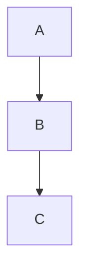

# Research

Technical research blog. Vanilla JS SPA, markdown-driven, deployed to GitHub Pages.

**Live**: https://mbarlow.github.io/research/

## Local Development

```bash
./dev.sh
```

Starts browser-sync on port 3070 with live-reload. Auto-rebuilds `content.json` when posts change.

## Adding Posts

Create a markdown file in `posts/` with YAML frontmatter:

```markdown
---
title: Post Title
date: 2026-02-14
order: 10
description: Brief description
tags: [tag1, tag2]
---

Your content here...
```

`order` is optional; lower values appear first when multiple posts share the same `date`.
Posts are sorted by post file timestamp (newest first), and the UI displays date + time in listing and post headers.

### Custom Markdown Extensions

**Callouts** — GitHub-style in blockquotes:
```markdown
> [!note]
> Important information here
```
Types: `note`, `warning`, `tip`, `danger`

**AI Chat blocks** — `chat` language fence:
````markdown
```chat
user: How does attention work?
llm: Self-attention computes Q, K, V matrices...
```
````

**Tutorial Steps** — `steps` language fence (use 4+ backticks if nesting code blocks):
`````markdown
````steps
### Step 1: Install
```bash
npm install
```
### Step 2: Run
```bash
npm start
```
````
`````

**Three.js Embeds** — scene modules in `scenes/`:
```html
<div data-scene="my-scene.js" style="width:100%;height:400px;"></div>
```

**Mermaid Diagrams**:
````markdown

````

**Sized Media** — pipe syntax in image alt:
```markdown


```

## Keyboard Shortcuts

| Key | Action |
|-----|--------|
| `/` | Toggle search |
| `t` | Toggle dark/light |
| `f` | Cycle mono font |
| `h` | Go home |
| `?` | Show shortcuts |
| `←` `→` | Prev/next post |

## Tech Stack

- **Markdown**: marked.js v12 (CDN ESM)
- **Syntax Highlighting**: Prism.js v1.29 (CDN + autoloader)
- **Diagrams**: Mermaid v11 (CDN ESM, lazy-loaded)
- **3D Embeds**: Three.js r182 (CDN via import map)
- **Fonts**: Inter + JetBrains Mono / Fira Code / Source Code Pro
- **Theme**: CSS custom properties + `data-theme` + localStorage
- **Deployment**: GitHub Actions → GitHub Pages

## Deployment

Push to `master`. The GitHub Action runs `node scripts/build-index.js` to generate `content.json` + `feed.xml`, then deploys to Pages.
