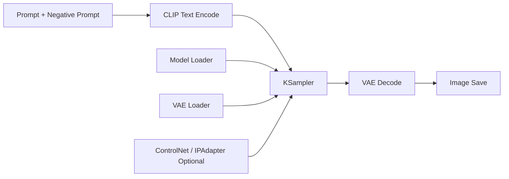

## Why ComfyUI Matters

ComfyUI is powerful because it externalizes the image generation graph. You can inspect every stage, swap components quickly, and encode workflow intent directly in nodes instead of hidden defaults.

> [!note]
> The goal here is repeatability. A beautiful one-off image is less valuable than a workflow that stays stable under iteration.

## Post Plan (Feature Map)

| Section Goal | Blog Feature Used | Why |
|---|---|---|
| Explain graph architecture | Mermaid workflow graph | Make pipeline branches explicit |
| Show concrete node setup | JSON/code blocks | Bridge UI graph to config |
| Operationalize iteration | Steps block | Enforce reproducible process |
| Improve debugging | Chat transcript + callouts | Handle common quality failures |

## Workflow Skeleton



## Versioned Workflow Snippet

```json
{
  "workflow_version": "1.3.0",
  "model": "sdxl_base_1.0.safetensors",
  "sampler": {
    "name": "dpmpp_2m_sde",
    "steps": 28,
    "cfg": 6.0,
    "scheduler": "karras"
  },
  "resolution": [1024, 1024],
  "seed": 238741920,
  "denoise": 1.0
}
```

> [!tip]
> Keep a locked baseline workflow file and branch from it per experiment. Never edit your baseline directly.

## Conversation: Debugging Image Quality

```chat
user: My outputs are sharp but composition is unstable. What should I check first?
assistant: Freeze seed, keep sampler constant, and reduce variable count. If too many nodes change together, you cannot attribute quality shifts.

user: Why do characters mutate across a batch?
assistant: Usually prompt drift and weak identity control. Add stronger reference conditioning (IPAdapter/ControlNet) and narrow prompt entropy.

user: How do I avoid overcooked high-contrast images?
assistant: Lower CFG, reduce aggressive post-processing nodes, and check if LoRA weights are stacked too heavily.
```

## A Repeatable Workflow Practice

````steps
### Step 1: Lock a baseline graph
Pick one model, one sampler, one resolution, and one seed. Save as `baseline.json`.

### Step 2: Run single-variable experiments
Change only one variable at a time (steps, CFG, denoise, LoRA weight) and log outcome notes.

### Step 3: Promote only proven improvements
If a change improves quality on multiple prompts, merge it into a new baseline and version it.

### Step 4: Build reusable subgraphs
Extract common chunks (upscaling pass, face detail pass, style stack) into composable templates.
````

## Prompt Template Pattern

```text
[subject], [camera/framing], [lighting], [style cues], [material detail], [background]

Negative prompt:
lowres, extra fingers, malformed anatomy, text artifacts, oversaturated highlights
```

## Failure Taxonomy

| Failure Mode | Typical Cause | Quick Test |
|---|---|---|
| Muddy detail | Too few steps or weak model | Increase steps by +6 and compare |
| Harsh artifacts | CFG too high | Drop CFG by 1.0 |
| Identity drift | Prompt entropy | Shorten prompt + add reference |
| Inconsistent style | Mixed LoRAs | Disable all but one LoRA |

> [!warning]
> Avoid "node hoarding". More nodes often add ambiguity faster than quality.

## Wrap-Up

The best ComfyUI workflows are versioned systems: baseline, controlled experiments, promotion rules, and reusable subgraphs. Treat image generation as an engineering loop and quality becomes predictable.

## Generation Metadata

- Assistant: Codex
- Model: GPT-5
- Generation date: 2026-02-14

## Prompt Used to Generate This Post

```text
Write a blog post titled "ComfyUI Workflows That Scale - From Experiments to Repeatable Pipelines" for technical readers. Include: a post plan table mapping goals to markdown features, a mermaid workflow graph, a JSON workflow snippet, note/tip/warning callouts, a chat transcript with 3 debugging questions, a 4-step block for reproducible iteration, a prompt-template snippet, and a failure taxonomy table. Keep it practical and readable. End with metadata Assistant=Codex, Model=GPT-5 and append the generation prompt.
```
