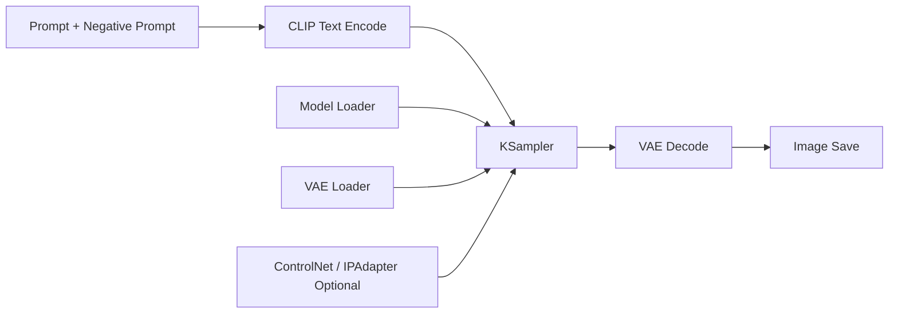

## Why the graph matters

ComfyUI externalizes the generation pipeline. Every stage is a node. Every decision is visible.

That visibility is the leverage. You stop guessing what your defaults are. You start versioning them.

> [!note]
> A pretty one-off image is worth less than a workflow you can re-run tomorrow and get the same answer.

## The skeleton


```mermaid
graph LR
    A[Prompt + Negative Prompt] --> B[CLIP Text Encode]
    B --> C[KSampler]
    D[Model Loader] --> C
    E[VAE Loader] --> C
    C --> F[VAE Decode]
    F --> G[Image Save]
    H[ControlNet / IPAdapter Optional] --> C
```

Three inputs. One sampler. One decode. Conditioning attaches at the sampler.

Everything else is a variation on this.

## Version the graph, not the image

Treat the workflow as code. Save it. Tag it. Diff it.

```json
{
  "workflow_version": "1.3.0",
  "model": "sdxl_base_1.0.safetensors",
  "sampler": {
    "name": "dpmpp_2m_sde",
    "steps": 28,
    "cfg": 6.0,
    "scheduler": "karras"
  },
  "resolution": [1024, 1024],
  "seed": 238741920,
  "denoise": 1.0
}
```

> [!tip]
> Lock a baseline. Branch from it. Never edit the baseline directly.

## Debugging is variable isolation

```chat
user: Outputs are sharp but composition is unstable. Where do I start?
assistant: Freeze the seed. Freeze the sampler. Change one thing. If you mutate three variables at once, you cannot attribute the result.

user: Characters mutate across a batch. Why?
assistant: Prompt entropy is too high and identity isn't anchored. Shorten the prompt. Add IPAdapter or ControlNet for reference conditioning.

user: Outputs are overcooked — high contrast, crunchy.
assistant: Drop CFG. Pull back stacked LoRA weights. Remove aggressive post-process nodes one at a time.
```

The pattern is the same every time: **isolate the variable**.

## The iteration loop

````steps
### Step 1: Lock a baseline
One model. One sampler. One resolution. One seed. Save as `baseline.json`.

### Step 2: Change one variable
Steps, CFG, denoise, LoRA weight — pick one. Log the result.

### Step 3: Promote what proves out
If a change helps across multiple prompts, merge it into a new baseline. Bump the version.

### Step 4: Extract subgraphs
Upscaling, face detail, style stacks — turn repeated chunks into reusable templates.
````

## Prompt structure

```text
[subject], [framing], [lighting], [style], [material], [background]

Negative:
lowres, extra fingers, malformed anatomy, text artifacts, oversaturated highlights
```

Slots, not sentences. Easier to swap. Easier to A/B.

## Failure → cause → test

| Failure | Likely cause | First test |
|---|---|---|
| Muddy detail | Steps too low, weak model | +6 steps |
| Harsh artifacts | CFG too high | -1.0 CFG |
| Identity drift | Prompt entropy | Shorten + add reference |
| Inconsistent style | Stacked LoRAs fighting | Disable all but one |

> [!warning]
> Node hoarding adds ambiguity faster than it adds quality. If you can't explain why a node is there, delete it.

## The summary

Baseline. One-variable experiments. Promote what works. Extract what repeats.

Treat image generation like an engineering loop and quality stops being luck.

## Generation Metadata

- Assistant: Codex
- Model: GPT-5
- Generation date: 2026-02-14

## Prompt Used to Generate This Post

```text
Write a blog post titled "ComfyUI Workflows That Scale - From Experiments to Repeatable Pipelines" for technical readers. Include: a post plan table mapping goals to markdown features, a mermaid workflow graph, a JSON workflow snippet, note/tip/warning callouts, a chat transcript with 3 debugging questions, a 4-step block for reproducible iteration, a prompt-template snippet, and a failure taxonomy table. Keep it practical and readable. End with metadata Assistant=Codex, Model=GPT-5 and append the generation prompt.
```
