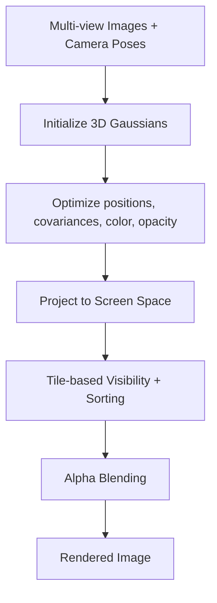
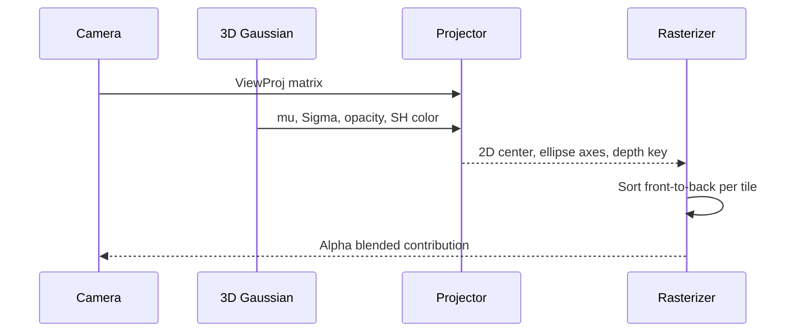

## Why Gaussian Splatting Is Interesting

Gaussian splatting is one of the most practical bridges between neural scene capture and real-time rendering. You still optimize a scene representation, but runtime behaves more like a renderer than a heavy neural volume integrator.

> [!note]
> This write-up focuses on implementation intuition: what to store, what to project, and what to optimize first.

## Post Plan (Feature Map)

| Section Goal | Blog Feature Used | Why |
|---|---|---|
| Build intuition | Mermaid diagrams | Clarify training vs rendering stages |
| Show interactivity | Three.js embed | Give a visual analog to projected splats |
| Make it actionable | Steps block + code | Provide a toy pipeline to implement |
| Address confusion | Chat transcript + callouts | Handle common stumbling points |

## Mental Model

A 3D Gaussian has mean `mu`, covariance `Sigma`, and color/opacity attributes. During rendering, each Gaussian is projected into screen space and blended in depth-aware order.



## Interactive Analog: Point-Splat Cloud

<div data-scene="gaussian-splat-cloud.js" style="width:100%;height:420px;"></div>

## Projection Pipeline



## Minimal Math Stub

```python
import numpy as np

def project_gaussian(mu_world, sigma_world, view_proj, jacobian_2d):
    """
    Toy projection: map 3D Gaussian to 2D covariance approximation.
    jacobian_2d is d(pi(x))/dx at projected center.
    """
    mu_h = np.concatenate([mu_world, [1.0]])
    clip = view_proj @ mu_h
    ndc = clip[:3] / clip[3]

    # First-order covariance projection: Sigma_2d = J * Sigma_3d * J^T
    sigma_2d = jacobian_2d @ sigma_world @ jacobian_2d.T

    return {
        "center_ndc": ndc[:2],
        "depth": ndc[2],
        "sigma_2d": sigma_2d,
    }
```

> [!tip]
> If splats shimmer while moving the camera, verify sort stability and clamping on very thin covariance eigenvalues.

## Conversation: Debugging Quality vs Speed

```chat
user: Why do my splats look blurry even with many points?
assistant: Usually covariance is too large or opacity accumulation is saturating early. Clamp covariance floor and tune alpha so detail survives.

user: What is the first optimization to try for speed?
assistant: Tile-based culling and local sorting. You avoid processing most splats for most pixels.

user: How do I reduce popping artifacts during camera motion?
assistant: Stabilize sort order, use consistent depth keys, and avoid aggressive pruning thresholds that switch contributions frame to frame.
```

## Build a Toy Splat Renderer

````steps
### Step 1: Start with point sprites
Render thousands of points to validate camera controls and GPU upload paths:

```javascript
const geometry = new THREE.BufferGeometry();
geometry.setAttribute('position', new THREE.BufferAttribute(positions, 3));
geometry.setAttribute('color', new THREE.BufferAttribute(colors, 3));
const material = new THREE.PointsMaterial({ size: 0.03, vertexColors: true, transparent: true, opacity: 0.65 });
scene.add(new THREE.Points(geometry, material));
```

### Step 2: Add per-point scale and alpha
Store basic splat attributes in buffers:

```javascript
geometry.setAttribute('scale', new THREE.BufferAttribute(scales, 1));
geometry.setAttribute('alpha', new THREE.BufferAttribute(alpha, 1));
```

### Step 3: Introduce screen-space sorting
Sort by camera depth each frame (or per tile) before draw:

```javascript
indices.sort((a, b) => depth[b] - depth[a]);
geometry.setIndex(indices);
```

### Step 4: Replace point circles with anisotropic ellipses
Move from isotropic sprites toward covariance-aware splats in a custom shader.
````

## Practical Heuristics

| Problem | Symptom | First Fix |
|---|---|---|
| Oversmoothing | Plastic look | Lower covariance upper bound |
| Noise flicker | Sparkling edges | Raise opacity floor slowly |
| Fill-rate bottleneck | FPS drops at close range | Aggressive tile culling |
| Memory pressure | VRAM spikes | Quantize attributes |

> [!warning]
> Treat this as a renderer architecture problem, not just a model quality problem. Many failures are pipeline failures.

## Wrap-Up

Gaussian splatting is compelling because it keeps the optimization story of neural methods while giving you renderer-style control at runtime. If you can project, cull, sort, and blend well, you can ship useful real-time outputs.

## Generation Metadata

- Assistant: Codex
- Model: GPT-5
- Generation date: 2026-02-14

## Prompt Used to Generate This Post

```text
Write a technical blog post titled "Gaussian Splatting - Practical Notes for Real-Time Radiance Fields". Include a section plan that maps learning goals to markdown features. Add one mermaid architecture diagram and one mermaid sequence diagram, one 3D embed placeholder using <div data-scene="gaussian-splat-cloud.js">, one Python code block for projecting a gaussian covariance, callout note/tip/warning blocks, one chat transcript covering debugging questions, one steps block with 4 implementation steps, and one heuristics table. Keep it practical and readable. End with metadata Assistant=Codex, Model=GPT-5 and append the generation prompt.
```
