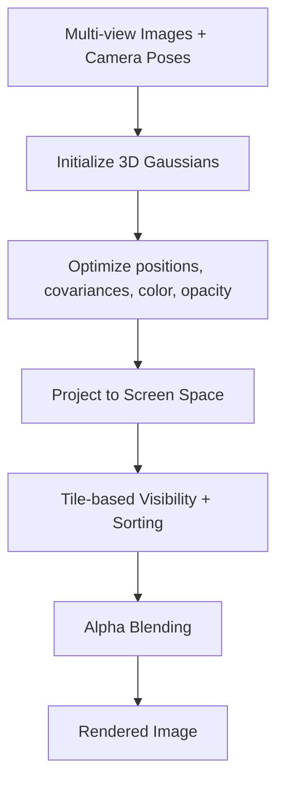
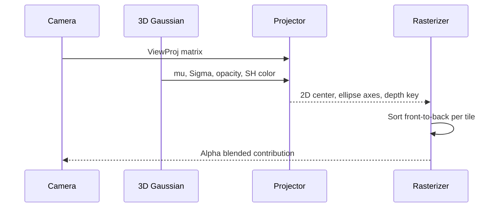

## Why splats won

Splats sit on the right edge of a tradeoff: they keep the optimization story of neural scene capture, but the runtime is a renderer, not an integrator.

You train like a neural method. You render like a graphics pipeline. That's the whole pitch.

> [!note]
> This is implementation intuition. What to store. What to project. What to optimize first.

## The model

A 3D Gaussian has three things you optimize:

- mean `mu` — where it lives
- covariance `Sigma` — its shape and orientation
- color + opacity — what it contributes


```mermaid
graph TD
    A[Multi-view Images + Camera Poses] --> B[Initialize 3D Gaussians]
    B --> C[Optimize positions, covariances, color, opacity]
    C --> D[Project to Screen Space]
    D --> E[Tile-based Visibility + Sorting]
    E --> F[Alpha Blending]
    F --> G[Rendered Image]
```

## Interactive analog: point-splat cloud

<div data-scene="gaussian-splat-cloud.js" style="width:100%;height:420px;"></div>

## The render path


```mermaid
sequenceDiagram
    participant Cam as Camera
    participant G as 3D Gaussian
    participant P as Projector
    participant R as Rasterizer

    Cam->>P: ViewProj matrix
    G->>P: mu, Sigma, opacity, SH color
    P-->>R: 2D center, ellipse axes, depth key
    R->>R: Sort front-to-back per tile
    R-->>Cam: Alpha blended contribution
```

Project, sort, blend. The graphics pipeline you already know — applied to anisotropic ellipses instead of triangles.

## Projection in code

```python
import numpy as np

def project_gaussian(mu_world, sigma_world, view_proj, jacobian_2d):
    """
    Toy projection: map 3D Gaussian to 2D covariance approximation.
    jacobian_2d is d(pi(x))/dx at projected center.
    """
    mu_h = np.concatenate([mu_world, [1.0]])
    clip = view_proj @ mu_h
    ndc = clip[:3] / clip[3]

    # First-order covariance projection: Sigma_2d = J * Sigma_3d * J^T
    sigma_2d = jacobian_2d @ sigma_world @ jacobian_2d.T

    return {
        "center_ndc": ndc[:2],
        "depth": ndc[2],
        "sigma_2d": sigma_2d,
    }
```

> [!tip]
> Splats shimmering when the camera moves? Check sort stability and clamp the floor on tiny covariance eigenvalues.

## Debugging, in conversation form

```chat
user: Splats look blurry even with many points. Why?
assistant: Covariance is too large or alpha is saturating early. Clamp the covariance floor and tune opacity so detail survives blending.

user: First optimization for speed?
assistant: Tile-based culling and per-tile sort. You stop processing most splats for most pixels.

user: How do I kill the popping during camera motion?
assistant: Stabilize sort order. Use consistent depth keys. Avoid pruning thresholds that flip contributions frame to frame.
```

## Build a toy splat renderer

````steps
### Step 1: Start with point sprites
Render thousands of points first. Validate camera controls and GPU upload paths before anything fancy.

```javascript
const geometry = new THREE.BufferGeometry();
geometry.setAttribute('position', new THREE.BufferAttribute(positions, 3));
geometry.setAttribute('color', new THREE.BufferAttribute(colors, 3));
const material = new THREE.PointsMaterial({ size: 0.03, vertexColors: true, transparent: true, opacity: 0.65 });
scene.add(new THREE.Points(geometry, material));
```

### Step 2: Add per-point scale and alpha
Splat attributes go in buffers.

```javascript
geometry.setAttribute('scale', new THREE.BufferAttribute(scales, 1));
geometry.setAttribute('alpha', new THREE.BufferAttribute(alpha, 1));
```

### Step 3: Sort by depth before drawing
Per-frame sort, or per-tile if you're feeling brave.

```javascript
indices.sort((a, b) => depth[b] - depth[a]);
geometry.setIndex(indices);
```

### Step 4: Replace circles with anisotropic ellipses
Drop point sprites. Move to a custom shader that respects the projected covariance.
````

## Symptom → first fix

| Problem | Symptom | First fix |
|---|---|---|
| Oversmoothing | Plastic look | Lower covariance upper bound |
| Noise flicker | Sparkling edges | Raise opacity floor, slowly |
| Fill-rate bottleneck | FPS drops up close | Aggressive tile culling |
| Memory pressure | VRAM spikes | Quantize attributes |

> [!warning]
> Most "model quality" failures are pipeline failures. Project, cull, sort, blend — fix the pipeline before you blame the optimizer.

## The summary

Project. Cull. Sort. Blend. Get those four right and splats ship.

## Generation Metadata

- Assistant: Codex
- Model: GPT-5
- Generation date: 2026-02-14

## Prompt Used to Generate This Post

```text
Write a technical blog post titled "Gaussian Splatting - Practical Notes for Real-Time Radiance Fields". Include a section plan that maps learning goals to markdown features. Add one mermaid architecture diagram and one mermaid sequence diagram, one 3D embed placeholder using <div data-scene="gaussian-splat-cloud.js">, one Python code block for projecting a gaussian covariance, callout note/tip/warning blocks, one chat transcript covering debugging questions, one steps block with 4 implementation steps, and one heuristics table. Keep it practical and readable. End with metadata Assistant=Codex, Model=GPT-5 and append the generation prompt.
```
