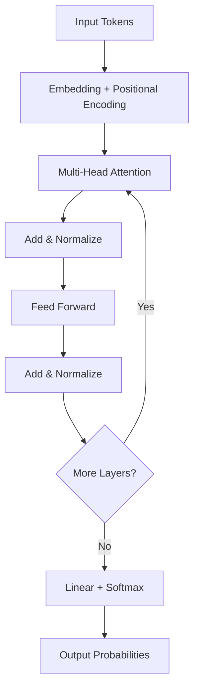
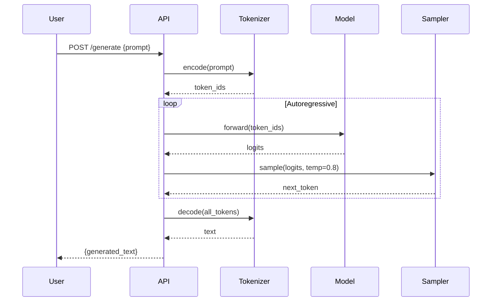

## Welcome

This is the inaugural post on the research blog — a private space for deep dives into technical topics. This post exists to showcase and verify every rendering feature the blog supports.

The blog is a **vanilla JS SPA** with no build tools, no frameworks, and no dependencies beyond a few CDN-loaded libraries. Everything renders client-side from markdown files.

## Syntax Highlighting

Code blocks get automatic language detection and Prism.js highlighting.

### JavaScript

```javascript
// Transformer self-attention (simplified)
function selfAttention(Q, K, V, dk) {
  const scores = matmul(Q, transpose(K));
  const scaled = scores.map(row => row.map(v => v / Math.sqrt(dk)));
  const weights = softmax(scaled);
  return matmul(weights, V);
}
```

### Python

```python
import torch
import torch.nn as nn

class MultiHeadAttention(nn.Module):
    def __init__(self, d_model=512, n_heads=8):
        super().__init__()
        self.d_k = d_model // n_heads
        self.n_heads = n_heads
        self.W_q = nn.Linear(d_model, d_model)
        self.W_k = nn.Linear(d_model, d_model)
        self.W_v = nn.Linear(d_model, d_model)

    def forward(self, x):
        batch_size = x.size(0)
        Q = self.W_q(x).view(batch_size, -1, self.n_heads, self.d_k).transpose(1, 2)
        K = self.W_k(x).view(batch_size, -1, self.n_heads, self.d_k).transpose(1, 2)
        V = self.W_v(x).view(batch_size, -1, self.n_heads, self.d_k).transpose(1, 2)
        return scaled_dot_product_attention(Q, K, V)
```

### Bash

```bash
# Training a microGPT model
python train.py \
  --model gpt2 \
  --dataset openwebtext \
  --batch_size 64 \
  --learning_rate 3e-4 \
  --max_steps 100000
```

### CSS

```css
.attention-head {
  display: grid;
  grid-template-columns: repeat(var(--n-heads), 1fr);
  gap: 0.5rem;
  container-type: inline-size;
}
```

## Mermaid Diagrams

### Flowchart — Transformer Architecture



### Sequence Diagram — Inference Pipeline



## Callout Blocks

> [!note]
> This is a **note** callout. Use it for important information that supplements the main content. Supports full markdown including `inline code` and [links](#).

> [!warning]
> This is a **warning** callout. Model weights are large — `gpt2-xl` is 6.4GB. Make sure you have enough disk space and VRAM before downloading.

> [!tip]
> This is a **tip** callout. Use `torch.compile()` on PyTorch 2.0+ for a free 20-30% speedup on most transformer models.

> [!danger]
> This is a **danger** callout. Never expose model inference endpoints without authentication. An open `/generate` endpoint can be exploited for prompt injection, resource exhaustion, or data exfiltration.

## AI Chat Transcript

```chat
user: How does self-attention work in transformers?
assistant: Self-attention lets each token in a sequence attend to every other token. Here's the process:

1. Each token gets projected into three vectors: **Query (Q)**, **Key (K)**, and **Value (V)**
2. Attention scores are computed as `QK^T / sqrt(d_k)`
3. Scores are passed through softmax to get attention weights
4. The output is the weighted sum of Value vectors

The key insight is that this allows the model to learn which tokens are relevant to each other, regardless of their distance in the sequence.
user: What makes multi-head attention different from single-head?
assistant: Multi-head attention runs several attention operations in parallel, each with different learned projections. Think of it like having multiple "perspectives" on the same data:

- **Head 1** might learn to attend to syntactic relationships
- **Head 2** might focus on semantic similarity
- **Head 3** might capture positional patterns

The outputs are concatenated and projected back to the original dimension. This gives the model much richer representational capacity than a single attention head.
```

## Tutorial Steps

````steps
### Step 1: Set up the environment
Create a virtual environment and install dependencies:

```bash
python -m venv .venv
source .venv/bin/activate
pip install torch transformers datasets
```

Verify CUDA is available:

```python
import torch
print(f"CUDA: {torch.cuda.is_available()}")
print(f"Device: {torch.cuda.get_device_name(0)}")
```

### Step 2: Load the tokenizer and model
Download a pre-trained GPT-2 model:

```python
from transformers import GPT2Tokenizer, GPT2LMHeadModel

tokenizer = GPT2Tokenizer.from_pretrained('gpt2')
model = GPT2LMHeadModel.from_pretrained('gpt2').cuda()
```

### Step 3: Generate text
Run inference with temperature sampling:

```python
input_ids = tokenizer.encode("The transformer architecture", return_tensors="pt").cuda()
output = model.generate(input_ids, max_length=100, temperature=0.8, do_sample=True)
print(tokenizer.decode(output[0]))
```
````

## Three.js Embed

A spinning cube rendered with Three.js — loaded dynamically as an ES module:

<div data-scene="hello-world.js" style="width:100%;height:400px;"></div>

## Typography

Regular text with **bold**, *italic*, and `inline code`. Here's a [link to marked.js docs](https://marked.js.org).

### Lists

Unordered:
- Gaussian splatting for real-time radiance fields
- NeRF variants and their trade-offs
- Diffusion models vs GANs for image synthesis

Ordered:
1. Tokenize input text
2. Run through embedding layer
3. Apply positional encoding
4. Pass through N transformer blocks
5. Project to vocabulary size
6. Sample from output distribution

### Table

| Model | Parameters | Training Data | Context Length |
|-------|-----------|--------------|----------------|
| GPT-2 | 1.5B | WebText (40GB) | 1,024 tokens |
| GPT-3 | 175B | CommonCrawl + books | 2,048 tokens |
| Llama 2 | 70B | 2T tokens | 4,096 tokens |
| Mistral 7B | 7B | Unknown | 8,192 tokens |

### Blockquote

> "What I cannot create, I do not understand."
> — Richard Feynman

---

## What's Next

This blog will cover deep dives into:

- **Karpathy's microGPT** — building transformers from scratch
- **Gaussian splatting** — real-time radiance field rendering
- **Local LLMs** — running and fine-tuning models on consumer hardware
- **ComfyUI workflows** — advanced image generation pipelines
- **Three.js techniques** — WebGL/WebGPU rendering patterns

Each post will include runnable code, diagrams, and interactive embeds where they help understanding.
