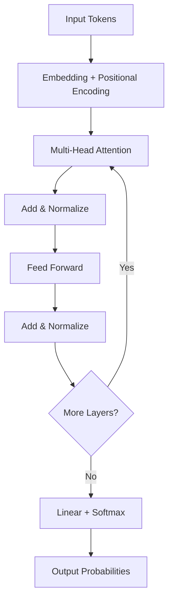
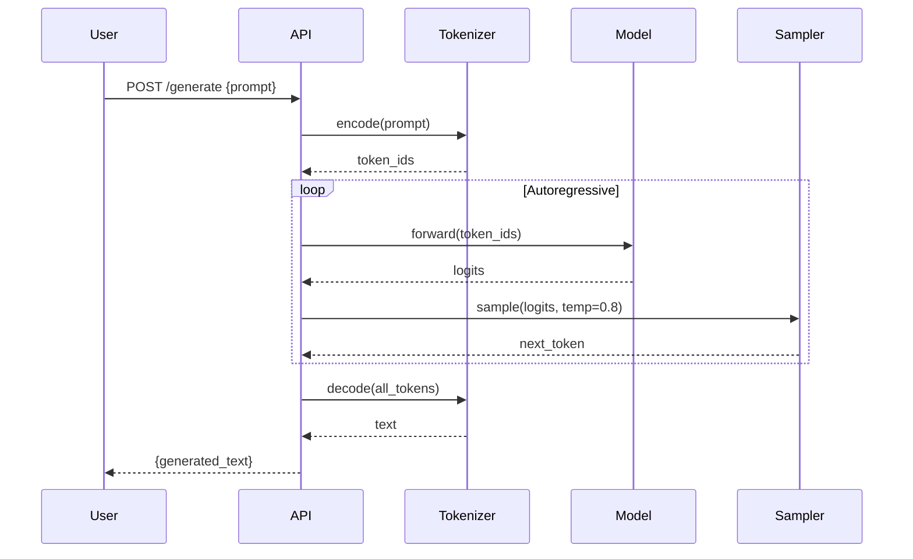

## What this is

The first post. It exists to verify every rendering feature works.

The blog is a vanilla JS SPA. No build step. No framework. Markdown rendered client-side.

## Syntax highlighting

Prism.js, autoloaded per language.

### JavaScript

```javascript
// Transformer self-attention (simplified)
function selfAttention(Q, K, V, dk) {
  const scores = matmul(Q, transpose(K));
  const scaled = scores.map(row => row.map(v => v / Math.sqrt(dk)));
  const weights = softmax(scaled);
  return matmul(weights, V);
}
```

### Python

```python
import torch
import torch.nn as nn

class MultiHeadAttention(nn.Module):
    def __init__(self, d_model=512, n_heads=8):
        super().__init__()
        self.d_k = d_model // n_heads
        self.n_heads = n_heads
        self.W_q = nn.Linear(d_model, d_model)
        self.W_k = nn.Linear(d_model, d_model)
        self.W_v = nn.Linear(d_model, d_model)

    def forward(self, x):
        batch_size = x.size(0)
        Q = self.W_q(x).view(batch_size, -1, self.n_heads, self.d_k).transpose(1, 2)
        K = self.W_k(x).view(batch_size, -1, self.n_heads, self.d_k).transpose(1, 2)
        V = self.W_v(x).view(batch_size, -1, self.n_heads, self.d_k).transpose(1, 2)
        return scaled_dot_product_attention(Q, K, V)
```

### Bash

```bash
# Training a microGPT model
python train.py \
  --model gpt2 \
  --dataset openwebtext \
  --batch_size 64 \
  --learning_rate 3e-4 \
  --max_steps 100000
```

### CSS

```css
.attention-head {
  display: grid;
  grid-template-columns: repeat(var(--n-heads), 1fr);
  gap: 0.5rem;
  container-type: inline-size;
}
```

## Mermaid

### Flowchart — transformer architecture


```mermaid
graph TD
    A[Input Tokens] --> B[Embedding + Positional Encoding]
    B --> C[Multi-Head Attention]
    C --> D[Add & Normalize]
    D --> E[Feed Forward]
    E --> F[Add & Normalize]
    F --> G{More Layers?}
    G -->|Yes| C
    G -->|No| H[Linear + Softmax]
    H --> I[Output Probabilities]
```

### Sequence — inference pipeline


```mermaid
sequenceDiagram
    participant User
    participant API
    participant Tokenizer
    participant Model
    participant Sampler

    User->>API: POST /generate {prompt}
    API->>Tokenizer: encode(prompt)
    Tokenizer-->>API: token_ids
    loop Autoregressive
        API->>Model: forward(token_ids)
        Model-->>API: logits
        API->>Sampler: sample(logits, temp=0.8)
        Sampler-->>API: next_token
    end
    API->>Tokenizer: decode(all_tokens)
    Tokenizer-->>API: text
    API-->>User: {generated_text}
```

## Callouts

> [!note]
> A **note**. Supplementary detail. Supports `inline code` and [links](#).

> [!warning]
> A **warning**. `gpt2-xl` is 6.4GB. Check disk and VRAM before pulling it.

> [!tip]
> A **tip**. `torch.compile()` on PyTorch 2.0+ buys 20–30% on most transformers, free.

> [!danger]
> A **danger**. Never expose a `/generate` endpoint without auth. Open inference is prompt injection, resource exhaustion, and data exfiltration waiting to happen.

## Chat transcript

```chat
user: How does self-attention work in transformers?
assistant: Each token attends to every other token. Three steps:

1. Project each token to **Query (Q)**, **Key (K)**, **Value (V)**
2. Score: `QK^T / sqrt(d_k)`
3. Softmax → weights → weighted sum of V

The model learns which tokens matter to each other regardless of distance.
user: What does multi-head buy you over single-head?
assistant: Multiple parallel attention ops with different learned projections — different perspectives on the same input:

- **Head 1** — syntactic relationships
- **Head 2** — semantic similarity
- **Head 3** — positional patterns

Concat, project back to original dim. Richer representation than one head.
```

## Steps

````steps
### Step 1: Set up the environment

```bash
python -m venv .venv
source .venv/bin/activate
pip install torch transformers datasets
```

Verify CUDA:

```python
import torch
print(f"CUDA: {torch.cuda.is_available()}")
print(f"Device: {torch.cuda.get_device_name(0)}")
```

### Step 2: Load tokenizer + model

```python
from transformers import GPT2Tokenizer, GPT2LMHeadModel

tokenizer = GPT2Tokenizer.from_pretrained('gpt2')
model = GPT2LMHeadModel.from_pretrained('gpt2').cuda()
```

### Step 3: Generate

```python
input_ids = tokenizer.encode("The transformer architecture", return_tensors="pt").cuda()
output = model.generate(input_ids, max_length=100, temperature=0.8, do_sample=True)
print(tokenizer.decode(output[0]))
```
````

## Three.js embed

A spinning cube. ES module, loaded on demand.

<div data-scene="hello-world.js" style="width:100%;height:400px;"></div>

## Typography

**Bold**, *italic*, `inline code`, [link](https://marked.js.org).

### Lists

Unordered:
- Gaussian splatting for real-time radiance fields
- NeRF variants and their tradeoffs
- Diffusion vs GANs for image synthesis

Ordered:
1. Tokenize
2. Embed
3. Add positional encoding
4. N transformer blocks
5. Project to vocab
6. Sample

### Table

| Model | Parameters | Training Data | Context Length |
|-------|-----------|--------------|----------------|
| GPT-2 | 1.5B | WebText (40GB) | 1,024 tokens |
| GPT-3 | 175B | CommonCrawl + books | 2,048 tokens |
| Llama 2 | 70B | 2T tokens | 4,096 tokens |
| Mistral 7B | 7B | Unknown | 8,192 tokens |

### Blockquote

> "What I cannot create, I do not understand."
> — Richard Feynman

---

## What's next

Deep dives, queued:

- **Karpathy's microGPT** — transformers from scratch
- **Gaussian splatting** — real-time radiance fields
- **Local LLMs** — running and fine-tuning on consumer hardware
- **ComfyUI workflows** — versioned image generation
- **Three.js techniques** — WebGL/WebGPU patterns

Code, diagrams, and embeds where they earn their keep.
