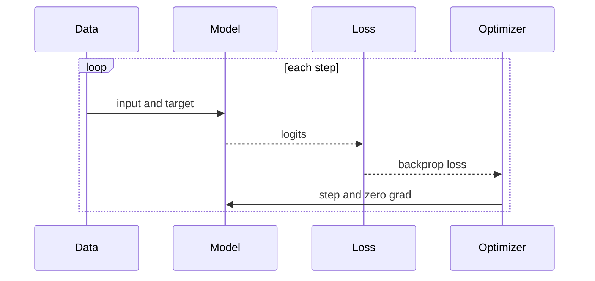

## Why This Post

Karpathy's microGPT write-up is a strong example of learning by implementation. Instead of treating a large language model as a black box, you build a small GPT end to end and inspect every moving part.

Primary reference: [karpathy.ai/microgpt.html](https://karpathy.ai/microgpt.html)

> [!note]
> This post is structured as a build notebook. The goal is understanding, not benchmark chasing.

## Post Plan (Feature Map)

| Section Goal | Blog Feature Used | Why |
|---|---|---|
| Build mental model | Mermaid flowchart + sequence | Visualize forward pass and training loop |
| Teach implementation | Python code blocks + callouts | Show minimal but correct modules |
| Make it interactive | Chat transcript | Surface common learner questions |
| Provide execution path | Steps block | Give a concrete path from clone to sampling |

## Big Picture

A tiny GPT training stack has four layers:

1. Data pipeline (tokenization, batching)
2. Model (embeddings, attention, MLP, residual blocks)
3. Optimization loop (loss, backward pass, optimizer step)
4. Sampling loop (temperature/top-k generation)


## Minimal Attention Block

```python
import math
import torch
import torch.nn as nn
import torch.nn.functional as F

class CausalSelfAttention(nn.Module):
    def __init__(self, d_model: int, n_heads: int, block_size: int):
        super().__init__()
        assert d_model % n_heads == 0
        self.n_heads = n_heads
        self.head_dim = d_model // n_heads
        self.qkv = nn.Linear(d_model, 3 * d_model)
        self.proj = nn.Linear(d_model, d_model)
        mask = torch.tril(torch.ones(block_size, block_size))
        self.register_buffer("mask", mask.view(1, 1, block_size, block_size))

    def forward(self, x):
        B, T, C = x.shape
        q, k, v = self.qkv(x).chunk(3, dim=-1)

        q = q.view(B, T, self.n_heads, self.head_dim).transpose(1, 2)
        k = k.view(B, T, self.n_heads, self.head_dim).transpose(1, 2)
        v = v.view(B, T, self.n_heads, self.head_dim).transpose(1, 2)

        att = (q @ k.transpose(-2, -1)) / math.sqrt(self.head_dim)
        att = att.masked_fill(self.mask[:, :, :T, :T] == 0, float("-inf"))
        att = F.softmax(att, dim=-1)

        y = att @ v
        y = y.transpose(1, 2).contiguous().view(B, T, C)
        return self.proj(y)
```

> [!tip]
> If training diverges early, inspect two things first: learning rate and whether your causal mask is correctly applied.

## Training Loop in One Diagram



## Conversation: Typical Sticking Points

```chat
user: Why does tiny GPT training feel unstable compared to CNN tutorials?
assistant: Two reasons dominate: sequence loss is harder than image classification, and transformer training is sensitive to optimization settings (LR, warmup, weight decay, gradient clipping).

user: What should I log first?
assistant: Start with train loss, validation loss, gradient norm, and tokens/sec. If you add one more metric, log learning rate per step.

user: How do I know if my model is learning structure and not memorizing?
assistant: Check validation loss trends and sample from held-out prompts. If outputs copy verbatim chunks often, reduce model size or increase data diversity.
```

## Hands-on Steps

````steps
### Step 1: Build a tiny dataset pipeline
Start with a small corpus so iteration cycles are short:

```bash
curl -L -o input.txt https://raw.githubusercontent.com/karpathy/char-rnn/master/data/tinyshakespeare/input.txt
python - <<'PY'
text = open("input.txt", "r", encoding="utf-8").read()
chars = sorted(set(text))
print("chars:", len(chars), "tokens:", len(text))
PY
```

### Step 2: Train a baseline model
Use a small config to validate correctness before scaling:

```bash
python train.py \
  --batch_size 64 \
  --block_size 128 \
  --n_layer 4 \
  --n_head 4 \
  --n_embd 256 \
  --max_iters 5000 \
  --eval_interval 250
```

### Step 3: Add quality-of-life improvements
Add reproducibility and safety rails:

```python
torch.manual_seed(1337)
torch.nn.utils.clip_grad_norm_(model.parameters(), 1.0)
optimizer = torch.optim.AdamW(model.parameters(), lr=3e-4, weight_decay=0.1)
```

### Step 4: Sample and inspect
Generate with controlled randomness:

```bash
python sample.py --start "ROMEO:" --max_new_tokens 200 --temperature 0.8 --top_k 100
```
````

## Scaling Checklist

| Decision | Start Here | When to Increase |
|---|---|---|
| Context length | 128 | Validation loss plateaus due to truncation |
| Layers | 4 | Underfitting with clean optimization |
| Embedding dim | 256 | Capacity bottleneck in samples |
| Batch size | 64 | GPU utilization is low |

> [!warning]
> More parameters without a better data pipeline usually buys slower training, not better understanding.

## Wrap-Up

microGPT is valuable because it compresses the transformer stack into something you can fully hold in your head. Once the tiny version works, scaling decisions become engineering trade-offs instead of mystery.

## Generation Metadata

- Assistant: Codex
- Model: GPT-5
- Generation date: 2026-02-14

## Prompt Used to Generate This Post

```text
Write a research blog entry titled "Karpathy's microGPT - Building a Transformer from First Principles". Audience: technical engineers who want practical understanding. Include: a concise intro linked to https://karpathy.ai/microgpt.html, one mermaid flowchart, one mermaid sequence diagram, one substantial Python code block for causal self-attention, at least one note/tip/warning callout, one chat transcript with 3 user questions and detailed assistant answers, one steps block with 4 executable steps, and one table of scaling decisions. Tone: pragmatic, readable, educational. End with generation metadata indicating Assistant=Codex and Model=GPT-5.
```
