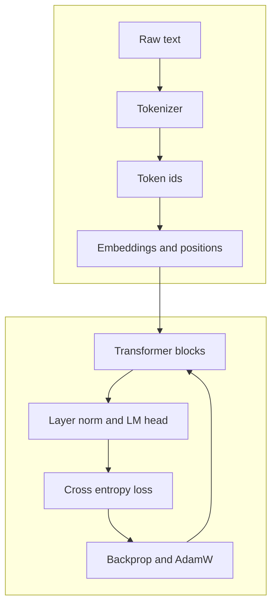
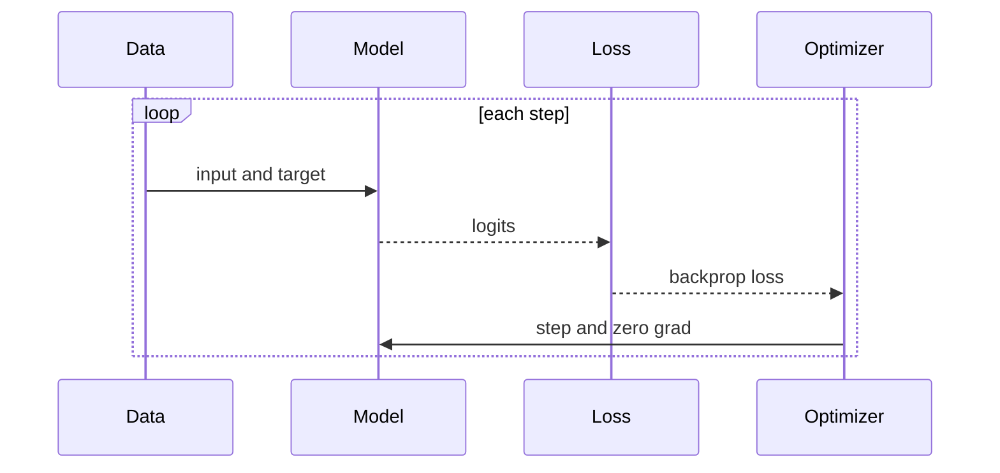

## Why build it small

Karpathy's microGPT teaches by implementation. You don't read about a transformer. You build one end to end.

A 6B parameter model is a black box. A 4-layer, 4-head, 256-dim model fits in your head. That's the point.

Reference: [karpathy.ai/microgpt.html](https://karpathy.ai/microgpt.html)

> [!note]
> Build notebook, not benchmark report. The goal is understanding.

## The four layers

A tiny GPT stack:

1. Data — tokenize, batch
2. Model — embeddings, attention, MLP, residuals
3. Optimization — loss, backward, step
4. Sampling — temperature/top-k generation


```mermaid
flowchart TB
    subgraph r1 [" "]
        direction LR
        A["Raw text"] --> B["Tokenizer"] --> C["Token ids"] --> D["Embeddings and positions"]
    end
    subgraph r2 [" "]
        direction LR
        E["Transformer blocks"] --> F["Layer norm and LM head"] --> G["Cross entropy loss"] --> H["Backprop and AdamW"]
    end
    D --> E
    H --> E
```

## Causal self-attention, minimal

```python
import math
import torch
import torch.nn as nn
import torch.nn.functional as F

class CausalSelfAttention(nn.Module):
    def __init__(self, d_model: int, n_heads: int, block_size: int):
        super().__init__()
        assert d_model % n_heads == 0
        self.n_heads = n_heads
        self.head_dim = d_model // n_heads
        self.qkv = nn.Linear(d_model, 3 * d_model)
        self.proj = nn.Linear(d_model, d_model)
        mask = torch.tril(torch.ones(block_size, block_size))
        self.register_buffer("mask", mask.view(1, 1, block_size, block_size))

    def forward(self, x):
        B, T, C = x.shape
        q, k, v = self.qkv(x).chunk(3, dim=-1)

        q = q.view(B, T, self.n_heads, self.head_dim).transpose(1, 2)
        k = k.view(B, T, self.n_heads, self.head_dim).transpose(1, 2)
        v = v.view(B, T, self.n_heads, self.head_dim).transpose(1, 2)

        att = (q @ k.transpose(-2, -1)) / math.sqrt(self.head_dim)
        att = att.masked_fill(self.mask[:, :, :T, :T] == 0, float("-inf"))
        att = F.softmax(att, dim=-1)

        y = att @ v
        y = y.transpose(1, 2).contiguous().view(B, T, C)
        return self.proj(y)
```

> [!tip]
> Diverging in the first few hundred steps? Check learning rate. Then check the causal mask is actually being applied.

## Training loop


```mermaid
sequenceDiagram
    participant Data
    participant Model
    participant Loss
    participant Optimizer

    loop each step
        Data->>Model: input and target
        Model-->>Loss: logits
        Loss-->>Optimizer: backprop loss
        Optimizer->>Model: step and zero grad
    end
```

## Sticking points

```chat
user: Tiny GPT training feels unstable compared to CNN tutorials. Why?
assistant: Sequence loss is harder than image classification, and transformers are sensitive to LR, warmup, weight decay, and gradient clipping. Two things you didn't have to tune for a CNN.

user: What do I log first?
assistant: Train loss, validation loss, gradient norm, tokens/sec. If you add one more, log learning rate per step.

user: How do I tell if it's learning vs memorizing?
assistant: Watch validation loss and sample from held-out prompts. If the outputs paste long verbatim chunks, shrink the model or diversify the data.
```

## The build

````steps
### Step 1: Tiny dataset
Short corpus = short iteration cycle.

```bash
curl -L -o input.txt https://raw.githubusercontent.com/karpathy/char-rnn/master/data/tinyshakespeare/input.txt
python - <<'PY'
text = open("input.txt", "r", encoding="utf-8").read()
chars = sorted(set(text))
print("chars:", len(chars), "tokens:", len(text))
PY
```

### Step 2: Train a baseline
Small config first. Validate correctness before you scale.

```bash
python train.py \
  --batch_size 64 \
  --block_size 128 \
  --n_layer 4 \
  --n_head 4 \
  --n_embd 256 \
  --max_iters 5000 \
  --eval_interval 250
```

### Step 3: Add the safety rails
Reproducibility and grad clipping.

```python
torch.manual_seed(1337)
torch.nn.utils.clip_grad_norm_(model.parameters(), 1.0)
optimizer = torch.optim.AdamW(model.parameters(), lr=3e-4, weight_decay=0.1)
```

### Step 4: Sample and look
Controlled randomness.

```bash
python sample.py --start "ROMEO:" --max_new_tokens 200 --temperature 0.8 --top_k 100
```
````

## When to scale what

| Lever | Start | Bump when |
|---|---|---|
| Context length | 128 | Validation loss plateaus from truncation |
| Layers | 4 | Underfitting with clean optimization |
| Embedding dim | 256 | Capacity bottleneck visible in samples |
| Batch size | 64 | GPU sitting idle |

> [!warning]
> More parameters without a better data pipeline buys slower training, not better understanding.

## The summary

A working tiny GPT collapses the transformer stack into something you can hold in your head.

Once that works, scaling is engineering. Not mystery.

## Generation Metadata

- Assistant: Codex
- Model: GPT-5
- Generation date: 2026-02-14

## Prompt Used to Generate This Post

```text
Write a research blog entry titled "Karpathy's microGPT - Building a Transformer from First Principles". Audience: technical engineers who want practical understanding. Include: a concise intro linked to https://karpathy.ai/microgpt.html, one mermaid flowchart, one mermaid sequence diagram, one substantial Python code block for causal self-attention, at least one note/tip/warning callout, one chat transcript with 3 user questions and detailed assistant answers, one steps block with 4 executable steps, and one table of scaling decisions. Tone: pragmatic, readable, educational. End with generation metadata indicating Assistant=Codex and Model=GPT-5.
```
