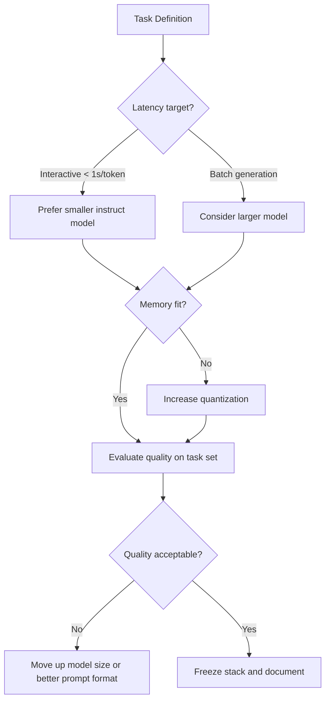

## Why Run Models Locally

Local LLMs provide privacy, lower marginal cost, and predictable latency for repeated workflows. The trade-off is that you become the platform engineer: model selection, memory budgeting, and quality evaluation are now your job.

> [!note]
> This is a deployment-focused post, not a benchmark leaderboard.

## Post Plan (Feature Map)

| Section Goal | Blog Feature Used | Why |
|---|---|---|
| Hardware sizing | Table + callouts | Turn vague constraints into concrete choices |
| Workflow design | Mermaid decision graph | Encode model/quant decisions clearly |
| Execution guide | Steps block + shell commands | Give a reproducible setup path |
| Troubleshooting | Chat transcript | Explain failure modes quickly |

## Start with a Budget Envelope

| Hardware Profile | Good First Model Class | Typical Quant |
|---|---|---|
| 16GB RAM laptop, no discrete GPU | 3B to 8B instruct | Q4_K_M |
| 32GB RAM desktop, mid GPU | 7B to 14B instruct | Q4_K_M to Q5_K_M |
| 64GB RAM workstation, strong GPU | 14B to 32B | Q5/KV-cache tuning |

> [!tip]
> Pick the smallest model that solves your target task reliably. Stability beats raw parameter count.

## Decision Flow



## Core Commands

```bash
# Example with Ollama
ollama pull qwen2.5:7b-instruct
ollama run qwen2.5:7b-instruct "Summarize this incident report in 5 bullets"

# Example with llama.cpp server
./llama-server \
  -m ./models/model.gguf \
  -c 8192 \
  -ngl 35 \
  --host 0.0.0.0 \
  --port 8080
```

> [!warning]
> Verify model license terms before using local models in commercial workflows.

## Conversation: Common Local LLM Problems

```chat
user: The model is fast but answers are shallow. What should I change first?
assistant: Keep the model and improve prompt structure plus retrieval context. Only scale model size after prompt and grounding are clean.

user: I get out-of-memory when context gets large.
assistant: Lower context length, reduce batch size, and consider stronger quantization. Also verify KV-cache settings, which often dominate memory.

user: How do I compare two model builds objectively?
assistant: Use a fixed prompt set, deterministic settings when possible, and score outputs against explicit criteria (factuality, format compliance, latency).
```

## Reproducible Local Setup

````steps
### Step 1: Define your acceptance tests
Write 20 to 50 real prompts that reflect your production workload. Include edge cases and failure examples.

### Step 2: Select a baseline model and quant
Start with an instruct model in Q4 class quantization and record exact model ID/version.

### Step 3: Benchmark latency and quality together
Collect tokens/sec, response latency, and quality scores in one sheet so optimization does not hide regressions.

### Step 4: Freeze and document
Lock model, quant, runtime flags, and prompt template. Add a quick rollback option to the previous known-good build.
````

## Minimal Evaluation Harness

```python
from time import perf_counter

PROMPTS = [
    "Extract action items from this meeting note.",
    "Rewrite this email in a neutral technical tone.",
]

def evaluate(client, prompts):
    rows = []
    for p in prompts:
        t0 = perf_counter()
        out = client.generate(p)
        dt = perf_counter() - t0
        rows.append({"prompt": p, "latency_s": round(dt, 2), "chars": len(out)})
    return rows
```

## Wrap-Up

Local LLM success is mostly operational discipline: pick a task, measure quality and latency together, then freeze a reproducible stack. Good local deployments are boring by design.

## Generation Metadata

- Assistant: Codex
- Model: GPT-5
- Generation date: 2026-02-14

## Prompt Used to Generate This Post

```text
Write a practical engineering blog post titled "Local LLMs on Consumer Hardware - A Practical Playbook". Include a section plan table mapping goals to blog markdown features, a hardware sizing table, a mermaid decision flowchart, command-line setup examples, callout note/tip/warning blocks, a chat transcript with 3 troubleshooting questions, a 4-step steps block for deployment workflow, and a small Python evaluation harness snippet. Keep the tone pragmatic and concise. End with metadata Assistant=Codex, Model=GPT-5 and append the exact generation prompt.
```
