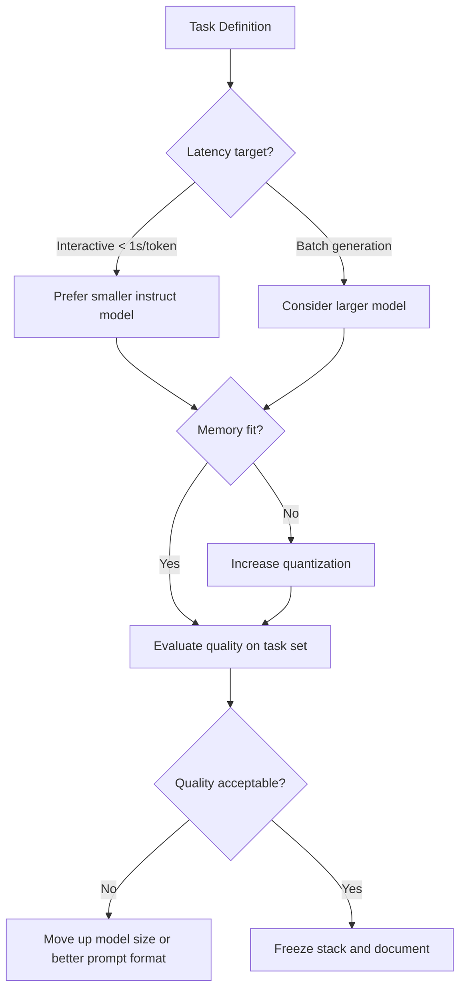

## Why local

Privacy. Lower marginal cost. Predictable latency.

The catch: you become the platform engineer. Model selection, memory budgeting, and quality evaluation are now your job.

> [!note]
> This is a deployment post. Not a leaderboard.

## Pick by budget envelope

| Hardware | First model class | Typical quant |
|---|---|---|
| 16GB RAM laptop, no GPU | 3B–8B instruct | Q4_K_M |
| 32GB RAM desktop, mid GPU | 7B–14B instruct | Q4_K_M → Q5_K_M |
| 64GB RAM workstation, strong GPU | 14B–32B | Q5 + KV-cache tuning |

> [!tip]
> Smallest model that solves your task reliably wins. Stability beats parameter count.

## The decision


```mermaid
flowchart TD
    A[Task Definition] --> B{Latency target?}
    B -->|Interactive < 1s/token| C[Prefer smaller instruct model]
    B -->|Batch generation| D[Consider larger model]
    C --> E{Memory fit?}
    D --> E
    E -->|No| F[Increase quantization]
    E -->|Yes| G[Evaluate quality on task set]
    F --> G
    G --> H{Quality acceptable?}
    H -->|No| I[Move up model size or better prompt format]
    H -->|Yes| J[Freeze stack and document]
```

## Core commands

```bash
# Ollama
ollama pull qwen2.5:7b-instruct
ollama run qwen2.5:7b-instruct "Summarize this incident report in 5 bullets"

# llama.cpp server
./llama-server \
  -m ./models/model.gguf \
  -c 8192 \
  -ngl 35 \
  --host 0.0.0.0 \
  --port 8080
```

> [!warning]
> Check the license before shipping a local model in a commercial product.

## Common failures

```chat
user: Model is fast but answers are shallow. What do I change first?
assistant: Keep the model. Improve prompt structure and add retrieval context. Don't scale model size until grounding is clean.

user: OOM as context grows.
assistant: Drop context length. Reduce batch size. Stronger quantization. Then check KV-cache settings — they often dominate memory.

user: How do I compare two builds objectively?
assistant: Fixed prompt set. Deterministic settings. Score against explicit criteria — factuality, format compliance, latency. Same sheet.
```

## The reproducible loop

````steps
### Step 1: Write your acceptance tests
20–50 real prompts that reflect production. Include the failure cases.

### Step 2: Pick a baseline
Instruct model, Q4 quant. Record the exact model ID and version.

### Step 3: Measure latency and quality together
Tokens/sec, response latency, quality score — one sheet. Optimization that hides regressions is not optimization.

### Step 4: Freeze and document
Lock model, quant, runtime flags, prompt template. Keep a one-step rollback to the previous good build.
````

## Minimal eval harness

```python
from time import perf_counter

PROMPTS = [
    "Extract action items from this meeting note.",
    "Rewrite this email in a neutral technical tone.",
]

def evaluate(client, prompts):
    rows = []
    for p in prompts:
        t0 = perf_counter()
        out = client.generate(p)
        dt = perf_counter() - t0
        rows.append({"prompt": p, "latency_s": round(dt, 2), "chars": len(out)})
    return rows
```

## The summary

Pick a task. Measure quality and latency together. Freeze a reproducible stack.

Good local deployments are boring on purpose.

## Generation Metadata

- Assistant: Codex
- Model: GPT-5
- Generation date: 2026-02-14

## Prompt Used to Generate This Post

```text
Write a practical engineering blog post titled "Local LLMs on Consumer Hardware - A Practical Playbook". Include a section plan table mapping goals to blog markdown features, a hardware sizing table, a mermaid decision flowchart, command-line setup examples, callout note/tip/warning blocks, a chat transcript with 3 troubleshooting questions, a 4-step steps block for deployment workflow, and a small Python evaluation harness snippet. Keep the tone pragmatic and concise. End with metadata Assistant=Codex, Model=GPT-5 and append the exact generation prompt.
```
