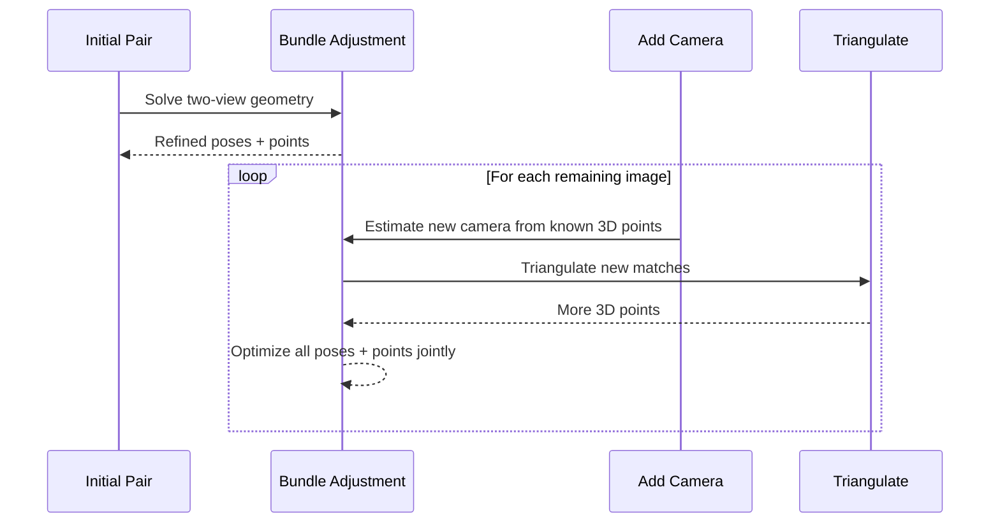

## What Is Photogrammetry

Photogrammetry is the science of reconstructing 3D geometry from 2D images. Given enough overlapping photographs of a scene, algorithms can recover the camera positions that took each photo, triangulate 3D points visible across multiple views, and ultimately produce a dense mesh with texture.

The core insight: **if the same physical point appears in two or more images taken from different angles, its 3D position can be triangulated.** Do this for millions of points and you get a 3D model.

> [!note]
> Photogrammetry works best on textured, diffuse surfaces. Shiny, transparent, or uniform surfaces lack the visual features needed for matching.

## Pipeline Overview

The full reconstruction pipeline has distinct stages, each building on the previous:


Each stage can fail independently. Understanding what each one does helps you debug when results are wrong.

## Feature Extraction

The first computational step is detecting **keypoints** — distinctive local patterns in each image that can be reliably identified again in other images.

Common feature detectors:

| Algorithm | Strengths | Weaknesses |
|-----------|-----------|------------|
| SIFT | Scale/rotation invariant, very robust | Patented (was), slower |
| AKAZE | Fast, open-source, good for video | Less distinctive than SIFT |
| SuperPoint | Learned features, handles poor lighting | Requires GPU, less tested |

Each keypoint gets a **descriptor** — a numeric fingerprint that encodes the local image pattern. Two keypoints in different images are considered a match if their descriptors are similar enough.

> [!tip]
> Texture-rich surfaces produce many keypoints. Blank walls, sky, and water produce almost none. When capturing, make sure your subject has visual detail across the surface.

## Feature Matching

After extracting keypoints from every image, the pipeline matches them **pairwise** — finding which keypoints in image A correspond to the same physical point seen in image B.

This is expensive: for N images, there are N*(N-1)/2 possible pairs. Pipelines use strategies to reduce this:

- **Sequential matching** — only match nearby frames (good for video)
- **Vocabulary tree** — cluster descriptors to find visually similar images first
- **GPS/metadata** — skip pairs from physically distant positions

After matching, **geometric verification** filters false matches using the fundamental matrix (epipolar constraint). Points that don't satisfy the two-view geometry are rejected.

> [!warning]
> Insufficient overlap between images is the most common cause of reconstruction failure. Aim for 60–80% overlap between consecutive frames.

## Structure from Motion

Structure from Motion (SfM) is the core algorithmic step. It simultaneously recovers:

1. **Camera poses** — the position and orientation of each camera
2. **Sparse 3D points** — a cloud of triangulated features
3. **Camera intrinsics** — focal length, sensor size, lens distortion



**Bundle adjustment** is the optimization that ties it all together — it minimizes reprojection error across all cameras and points simultaneously. It's computationally expensive but critical for accuracy.

For phone cameras, providing intrinsics helps significantly:

```text
Pixel 8a:
  Focal length: 6.81mm
  Sensor width: 6.29mm
  → Focal length in pixels: (6.81 / 6.29) × image_width
```

## Multi-View Stereo

SfM produces a **sparse** point cloud — thousands to millions of points, but not enough for a detailed surface. Multi-View Stereo (MVS) fills in the gaps.

For each image, MVS computes a **depth map** — the distance from the camera to the nearest surface at each pixel. It does this by:

1. For each pixel, projecting a ray into 3D
2. Checking neighboring camera images for matching patches at various depths
3. Selecting the depth with the best photometric consistency

The depth maps are then fused into a **dense point cloud** with tens of millions of points.

> [!tip]
> More images from more angles produce better depth maps. For video, 2fps extraction typically gives good overlap without excessive redundancy.

## Meshing and Texturing

The dense point cloud is converted to a triangle mesh using **Poisson surface reconstruction** — fitting a smooth surface through the oriented points.

After meshing, **UV mapping** projects the original image colors onto the mesh surface. The result is typically:

- `texturedMesh.obj` — the 3D geometry (vertices, faces, UV coordinates)
- `texturedMesh.mtl` — material definition (references the texture file)
- `texture_1001.exr` — the texture atlas (high dynamic range image)

The OBJ/MTL/texture triplet is the standard output format that most 3D tools can import.

## Interactive Result

Here's a real photogrammetry result — a flower arrangement reconstructed from a phone video. Drag to orbit, scroll to zoom.

<div data-scene="photogrammetry-viewer.js" style="width:100%;height:500px;"></div>

> [!note]
> This model was reconstructed from a 30-second phone video using the automated pipeline described below. The texture comes from the original video frames projected onto the mesh.

## My Pipeline

Here's the automated pipeline I run at home. Drop an MP4 into the input folder and walk away.

````steps
### Extract frames from video

ffmpeg pulls frames from the input video at 2fps. This gives good overlap for a typical walk-around capture without creating thousands of redundant frames.

```bash
ffmpeg -i video.mp4 -vf fps=2 -q:v 2 frames/frame_%05d.png
```

### Reconstruct with Meshroom

The frames are fed to Meshroom running in a Docker container with GPU access. Camera intrinsics for Pixel 8a are passed as overrides for better initial calibration.

```bash
docker run --rm --gpus all \
    -v ./frames:/frames \
    -v ./output:/output \
    meshroom-local \
    meshroom_batch \
        --input /frames \
        --output /output \
        --pipeline photogrammetry \
        --paramOverrides \
            "CameraInit:focalLength=6.81" \
            "CameraInit:sensorWidth=6.29"
```

### Automated watcher with inotifywait

`reconstruct.sh` runs as a daemon, watching the input directory. When a new MP4 appears, it extracts frames and kicks off reconstruction automatically.

```bash
inotifywait -m -e create -e moved_to "$INPUT_DIR" \
    --format '%w%f' | while read -r file; do
    [[ "$file" == *.mp4 ]] && process_video "$file"
done
```

### Collect output

Meshroom outputs land in `output/{name}/` — OBJ mesh, MTL material, and EXR texture. The script skips videos that already have output, so you can restart without reprocessing.
````

## Practical Tips

| Problem | Symptom | Fix |
|---------|---------|-----|
| Few features matched | SfM fails, no reconstruction | Reshoot with more texture/overlap |
| Blurry frames | Noisy mesh, holes | Use tripod or slower movement |
| Shiny/reflective surfaces | Missing geometry, phantom points | Spray with matte powder or avoid |
| Single-color surfaces | Holes in reconstruction | Add temporary texture (tape, stickers) |
| Moving objects in frame | Ghost geometry, artifacts | Mask out moving regions or reshoot |
| Scale is wrong | Model is huge/tiny | Use known-distance reference points |
| Dark/uneven lighting | Poor matching, color banding | Use even diffuse lighting |
| Not enough VRAM | Process killed, OOM | Reduce image resolution or use CPU fallback |

## Debugging Common Issues

```chat
user: My reconstruction only has part of the object. The back is missing.
assistant: The camera didn't see the back with enough overlap. SfM can only reconstruct what's visible in multiple images from different angles. Re-capture with a full orbit around the object — aim for 60-80% overlap between consecutive views.

user: The mesh has the right shape but the texture looks stretched and blurry.
assistant: That's usually a UV mapping issue from insufficient camera poses in that region. More images from additional angles during capture helps the texturing stage project sharp details. Also check that the source images aren't motion-blurred.

user: Meshroom runs but produces an empty output folder.
assistant: Check the Meshroom log — most likely SfM failed to initialize. Common causes: too few features (bland surfaces), not enough overlap between images, or wrong camera intrinsics. Try starting with a known-good dataset to verify your pipeline works, then iterate on capture technique.

user: How many frames do I need from a video?
assistant: For a 360° walk-around, 2fps extraction from a 30-60 second video typically gives 60-120 frames — that's usually enough. Quality matters more than quantity. Steady motion with good overlap beats more blurry frames.
```

## What's Next

The natural extension is **gaussian splatting** — same input (images + camera poses from SfM), but instead of meshing, you optimize a set of 3D Gaussians that can be rendered in real-time. I have a companion pipeline for that using COLMAP + the graphdeco gaussian-splatting trainer.
