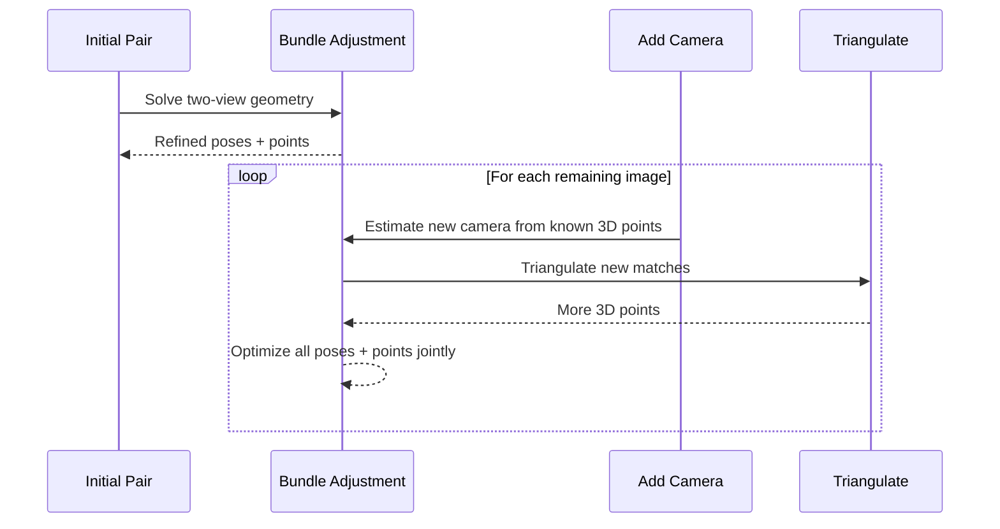

## What it is

Reconstructing 3D geometry from 2D images.

The core insight: **the same physical point in two images from different angles can be triangulated.** Do that for millions of points and you have a model.

> [!note]
> Works on textured, diffuse surfaces. Fails on shiny, transparent, or uniform ones — there's nothing to match.

## The pipeline


```mermaid
graph LR
    A[Video] --> B[Frames]
    B --> C[Feature Extraction]
    C --> D[Feature Matching]
    D --> E[Structure from Motion]
    E --> F[Depth Maps]
    F --> G[Dense Point Cloud]
    G --> H[Meshing]
    H --> I[Texturing]
    I --> J[OBJ + Texture]
```

Each stage fails independently. Knowing which stage failed is half the debugging.

## Feature extraction

Detect **keypoints** — local patterns distinctive enough to be re-found in other images.

| Algorithm | Strengths | Weaknesses |
|-----------|-----------|------------|
| SIFT | Scale/rotation invariant, robust | Patented (was), slower |
| AKAZE | Fast, open source, good for video | Less distinctive than SIFT |
| SuperPoint | Learned, handles poor lighting | GPU required, less battle-tested |

Each keypoint gets a **descriptor** — a numeric fingerprint. Match = similar descriptors.

> [!tip]
> Texture-rich surfaces yield many keypoints. Sky, blank walls, water yield almost none. Capture surfaces with detail.

## Feature matching

Match keypoints pairwise across images.

For N images that's N(N-1)/2 pairs — too many. Strategies:

- **Sequential** — only match nearby frames (good for video)
- **Vocabulary tree** — cluster descriptors to find visually similar images first
- **GPS / metadata** — skip pairs from physically distant positions

Then **geometric verification** rejects matches that don't satisfy the epipolar constraint.

> [!warning]
> Insufficient overlap is the #1 reconstruction failure. 60–80% overlap between consecutive frames.

## Structure from Motion

SfM solves three things at once:

1. Camera poses — position + orientation per camera
2. Sparse 3D points — triangulated features
3. Camera intrinsics — focal length, sensor, distortion


```mermaid
sequenceDiagram
    participant Init as Initial Pair
    participant BA as Bundle Adjustment
    participant Add as Add Camera
    participant Tri as Triangulate

    Init->>BA: Solve two-view geometry
    BA-->>Init: Refined poses + points
    loop For each remaining image
        Add->>BA: Estimate new camera from known 3D points
        BA->>Tri: Triangulate new matches
        Tri-->>BA: More 3D points
        BA-->>BA: Optimize all poses + points jointly
    end
```

**Bundle adjustment** is the optimizer that ties it together — minimize reprojection error across all cameras and points jointly. Expensive. Critical.

For phone cameras, supply intrinsics:

```text
Pixel 8a:
  Focal length: 6.81mm
  Sensor width: 6.29mm
  → Focal length in pixels: (6.81 / 6.29) × image_width
```

## Multi-View Stereo

SfM gives you a **sparse** cloud. MVS densifies it.

For each image, compute a **depth map**:

1. Project a ray for each pixel
2. Check neighbor cameras at varying depths
3. Pick the depth with the best photometric agreement

Fuse depth maps → dense point cloud, tens of millions of points.

> [!tip]
> Video at 2fps gives good MVS overlap without redundant frames.

## Mesh + texture

Dense cloud → triangle mesh via **Poisson surface reconstruction** (smooth surface fit through oriented points).

Then **UV mapping** projects original image colors onto the mesh:

- `texturedMesh.obj` — geometry (vertices, faces, UVs)
- `texturedMesh.mtl` — material (references the texture)
- `texture_1001.exr` — texture atlas (HDR)

OBJ/MTL/texture is the universal handoff format.

## Result

A flower arrangement reconstructed from a 30-second phone video. Drag to orbit. Scroll to zoom.

<div data-scene="photogrammetry-viewer.js" style="width:100%;height:500px;"></div>

> [!note]
> Reconstructed using the pipeline below. Texture is the original video frames projected onto the mesh.

## My pipeline

Drop an MP4 in. Walk away.

````steps
### Extract frames

ffmpeg at 2fps. Good overlap for a walk-around capture without thousands of redundant frames.

```bash
ffmpeg -i video.mp4 -vf fps=2 -q:v 2 frames/frame_%05d.png
```

### Reconstruct with Meshroom

Dockerized Meshroom with GPU access. Pixel 8a intrinsics passed as overrides for better initial calibration.

```bash
docker run --rm --gpus all \
    -v ./frames:/frames \
    -v ./output:/output \
    meshroom-local \
    meshroom_batch \
        --input /frames \
        --output /output \
        --pipeline photogrammetry \
        --paramOverrides \
            "CameraInit:focalLength=6.81" \
            "CameraInit:sensorWidth=6.29"
```

### Watch the input directory

`reconstruct.sh` runs as a daemon. New MP4 lands → frames extracted → reconstruction starts.

```bash
inotifywait -m -e create -e moved_to "$INPUT_DIR" \
    --format '%w%f' | while read -r file; do
    [[ "$file" == *.mp4 ]] && process_video "$file"
done
```

### Collect output

Meshroom writes to `output/{name}/` — OBJ, MTL, EXR. Script skips videos that already have output, so restarts are free.
````

## Symptom → cause → fix

| Symptom | Cause | Fix |
|---------|---------|-----|
| Few features matched | Bland surface | Reshoot with more texture/overlap |
| Blurry frames | Hand shake | Tripod or slower movement |
| Shiny/reflective | No matchable detail | Matte powder or skip |
| Single-color surfaces | No features | Add temporary texture (tape, stickers) |
| Moving objects in frame | SfM breaks | Mask the moving region or reshoot |
| Wrong scale | No reference | Add a known-distance reference object |
| Dark/uneven lighting | Bad matching, color banding | Even diffuse lighting |
| Process killed | OOM | Reduce resolution or fall back to CPU |

## Q&A

```chat
user: Reconstruction has the front but no back.
assistant: Camera didn't see the back with enough overlap. SfM only reconstructs what's visible from multiple angles. Re-capture with a full orbit, 60–80% overlap between consecutive views.

user: Mesh shape is right but the texture is stretched and blurry.
assistant: UV mapping issue from sparse camera poses in that region. More angles during capture sharpens the texturing. And check the source frames aren't motion-blurred.

user: Meshroom runs but the output folder is empty.
assistant: Check the log. Usually SfM failed to initialize — too few features, not enough overlap, wrong intrinsics. Run a known-good dataset first to confirm the pipeline. Then iterate on capture.

user: How many frames from a video?
assistant: 2fps from a 30–60s walk-around → 60–120 frames. Usually enough. Steady motion beats more blurry frames every time.
```

## What's next

The natural extension is **gaussian splatting** — same input (images + SfM poses), but instead of meshing, optimize a set of 3D Gaussians that render in real time. Companion pipeline lives in the next post.
