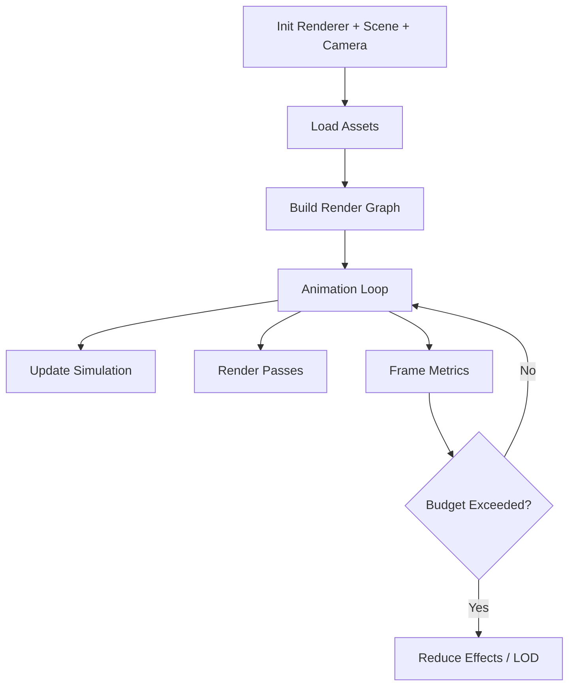

## Why This Guide

Three.js is easy to start and easy to outgrow. The hard part is not getting a cube on screen, it is keeping frame time stable as scene complexity and UX requirements grow.

> [!note]
> These patterns prioritize consistency under load over flashy demos.

## Post Plan (Feature Map)

| Section Goal | Blog Feature Used | Why |
|---|---|---|
| Explain runtime architecture | Mermaid diagram | Make update/render responsibilities explicit |
| Demonstrate visually | Three.js embed | Show a scalable scene pattern in motion |
| Provide execution workflow | Steps block | Turn concepts into implementation order |
| Diagnose perf issues | Chat transcript + table | Fast path to debugging |

## Runtime Architecture



## Interactive Scene: Instancing + Motion

<div data-scene="threejs-techniques-scene.js" style="width:100%;height:420px;"></div>

## A Reliable Render Loop

```javascript
const clock = new THREE.Clock();

function animate() {
  requestAnimationFrame(animate);
  const dt = Math.min(clock.getDelta(), 1 / 30);

  updateSimulation(dt);
  updateCamera(dt);
  renderer.render(scene, camera);

  metrics.frame(dt);
}

animate();
```

> [!tip]
> Clamp `dt` so tab throttling or frame drops do not explode physics or camera smoothing.

## Conversation: Performance Triage

```chat
user: FPS drops when I add many repeated meshes. What should I switch to?
assistant: Use InstancedMesh first. It removes most draw-call overhead for repeated geometry and material combinations.

user: My scene looks good but stutters every few seconds.
assistant: Check garbage generation in your animation loop. Reuse vectors and matrices instead of allocating each frame.

user: How do I decide what to optimize first?
assistant: Profile by category: CPU update time, GPU draw time, and overdraw/fill rate. Optimize the dominant bottleneck, not the loudest guess.
```

## Build Order for a Scalable Scene

````steps
### Step 1: Set a frame budget and baseline metrics
Track frame time and draw calls before adding effects.

### Step 2: Use instancing for repeated geometry
Convert repeated meshes into `THREE.InstancedMesh` and verify draw-call reduction.

### Step 3: Add LOD and culling
Use distance-based detail levels and frustum checks to avoid rendering unseen work.

### Step 4: Layer postprocessing intentionally
Add effects one by one and keep a feature flag to disable expensive passes quickly.
````

## Quick Patterns That Pay Off

| Pattern | Benefit | Cost |
|---|---|---|
| Instancing | Fewer draw calls | Per-instance transform management |
| Texture atlases | Fewer material switches | UV authoring complexity |
| LOD groups | Stable frame time | Asset prep overhead |
| Explicit cleanup | Less memory leak risk | Lifecycle code discipline |

```javascript
window.addEventListener('resize', () => {
  const w = container.clientWidth;
  const h = container.clientHeight;
  camera.aspect = w / h;
  camera.updateProjectionMatrix();
  renderer.setSize(w, h, false);
});
```

> [!warning]
> Visual polish features are usually multiplicative. Add them late, and only if frame budget remains healthy.

## Wrap-Up

A production-ready Three.js app is mostly architecture and discipline: bounded frame loop, measured budgets, and scene complexity that scales predictably.

## Generation Metadata

- Assistant: Codex
- Model: GPT-5
- Generation date: 2026-02-14

## Prompt Used to Generate This Post

```text
Write a technical blog post titled "Three.js Rendering Techniques That Hold Up in Real Projects". Include: a section plan table mapping goals to markdown features, one mermaid architecture diagram, one interactive scene embed placeholder <div data-scene="threejs-techniques-scene.js">, JavaScript code for a robust animation loop, a tip and warning callout, a chat transcript with 3 performance triage questions, a 4-step implementation steps block, and a table of high-impact patterns. Keep the writing practical and readable. End with Assistant=Codex and Model=GPT-5 metadata and append the exact generation prompt.
```
