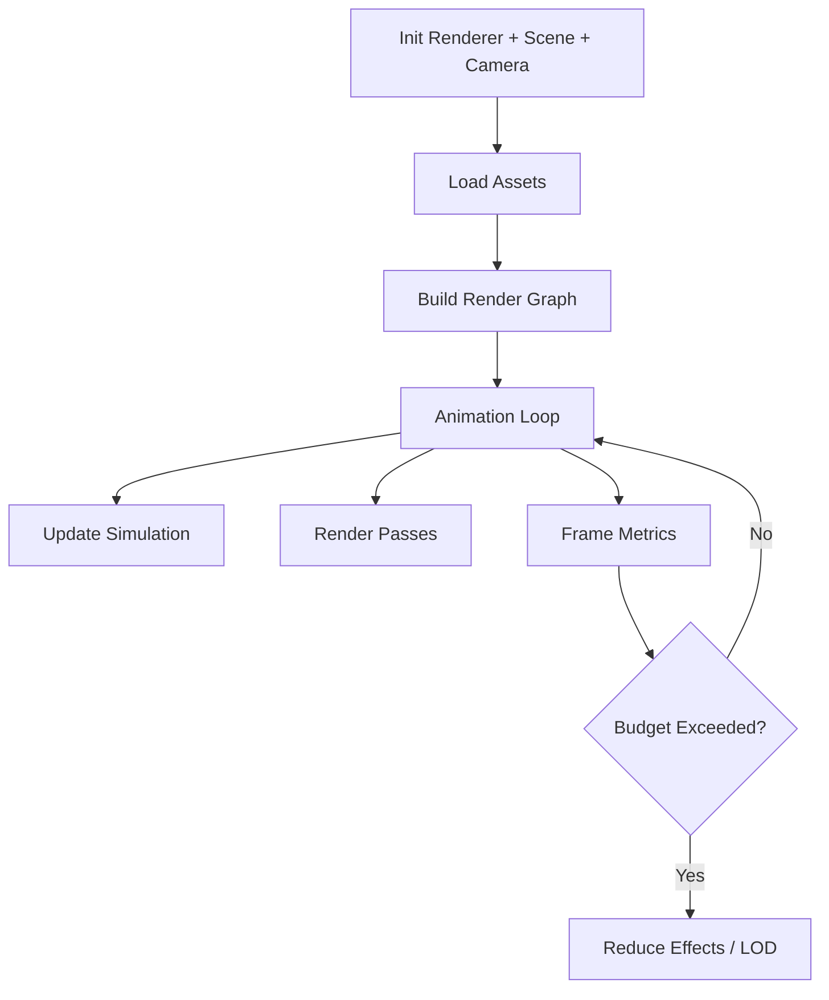

## The hard part isn't the cube

Three.js is easy to start. Easy to outgrow.

Putting a cube on screen is not the hard part. Keeping frame time stable as the scene grows is.

> [!note]
> These patterns prioritize consistency under load over flashy demos.

## Runtime architecture


```mermaid
graph TD
    A[Init Renderer + Scene + Camera] --> B[Load Assets]
    B --> C[Build Render Graph]
    C --> D[Animation Loop]
    D --> E[Update Simulation]
    D --> F[Render Passes]
    D --> G[Frame Metrics]
    G --> H{Budget Exceeded?}
    H -->|Yes| I[Reduce Effects / LOD]
    H -->|No| D
```

## Interactive: instancing in motion

<div data-scene="threejs-techniques-scene.js" style="width:100%;height:420px;"></div>

## A reliable render loop

```javascript
const clock = new THREE.Clock();

function animate() {
  requestAnimationFrame(animate);
  const dt = Math.min(clock.getDelta(), 1 / 30);

  updateSimulation(dt);
  updateCamera(dt);
  renderer.render(scene, camera);

  metrics.frame(dt);
}

animate();
```

> [!tip]
> Clamp `dt`. Tab throttling and frame drops will explode physics or camera smoothing if you don't.

## Performance triage

```chat
user: FPS drops when I add many repeated meshes. What do I switch to?
assistant: InstancedMesh. Removes the draw-call overhead for repeated geometry+material combos.

user: Scene looks fine but stutters every few seconds.
assistant: GC. Reuse vectors and matrices across frames instead of allocating each tick.

user: How do I pick what to optimize first?
assistant: Profile by category — CPU update, GPU draw, overdraw/fill rate. Optimize the dominant bottleneck. Not the loudest guess.
```

## Build order

````steps
### Step 1: Frame budget + baseline metrics
Track frame time and draw calls before adding effects.

### Step 2: Instance the repeats
Convert repeated meshes to `THREE.InstancedMesh`. Verify draw-call drop.

### Step 3: LOD + culling
Distance-based detail. Frustum checks. Stop rendering work that isn't seen.

### Step 4: Postprocessing, layered
Add effects one at a time. Keep a feature flag to disable expensive passes fast.
````

## Patterns that pay

| Pattern | Benefit | Cost |
|---|---|---|
| Instancing | Fewer draw calls | Per-instance transform management |
| Texture atlases | Fewer material switches | UV authoring complexity |
| LOD groups | Stable frame time | Asset prep overhead |
| Explicit cleanup | Less leak risk | Lifecycle discipline |

```javascript
window.addEventListener('resize', () => {
  const w = container.clientWidth;
  const h = container.clientHeight;
  camera.aspect = w / h;
  camera.updateProjectionMatrix();
  renderer.setSize(w, h, false);
});
```

> [!warning]
> Visual polish stacks multiplicatively. Add it late, only if budget remains healthy.

## The summary

A production Three.js app is architecture and discipline.

Bounded loop. Measured budget. Scene complexity that scales predictably.

## Generation Metadata

- Assistant: Codex
- Model: GPT-5
- Generation date: 2026-02-14

## Prompt Used to Generate This Post

```text
Write a technical blog post titled "Three.js Rendering Techniques That Hold Up in Real Projects". Include: a section plan table mapping goals to markdown features, one mermaid architecture diagram, one interactive scene embed placeholder <div data-scene="threejs-techniques-scene.js">, JavaScript code for a robust animation loop, a tip and warning callout, a chat transcript with 3 performance triage questions, a 4-step implementation steps block, and a table of high-impact patterns. Keep the writing practical and readable. End with Assistant=Codex and Model=GPT-5 metadata and append the exact generation prompt.
```
