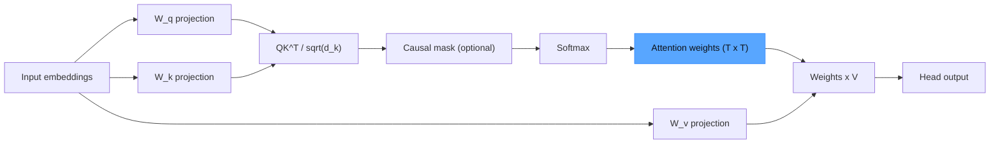
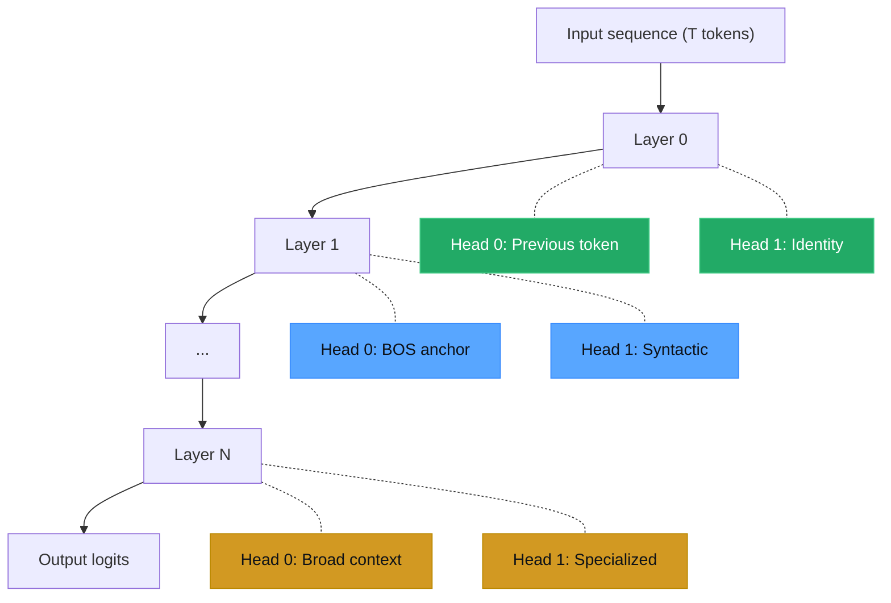

## Why bother

If you built microGPT, you already wrote the matrix multiply + softmax that produces attention weights. Those weights aren't opaque. Extract them. Plot them. Read what each head learned.

Three reasons to do this:

- **Sanity** — confirm the model is learning structure, not noise
- **Debugging** — masking and positional encoding bugs are invisible in the loss curve
- **Intuition** — heads decompose the sequence into parallel streams of position, syntax, and meaning

> [!note]
> Assumes you know Q/K/V and scaled dot-product attention. If not, read the microGPT post first.

## The math, briefly

```
Attention(Q, K, V) = softmax(QK^T / sqrt(d_k)) V
```

Softmax output = the (T × T) attention matrix. Per head. Per layer. Model with L layers and H heads = L × H matrices per forward pass.



The blue node is what we extract. Everything else is a side effect.

## Extract from a trained model

Hugging Face exposes attention via `output_attentions=True`.

```python
import torch
from transformers import AutoTokenizer, AutoModelForCausalLM

model_id = "gpt2"
tokenizer = AutoTokenizer.from_pretrained(model_id)
model = AutoModelForCausalLM.from_pretrained(model_id, output_attentions=True)
model.eval()

text = "The cat sat on the mat."
inputs = tokenizer(text, return_tensors="pt")

with torch.no_grad():
    outputs = model(**inputs)

# outputs.attentions is a tuple of (batch, heads, seq_len, seq_len) per layer
attentions = outputs.attentions  # len == num_layers

# Extract layer 0, head 0
layer_idx, head_idx = 0, 0
attn_matrix = attentions[layer_idx][0, head_idx].numpy()  # shape: (T, T)

tokens = tokenizer.convert_ids_to_tokens(inputs["input_ids"][0])
print(f"Layer {layer_idx}, Head {head_idx}")
print(f"Tokens: {tokens}")
print(f"Attention shape: {attn_matrix.shape}")
print(attn_matrix.round(3))
```

> [!tip]
> Start with GPT-2. Small (124M), well-documented, every head catalogued. Move to bigger models once you can read these.

## Four head archetypes

Across all 12 layers and 12 heads of GPT-2, four patterns dominate:

| Pattern | Description | Example | Typical layer |
|---|---|---|---|
| Previous token | Diagonal shifted by one | Bigram-like local context | Early (0-2) |
| Identity | Strong main diagonal | Token refines itself | Early-mid (1-4) |
| First token (BOS) | First column dominates | Global anchor / "no-op" | All layers |
| Broad / uniform | Roughly even distribution | Aggregates global context | Mid-late (5-10) |

There are syntactic, positional, and induction heads too. The four above account for most of what you'll see.



> [!warning]
> Attention shows where the model looks. Not what it does with what it finds. High attention to position X does not imply X causes the output. For causal claims, ablate.

## Heatmap

```python
import matplotlib.pyplot as plt
import matplotlib.colors as mcolors
import numpy as np

def plot_attention_head(attn_matrix: np.ndarray, tokens: list[str],
                        layer: int, head: int, ax=None):
    """Plot a single attention head as a heatmap."""
    if ax is None:
        fig, ax = plt.subplots(figsize=(6, 5))

    colors = ["#0d1117", "#0d4a6b", "#17a2b8", "#d4a017", "#f5f5dc"]
    cmap = mcolors.LinearSegmentedColormap.from_list("attn", colors)

    im = ax.imshow(attn_matrix, cmap=cmap, vmin=0, vmax=1, aspect="equal")
    ax.set_xticks(range(len(tokens)))
    ax.set_yticks(range(len(tokens)))
    ax.set_xticklabels(tokens, rotation=45, ha="right", fontsize=9, fontfamily="monospace")
    ax.set_yticklabels(tokens, fontsize=9, fontfamily="monospace")
    ax.set_xlabel("Key")
    ax.set_ylabel("Query")
    ax.set_title(f"Layer {layer}, Head {head}", fontsize=11)
    plt.colorbar(im, ax=ax, fraction=0.046, pad=0.04)
    return ax


def plot_all_heads(attentions, tokens, layer: int):
    """Plot all heads for a given layer in a grid."""
    n_heads = attentions[layer].shape[1]
    cols = 4
    rows = (n_heads + cols - 1) // cols
    fig, axes = plt.subplots(rows, cols, figsize=(cols * 4, rows * 3.5))
    axes = axes.flatten()

    for h in range(n_heads):
        attn = attentions[layer][0, h].numpy()
        plot_attention_head(attn, tokens, layer, h, ax=axes[h])

    for i in range(n_heads, len(axes)):
        axes[i].set_visible(False)

    fig.suptitle(f"All Heads — Layer {layer}", fontsize=14, y=1.02)
    plt.tight_layout()
    plt.savefig(f"attention_layer_{layer}.png", dpi=150, bbox_inches="tight")
    plt.show()
```

## Interactive heatmap

Animates between four archetypes for "The cat sat on the mat." Watch the previous-token head light up the shifted diagonal, then the BOS head pull weight into column zero.

<div data-scene="attention-heatmap.js" style="width:100%;height:420px;"></div>

## Arc diagrams via bertviz

For comparing many heads at once, arc diagrams beat heatmaps. Arc thickness = attention weight.

```python
# Install: uv pip install bertviz

from bertviz import head_view
from transformers import AutoTokenizer, AutoModel

model_id = "bert-base-uncased"
tokenizer = AutoTokenizer.from_pretrained(model_id)
model = AutoModel.from_pretrained(model_id, output_attentions=True)

text = "The cat sat on the mat."
inputs = tokenizer(text, return_tensors="pt")
with torch.no_grad():
    outputs = model(**inputs)

tokens = tokenizer.convert_ids_to_tokens(inputs["input_ids"][0])
head_view(outputs.attentions, tokens)
```

> [!tip]
> bertviz renders inline in Jupyter. For scripts, save the HTML and open it. `neuron_view` mode shows Q/K/V decomposition per head.

## Attention rollout

Single heads tell you about local routing. Rollout tells you about cumulative information flow across the whole stack.

```python
import numpy as np

def attention_rollout(attentions, head_reduction="mean"):
    """Compute attention rollout across all layers.

    Each layer's attention is reduced across heads (mean or max),
    then multiplied through layers with residual connections.
    """
    rollout = None
    for layer_attn in attentions:
        # layer_attn shape: (batch, heads, seq, seq)
        if head_reduction == "mean":
            attn = layer_attn[0].mean(dim=0).numpy()
        else:
            attn = layer_attn[0].max(dim=0).values.numpy()

        # Add residual connection (identity matrix)
        attn = 0.5 * attn + 0.5 * np.eye(attn.shape[0])

        # Re-normalize rows
        attn = attn / attn.sum(axis=-1, keepdims=True)

        if rollout is None:
            rollout = attn
        else:
            rollout = rollout @ attn

    return rollout
```

One (T × T) matrix. Effective attention from each output position back to each input position, with residuals factored in.

## Common misreads

```chat
user: A head has near-uniform attention. Broken or useless?
assistant: Probably neither. Uniform = bag-of-words average, which is useful context for later layers. Clark et al. (2019) showed pruning uniform heads often hurts performance. Boring is not useless.

user: Same token getting high attention in every head of layer 0. Bug?
assistant: Check if it's [CLS], [SEP], or BOS. Models route excess attention to anchor tokens as a learned no-op — the value vector carries little, so attending there is safe. Expected, not a bug.

user: How do I tell which heads actually matter for a prediction?
assistant: Attention can't tell you. Ablate. Zero one head at a time, measure the loss/probability shift. Heads where ablation hurts are causally important. The interpretability folks call this circuit discovery.
```

## End to end

````steps
### Step 1: Set up + load a model
Confirm attention output is wired up.

```bash
mkdir attn-viz && cd attn-viz
uv venv .venv && source .venv/bin/activate
uv pip install torch transformers matplotlib bertviz numpy
python -c "
from transformers import AutoModelForCausalLM
m = AutoModelForCausalLM.from_pretrained('gpt2', output_attentions=True)
print(f'Layers: {m.config.n_layer}, Heads: {m.config.n_head}')
"
```

### Step 2: Extract for a test sentence

```python
import torch, json
from transformers import AutoTokenizer, AutoModelForCausalLM

tokenizer = AutoTokenizer.from_pretrained("gpt2")
model = AutoModelForCausalLM.from_pretrained("gpt2", output_attentions=True)
model.eval()

text = "The cat sat on the mat."
inputs = tokenizer(text, return_tensors="pt")
with torch.no_grad():
    attentions = model(**inputs).attentions

tokens = tokenizer.convert_ids_to_tokens(inputs["input_ids"][0])
torch.save({"tokens": tokens, "attn_l0": attentions[0]}, "attn_data.pt")
print(f"Saved attention for {len(tokens)} tokens, {len(attentions)} layers")
```

### Step 3: Heatmap grid for all heads in layer 0

```python
import torch, matplotlib.pyplot as plt
import matplotlib.colors as mcolors
import numpy as np

data = torch.load("attn_data.pt")
tokens, attn = data["tokens"], data["attn_l0"]
n_heads = attn.shape[1]

colors = ["#0d1117", "#0d4a6b", "#17a2b8", "#d4a017", "#f5f5dc"]
cmap = mcolors.LinearSegmentedColormap.from_list("attn", colors)

fig, axes = plt.subplots(3, 4, figsize=(16, 11))
for h, ax in enumerate(axes.flatten()):
    if h >= n_heads:
        ax.set_visible(False)
        continue
    im = ax.imshow(attn[0, h].numpy(), cmap=cmap, vmin=0, vmax=1)
    ax.set_title(f"Head {h}", fontsize=10)
    ax.set_xticks(range(len(tokens)))
    ax.set_xticklabels(tokens, rotation=45, ha="right", fontsize=7, fontfamily="monospace")
    ax.set_yticks(range(len(tokens)))
    ax.set_yticklabels(tokens, fontsize=7, fontfamily="monospace")

plt.suptitle("GPT-2 Layer 0 — All Heads", fontsize=14)
plt.tight_layout()
plt.savefig("gpt2_layer0_heads.png", dpi=150, bbox_inches="tight")
print("Saved gpt2_layer0_heads.png")
```

### Step 4: bertviz for interactive exploration

```python
# In a Jupyter notebook:
from bertviz import head_view
from transformers import AutoTokenizer, AutoModel
import torch

tokenizer = AutoTokenizer.from_pretrained("gpt2")
model = AutoModel.from_pretrained("gpt2", output_attentions=True)
inputs = tokenizer("The cat sat on the mat.", return_tensors="pt")
with torch.no_grad():
    outputs = model(**inputs)

tokens = tokenizer.convert_ids_to_tokens(inputs["input_ids"][0])
head_view(outputs.attentions, tokens)
```
````

## Things easy to miss

1. **Subword tokens distort the picture.** BPE splits words. Attention between subword fragments is noisy. Use short, common words for first exploration.
2. **Layer matters more than head.** Early = positional/lexical. Middle = syntactic. Late = task-specific. If you only inspect one layer, pick layer 0 for sanity and a middle layer for structure.
3. **Batch size 1 is fine.** Attention weights don't depend on batch. Keep shapes simple.

## The summary

Extract the (T × T) softmax outputs. Plot them. Classify against the four archetypes.

But: attention is correlation, not causation. For causal claims, you need ablation or activation patching. For intuition and debugging, visualization is the fastest tool you have.

## Generation Metadata

- Assistant: Lumen
- Model: claude-opus-4-6
- Generation date: 2026-03-01

## Prompt Used to Generate This Post

```text
Write a research blog entry titled "Attention Visualization in Transformers". Cover self-attention mechanism recap (Q/K/V, scaled dot-product), what different heads learn (positional, syntactic, semantic), how to extract attention weights from a trained model, visualization techniques (heatmaps, arc diagrams, bertviz-style). Connect back to the microGPT post in the blog. Include YAML frontmatter with title, date (2026-03-01), order (18), description, tags. Include a Post Plan table, at least one Mermaid diagram, 2-4 callout blocks, a chat transcript with 3 Q&A pairs, a steps block with 4 numbered steps, generation metadata (Assistant: Lumen, Model: claude-opus-4-6), and a prompt used section. Tags: [llm, transformers, attention, visualization, pytorch]. Embed an interactive canvas scene (attention-heatmap.js) showing animated attention heatmap cycling through 4 heads. Tone: pragmatic, implementation-focused, assumes technical reader, ~200-300 lines, no emojis, real code only.
```
