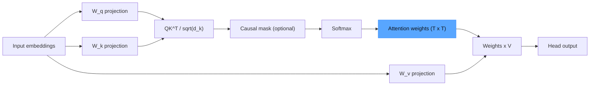
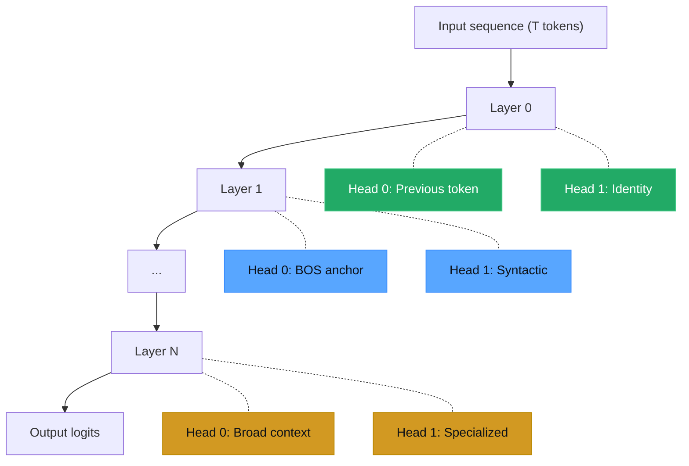

## Why Visualize Attention

If you followed the microGPT build in an earlier post, you implemented multi-head self-attention as a matrix multiply followed by softmax. The weights that softmax produces are the attention pattern -- a probability distribution over positions for every query token. These patterns are not opaque. You can extract them, plot them, and learn what each head specializes in.

This matters for three reasons. First, visualization confirms your model is learning structure rather than memorizing noise. Second, it exposes bugs in masking and positional encoding that are invisible in aggregate loss curves. Third, it builds intuition about why transformers generalize: different heads decompose the sequence into parallel streams of positional, syntactic, and semantic information.

> [!note]
> This post assumes familiarity with the transformer attention mechanism. If you need a refresher on Q/K/V and scaled dot-product attention, start with the microGPT post in this blog.

## Post Plan (Feature Map)

| Section Goal | Blog Feature Used | Why |
|---|---|---|
| Recap attention computation | Mermaid diagram + code | Ground the visualization in math |
| Show extraction from real models | Python code blocks | Copy-paste-ready extraction script |
| Classify head behaviors | Table + callouts | Give vocabulary for what you see |
| Interactive heatmap | Embedded scene | Let readers see head switching live |
| Connect to tooling ecosystem | Steps block | Path from extraction to bertviz |
| Address common confusion | Chat transcript | Short-circuit misinterpretations |

## Self-Attention Recap

Scaled dot-product attention computes:

```
Attention(Q, K, V) = softmax(QK^T / sqrt(d_k)) V
```

The softmax output is the attention weight matrix. For a sequence of length T, this matrix has shape (T x T) per head, per layer. A model with L layers and H heads produces L x H attention matrices per forward pass. That is a lot of data, but most insight comes from inspecting individual heads.



The blue node is what we extract and visualize. Everything else is either frozen (at inference) or computed as a side effect.

## Extracting Attention Weights from a Trained Model

Hugging Face transformers expose attention weights via the `output_attentions` flag. Here is a minimal extraction script that works with any causal LM:

```python
import torch
from transformers import AutoTokenizer, AutoModelForCausalLM

model_id = "gpt2"
tokenizer = AutoTokenizer.from_pretrained(model_id)
model = AutoModelForCausalLM.from_pretrained(model_id, output_attentions=True)
model.eval()

text = "The cat sat on the mat."
inputs = tokenizer(text, return_tensors="pt")

with torch.no_grad():
    outputs = model(**inputs)

# outputs.attentions is a tuple of (batch, heads, seq_len, seq_len) per layer
attentions = outputs.attentions  # len == num_layers

# Extract layer 0, head 0
layer_idx, head_idx = 0, 0
attn_matrix = attentions[layer_idx][0, head_idx].numpy()  # shape: (T, T)

tokens = tokenizer.convert_ids_to_tokens(inputs["input_ids"][0])
print(f"Layer {layer_idx}, Head {head_idx}")
print(f"Tokens: {tokens}")
print(f"Attention shape: {attn_matrix.shape}")
print(attn_matrix.round(3))
```

> [!tip]
> GPT-2 is the best model for learning attention visualization. It is small (124M parameters), well-documented, and every head has been catalogued by researchers. Start there before moving to larger models.

## What Different Heads Learn

When you visualize attention across all 12 layers and 12 heads of GPT-2, distinct patterns emerge. Here are the four most common archetypes:

| Pattern | Description | Example | Typical Layer |
|---|---|---|---|
| Previous token | Strong diagonal shifted by one position | Bigram-like local context | Early layers (0-2) |
| Identity / self | Strong main diagonal | Token refines its own representation | Early-mid layers (1-4) |
| First token (BOS) | First column dominates | Global anchor, often used as a "no-op" | All layers |
| Broad / uniform | Roughly even distribution | Aggregating global context | Mid-late layers (5-10) |

There are also syntactic heads (attending to the verb from its subject), positional heads (fixed-offset patterns), and rare specialized heads (separator token attention, induction heads). The four above cover what you will see most often.



> [!warning]
> Attention weights show where the model looks, not what it does with what it finds. A head with high attention to position X does not mean position X causally determines the output. For causal analysis, you need activation patching or ablation studies.

## Plotting a Heatmap with Matplotlib

The simplest visualization is a 2D heatmap. This function takes one attention matrix and produces a labeled plot:

```python
import matplotlib.pyplot as plt
import matplotlib.colors as mcolors
import numpy as np

def plot_attention_head(attn_matrix: np.ndarray, tokens: list[str],
                        layer: int, head: int, ax=None):
    """Plot a single attention head as a heatmap."""
    if ax is None:
        fig, ax = plt.subplots(figsize=(6, 5))

    # Custom colormap: dark blue -> cyan -> yellow
    colors = ["#0d1117", "#0d4a6b", "#17a2b8", "#d4a017", "#f5f5dc"]
    cmap = mcolors.LinearSegmentedColormap.from_list("attn", colors)

    im = ax.imshow(attn_matrix, cmap=cmap, vmin=0, vmax=1, aspect="equal")
    ax.set_xticks(range(len(tokens)))
    ax.set_yticks(range(len(tokens)))
    ax.set_xticklabels(tokens, rotation=45, ha="right", fontsize=9, fontfamily="monospace")
    ax.set_yticklabels(tokens, fontsize=9, fontfamily="monospace")
    ax.set_xlabel("Key")
    ax.set_ylabel("Query")
    ax.set_title(f"Layer {layer}, Head {head}", fontsize=11)
    plt.colorbar(im, ax=ax, fraction=0.046, pad=0.04)
    return ax


def plot_all_heads(attentions, tokens, layer: int):
    """Plot all heads for a given layer in a grid."""
    n_heads = attentions[layer].shape[1]
    cols = 4
    rows = (n_heads + cols - 1) // cols
    fig, axes = plt.subplots(rows, cols, figsize=(cols * 4, rows * 3.5))
    axes = axes.flatten()

    for h in range(n_heads):
        attn = attentions[layer][0, h].numpy()
        plot_attention_head(attn, tokens, layer, h, ax=axes[h])

    for i in range(n_heads, len(axes)):
        axes[i].set_visible(False)

    fig.suptitle(f"All Heads — Layer {layer}", fontsize=14, y=1.02)
    plt.tight_layout()
    plt.savefig(f"attention_layer_{layer}.png", dpi=150, bbox_inches="tight")
    plt.show()
```

## Interactive Heatmap

The visualization below animates between four attention head patterns for the sentence "The cat sat on the mat." Watch how each head focuses on different positions -- the previous-token head lights up a shifted diagonal, while the first-token head concentrates weight in the first column.

<div data-scene="attention-heatmap.js" style="width:100%;height:420px;"></div>

## BertViz and Arc Diagrams

For deeper exploration, the bertviz library renders multi-head attention as interactive arc diagrams. Arcs connect each query token to the keys it attends to, with arc thickness proportional to attention weight. This is more readable than heatmaps when comparing many heads simultaneously.

```python
# Install: uv pip install bertviz

from bertviz import head_view
from transformers import AutoTokenizer, AutoModel

model_id = "bert-base-uncased"
tokenizer = AutoTokenizer.from_pretrained(model_id)
model = AutoModel.from_pretrained(model_id, output_attentions=True)

text = "The cat sat on the mat."
inputs = tokenizer(text, return_tensors="pt")
with torch.no_grad():
    outputs = model(**inputs)

tokens = tokenizer.convert_ids_to_tokens(inputs["input_ids"][0])
head_view(outputs.attentions, tokens)
```

> [!tip]
> bertviz works in Jupyter notebooks with inline rendering. For scripts, save the HTML output and open it in a browser. The neuron_view mode shows Q/K/V decompositions per head.

## Attention Patterns Across Layers

One of the most informative visualizations is an attention rollout or attention flow across all layers. Rather than looking at single heads, you can compute the cumulative attention from the input layer to any later layer by multiplying attention matrices:

```python
import numpy as np

def attention_rollout(attentions, head_reduction="mean"):
    """Compute attention rollout across all layers.

    Each layer's attention is reduced across heads (mean or max),
    then multiplied through layers with residual connections.
    """
    rollout = None
    for layer_attn in attentions:
        # layer_attn shape: (batch, heads, seq, seq)
        if head_reduction == "mean":
            attn = layer_attn[0].mean(dim=0).numpy()
        else:
            attn = layer_attn[0].max(dim=0).values.numpy()

        # Add residual connection (identity matrix)
        attn = 0.5 * attn + 0.5 * np.eye(attn.shape[0])

        # Re-normalize rows
        attn = attn / attn.sum(axis=-1, keepdims=True)

        if rollout is None:
            rollout = attn
        else:
            rollout = rollout @ attn

    return rollout
```

This gives a single (T x T) matrix showing the effective attention from each output position back to each input position, accounting for residual connections and multi-layer composition.

## Conversation: Common Misunderstandings

```chat
user: A head has near-uniform attention. Is it broken or useless?
assistant: Probably not. Uniform attention computes something close to a bag-of-words average, which is useful context for later layers. Some heads genuinely learn to aggregate global information. Clark et al. (2019) found that pruning uniform heads often hurts downstream performance. Do not assume a head is useless just because its pattern looks boring.

user: I see the same token getting high attention in every head of layer 0. Is that a bug?
assistant: Check if that token is a special token like [CLS], [SEP], or BOS. Models frequently route excess attention to these anchor tokens as a learned "no-op" -- the value vector for these tokens tends to carry little information, so attending to them is a safe default. This is expected behavior, not a bug.

user: How do I know which heads are actually important for a specific prediction?
assistant: Attention weights alone cannot tell you. You need causal interventions. The standard approach is attention head ablation: zero out one head at a time and measure the change in loss or output probability. Heads where ablation causes large changes are causally important. The mechanistic interpretability literature calls these "circuit discovery" methods.
```

## From Extraction to Visualization: Step by Step

````steps
### Step 1: Set up the environment and load a model
Install dependencies and confirm attention output is available:

```bash
mkdir attn-viz && cd attn-viz
uv venv .venv && source .venv/bin/activate
uv pip install torch transformers matplotlib bertviz numpy
python -c "
from transformers import AutoModelForCausalLM
m = AutoModelForCausalLM.from_pretrained('gpt2', output_attentions=True)
print(f'Layers: {m.config.n_layer}, Heads: {m.config.n_head}')
"
```

### Step 2: Extract attention weights for a test sentence
Run a forward pass and save the attention tensors:

```python
import torch, json
from transformers import AutoTokenizer, AutoModelForCausalLM

tokenizer = AutoTokenizer.from_pretrained("gpt2")
model = AutoModelForCausalLM.from_pretrained("gpt2", output_attentions=True)
model.eval()

text = "The cat sat on the mat."
inputs = tokenizer(text, return_tensors="pt")
with torch.no_grad():
    attentions = model(**inputs).attentions

tokens = tokenizer.convert_ids_to_tokens(inputs["input_ids"][0])
# Save layer 0 attention for inspection
torch.save({"tokens": tokens, "attn_l0": attentions[0]}, "attn_data.pt")
print(f"Saved attention for {len(tokens)} tokens, {len(attentions)} layers")
```

### Step 3: Generate heatmaps for all heads in layer 0
Plot and save a grid of attention heatmaps:

```python
import torch, matplotlib.pyplot as plt
import matplotlib.colors as mcolors
import numpy as np

data = torch.load("attn_data.pt")
tokens, attn = data["tokens"], data["attn_l0"]
n_heads = attn.shape[1]

colors = ["#0d1117", "#0d4a6b", "#17a2b8", "#d4a017", "#f5f5dc"]
cmap = mcolors.LinearSegmentedColormap.from_list("attn", colors)

fig, axes = plt.subplots(3, 4, figsize=(16, 11))
for h, ax in enumerate(axes.flatten()):
    if h >= n_heads:
        ax.set_visible(False)
        continue
    im = ax.imshow(attn[0, h].numpy(), cmap=cmap, vmin=0, vmax=1)
    ax.set_title(f"Head {h}", fontsize=10)
    ax.set_xticks(range(len(tokens)))
    ax.set_xticklabels(tokens, rotation=45, ha="right", fontsize=7, fontfamily="monospace")
    ax.set_yticks(range(len(tokens)))
    ax.set_yticklabels(tokens, fontsize=7, fontfamily="monospace")

plt.suptitle("GPT-2 Layer 0 — All Heads", fontsize=14)
plt.tight_layout()
plt.savefig("gpt2_layer0_heads.png", dpi=150, bbox_inches="tight")
print("Saved gpt2_layer0_heads.png")
```

### Step 4: Launch bertviz for interactive exploration
Use bertviz head_view for a richer, interactive visualization in Jupyter:

```python
# In a Jupyter notebook:
from bertviz import head_view
from transformers import AutoTokenizer, AutoModel
import torch

tokenizer = AutoTokenizer.from_pretrained("gpt2")
model = AutoModel.from_pretrained("gpt2", output_attentions=True)
inputs = tokenizer("The cat sat on the mat.", return_tensors="pt")
with torch.no_grad():
    outputs = model(**inputs)

tokens = tokenizer.convert_ids_to_tokens(inputs["input_ids"][0])
head_view(outputs.attentions, tokens)
# Use the dropdown to switch layers, click heads to isolate them
```
````

## Practical Notes

A few things that are easy to overlook:

1. **Subword tokens change the picture.** BPE tokenizers split words into subword pieces. "sitting" might become ["sit", "ting"]. Attention patterns between subword fragments are noisy and hard to interpret. Use short, common words for initial exploration.

2. **Layer matters more than head.** Early layers tend to learn positional and lexical patterns. Middle layers learn syntactic structure. Late layers are task-specific. If you only have time to inspect one layer, pick layer 0 for sanity checking and a middle layer for interesting structure.

3. **Batch size 1 is fine for visualization.** Attention weights do not change with batch size (they depend only on the input sequence). Always extract with batch size 1 to keep shapes simple.

## Wrap-Up

Attention visualization turns the transformer's internal routing into something you can inspect and reason about. The pipeline is straightforward: extract the (T x T) softmax outputs per head per layer, plot them as heatmaps or arc diagrams, and classify the patterns you find. The four main archetypes -- previous token, identity, first token, and broad -- account for most of what you will see in early and middle layers.

The key limitation is that attention weights show correlation, not causation. A head attending strongly to a position does not mean that position drives the output. For causal claims, you need ablation or activation patching. But for building intuition, debugging models, and understanding what multi-head attention actually does with its capacity, visualization is the fastest tool available.

## Generation Metadata

- Assistant: Lumen
- Model: claude-opus-4-6
- Generation date: 2026-03-01

## Prompt Used to Generate This Post

```text
Write a research blog entry titled "Attention Visualization in Transformers". Cover self-attention mechanism recap (Q/K/V, scaled dot-product), what different heads learn (positional, syntactic, semantic), how to extract attention weights from a trained model, visualization techniques (heatmaps, arc diagrams, bertviz-style). Connect back to the microGPT post in the blog. Include YAML frontmatter with title, date (2026-03-01), order (18), description, tags. Include a Post Plan table, at least one Mermaid diagram, 2-4 callout blocks, a chat transcript with 3 Q&A pairs, a steps block with 4 numbered steps, generation metadata (Assistant: Lumen, Model: claude-opus-4-6), and a prompt used section. Tags: [llm, transformers, attention, visualization, pytorch]. Embed an interactive canvas scene (attention-heatmap.js) showing animated attention heatmap cycling through 4 heads. Tone: pragmatic, implementation-focused, assumes technical reader, ~200-300 lines, no emojis, real code only.
```
