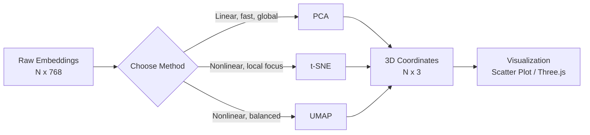

## The geometry of meaning

Every token your model touches lives as a point in a high-dimensional vector space. That space has structure — synonyms cluster, analogies form parallelograms, semantic categories occupy distinct regions.

768 dimensions is unreadable. 3 isn't.

Project, plot, debug.

When semantic search returns garbage, the visualization tells you whether the query landed in the wrong neighborhood or whether the neighborhood itself is poorly formed. The plot is the diagnostic.

> [!note]
> This post uses dense embeddings (Ollama, sentence-transformers, OpenAI). Sparse embeddings (TF-IDF, BM25) are a different problem.

## What an embedding is

A learned dense vector representation of a discrete input — a word, a sentence, an image patch, a code snippet. Fixed length, typically 384–4096 dims. Semantic similarity = geometric proximity.

Three properties:

- **Dense** — every dim carries signal, no zeros by design
- **Learned** — positions emerge from training, not hand-coded
- **Geometric** — relationships become spatial. `king - queen ≈ man - woman`. Cosine similarity ≈ semantic similarity.

```python
import requests
import numpy as np


def get_embedding(text: str, model: str = "nomic-embed-text") -> np.ndarray:
    """Get an embedding vector from Ollama."""
    resp = requests.post("http://localhost:11434/api/embed", json={
        "model": model,
        "input": text,
    })
    return np.array(resp.json()["embeddings"][0])


# Compare two words
v_cat = get_embedding("cat")
v_dog = get_embedding("dog")
v_france = get_embedding("france")

# Cosine similarity
def cosine_sim(a: np.ndarray, b: np.ndarray) -> float:
    return float(np.dot(a, b) / (np.linalg.norm(a) * np.linalg.norm(b)))

print(f"cat-dog:    {cosine_sim(v_cat, v_dog):.4f}")     # ~0.78
print(f"cat-france: {cosine_sim(v_cat, v_france):.4f}")   # ~0.35
```

cat is closer to dog than france. Confirmed.

> [!tip]
> `nomic-embed-text` is the default. 768 dims, fast on CPU, handles short queries and long passages. `ollama pull nomic-embed-text`.

## Three reducers

768 dims won't plot. Reduce. Each algorithm trades differently.

### PCA

Linear, deterministic, fast. Finds orthogonal directions of maximum variance and projects onto them.

```python
from sklearn.decomposition import PCA

# embeddings: np.ndarray of shape (N, 768)
pca = PCA(n_components=3)
projected_pca = pca.fit_transform(embeddings)

# How much variance do the 3 components explain?
print(f"Explained variance: {pca.explained_variance_ratio_.sum():.2%}")
```

First pass. If clusters separate in the top 3 components, you're done. If not, go nonlinear.

### t-SNE

Models pairwise similarities as probability distributions, minimizes KL divergence. Preserves local neighborhoods. Distorts global geometry.

```python
from sklearn.manifold import TSNE

tsne = TSNE(
    n_components=3,
    perplexity=30,       # controls neighborhood size
    learning_rate=200,
    n_iter=1000,
    random_state=42,
)
projected_tsne = tsne.fit_transform(embeddings)
```

Tradeoffs: non-deterministic, O(N²), and inter-cluster distances are not meaningful. Perplexity is the critical knob — too low = noise, too high = mush.

### UMAP

Builds a topological representation (k-NN graph), optimizes a low-dim layout that preserves it. Faster than t-SNE. Preserves more global structure. Default choice.

```python
import umap

reducer = umap.UMAP(
    n_components=3,
    n_neighbors=15,      # local neighborhood size
    min_dist=0.1,        # how tightly points can pack
    metric="cosine",     # match embedding similarity metric
    random_state=42,
)
projected_umap = reducer.fit_transform(embeddings)
```

`n_neighbors` = local vs global tradeoff. `min_dist` = visual compactness.



> [!warning]
> Don't over-read distances in t-SNE/UMAP plots. These algorithms distort global geometry to preserve local neighborhoods. UMAP's inter-cluster spacing is *more* meaningful than t-SNE's. For quantitative work, use cosine similarity on the original vectors.

## End-to-end pipeline

Extract embeddings from Ollama, reduce to 3D with UMAP, export for the visualization.

```python
import json
import numpy as np
import requests
import umap

WORDS = {
    "animals": [
        "cat", "dog", "fish", "bird", "horse", "snake", "whale", "eagle",
        "rabbit", "tiger", "lion", "bear", "shark", "wolf", "deer", "fox",
        "dolphin", "parrot", "owl", "frog", "monkey", "penguin",
    ],
    "colors": [
        "red", "blue", "green", "yellow", "purple", "orange", "white",
        "black", "pink", "cyan", "magenta", "teal", "crimson", "gold",
        "silver", "violet", "indigo", "maroon", "beige", "navy",
    ],
    "countries": [
        "france", "japan", "brazil", "canada", "germany", "india", "mexico",
        "egypt", "italy", "china", "australia", "kenya", "sweden", "chile",
        "spain", "korea", "nigeria", "peru", "norway", "poland", "turkey",
        "vietnam", "greece",
    ],
    "food": [
        "pizza", "rice", "bread", "apple", "cheese", "pasta", "sushi",
        "steak", "soup", "taco", "curry", "salad", "butter", "noodles",
        "burger", "mango", "cake", "honey", "garlic", "salmon", "waffle",
        "yogurt", "pretzel",
    ],
}


def get_embeddings_batch(texts: list[str], model: str = "nomic-embed-text") -> np.ndarray:
    """Fetch embeddings for a batch of texts from Ollama."""
    resp = requests.post("http://localhost:11434/api/embed", json={
        "model": model,
        "input": texts,
    })
    return np.array(resp.json()["embeddings"])


# Flatten words and track labels
all_words = []
all_labels = []
for category, words in WORDS.items():
    all_words.extend(words)
    all_labels.extend([category] * len(words))

# Fetch embeddings
embeddings = get_embeddings_batch(all_words)
print(f"Embedding matrix: {embeddings.shape}")  # (88, 768)

# Project to 3D with UMAP
reducer = umap.UMAP(
    n_components=3,
    n_neighbors=12,
    min_dist=0.2,
    metric="cosine",
    random_state=42,
)
coords_3d = reducer.fit_transform(embeddings)

# Normalize to a reasonable scene scale
coords_3d -= coords_3d.mean(axis=0)
scale = np.abs(coords_3d).max()
coords_3d = (coords_3d / scale) * 8  # fit in a ~16-unit box

# Export for Three.js
output = []
for i, word in enumerate(all_words):
    output.append({
        "word": word,
        "category": all_labels[i],
        "position": coords_3d[i].tolist(),
    })

with open("embedding_coords.json", "w") as f:
    json.dump(output, f, indent=2)

print(f"Exported {len(output)} points to embedding_coords.json")
```

The output JSON drops directly into a Three.js scene.

## Cosine and nearest neighbors

Cosine measures the angle between vectors. Magnitude is ignored.

$$\text{cos\_sim}(\mathbf{a}, \mathbf{b}) = \frac{\mathbf{a} \cdot \mathbf{b}}{|\mathbf{a}||\mathbf{b}|}$$

Range: [-1, 1]. For unit vectors, cosine = dot product.

NN search over embeddings is the foundation of semantic search, RAG, and clustering. Use FAISS in practice.

```python
import faiss
import numpy as np

# Normalize embeddings (FAISS IndexFlatIP = inner product = cosine for unit vectors)
norms = np.linalg.norm(embeddings, axis=1, keepdims=True)
normalized = (embeddings / norms).astype(np.float32)

index = faiss.IndexFlatIP(normalized.shape[1])
index.add(normalized)

# Query: 5 nearest neighbors for "sushi"
query = get_embeddings_batch(["sushi"])
query_norm = (query / np.linalg.norm(query, axis=1, keepdims=True)).astype(np.float32)

distances, indices = index.search(query_norm, k=5)
for rank, (dist, idx) in enumerate(zip(distances[0], indices[0])):
    print(f"  {rank+1}. {all_words[idx]:12s} (similarity: {dist:.4f})")
# 1. sushi        (similarity: 1.0000)
# 2. rice         (similarity: 0.7834)
# 3. noodles      (similarity: 0.7621)
# 4. pasta        (similarity: 0.7412)
# 5. salmon       (similarity: 0.7108)
```

## What this unlocks

- **Semantic search** — embed corpus, embed query, return NNs. The core of RAG.
- **Clustering** — HDBSCAN or k-means over embeddings. No manual labels.
- **Anomaly detection** — points far from any cluster are semantic outliers
- **Deduplication** — cosine > ~0.95 = near-duplicate. One FAISS pass flags them.

> [!note]
> Quality downstream depends entirely on embedding quality. Better model > fancier reduction or clustering algorithm. Start with the embeddings.

## Interactive: 3D scatter

88 word embeddings across four semantic clusters. Each cluster colored. Faint lines connect intra-cluster nearest neighbors. Camera orbits.

<div data-scene="embedding-scatter.js" style="width:100%;height:420px;"></div>

In a real pipeline these are UMAP outputs. Here they're gaussian scatter around pre-assigned cluster centers — but the spatial pattern matches what you see with real embeddings: tight intra-cluster grouping, clear inter-cluster gaps, and edge cases (apple) that sit between groups.

## Common questions

```chat
user: How do I choose between PCA, t-SNE, and UMAP?
assistant: PCA first — fast, deterministic, sanity check. If clusters don't appear in top 3 components, switch to UMAP. Use t-SNE only if you specifically want local neighborhood preservation and don't care about global layout. UMAP is the default for everything else.

user: My UMAP shows one big blob, not distinct clusters. Why?
assistant: Three causes. (1) Embedding model doesn't separate those concepts — try a bigger or domain-specific model. (2) `n_neighbors` too high — drop to 5–10. (3) `min_dist` too high — drop to 0.05. And use `metric="cosine"` since embedding similarity is angular.

user: Can I use the 3D projected coordinates for downstream classification?
assistant: No. Reduction is lossy. The projection doesn't preserve quantitative relationships. Use the full-dim embeddings for classification, search, clustering. The 3D plot is a diagnostic and communication tool only.
```

## Hands-on

````steps
### Step 1: Pull an embedding model
nomic-embed-text. 137M params, 768-dim, runs on CPU.

```bash
ollama pull nomic-embed-text
curl http://localhost:11434/api/embed \
  -d '{"model": "nomic-embed-text", "input": "hello world"}'
```

### Step 2: Install Python deps

```bash
uv venv .venv && source .venv/bin/activate
uv pip install numpy requests umap-learn scikit-learn faiss-cpu matplotlib
```

### Step 3: Run the pipeline
Drop the script into `embed_project.py`. Run it.

```bash
uv run python embed_project.py
# Embedding matrix: (88, 768)
# Exported 88 points to embedding_coords.json
```

### Step 4: Visualize
Quick check: matplotlib. Interactive: load JSON into Three.js.

```python
import json
import matplotlib.pyplot as plt

with open("embedding_coords.json") as f:
    data = json.load(f)

fig = plt.figure(figsize=(10, 8))
ax = fig.add_subplot(111, projection="3d")

colors = {"animals": "#4fc3f7", "colors": "#f06292", "countries": "#aed581", "food": "#ffb74d"}
for point in data:
    ax.scatter(*point["position"], c=colors[point["category"]], s=20, alpha=0.8)
    ax.text(*point["position"], point["word"], fontsize=6, alpha=0.6)

ax.set_xlabel("UMAP 1")
ax.set_ylabel("UMAP 2")
ax.set_zlabel("UMAP 3")
plt.tight_layout()
plt.savefig("embedding_scatter.png", dpi=150)
plt.show()
```
````

## The summary

Embeddings turn meaning into geometry.

PCA — fast linear baseline. t-SNE — local neighborhoods at the cost of global fidelity. UMAP — best balance for most cases.

Extract. Project. Plot. The visualization is a diagnostic — does your model capture the distinctions you care about? Are clusters well-separated? Where are the edge cases?

The same vectors then power search, clustering, and dedup. The embedding is the foundation. The projection is just how you inspect it.

## Generation Metadata

- Assistant: Lumen
- Model: claude-opus-4-6
- Generation date: 2026-03-01

## Prompt Used to Generate This Post

```text
Write a markdown blog post about "Embedding Spaces in 3D". Cover what embeddings are (dense vector representations), how models learn them, dimensionality reduction (PCA, t-SNE, UMAP -- explain each), cosine similarity, nearest neighbors, practical uses (semantic search, clustering, anomaly detection). Show how to extract embeddings from a local model and project them for visualization. Include an interactive Three.js 3D scatter plot scene embed. Follow the existing blog format: YAML frontmatter, opening motivation, Post Plan table, Mermaid diagram, callout blocks (note/tip/warning), chat transcript with 3 Q&A pairs, 4-step steps block, wrap-up, and generation metadata (Assistant: Lumen, Model: claude-opus-4-6). Use real Python code with Ollama, umap-learn, faiss, sklearn. Tags: [llm, embeddings, dimensionality-reduction, umap, visualization]. Keep tone pragmatic, implementation-focused, ~200-300 lines, no emojis.
```
