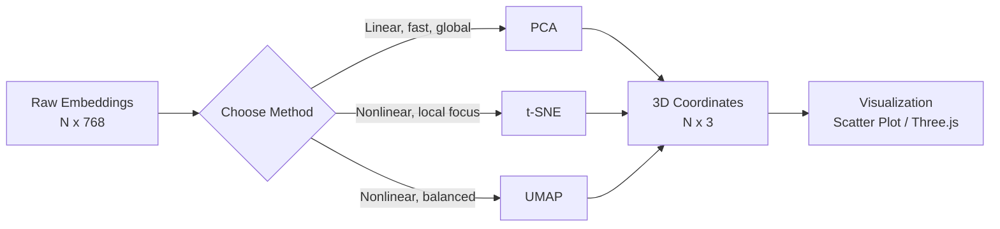

## Why Stare at Embedding Spaces

Every token your model processes lives as a point in a high-dimensional vector space. That space has structure -- words with similar meaning cluster together, analogies form parallelograms, and entire semantic categories occupy distinct neighborhoods. But 768 dimensions is hard to reason about. Projecting those vectors down to 2D or 3D makes that structure visible and debuggable.

This matters in practice. When your semantic search returns irrelevant results, visualizing the embedding space shows you whether the query vector landed in the wrong neighborhood or whether the neighborhood itself is poorly formed. When your clustering pipeline produces garbage clusters, a 3D scatter plot tells you whether the problem is the embeddings or the clustering algorithm. The visualization is the diagnostic tool.

> [!note]
> This post works with dense vector embeddings from transformer models (the kind you get from Ollama, sentence-transformers, or OpenAI). Sparse embeddings (TF-IDF, BM25) are a different representation with different projection behavior.

## Post Plan (Feature Map)

| Section Goal | Blog Feature Used | Why |
|---|---|---|
| Explain what embeddings are and why they matter | Prose + callouts | Ground the reader before implementation |
| Walk through dimensionality reduction methods | Prose + Python code + Mermaid diagram | Compare PCA, t-SNE, UMAP with runnable examples |
| Extract embeddings from a local model | Python code blocks | Copy-paste pipeline with Ollama |
| Project and visualize in 3D | Python code + interactive scene | Show the output, then let the reader explore it |
| Debug common issues | Chat transcript | Address real confusion points |
| End-to-end reproduction path | Steps block | Hands-on walkthrough |

## What Embeddings Actually Are

An embedding is a learned dense vector representation of a discrete input -- a word, a sentence, an image patch, a code snippet. The model maps the input to a fixed-length float array (typically 384 to 4096 dimensions) such that semantic similarity corresponds to geometric proximity.

The key properties:

- **Dense**: Every dimension carries signal. Unlike one-hot or bag-of-words vectors, there are no zeros by design.
- **Learned**: The positions are not hand-coded. They emerge from training on large corpora. The model learns that "cat" and "dog" should be near each other because they appear in similar contexts.
- **Geometric**: Relationships become spatial. The vector from "king" to "queen" is approximately the same as the vector from "man" to "woman". Cosine similarity between two embeddings measures how semantically related they are.

```python
import requests
import numpy as np


def get_embedding(text: str, model: str = "nomic-embed-text") -> np.ndarray:
    """Get an embedding vector from Ollama."""
    resp = requests.post("http://localhost:11434/api/embed", json={
        "model": model,
        "input": text,
    })
    return np.array(resp.json()["embeddings"][0])


# Compare two words
v_cat = get_embedding("cat")
v_dog = get_embedding("dog")
v_france = get_embedding("france")

# Cosine similarity
def cosine_sim(a: np.ndarray, b: np.ndarray) -> float:
    return float(np.dot(a, b) / (np.linalg.norm(a) * np.linalg.norm(b)))

print(f"cat-dog:    {cosine_sim(v_cat, v_dog):.4f}")     # ~0.78
print(f"cat-france: {cosine_sim(v_cat, v_france):.4f}")   # ~0.35
```

The numbers confirm intuition: "cat" is much closer to "dog" than to "france" in embedding space.

> [!tip]
> `nomic-embed-text` is a good default embedding model for Ollama. It produces 768-dimensional vectors, runs fast on CPU, and handles both short queries and longer passages. Pull it with `ollama pull nomic-embed-text`.

## Dimensionality Reduction: PCA, t-SNE, UMAP

768 dimensions cannot be plotted directly. Dimensionality reduction algorithms project high-dimensional data to 2D or 3D while preserving as much structure as possible. Each algorithm makes different tradeoffs.

### PCA (Principal Component Analysis)

PCA finds the orthogonal directions of maximum variance and projects onto them. It is linear, deterministic, and fast. The downside: it preserves global variance but can miss nonlinear cluster structure.

```python
from sklearn.decomposition import PCA

# embeddings: np.ndarray of shape (N, 768)
pca = PCA(n_components=3)
projected_pca = pca.fit_transform(embeddings)

# How much variance do the 3 components explain?
print(f"Explained variance: {pca.explained_variance_ratio_.sum():.2%}")
```

PCA is the right first pass. If your clusters are already linearly separable in the top 3 principal components, you are done. If not, you need a nonlinear method.

### t-SNE (t-distributed Stochastic Neighbor Embedding)

t-SNE models pairwise similarities as probability distributions and minimizes the KL divergence between the high-dimensional and low-dimensional distributions. It excels at preserving local neighborhood structure -- nearby points stay nearby.

```python
from sklearn.manifold import TSNE

tsne = TSNE(
    n_components=3,
    perplexity=30,       # controls neighborhood size
    learning_rate=200,
    n_iter=1000,
    random_state=42,
)
projected_tsne = tsne.fit_transform(embeddings)
```

The tradeoffs: t-SNE is non-deterministic (results change across runs), slow on large datasets (O(N^2) by default), and does not preserve global distances. Two clusters that appear far apart in a t-SNE plot may not actually be far apart in the original space. Perplexity is the critical hyperparameter -- too low and you get noise, too high and you lose cluster definition.

### UMAP (Uniform Manifold Approximation and Projection)

UMAP constructs a topological representation of the high-dimensional data (a weighted k-neighbor graph) and optimizes a low-dimensional layout that preserves that topology. It is faster than t-SNE, preserves more global structure, and scales well.

```python
import umap

reducer = umap.UMAP(
    n_components=3,
    n_neighbors=15,      # local neighborhood size
    min_dist=0.1,        # how tightly points can pack
    metric="cosine",     # match embedding similarity metric
    random_state=42,
)
projected_umap = reducer.fit_transform(embeddings)
```

UMAP is the default choice for most embedding visualization tasks. `n_neighbors` controls the balance between local and global structure (higher values preserve more global relationships). `min_dist` controls visual compactness.



> [!warning]
> Do not over-interpret distances in t-SNE or UMAP plots. These algorithms distort global geometry to preserve local neighborhoods. The relative positions of clusters can be meaningful in UMAP but are essentially arbitrary in t-SNE. Use cosine similarity on the original vectors for quantitative comparisons.

## Extracting and Projecting Embeddings: Full Pipeline

Here is a complete pipeline that extracts embeddings from Ollama for a set of words, reduces to 3D with UMAP, and exports the result for visualization.

```python
import json
import numpy as np
import requests
import umap

WORDS = {
    "animals": [
        "cat", "dog", "fish", "bird", "horse", "snake", "whale", "eagle",
        "rabbit", "tiger", "lion", "bear", "shark", "wolf", "deer", "fox",
        "dolphin", "parrot", "owl", "frog", "monkey", "penguin",
    ],
    "colors": [
        "red", "blue", "green", "yellow", "purple", "orange", "white",
        "black", "pink", "cyan", "magenta", "teal", "crimson", "gold",
        "silver", "violet", "indigo", "maroon", "beige", "navy",
    ],
    "countries": [
        "france", "japan", "brazil", "canada", "germany", "india", "mexico",
        "egypt", "italy", "china", "australia", "kenya", "sweden", "chile",
        "spain", "korea", "nigeria", "peru", "norway", "poland", "turkey",
        "vietnam", "greece",
    ],
    "food": [
        "pizza", "rice", "bread", "apple", "cheese", "pasta", "sushi",
        "steak", "soup", "taco", "curry", "salad", "butter", "noodles",
        "burger", "mango", "cake", "honey", "garlic", "salmon", "waffle",
        "yogurt", "pretzel",
    ],
}


def get_embeddings_batch(texts: list[str], model: str = "nomic-embed-text") -> np.ndarray:
    """Fetch embeddings for a batch of texts from Ollama."""
    resp = requests.post("http://localhost:11434/api/embed", json={
        "model": model,
        "input": texts,
    })
    return np.array(resp.json()["embeddings"])


# Flatten words and track labels
all_words = []
all_labels = []
for category, words in WORDS.items():
    all_words.extend(words)
    all_labels.extend([category] * len(words))

# Fetch embeddings
embeddings = get_embeddings_batch(all_words)
print(f"Embedding matrix: {embeddings.shape}")  # (88, 768)

# Project to 3D with UMAP
reducer = umap.UMAP(
    n_components=3,
    n_neighbors=12,
    min_dist=0.2,
    metric="cosine",
    random_state=42,
)
coords_3d = reducer.fit_transform(embeddings)

# Normalize to a reasonable scene scale
coords_3d -= coords_3d.mean(axis=0)
scale = np.abs(coords_3d).max()
coords_3d = (coords_3d / scale) * 8  # fit in a ~16-unit box

# Export for Three.js
output = []
for i, word in enumerate(all_words):
    output.append({
        "word": word,
        "category": all_labels[i],
        "position": coords_3d[i].tolist(),
    })

with open("embedding_coords.json", "w") as f:
    json.dump(output, f, indent=2)

print(f"Exported {len(output)} points to embedding_coords.json")
```

Running this produces a JSON file with 3D coordinates that you can feed directly into a Three.js scene. The interactive visualization below uses pre-computed positions following this exact method (with gaussian scatter around cluster centers for demonstration).

## Cosine Similarity and Nearest Neighbors

Cosine similarity is the standard metric for comparing embeddings. It measures the angle between two vectors, ignoring magnitude:

$$\text{cos\_sim}(\mathbf{a}, \mathbf{b}) = \frac{\mathbf{a} \cdot \mathbf{b}}{|\mathbf{a}||\mathbf{b}|}$$

Values range from -1 (opposite) to 1 (identical). For normalized embeddings, cosine similarity equals the dot product.

Nearest-neighbor search over embeddings is the foundation of semantic search, retrieval-augmented generation (RAG), and clustering. In practice you use approximate nearest neighbors (ANN) libraries for speed:

```python
import faiss
import numpy as np

# Build a FAISS index for fast cosine similarity search
# Normalize embeddings first (FAISS IndexFlatIP = inner product = cosine for unit vectors)
norms = np.linalg.norm(embeddings, axis=1, keepdims=True)
normalized = (embeddings / norms).astype(np.float32)

index = faiss.IndexFlatIP(normalized.shape[1])
index.add(normalized)

# Query: find 5 nearest neighbors for "sushi"
query = get_embeddings_batch(["sushi"])
query_norm = (query / np.linalg.norm(query, axis=1, keepdims=True)).astype(np.float32)

distances, indices = index.search(query_norm, k=5)
for rank, (dist, idx) in enumerate(zip(distances[0], indices[0])):
    print(f"  {rank+1}. {all_words[idx]:12s} (similarity: {dist:.4f})")
# 1. sushi        (similarity: 1.0000)
# 2. rice         (similarity: 0.7834)
# 3. noodles      (similarity: 0.7621)
# 4. pasta        (similarity: 0.7412)
# 5. salmon       (similarity: 0.7108)
```

## Practical Applications

**Semantic search**: Embed your document corpus, embed the user query, return the nearest neighbors. This is the core of RAG pipelines.

**Clustering**: Run HDBSCAN or k-means on the embedding space to discover topic groups without manual labeling.

**Anomaly detection**: Points that are far from all cluster centers in embedding space are semantic outliers -- useful for content moderation, fraud detection, or data quality checks.

**Deduplication**: Near-duplicate documents have cosine similarity above ~0.95. A single pass through a FAISS index flags them efficiently.

> [!note]
> The quality of all downstream tasks depends entirely on embedding quality. A better embedding model (larger, domain-specific, or fine-tuned) matters more than a fancier reduction or clustering algorithm. Start with the embeddings.

## Interactive: 3D Embedding Scatter Plot

The scene below renders ~88 word embeddings across four semantic clusters (animals, colors, countries, food). Each cluster gets a distinct color. Faint lines connect nearest neighbors within each cluster. The camera orbits slowly so you can see the 3D separation.

<div data-scene="embedding-scatter.js" style="width:100%;height:420px;"></div>

In a real pipeline the positions would come from UMAP output on actual embedding vectors. Here they are simulated with gaussian scatter around pre-assigned cluster centers -- but the spatial structure mirrors what you see with real embeddings: tight intra-cluster grouping, clear inter-cluster separation, and a few edge cases (words like "apple" that could plausibly belong to multiple clusters) sitting between groups.

## Conversation: Common Embedding Questions

```chat
user: How do I choose between PCA, t-SNE, and UMAP for visualization?
assistant: Start with PCA as a sanity check -- it is fast and deterministic. If the clusters are not visible in the first 3 principal components, switch to UMAP. Use t-SNE only if you specifically need to optimize for local neighborhood preservation and do not care about global layout. UMAP is the default choice for most use cases because it balances local and global structure, runs faster than t-SNE, and produces more stable results across runs.

user: My UMAP projection shows one big blob instead of distinct clusters. What is wrong?
assistant: Three common causes. First, the embedding model may not separate those concepts well -- try a different or larger model. Second, your n_neighbors parameter may be too high, which over-smooths the topology. Lower it to 5-10 for tighter clusters. Third, your min_dist may be too high. Drop it to 0.05 to let clusters compress. Also check that you are using metric="cosine" since embedding similarity is angular, not Euclidean.

user: Can I use the 3D projected coordinates for downstream tasks like classification?
assistant: No. Dimensionality reduction is lossy and the projected coordinates do not preserve the quantitative relationships of the original space. Use the full-dimensional embeddings for classification, search, and clustering. The 3D projection is a diagnostic and communication tool only -- it shows you qualitative structure but should not feed into a pipeline.
```

## Hands-On: Extract, Project, Visualize

````steps
### Step 1: Pull an embedding model
Install nomic-embed-text via Ollama. This 137M-parameter model produces 768-dimensional embeddings and runs well on CPU.

```bash
ollama pull nomic-embed-text
# Verify it works
curl http://localhost:11434/api/embed \
  -d '{"model": "nomic-embed-text", "input": "hello world"}'
```

### Step 2: Install Python dependencies
Set up a virtual environment with umap-learn, scikit-learn, faiss-cpu, and matplotlib for static plots.

```bash
uv venv .venv && source .venv/bin/activate
uv pip install numpy requests umap-learn scikit-learn faiss-cpu matplotlib
```

### Step 3: Run the extraction and projection pipeline
Copy the full pipeline script from above into `embed_project.py` and run it. It fetches embeddings for ~88 words, projects to 3D with UMAP, and exports coordinates to JSON.

```bash
uv run python embed_project.py
# Output: Embedding matrix: (88, 768)
# Output: Exported 88 points to embedding_coords.json
```

### Step 4: Visualize with matplotlib (static) or Three.js (interactive)
For a quick static check, plot the exported coordinates with matplotlib. For an interactive version, load the JSON into a Three.js scene following the pattern in the embedded visualization above.

```python
import json
import matplotlib.pyplot as plt

with open("embedding_coords.json") as f:
    data = json.load(f)

fig = plt.figure(figsize=(10, 8))
ax = fig.add_subplot(111, projection="3d")

colors = {"animals": "#4fc3f7", "colors": "#f06292", "countries": "#aed581", "food": "#ffb74d"}
for point in data:
    ax.scatter(*point["position"], c=colors[point["category"]], s=20, alpha=0.8)
    ax.text(*point["position"], point["word"], fontsize=6, alpha=0.6)

ax.set_xlabel("UMAP 1")
ax.set_ylabel("UMAP 2")
ax.set_zlabel("UMAP 3")
plt.tight_layout()
plt.savefig("embedding_scatter.png", dpi=150)
plt.show()
```
````

## Wrap-Up

Embeddings compress semantic meaning into geometry. PCA gives you a fast linear baseline, t-SNE optimizes local neighborhoods at the cost of global fidelity, and UMAP strikes the best balance for most visualization tasks. The practical workflow is straightforward: extract embeddings from your model, project to 3D with UMAP, and render the result as an interactive scatter plot. The visualization itself is a diagnostic tool -- it shows you whether your embedding model captures the distinctions you care about, whether your clusters are well-separated, and where the edge cases live. From there, the same embeddings power semantic search, clustering, anomaly detection, and deduplication without any changes to the vectors themselves. The embedding is the foundation; the projection is just how you inspect it.

## Generation Metadata

- Assistant: Lumen
- Model: claude-opus-4-6
- Generation date: 2026-03-01

## Prompt Used to Generate This Post

```text
Write a markdown blog post about "Embedding Spaces in 3D". Cover what embeddings are (dense vector representations), how models learn them, dimensionality reduction (PCA, t-SNE, UMAP -- explain each), cosine similarity, nearest neighbors, practical uses (semantic search, clustering, anomaly detection). Show how to extract embeddings from a local model and project them for visualization. Include an interactive Three.js 3D scatter plot scene embed. Follow the existing blog format: YAML frontmatter, opening motivation, Post Plan table, Mermaid diagram, callout blocks (note/tip/warning), chat transcript with 3 Q&A pairs, 4-step steps block, wrap-up, and generation metadata (Assistant: Lumen, Model: claude-opus-4-6). Use real Python code with Ollama, umap-learn, faiss, sklearn. Tags: [llm, embeddings, dimensionality-reduction, umap, visualization]. Keep tone pragmatic, implementation-focused, ~200-300 lines, no emojis.
```
