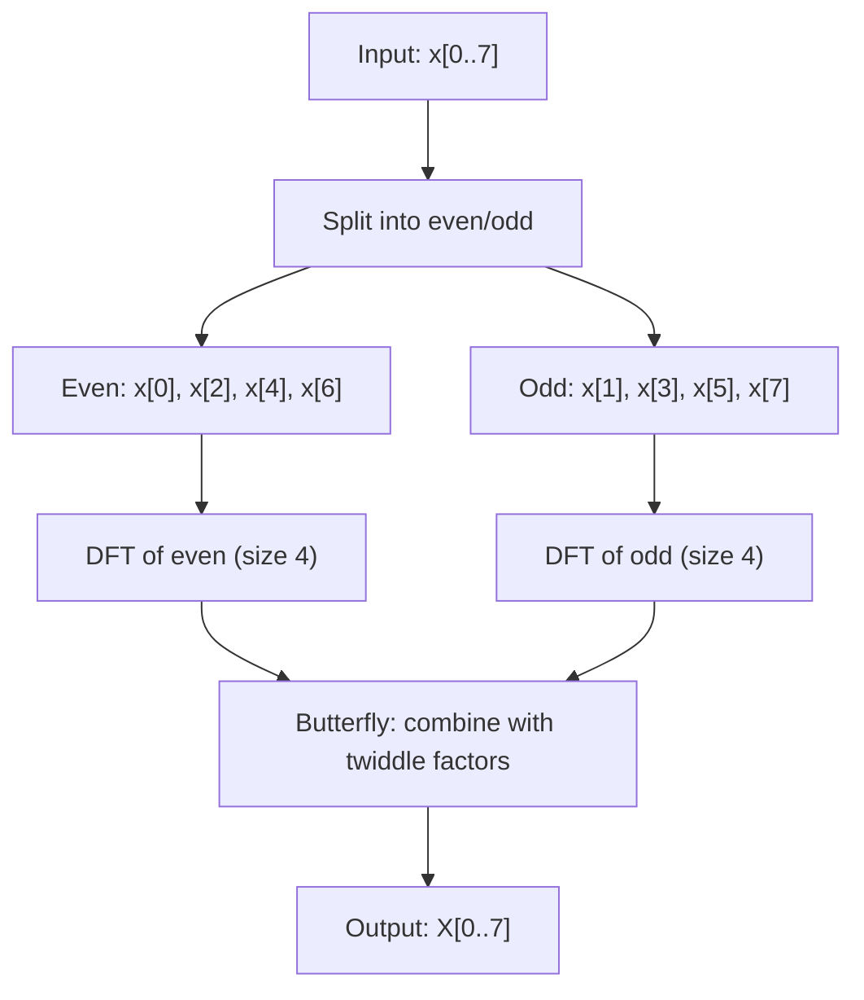

## Why visualize it

The DFT is one of the most useful algorithms in computing. Most explanations jump to the summation and lose people at the complex exponential.

The core idea is simple: any periodic signal decomposes into sine and cosine waves. The DFT tells you which frequencies are there, and how strong. The inverse DFT puts the signal back together.

It's the foundation of audio analysis, image compression (JPEG = DCT), filtering (zero out a frequency bin), and modulation (OFDM in WiFi/LTE).

Watching rotating circles compose a square wave makes the math click. Summation notation does not.

> [!note]
> 1D DFT here. The 2D version (image processing) applies the same transform along rows and columns independently.

## The formula

N time samples → N frequency coefficients.

```
X[k] = sum(n=0 to N-1) x[n] * e^(-j * 2*pi * k * n / N)
```

Each X[k] is complex. Magnitude = strength of frequency k. Angle = phase.

Naive DFT in code:

```javascript
function dft(signal) {
  const N = signal.length;
  const result = [];
  for (let k = 0; k < N; k++) {
    let re = 0, im = 0;
    for (let n = 0; n < N; n++) {
      const angle = (2 * Math.PI * k * n) / N;
      re += signal[n] * Math.cos(angle);
      im -= signal[n] * Math.sin(angle);
    }
    result.push({ re, im, freq: k, amp: Math.sqrt(re * re + im * im) / N });
  }
  return result;
}
```

O(N²). For real-time audio at 44100 Hz with a 4096 window, you need the FFT.

> [!tip]
> For real input, the DFT output is conjugate symmetric. Only the first N/2+1 bins carry unique information.

## Epicycles

Square wave approximation via epicycles. Each rotating circle = one harmonic. Radius 1/n, frequency n. The tip of the last circle traces the waveform.

<div data-scene="fourier-epicycles.js" style="width:100%;height:420px;"></div>

This is how a square wave is built. With 10 harmonics you can see the Gibbs phenomenon — the small overshoot near discontinuities that never fully disappears.

## DFT → FFT (Cooley-Tukey)

Radix-2 splits the input into even and odd indices, recursively transforms each, combines with butterflies. O(N²) → O(N log N).



The trick: `W_N^(k+N/2) = -W_N^k`. Same multiplications cover both halves.

```python
import numpy as np

def fft_recursive(x):
    N = len(x)
    if N <= 1:
        return x
    even = fft_recursive(x[0::2])
    odd = fft_recursive(x[1::2])
    T = [np.exp(-2j * np.pi * k / N) * odd[k] for k in range(N // 2)]
    return [even[k] + T[k] for k in range(N // 2)] + \
           [even[k] - T[k] for k in range(N // 2)]

# Test: FFT of a simple signal
signal = [1, 0, -1, 0, 1, 0, -1, 0]
result = fft_recursive(signal)
magnitudes = [abs(c) / len(signal) for c in result]
print("Magnitudes:", [round(m, 3) for m in magnitudes])
# Dominant peak at bin 2 (frequency = 2 cycles per N samples)
```

> [!warning]
> Radix-2 needs power-of-2 input length. Zero-pad to the next power of 2. `numpy.fft` handles this automatically. If you roll your own, pad first.

## Time vs frequency

Time domain — what is the signal doing right now?
Frequency domain — what frequencies are in this signal?

The DFT is the bridge. Lossless. Inverse goes back.

```javascript
// Compute magnitude spectrum from FFT result
function magnitudeSpectrum(fftResult, sampleRate) {
  const N = fftResult.length;
  const spectrum = [];
  for (let k = 0; k <= N / 2; k++) {
    const re = fftResult[k].re;
    const im = fftResult[k].im;
    const magnitude = Math.sqrt(re * re + im * im) / N;
    const frequencyHz = (k * sampleRate) / N;
    spectrum.push({ bin: k, frequency: frequencyHz, magnitude });
  }
  return spectrum;
}

// 44100 Hz sample rate, 1024-sample window
// Bin 0 = DC, Bin 512 = Nyquist (22050 Hz)
// Resolution = sampleRate / N = 44100 / 1024 ~ 43 Hz per bin
```

## Windowing

Take a finite chunk of a signal and apply the DFT. You're implicitly assuming it repeats. If it doesn't line up at the boundaries, you get **spectral leakage** — energy from one frequency smears across neighbors.

Fix: multiply by a window function that tapers to zero at the edges before the DFT.

| Window | Sidelobe | Main lobe | Best for |
|---|---|---|---|
| Rectangular (none) | -13 dB | Narrowest | Already periodic in frame |
| Hann | -31 dB | Moderate | General audio |
| Hamming | -42 dB | Moderate | Speech |
| Blackman | -58 dB | Wide | High dynamic range |
| Kaiser (β=8) | -60 dB | Adjustable | Tunable tradeoff |

```javascript
function hannWindow(signal) {
  const N = signal.length;
  const windowed = new Float32Array(N);
  for (let n = 0; n < N; n++) {
    const w = 0.5 * (1 - Math.cos((2 * Math.PI * n) / (N - 1)));
    windowed[n] = signal[n] * w;
  }
  return windowed;
}
```

> [!tip]
> Always window real-world signals before FFT. Hann is a safe default. Skip the window only when the signal is exactly periodic in your frame.

## Where it shows up

**Audio spectrum analysis.** Overlapping frames (2048 samples, 50% overlap) → Hann window → FFT → magnitude. Every equalizer.

**JPEG.** DCT (real-valued cousin of DFT) on 8×8 blocks. High-frequency coefficients quantized harder because the eye is less sensitive.

**Filtering.** Kill 60 Hz hum: FFT, zero bins near 60 Hz and harmonics, inverse FFT. Conceptually simple. Watch the windowing and overlap-add.

**Convolution.** Time-domain convolution = frequency-domain multiplication. For long FIR filters, FFT-based convolution via overlap-add is orders of magnitude faster.

## Common questions

```chat
user: Why does my FFT output look mirrored?
assistant: For real input the DFT is conjugate symmetric — `X[k] = conj(X[N-k])`. Second half is redundant. Plot bins 0 through N/2. Or use `rfft`, which only returns the unique bins.

user: How do I convert FFT bin index to Hz?
assistant: `freq = (bin * sample_rate) / N`. At 44100 Hz with 1024-sample FFT, each bin spans ~43 Hz. Bin 0 = DC. Bin 512 = Nyquist. Want finer resolution? Longer window.

user: My FFT shows energy across many bins for what I know is a pure tone.
assistant: Spectral leakage. The frequency doesn't land on a bin center. Rectangular window's sidelobes spread energy. Apply Hann or Blackman. Main lobe gets wider but sidelobes drop. Cleaner peak.
```

## Build a browser spectrum analyzer

````steps
### Step 1: Capture audio via Web Audio API
`getUserMedia` for the mic, connect to an `AnalyserNode`.

```javascript
const stream = await navigator.mediaDevices.getUserMedia({ audio: true });
const audioCtx = new AudioContext();
const source = audioCtx.createMediaStreamSource(stream);
const analyser = audioCtx.createAnalyser();
analyser.fftSize = 2048; // 1024 unique frequency bins
source.connect(analyser);
```

### Step 2: Read frequency data per frame

```javascript
const freqData = new Uint8Array(analyser.frequencyBinCount);
function readSpectrum() {
  analyser.getByteFrequencyData(freqData);
  // freqData[0] = DC, freqData[1023] = Nyquist
  return freqData;
}
```

### Step 3: Map bins to canvas, draw bars

```javascript
function drawSpectrum(ctx, data, width, height) {
  const barWidth = width / data.length;
  ctx.fillStyle = '#0a0e17';
  ctx.fillRect(0, 0, width, height);
  for (let i = 0; i < data.length; i++) {
    const barHeight = (data[i] / 255) * height;
    const hue = (i / data.length) * 240;
    ctx.fillStyle = `hsl(${hue}, 70%, 55%)`;
    ctx.fillRect(i * barWidth, height - barHeight, barWidth - 1, barHeight);
  }
}
```

### Step 4: Animate

```javascript
const canvas = document.getElementById('spectrum');
const ctx = canvas.getContext('2d');
function animate() {
  requestAnimationFrame(animate);
  const data = readSpectrum();
  drawSpectrum(ctx, data, canvas.width, canvas.height);
}
animate();
```
````

## DFT as change of basis

N samples live in an N-dim vector space. The standard basis is time-domain samples (1 at time n, 0 elsewhere). The Fourier basis is complex exponentials at each frequency.

The DFT matrix F multiplies your signal vector to express it in the Fourier basis. F⁻¹ converts back. Orthogonal basis = invertible, lossless.

```python
import numpy as np

# The DFT matrix for N=4
N = 4
F = np.zeros((N, N), dtype=complex)
for k in range(N):
    for n in range(N):
        F[k, n] = np.exp(-2j * np.pi * k * n / N)

print("DFT matrix (N=4):")
print(np.round(F, 3))
# Each row is a basis vector at frequency k
# F is unitary (up to scaling by sqrt(N))

signal = np.array([1, 0, -1, 0])
spectrum = F @ signal
print("Spectrum:", np.round(spectrum, 3))
# Reconstruct: signal = (1/N) * F_conj_transpose @ spectrum
```

## The summary

Time ↔ frequency. The DFT is the bridge.

DFT in O(N²). FFT in O(N log N). Window before transforming real-world signals. Watch for leakage.

The epicycle picture is the whole intuition: complex signals are sums of rotating circles. Once you see that, the formula stops being abstract.

## Generation Metadata

- Assistant: Lumen
- Model: claude-opus-4-6
- Generation date: 2026-03-01

## Prompt Used to Generate This Post

```text
Write a markdown blog post about Fourier Transforms Visualized. Cover DFT math (the sum formula), frequency domain vs time domain, FFT algorithm (Cooley-Tukey), windowing, spectral leakage, practical applications (audio analysis, image compression, signal filtering). The epicycle visualization shows how sine waves compose complex signals. Include: YAML frontmatter (title, date 2026-03-01, order 17, description, tags), opening motivation section, Post Plan (Feature Map) table, core technical content with real code (JavaScript, Python), at least one Mermaid diagram, the scene embed div, 2-4 callout blocks, one chat transcript with 3 Q&A pairs, one steps block with 4 steps, wrap-up section, generation metadata (Assistant: Lumen, Model: claude-opus-4-6, Generation date: 2026-03-01), and the prompt used. Tags: [math, fourier-transform, signal-processing, visualization, dft]. Scene: fourier-epicycles.js -- Canvas 2D epicycles approximating a square wave. Tone: pragmatic, implementation-focused, assumes technical reader, ~200-300 lines, no emojis, real code only.
```
