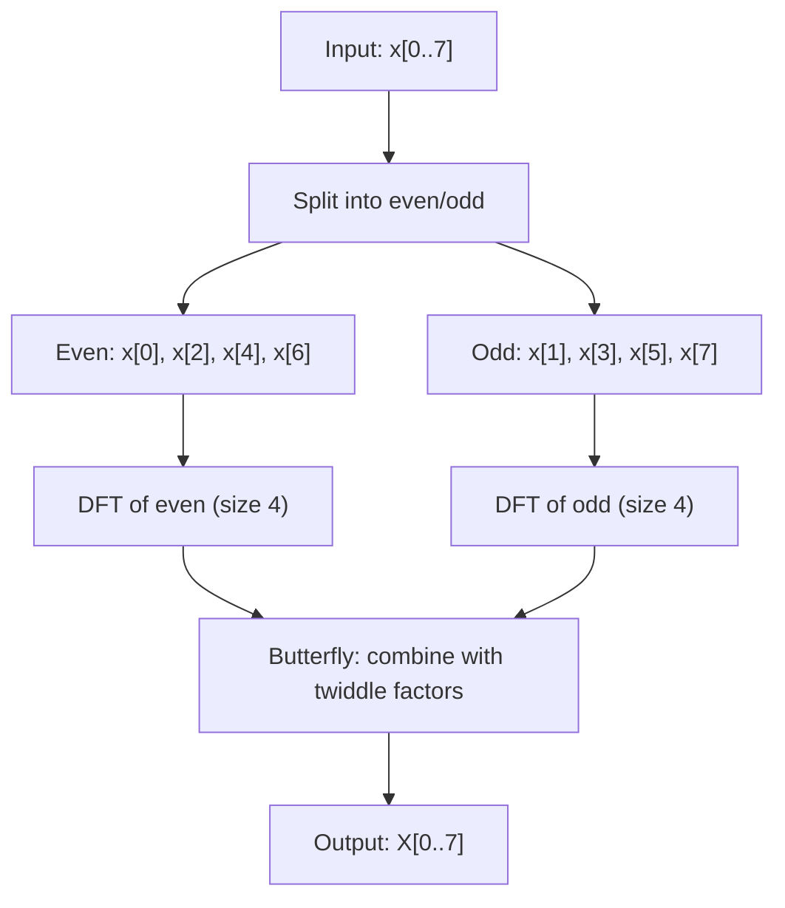

## Why Fourier Transforms Deserve a Visual Intuition

The Discrete Fourier Transform is one of the most useful algorithms in computing, yet most explanations jump straight to the summation formula and lose people at the complex exponential. The core idea is simple: any periodic signal can be decomposed into a sum of sine and cosine waves at different frequencies. The DFT tells you which frequencies are present and how strong each one is. The inverse DFT reconstructs the original signal from those frequencies.

This matters practically because it is the foundation of audio analysis (spectrum analyzers, equalizers), image compression (JPEG operates on DCT, a real-valued cousin), signal filtering (remove noise by zeroing frequency bins), and telecommunications (OFDM modulation in WiFi and LTE). Understanding it visually -- watching rotating circles compose a square wave -- makes the math click in a way that staring at summation notation never will.

> [!note]
> This post covers the one-dimensional DFT. The 2D case (used in image processing) applies the same transform along rows and columns independently.

## Post Plan (Feature Map)

| Section Goal | Blog Feature Used | Why |
|---|---|---|
| Build geometric intuition for Fourier series | Interactive scene (epicycles) | Rotating circles make the decomposition tangible |
| Present the DFT formula precisely | Code blocks + math notation | Copy-paste-ready implementations |
| Explain FFT (Cooley-Tukey) | Mermaid diagram + code | Show the divide-and-conquer structure |
| Cover windowing and spectral leakage | Callout + table | Common pitfall with a concrete fix |
| Demonstrate practical applications | Steps block + chat | End-to-end audio analysis walkthrough |

## The DFT Formula

The Discrete Fourier Transform converts N time-domain samples into N frequency-domain coefficients. For a sequence x[0], x[1], ..., x[N-1]:

```
X[k] = sum(n=0 to N-1) x[n] * e^(-j * 2*pi * k * n / N)
```

Each output X[k] is a complex number encoding the amplitude and phase of frequency bin k. The magnitude |X[k]| gives the strength of that frequency; the angle gives the phase offset.

In code, a naive DFT is straightforward:

```javascript
function dft(signal) {
  const N = signal.length;
  const result = [];
  for (let k = 0; k < N; k++) {
    let re = 0, im = 0;
    for (let n = 0; n < N; n++) {
      const angle = (2 * Math.PI * k * n) / N;
      re += signal[n] * Math.cos(angle);
      im -= signal[n] * Math.sin(angle);
    }
    result.push({ re, im, freq: k, amp: Math.sqrt(re * re + im * im) / N });
  }
  return result;
}
```

This runs in O(N^2) time. For N = 1024, that is about a million multiplications. For real-time audio at 44100 Hz with a 4096-sample window, you need the FFT.

> [!tip]
> The output of the DFT is symmetric for real-valued input. Only the first N/2 + 1 bins contain unique information. The rest are complex conjugates.

## Epicycles: Seeing Fourier Series in Action

The visualization below shows a Fourier series approximation of a square wave using epicycles. Each rotating circle corresponds to one harmonic (odd harmonics: n=1, 3, 5, 7, ...). The radius of each circle is 1/n, and it rotates at frequency n. The tip of the last circle traces the approximated waveform on the right side.

<div data-scene="fourier-epicycles.js" style="width:100%;height:420px;"></div>

This is how a square wave is built from sine waves. With 10 harmonics, you can see the Gibbs phenomenon -- the small overshoot near the discontinuities that never fully disappears no matter how many terms you add.

## From DFT to FFT: The Cooley-Tukey Algorithm

The Fast Fourier Transform reduces the O(N^2) DFT to O(N log N) by exploiting symmetry in the complex exponentials. The radix-2 Cooley-Tukey algorithm splits the input into even-indexed and odd-indexed subsequences, computes the DFT of each recursively, and combines them using "butterfly" operations.



The twiddle factor W_N^k = e^(-j * 2*pi*k/N) is the key. Because W_N^(k+N/2) = -W_N^k, you can reuse the same multiplications for the top and bottom halves of the output.

```python
import numpy as np

def fft_recursive(x):
    N = len(x)
    if N <= 1:
        return x
    even = fft_recursive(x[0::2])
    odd = fft_recursive(x[1::2])
    T = [np.exp(-2j * np.pi * k / N) * odd[k] for k in range(N // 2)]
    return [even[k] + T[k] for k in range(N // 2)] + \
           [even[k] - T[k] for k in range(N // 2)]

# Test: FFT of a simple signal
signal = [1, 0, -1, 0, 1, 0, -1, 0]
result = fft_recursive(signal)
magnitudes = [abs(c) / len(signal) for c in result]
print("Magnitudes:", [round(m, 3) for m in magnitudes])
# Dominant peak at bin 2 (frequency = 2 cycles per N samples)
```

> [!warning]
> The radix-2 FFT requires the input length to be a power of 2. In practice, you zero-pad your signal to the next power of 2. Libraries like numpy.fft handle this automatically, but if you roll your own, pad first.

## Frequency Domain vs Time Domain

The time domain shows amplitude over time. The frequency domain shows amplitude (and phase) over frequency. The DFT is the bridge between them, and it is lossless -- you can always go back via the inverse DFT.

A practical way to think about it: the time domain answers "what is the signal doing right now?" while the frequency domain answers "what frequencies are present in this signal?"

```javascript
// Compute magnitude spectrum from FFT result
function magnitudeSpectrum(fftResult, sampleRate) {
  const N = fftResult.length;
  const spectrum = [];
  for (let k = 0; k <= N / 2; k++) {
    const re = fftResult[k].re;
    const im = fftResult[k].im;
    const magnitude = Math.sqrt(re * re + im * im) / N;
    const frequencyHz = (k * sampleRate) / N;
    spectrum.push({ bin: k, frequency: frequencyHz, magnitude });
  }
  return spectrum;
}

// Example: 44100 Hz sample rate, 1024-sample window
// Bin 0 = DC (0 Hz), Bin 512 = Nyquist (22050 Hz)
// Frequency resolution = sampleRate / N = 44100 / 1024 ~ 43 Hz per bin
```

## Windowing and Spectral Leakage

When you take a finite chunk of a signal and apply the DFT, you are implicitly assuming the signal repeats. If it does not line up cleanly at the boundaries, you get spectral leakage: energy from a single frequency smears across neighboring bins.

The fix is windowing. You multiply the signal by a window function that tapers smoothly to zero at the edges before applying the DFT.

| Window | Sidelobe Level | Main Lobe Width | Best For |
|---|---|---|---|
| Rectangular (none) | -13 dB | Narrowest | Signals already periodic in the frame |
| Hann | -31 dB | Moderate | General-purpose audio analysis |
| Hamming | -42 dB | Moderate | Speech processing |
| Blackman | -58 dB | Wide | High dynamic range measurement |
| Kaiser (beta=8) | -60 dB | Adjustable | Configurable trade-off |

```javascript
function hannWindow(signal) {
  const N = signal.length;
  const windowed = new Float32Array(N);
  for (let n = 0; n < N; n++) {
    const w = 0.5 * (1 - Math.cos((2 * Math.PI * n) / (N - 1)));
    windowed[n] = signal[n] * w;
  }
  return windowed;
}
```

> [!tip]
> Always apply a window before computing the FFT of a real-world signal. The Hann window is a safe default. Skip the window only when you know the signal is exactly periodic within your frame.

## Practical Applications

The FFT shows up everywhere once you know what to look for:

**Audio spectrum analysis.** Split audio into overlapping frames (e.g., 2048 samples with 50% overlap), apply a Hann window, compute the FFT, and plot the magnitude spectrum. This is what every equalizer and spectrum visualizer does.

**JPEG compression.** JPEG applies the DCT (Discrete Cosine Transform, a real-valued relative of the DFT) to 8x8 pixel blocks. High-frequency coefficients are quantized aggressively because the human eye is less sensitive to high-frequency detail.

**Signal filtering.** To remove a 60 Hz power line hum: compute the FFT, zero out bins near 60 Hz and its harmonics, compute the inverse FFT. This is conceptually simple but requires care with windowing and overlap-add to avoid artifacts.

**Convolution.** Convolution in the time domain is multiplication in the frequency domain. For long filters (FIR with thousands of taps), FFT-based convolution via overlap-add is orders of magnitude faster than direct convolution.

## Conversation: Common Questions

```chat
user: Why do I see a mirror image in my FFT output? The spectrum looks symmetric.
assistant: For real-valued input, the DFT output is conjugate symmetric. X[k] = conj(X[N-k]). The second half is redundant. Only plot bins 0 through N/2 for the meaningful spectrum. This is why libraries often provide an rfft function that returns only the unique bins.

user: What is the relationship between the FFT bin index and actual frequency in Hz?
assistant: Frequency in Hz = (bin_index * sample_rate) / N. For a 44100 Hz signal with a 1024-sample FFT, each bin spans about 43 Hz. Bin 0 is DC (0 Hz), bin 512 is the Nyquist frequency (22050 Hz). If you need finer frequency resolution, use a longer FFT window.

user: My FFT shows energy spread across many bins when I know the signal is a pure tone. What is wrong?
assistant: That is spectral leakage. Your signal's frequency does not land exactly on a bin center, and the rectangular window's sidelobes spread energy to neighboring bins. Apply a Hann or Blackman window before the FFT. The main lobe will be wider (lower frequency resolution) but the sidelobes drop dramatically, giving you a cleaner peak.
```

## Hands-on: Build a Browser Audio Spectrum Analyzer

````steps
### Step 1: Capture audio input with the Web Audio API
Use `getUserMedia` to access the microphone, then connect it to an `AnalyserNode`. The analyser provides FFT data directly.

```javascript
const stream = await navigator.mediaDevices.getUserMedia({ audio: true });
const audioCtx = new AudioContext();
const source = audioCtx.createMediaStreamSource(stream);
const analyser = audioCtx.createAnalyser();
analyser.fftSize = 2048; // 1024 unique frequency bins
source.connect(analyser);
```

### Step 2: Read frequency data each frame
The `AnalyserNode` gives you magnitude data in a `Uint8Array` scaled 0-255, or as float dB values.

```javascript
const freqData = new Uint8Array(analyser.frequencyBinCount);
function readSpectrum() {
  analyser.getByteFrequencyData(freqData);
  // freqData[0] = DC, freqData[1023] = Nyquist
  return freqData;
}
```

### Step 3: Map bins to canvas and draw bars
Each bin maps to a frequency: `freq = bin * sampleRate / fftSize`. Draw vertical bars proportional to the magnitude.

```javascript
function drawSpectrum(ctx, data, width, height) {
  const barWidth = width / data.length;
  ctx.fillStyle = '#0a0e17';
  ctx.fillRect(0, 0, width, height);
  for (let i = 0; i < data.length; i++) {
    const barHeight = (data[i] / 255) * height;
    const hue = (i / data.length) * 240;
    ctx.fillStyle = `hsl(${hue}, 70%, 55%)`;
    ctx.fillRect(i * barWidth, height - barHeight, barWidth - 1, barHeight);
  }
}
```

### Step 4: Animate with requestAnimationFrame
Tie it together in a render loop. The result is a real-time frequency visualizer running entirely in the browser.

```javascript
const canvas = document.getElementById('spectrum');
const ctx = canvas.getContext('2d');
function animate() {
  requestAnimationFrame(animate);
  const data = readSpectrum();
  drawSpectrum(ctx, data, canvas.width, canvas.height);
}
animate();
```
````

## The Fourier Transform as a Change of Basis

One way to think about the DFT mathematically: it is a change of basis. Your N samples live in an N-dimensional vector space. The standard basis is time-domain samples (1 at time n, 0 elsewhere). The Fourier basis vectors are complex exponentials at each frequency. The DFT matrix F multiplies your signal vector to express it in the frequency basis. The inverse DFT matrix F^(-1) converts back. The fact that these basis vectors are orthogonal is what makes the transform invertible and lossless.

```python
import numpy as np

# The DFT matrix for N=4
N = 4
F = np.zeros((N, N), dtype=complex)
for k in range(N):
    for n in range(N):
        F[k, n] = np.exp(-2j * np.pi * k * n / N)

print("DFT matrix (N=4):")
print(np.round(F, 3))
# Each row is a basis vector at frequency k
# F is unitary (up to scaling by sqrt(N))

signal = np.array([1, 0, -1, 0])
spectrum = F @ signal
print("Spectrum:", np.round(spectrum, 3))
# Reconstruct: signal = (1/N) * F_conj_transpose @ spectrum
```

## Wrap-Up

The Fourier transform converts signals between time and frequency representations. The DFT does this for discrete, finite signals in O(N^2). The FFT (Cooley-Tukey) exploits symmetry to bring this down to O(N log N), making real-time audio analysis, image compression, and signal filtering practical. Windowing prevents spectral leakage when your signal is not perfectly periodic in the analysis frame. The epicycle visualization captures the core idea geometrically: complex signals are just sums of rotating circles at different frequencies and amplitudes. Once you see that, the summation formula stops being abstract and starts being obvious.

## Generation Metadata

- Assistant: Lumen
- Model: claude-opus-4-6
- Generation date: 2026-03-01

## Prompt Used to Generate This Post

```text
Write a markdown blog post about Fourier Transforms Visualized. Cover DFT math (the sum formula), frequency domain vs time domain, FFT algorithm (Cooley-Tukey), windowing, spectral leakage, practical applications (audio analysis, image compression, signal filtering). The epicycle visualization shows how sine waves compose complex signals. Include: YAML frontmatter (title, date 2026-03-01, order 17, description, tags), opening motivation section, Post Plan (Feature Map) table, core technical content with real code (JavaScript, Python), at least one Mermaid diagram, the scene embed div, 2-4 callout blocks, one chat transcript with 3 Q&A pairs, one steps block with 4 steps, wrap-up section, generation metadata (Assistant: Lumen, Model: claude-opus-4-6, Generation date: 2026-03-01), and the prompt used. Tags: [math, fourier-transform, signal-processing, visualization, dft]. Scene: fourier-epicycles.js -- Canvas 2D epicycles approximating a square wave. Tone: pragmatic, implementation-focused, assumes technical reader, ~200-300 lines, no emojis, real code only.
```
