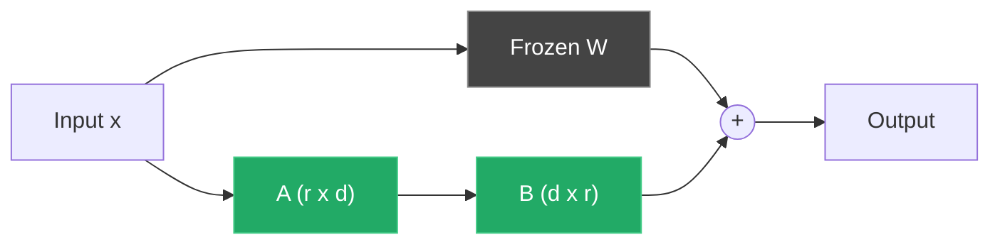

## Why Fine-Tune at All

Prompting gets you 80% of the way. The remaining 20% — consistent output format, domain-specific terminology, reliable tone — often requires the model to internalize patterns that prompt engineering alone cannot reliably enforce. Fine-tuning encodes those patterns into the weights.

Full fine-tuning of a 7B model requires 56GB+ of VRAM just for optimizer states. That rules out most consumer hardware. LoRA sidesteps this by freezing the original weights and training small rank-decomposition matrices that are injected into the attention layers. The result: you train 0.1–1% of the parameters and need a fraction of the memory.

> [!note]
> LoRA stands for **Low-Rank Adaptation**. The core idea is that weight updates during fine-tuning occupy a low-rank subspace, so you can represent them as the product of two small matrices instead of a full-rank update.

## Post Plan (Feature Map)

| Section Goal | Blog Feature Used | Why |
|---|---|---|
| Explain LoRA mechanism | Mermaid diagram + callouts | Visualize where adapters are injected |
| Dataset preparation | Python code + tables | Repeatable formatting pipeline |
| Training configuration | Python code + bash commands | Copy-paste-ready training script |
| VRAM management | Callouts + table | Turn OOM errors into concrete fixes |
| Common confusion | Chat transcript | Address questions before they stall progress |
| Reproduction path | Steps block | End-to-end walkthrough on real hardware |

## How LoRA Works

In a standard transformer, each attention layer has weight matrices W_q, W_k, W_v, and W_o of shape (d x d). Full fine-tuning updates all of these. LoRA instead freezes W and adds a low-rank decomposition: the update is represented as BA where B is (d x r) and A is (r x d), with rank r typically between 4 and 64.

During forward pass: output = Wx + BAx. During training, only A and B receive gradients.



The green boxes are trainable. Everything else is frozen. At inference time, you can merge BA back into W and pay zero additional latency.

> [!tip]
> Start with rank 16. It works well for most instruction-tuning tasks. Only increase rank if validation loss plateaus and you have confirmed the dataset is not the bottleneck.

## Dataset Preparation

LoRA fine-tuning expects instruction-formatted examples. The standard layout is a JSONL file where each line contains a `text` field with the full prompt-response pair.

```python
import json
from pathlib import Path

def format_alpaca(instruction: str, output: str, input_text: str = "") -> dict:
    """Format a single training example in Alpaca style."""
    parts = [f"### Instruction:\n{instruction}"]
    if input_text:
        parts.append(f"### Input:\n{input_text}")
    parts.append(f"### Response:\n{output}")
    return {"text": "\n\n".join(parts)}

raw_data = [
    {"instruction": "Summarize this bug report.", "input": "App crashes on login when...", "output": "Login crash caused by..."},
    {"instruction": "Write a unit test for the add function.", "input": "", "output": "def test_add(): assert add(2, 3) == 5"},
]

with Path("train.jsonl").open("w") as f:
    for item in raw_data:
        f.write(json.dumps(format_alpaca(item["instruction"], item["output"], item.get("input", ""))) + "\n")
```

| Dataset Size | Typical Use Case | Training Time (7B, RTX 3060) |
|---|---|---|
| 100–500 examples | Style/format enforcement | 10–30 min |
| 1k–5k examples | Domain specialization | 1–3 hours |
| 10k+ examples | Task-specific model | 6+ hours |

> [!warning]
> Quality beats quantity. 500 high-quality, hand-reviewed examples will outperform 10k noisy auto-generated ones. Audit your dataset before training.

## Training with PEFT

Install the stack:

```bash
uv venv .venv && source .venv/bin/activate
uv pip install torch transformers datasets peft accelerate bitsandbytes trl
```

Training script:

```python
import torch
from datasets import load_dataset
from transformers import (
    AutoModelForCausalLM,
    AutoTokenizer,
    BitsAndBytesConfig,
    TrainingArguments,
)
from peft import LoraConfig, get_peft_model, prepare_model_for_kbit_training
from trl import SFTTrainer

# --- Model and quantization ---
model_id = "mistralai/Mistral-7B-v0.3"

bnb_config = BitsAndBytesConfig(
    load_in_4bit=True,
    bnb_4bit_quant_type="nf4",
    bnb_4bit_compute_dtype=torch.bfloat16,
    bnb_4bit_use_double_quant=True,
)

model = AutoModelForCausalLM.from_pretrained(
    model_id,
    quantization_config=bnb_config,
    device_map="auto",
    torch_dtype=torch.bfloat16,
)
model = prepare_model_for_kbit_training(model)

tokenizer = AutoTokenizer.from_pretrained(model_id)
tokenizer.pad_token = tokenizer.eos_token

# --- LoRA config ---
lora_config = LoraConfig(
    r=16,
    lora_alpha=32,
    target_modules=["q_proj", "k_proj", "v_proj", "o_proj"],
    lora_dropout=0.05,
    bias="none",
    task_type="CAUSAL_LM",
)

model = get_peft_model(model, lora_config)
model.print_trainable_parameters()
# Output: trainable params: 13,631,488 || all params: 7,255,896,064 || trainable%: 0.188

# --- Dataset ---
dataset = load_dataset("json", data_files="train.jsonl", split="train")

# --- Training ---
training_args = TrainingArguments(
    output_dir="./lora-output",
    num_train_epochs=3,
    per_device_train_batch_size=4,
    gradient_accumulation_steps=4,
    learning_rate=2e-4,
    lr_scheduler_type="cosine",
    warmup_ratio=0.05,
    bf16=True,
    gradient_checkpointing=True,
    logging_steps=10,
    save_strategy="epoch",
    optim="paged_adamw_8bit",
    max_grad_norm=0.3,
    report_to="none",
)

trainer = SFTTrainer(
    model=model,
    train_dataset=dataset,
    args=training_args,
    tokenizer=tokenizer,
    max_seq_length=1024,
    dataset_text_field="text",
)

trainer.train()
trainer.save_model("./lora-output/final")
```

## VRAM Management

Fitting a 7B model on 12GB VRAM requires stacking several techniques. Here is what each one buys you:

| Technique | VRAM Saved | Trade-off |
|---|---|---|
| 4-bit quantization (QLoRA) | ~60% of model weight memory | Slight quality loss, slower matmuls |
| Gradient checkpointing | ~40% of activation memory | ~20% slower training |
| Paged AdamW 8-bit | ~50% of optimizer memory | Negligible quality impact |
| Reduced sequence length | Linear with length | Less context per example |
| Gradient accumulation | Enables small batch size | Same effective batch, no VRAM cost |

The training script above uses all of these. On an RTX 3060 12GB, a 7B model with rank 16 LoRA, batch size 4, sequence length 1024, and gradient accumulation 4 fits comfortably with ~1GB headroom.

> [!tip]
> Monitor VRAM during the first 50 steps. If usage creeps up, you likely have a memory leak from logging or evaluation callbacks. Use `nvidia-smi -l 2` in a separate terminal.

## Evaluation and Merging

After training, test the adapter on held-out prompts:

```python
from peft import PeftModel

base_model = AutoModelForCausalLM.from_pretrained(
    model_id, quantization_config=bnb_config, device_map="auto", torch_dtype=torch.bfloat16,
)
model = PeftModel.from_pretrained(base_model, "./lora-output/final")
model.eval()

prompt = "### Instruction:\nSummarize this error log.\n\n### Input:\nKeyError: 'user_id' in handler.py line 42...\n\n### Response:\n"
inputs = tokenizer(prompt, return_tensors="pt").to("cuda")
with torch.no_grad():
    output = model.generate(**inputs, max_new_tokens=256, temperature=0.7, do_sample=True)
print(tokenizer.decode(output[0], skip_special_tokens=True))
```

Once evaluation passes, merge the adapter back into the base model. The merged model runs at full speed with no adapter overhead.

```python
from peft import PeftModel
import torch

# Merge on CPU to avoid VRAM limits
base_model = AutoModelForCausalLM.from_pretrained(model_id, torch_dtype=torch.bfloat16, device_map="cpu")
model = PeftModel.from_pretrained(base_model, "./lora-output/final")
merged = model.merge_and_unload()
merged.save_pretrained("./merged-model")
AutoTokenizer.from_pretrained(model_id).save_pretrained("./merged-model")
```

Convert to GGUF for local inference with llama.cpp or Ollama:

```bash
git clone https://github.com/ggerganov/llama.cpp && cd llama.cpp
python convert_hf_to_gguf.py ../merged-model --outfile ../merged-model.gguf --outtype bf16
./llama-quantize ../merged-model.gguf ../merged-model-q4_k_m.gguf Q4_K_M
ollama create my-finetuned -f Modelfile
ollama run my-finetuned "Summarize this bug report."
```

## Common Questions

```chat
user: Should I use LoRA or full fine-tuning?
assistant: Use LoRA if you have less than 48GB VRAM or want to maintain multiple task-specific adapters on one base model. Full fine-tuning gives marginally better quality but requires 4-8x the VRAM and produces a full model copy per task. For most practical use cases on consumer hardware, LoRA is the right default.

user: My training loss drops to near zero but outputs are bad. What is happening?
assistant: You are overfitting. This happens fast with small datasets and high rank. Reduce the number of epochs, lower the rank (try r=8), increase dropout to 0.1, or add more diverse training examples. Also verify your evaluation is using the same prompt template as training — format mismatch is a common silent failure.

user: Can I stack multiple LoRA adapters on the same base model?
assistant: Yes. PEFT supports loading multiple adapters and switching between them at inference time with `model.set_adapter("adapter_name")`. You can also merge adapters sequentially, though quality may degrade with more than 2-3 merges. The practical pattern is: one base model, multiple task-specific adapters swapped at runtime.
```

## Hands-on Reproduction

````steps
### Step 1: Prepare the environment
Set up a clean Python environment with all dependencies:

```bash
mkdir lora-finetune && cd lora-finetune
uv venv .venv && source .venv/bin/activate
uv pip install torch transformers datasets peft accelerate bitsandbytes trl
python -c "import torch; print(f'CUDA: {torch.cuda.is_available()}, Device: {torch.cuda.get_device_name(0)}')"
```

### Step 2: Build and validate your dataset
Create at least 200 examples in Alpaca JSONL format and sanity-check before training:

```bash
python -c "
import json
examples = [json.loads(l) for l in open('train.jsonl')]
assert all('text' in ex for ex in examples)
print(f'{len(examples)} examples, avg {sum(len(e[\"text\"]) for e in examples)//len(examples)} chars')
"
```

### Step 3: Train and monitor VRAM
Launch training in one terminal, watch GPU memory in another. Expect peak ~10-11GB on an RTX 3060.

```bash
python train_lora.py          # Terminal 1
watch -n 2 nvidia-smi         # Terminal 2
```

### Step 4: Evaluate and merge
Test adapter quality on held-out prompts, then merge and convert for deployment:

```bash
python evaluate.py && python merge_adapter.py
cd llama.cpp && python convert_hf_to_gguf.py ../merged-model --outfile ../merged.gguf --outtype bf16
./llama-quantize ../merged.gguf ../merged-q4km.gguf Q4_K_M
```
````

## Wrap-Up

LoRA makes fine-tuning accessible on hardware that would otherwise be limited to inference. The workflow is straightforward: prepare a clean dataset, configure PEFT with aggressive memory optimizations, train, evaluate, and merge. The adapter files themselves are tiny — typically 10-50MB — which makes experimentation cheap and version control practical.

The most common failure mode is not VRAM or training instability. It is bad data. Invest your time in dataset quality and prompt template consistency before tuning hyperparameters.

## Generation Metadata

- Assistant: Lumen
- Model: claude-opus-4-6
- Generation date: 2026-03-01

## Prompt Used to Generate This Post

```text
Write a markdown blog post about LoRA Fine-Tuning on a Single GPU. Cover what LoRA is and why it works (low-rank adaptation), dataset preparation, training with PEFT/Hugging Face, VRAM management (gradient checkpointing, mixed precision), evaluation, merging adapters back into the base model. Focus on a practical workflow running on an RTX 3060 or similar consumer GPU with 12GB VRAM. Include YAML frontmatter with title, date (2026-03-01), order (8), description, tags. Include a Post Plan table, at least one Mermaid diagram, 2-4 callout blocks, a chat transcript with 3 Q&A pairs, a steps block with 4 numbered steps, generation metadata (Assistant: Lumen, Model: claude-opus-4-6), and a prompt used section. Tags: [llm, fine-tuning, lora, peft, pytorch]. Tone: pragmatic, implementation-focused, direct. ~200-300 lines of markdown.
```
