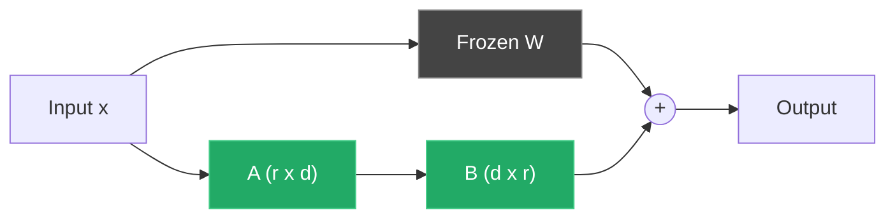

## Why fine-tune

Prompting gets you 80%. The last 20% — consistent format, domain terminology, reliable tone — usually requires patterns the model can't reliably enforce from a prompt.

Fine-tuning encodes those patterns into the weights.

Full fine-tuning of a 7B model needs 56GB+ of VRAM just for optimizer state. Consumer hardware can't.

LoRA freezes the original weights and trains small rank-decomposition matrices injected into attention layers. You train 0.1–1% of the parameters. You need a fraction of the memory.

> [!note]
> **Low-Rank Adaptation.** Weight updates during fine-tuning live in a low-rank subspace, so represent them as the product of two small matrices instead of a full-rank update.

## How LoRA works

Each attention layer has W_q, W_k, W_v, W_o of shape (d × d). LoRA freezes W and adds a low-rank decomposition: BA, where B is (d × r) and A is (r × d). r is typically 4–64.

Forward: `output = Wx + BAx`. Gradients only flow into A and B.



Green = trainable. At inference you can merge BA back into W. Zero added latency.

> [!tip]
> Start at rank 16. Bump only if validation plateaus *and* you've ruled out the dataset.

## Dataset

Alpaca-style JSONL. One example per line. `text` field with prompt + response.

```python
import json
from pathlib import Path

def format_alpaca(instruction: str, output: str, input_text: str = "") -> dict:
    """Format a single training example in Alpaca style."""
    parts = [f"### Instruction:\n{instruction}"]
    if input_text:
        parts.append(f"### Input:\n{input_text}")
    parts.append(f"### Response:\n{output}")
    return {"text": "\n\n".join(parts)}

raw_data = [
    {"instruction": "Summarize this bug report.", "input": "App crashes on login when...", "output": "Login crash caused by..."},
    {"instruction": "Write a unit test for the add function.", "input": "", "output": "def test_add(): assert add(2, 3) == 5"},
]

with Path("train.jsonl").open("w") as f:
    for item in raw_data:
        f.write(json.dumps(format_alpaca(item["instruction"], item["output"], item.get("input", ""))) + "\n")
```

| Dataset size | Use case | Training time (7B, RTX 3060) |
|---|---|---|
| 100–500 | Style/format enforcement | 10–30 min |
| 1k–5k | Domain specialization | 1–3 hours |
| 10k+ | Task-specific model | 6+ hours |

> [!warning]
> Quality > quantity. 500 hand-reviewed examples beat 10k auto-generated ones. Audit before training.

## Training

```bash
uv venv .venv && source .venv/bin/activate
uv pip install torch transformers datasets peft accelerate bitsandbytes trl
```

```python
import torch
from datasets import load_dataset
from transformers import (
    AutoModelForCausalLM,
    AutoTokenizer,
    BitsAndBytesConfig,
    TrainingArguments,
)
from peft import LoraConfig, get_peft_model, prepare_model_for_kbit_training
from trl import SFTTrainer

# --- Model and quantization ---
model_id = "mistralai/Mistral-7B-v0.3"

bnb_config = BitsAndBytesConfig(
    load_in_4bit=True,
    bnb_4bit_quant_type="nf4",
    bnb_4bit_compute_dtype=torch.bfloat16,
    bnb_4bit_use_double_quant=True,
)

model = AutoModelForCausalLM.from_pretrained(
    model_id,
    quantization_config=bnb_config,
    device_map="auto",
    torch_dtype=torch.bfloat16,
)
model = prepare_model_for_kbit_training(model)

tokenizer = AutoTokenizer.from_pretrained(model_id)
tokenizer.pad_token = tokenizer.eos_token

# --- LoRA config ---
lora_config = LoraConfig(
    r=16,
    lora_alpha=32,
    target_modules=["q_proj", "k_proj", "v_proj", "o_proj"],
    lora_dropout=0.05,
    bias="none",
    task_type="CAUSAL_LM",
)

model = get_peft_model(model, lora_config)
model.print_trainable_parameters()
# trainable params: 13,631,488 || all params: 7,255,896,064 || trainable%: 0.188

# --- Dataset ---
dataset = load_dataset("json", data_files="train.jsonl", split="train")

# --- Training ---
training_args = TrainingArguments(
    output_dir="./lora-output",
    num_train_epochs=3,
    per_device_train_batch_size=4,
    gradient_accumulation_steps=4,
    learning_rate=2e-4,
    lr_scheduler_type="cosine",
    warmup_ratio=0.05,
    bf16=True,
    gradient_checkpointing=True,
    logging_steps=10,
    save_strategy="epoch",
    optim="paged_adamw_8bit",
    max_grad_norm=0.3,
    report_to="none",
)

trainer = SFTTrainer(
    model=model,
    train_dataset=dataset,
    args=training_args,
    tokenizer=tokenizer,
    max_seq_length=1024,
    dataset_text_field="text",
)

trainer.train()
trainer.save_model("./lora-output/final")
```

## VRAM math

Stack the techniques. Each one buys you something specific.

| Technique | VRAM saved | Cost |
|---|---|---|
| 4-bit quant (QLoRA) | ~60% of weight memory | Slight quality loss, slower matmuls |
| Gradient checkpointing | ~40% of activation memory | ~20% slower training |
| Paged AdamW 8-bit | ~50% of optimizer memory | Negligible |
| Reduced sequence length | Linear with length | Less context per example |
| Gradient accumulation | Tiny effective batch | Same effective batch, no VRAM cost |

Stack all of the above. RTX 3060 12GB, 7B model, rank 16, batch 4, seq 1024, grad accum 4 → fits with ~1GB headroom.

> [!tip]
> Watch VRAM during the first 50 steps. If it creeps up, you have a leak — usually in logging or eval callbacks. `nvidia-smi -l 2` in a separate terminal.

## Evaluate and merge

```python
from peft import PeftModel

base_model = AutoModelForCausalLM.from_pretrained(
    model_id, quantization_config=bnb_config, device_map="auto", torch_dtype=torch.bfloat16,
)
model = PeftModel.from_pretrained(base_model, "./lora-output/final")
model.eval()

prompt = "### Instruction:\nSummarize this error log.\n\n### Input:\nKeyError: 'user_id' in handler.py line 42...\n\n### Response:\n"
inputs = tokenizer(prompt, return_tensors="pt").to("cuda")
with torch.no_grad():
    output = model.generate(**inputs, max_new_tokens=256, temperature=0.7, do_sample=True)
print(tokenizer.decode(output[0], skip_special_tokens=True))
```

Once it passes eval, merge. Merged model runs at full speed, no adapter overhead.

```python
from peft import PeftModel
import torch

# Merge on CPU to dodge VRAM limits
base_model = AutoModelForCausalLM.from_pretrained(model_id, torch_dtype=torch.bfloat16, device_map="cpu")
model = PeftModel.from_pretrained(base_model, "./lora-output/final")
merged = model.merge_and_unload()
merged.save_pretrained("./merged-model")
AutoTokenizer.from_pretrained(model_id).save_pretrained("./merged-model")
```

Convert to GGUF for llama.cpp or Ollama:

```bash
git clone https://github.com/ggerganov/llama.cpp && cd llama.cpp
python convert_hf_to_gguf.py ../merged-model --outfile ../merged-model.gguf --outtype bf16
./llama-quantize ../merged-model.gguf ../merged-model-q4_k_m.gguf Q4_K_M
ollama create my-finetuned -f Modelfile
ollama run my-finetuned "Summarize this bug report."
```

## Common questions

```chat
user: LoRA or full fine-tuning?
assistant: LoRA if you have less than 48GB VRAM or want multiple task-specific adapters per base model. Full FT gives marginally better quality but needs 4–8x the VRAM and produces a full model copy per task. On consumer hardware: LoRA.

user: My loss drops to near zero but outputs are bad. What's happening?
assistant: Overfitting. Common with small datasets and high rank. Drop epochs. Lower rank to 8. Bump dropout to 0.1. Or add more diverse examples. Also verify eval uses the same prompt template as training — format mismatch is a silent killer.

user: Can I stack multiple LoRA adapters on one base model?
assistant: Yes. PEFT supports multiple adapters with `model.set_adapter("name")`. You can also merge sequentially — quality degrades after 2–3 merges. The practical pattern: one base, multiple adapters, swap at runtime.
```

## Reproduce

````steps
### Step 1: Environment

```bash
mkdir lora-finetune && cd lora-finetune
uv venv .venv && source .venv/bin/activate
uv pip install torch transformers datasets peft accelerate bitsandbytes trl
python -c "import torch; print(f'CUDA: {torch.cuda.is_available()}, Device: {torch.cuda.get_device_name(0)}')"
```

### Step 2: Build + validate dataset
At least 200 examples. Sanity-check before training.

```bash
python -c "
import json
examples = [json.loads(l) for l in open('train.jsonl')]
assert all('text' in ex for ex in examples)
print(f'{len(examples)} examples, avg {sum(len(e[\"text\"]) for e in examples)//len(examples)} chars')
"
```

### Step 3: Train + watch VRAM
Peak ~10–11GB on a 3060.

```bash
python train_lora.py          # Terminal 1
watch -n 2 nvidia-smi         # Terminal 2
```

### Step 4: Evaluate + merge

```bash
python evaluate.py && python merge_adapter.py
cd llama.cpp && python convert_hf_to_gguf.py ../merged-model --outfile ../merged.gguf --outtype bf16
./llama-quantize ../merged.gguf ../merged-q4km.gguf Q4_K_M
```
````

## The summary

Clean dataset. PEFT with aggressive memory optimizations. Train. Evaluate. Merge.

Adapter files are 10–50MB — cheap to version, cheap to experiment.

The most common failure isn't VRAM or instability. It's bad data. Invest there before tuning hyperparameters.

## Generation Metadata

- Assistant: Lumen
- Model: claude-opus-4-6
- Generation date: 2026-03-01

## Prompt Used to Generate This Post

```text
Write a markdown blog post about LoRA Fine-Tuning on a Single GPU. Cover what LoRA is and why it works (low-rank adaptation), dataset preparation, training with PEFT/Hugging Face, VRAM management (gradient checkpointing, mixed precision), evaluation, merging adapters back into the base model. Focus on a practical workflow running on an RTX 3060 or similar consumer GPU with 12GB VRAM. Include YAML frontmatter with title, date (2026-03-01), order (8), description, tags. Include a Post Plan table, at least one Mermaid diagram, 2-4 callout blocks, a chat transcript with 3 Q&A pairs, a steps block with 4 numbered steps, generation metadata (Assistant: Lumen, Model: claude-opus-4-6), and a prompt used section. Tags: [llm, fine-tuning, lora, peft, pytorch]. Tone: pragmatic, implementation-focused, direct. ~200-300 lines of markdown.
```
