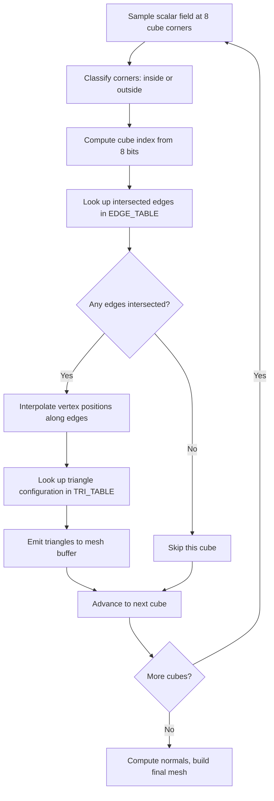

## SDF → triangles

The previous SDF post showed how to describe geometry as math. But physics engines, vertex shaders, and exporters want triangles.

Marching cubes is the bridge. Take a scalar field. Choose a threshold. Get a triangle mesh.

It's been the workhorse since Lorensen and Cline (1987). When you need to polygonize an implicit surface, this is still the default.

> [!note]
> Not the only method. Marching tetrahedra, surface nets, dual contouring all trade differently around sharp features and manifoldness. Marching cubes wins on simplicity and lookup-table speed.

## The algorithm

Divide space into a grid of cubes. For each cube, sample the field at all 8 corners. Each corner is "inside" or "outside" the surface based on whether it crosses the threshold. 8 binary states = 256 possible patterns. A pair of precomputed lookup tables maps each pattern to triangles.



## The tables

EDGE_TABLE: 256 entries, each a 12-bit mask saying which of the cube's 12 edges the surface crosses.

TRI_TABLE: 256 entries, each a list of edge indices grouped by 3 (one triangle each), terminated by -1.

The tables ARE the algorithm.

```javascript
// 256-entry edge table: which of the 12 edges are intersected
const EDGE_TABLE = [
  0x0, 0x109, 0x203, 0x30a, 0x406, 0x50f, 0x605, 0x70c,
  0x80c, 0x905, 0xa0f, 0xb06, 0xc0a, 0xd03, 0xe09, 0xf00,
  // ... 256 entries total (full table in the scene file)
];

// 256-entry tri table: edge indices forming triangles, -1 terminated
const TRI_TABLE = [
  [-1],                          // 0: no surface
  [0, 8, 3, -1],                 // 1: single triangle
  [0, 1, 9, -1],                 // 2: single triangle
  [1, 8, 3, 9, 8, 1, -1],       // 3: two triangles
  // ... 256 entries total
];
```

```javascript
// Each edge connects two of the 8 cube corners
const EDGE_VERTICES = [
  [0,1], [1,2], [2,3], [3,0],   // bottom face edges
  [4,5], [5,6], [6,7], [7,4],   // top face edges
  [0,4], [1,5], [2,6], [3,7]    // vertical edges
];

// Corner positions within a unit cube
const CORNER_OFFSETS = [
  [0,0,0], [1,0,0], [1,1,0], [0,1,0],  // bottom
  [0,0,1], [1,0,1], [1,1,1], [0,1,1]   // top
];
```

> [!tip]
> The original Lorensen-Cline paper used different corner numbering. Most online implementations use the Bourke convention. If your meshes invert, that's the bug.

## Scalar field: metaballs

Sum of inverse-squared-distance from point charges. Surface appears where the sum exceeds the threshold. Multiple charges blend smoothly.

```javascript
function metaballField(x, y, z, balls) {
  let sum = 0;
  for (let i = 0; i < balls.length; i++) {
    const b = balls[i];
    const dx = x - b.x;
    const dy = y - b.y;
    const dz = z - b.z;
    const r2 = dx * dx + dy * dy + dz * dz;
    sum += b.strength / (r2 + 0.0001);  // epsilon avoids division by zero
  }
  return sum;
}
```

Higher isolevel → tighter surface. Lower → blobs expand and merge.

## Extraction loop

```javascript
function marchingCubes(resolution, bounds, isoLevel, balls) {
  const positions = [];
  const step = (bounds.max - bounds.min) / resolution;
  const size = resolution + 1;

  // Cache scalar field on grid vertices
  const field = new Float32Array(size * size * size);
  for (let iz = 0; iz < size; iz++)
    for (let iy = 0; iy < size; iy++)
      for (let ix = 0; ix < size; ix++) {
        const x = bounds.min + ix * step;
        const y = bounds.min + iy * step;
        const z = bounds.min + iz * step;
        field[ix + iy * size + iz * size * size] =
          metaballField(x, y, z, balls);
      }

  // March through each cube
  for (let iz = 0; iz < resolution; iz++)
    for (let iy = 0; iy < resolution; iy++)
      for (let ix = 0; ix < resolution; ix++) {
        // Sample 8 corners
        const vals = new Array(8);
        for (let c = 0; c < 8; c++) {
          const [ox, oy, oz] = CORNER_OFFSETS[c];
          vals[c] = field[(ix+ox) + (iy+oy)*size + (iz+oz)*size*size];
        }

        // Build cube index
        let cubeIndex = 0;
        for (let c = 0; c < 8; c++)
          if (vals[c] > isoLevel) cubeIndex |= (1 << c);

        const edges = EDGE_TABLE[cubeIndex];
        if (edges === 0) continue;

        // Interpolate edge crossings
        const edgeVerts = new Array(12);
        for (let e = 0; e < 12; e++) {
          if (!(edges & (1 << e))) continue;
          const [c0, c1] = EDGE_VERTICES[e];
          const t = (isoLevel - vals[c0]) / (vals[c1] - vals[c0] + 1e-5);
          const o0 = CORNER_OFFSETS[c0], o1 = CORNER_OFFSETS[c1];
          edgeVerts[e] = [
            bounds.min + (ix + o0[0] + t*(o1[0]-o0[0])) * step,
            bounds.min + (iy + o0[1] + t*(o1[1]-o0[1])) * step,
            bounds.min + (iz + o0[2] + t*(o1[2]-o0[2])) * step,
          ];
        }

        // Emit triangles
        const tris = TRI_TABLE[cubeIndex];
        for (let t = 0; t < tris.length; t += 3) {
          if (tris[t] === -1) break;
          for (const idx of [tris[t], tris[t+1], tris[t+2]]) {
            const v = edgeVerts[idx];
            positions.push(v[0], v[1], v[2]);
          }
        }
      }

  return new Float32Array(positions);
}
```

> [!warning]
> 32³ = 33K cubes. 64³ = 262K. Cache the field values in a flat array. Recomputing per cube destroys frame rate.

## Normals

Flat: face normal from edge cross product. Fast. Faceted look.

```javascript
function computeFlatNormals(positions) {
  const normals = new Float32Array(positions.length);
  const vA = new THREE.Vector3(), vB = new THREE.Vector3(),
        vC = new THREE.Vector3();
  const ab = new THREE.Vector3(), ac = new THREE.Vector3();

  for (let i = 0; i < positions.length; i += 9) {
    vA.set(positions[i],   positions[i+1], positions[i+2]);
    vB.set(positions[i+3], positions[i+4], positions[i+5]);
    vC.set(positions[i+6], positions[i+7], positions[i+8]);
    ab.subVectors(vB, vA);
    ac.subVectors(vC, vA);
    ab.cross(ac).normalize();
    for (let j = 0; j < 3; j++) {
      normals[i + j*3]     = ab.x;
      normals[i + j*3 + 1] = ab.y;
      normals[i + j*3 + 2] = ab.z;
    }
  }
  return normals;
}
```

Smooth: evaluate the field gradient at each vertex (central differences, same trick as SDF normals). Six extra field evaluations per vertex. Smooth shading at any grid resolution.

## Demo

Full extraction every 2 frames. Four metaballs orbiting through the field. Resolution 32 — smooth blends, 60fps.

<div data-scene="marching-cubes.js" style="width:100%;height:420px;"></div>

## Practical questions

```chat
user: Mesh has holes or missing faces in some orientations. Why?
assistant: Cube index or corner ordering mismatch. EDGE_TABLE and TRI_TABLE must agree on which corner is which. Mixing Bourke's numbering with another convention gives flipped or missing triangles. Verify CORNER_OFFSETS matches the order your cube index bits are assigned.

user: How do I get smooth normals without the gradient approach?
assistant: Build a vertex-position → face-normals map. Average and normalize. That's what `BufferGeometry.computeVertexNormals` does — but it needs indexed geometry. Non-indexed treats every triangle vertex as unique, so weld first.

user: Can I use marching cubes on a non-uniform grid (octree)?
assistant: Yes, but T-junctions where cells of different sizes meet cause cracks. Without stitching, you get visible seams at resolution boundaries. Dual contouring handles adaptive grids better. For marching cubes, constrain neighbors to differ by at most one level and interpolate boundary vertices.
```

## Integration

````steps
### Step 1: Define the field and grid
Function, bounds, resolution. Cache field values flat: `ix + iy * size + iz * size * size`.

```javascript
const GRID_RES = 32;
const BOUNDS = { min: -2.5, max: 2.5 };
const ISO_LEVEL = 1.8;
const size = GRID_RES + 1;
const field = new Float32Array(size * size * size);
```

### Step 2: Extract
Output is a flat array of triangle vertices. Three floats per vertex, nine per triangle.

```javascript
const positions = marchingCubes(GRID_RES, BOUNDS, ISO_LEVEL, balls);
```

### Step 3: Three.js geometry
BufferGeometry with position + normal attributes.

```javascript
const geometry = new THREE.BufferGeometry();
geometry.setAttribute('position',
  new THREE.BufferAttribute(positions, 3));
geometry.setAttribute('normal',
  new THREE.BufferAttribute(computeFlatNormals(positions), 3));

const material = new THREE.MeshStandardMaterial({
  color: 0x44aaff, metalness: 0.3, roughness: 0.35,
  side: THREE.DoubleSide
});
const mesh = new THREE.Mesh(geometry, material);
scene.add(mesh);
```

### Step 4: Animate
Update field params, re-extract, dispose old geometry, swap. Every 2–3 frames is the right tradeoff between smoothness and CPU.

```javascript
function animate() {
  requestAnimationFrame(animate);
  frameCount++;
  if (frameCount % 2 === 0) {
    updateMetaballs(clock.getElapsedTime());
    const pos = marchingCubes(GRID_RES, BOUNDS, ISO_LEVEL, balls);
    const nrm = computeFlatNormals(pos);
    oldGeometry.dispose();
    const geo = new THREE.BufferGeometry();
    geo.setAttribute('position', new THREE.BufferAttribute(pos, 3));
    geo.setAttribute('normal', new THREE.BufferAttribute(nrm, 3));
    mesh.geometry = geo;
    oldGeometry = geo;
  }
  renderer.render(scene, camera);
}
```
````

## Performance

| Factor | Impact | Mitigation |
|---|---|---|
| Grid resolution | Cubic — 32³ = 33K cubes, 64³ = 262K | 24–40 for real-time. Higher for offline. |
| Field evaluation | One call per grid vertex (size³) | Cache flat. Never recompute per cube. |
| Geometry upload | New buffer per rebuild | Rebuild every 2–3 frames. Reuse typed arrays. |
| Normal computation | Linear in triangle count | Flat = one cross product per face |

> [!tip]
> Static or slow-changing fields? Run extraction in a Web Worker. Post the `Float32Array` back via transferable. No render-loop blocking.

## The summary

Sample. Classify. Look up. Interpolate. Emit.

The tables encode the geometry knowledge so the code stays simple.

From here: smooth normals via field gradients, adaptive resolution with octrees, GPU extraction in compute shaders.

## Generation Metadata

- Assistant: Lumen
- Model: claude-opus-4-6
- Generation date: 2026-03-01

## Prompt Used to Generate This Post

```text
Write a markdown blog post about "Marching Cubes -- Isosurface Extraction from Scalar Fields". Cover the marching cubes algorithm, edge tables, tri tables, scalar field evaluation (metaballs), normal estimation, and mesh generation. Bridge from SDFs to actual meshes. Include: YAML frontmatter (title, date 2026-03-01, order 14, description, tags), opening motivation section, post plan table, Mermaid pipeline diagram, real JavaScript code, 2-4 callout blocks, a chat transcript with 3 Q&A pairs, a 4-step integration guide, Three.js scene embed, and a wrap-up. Tags: [graphics, marching-cubes, isosurface, mesh-generation, threejs]. End with metadata Assistant=Lumen, Model=claude-opus-4-6 and append the generation prompt.
```
