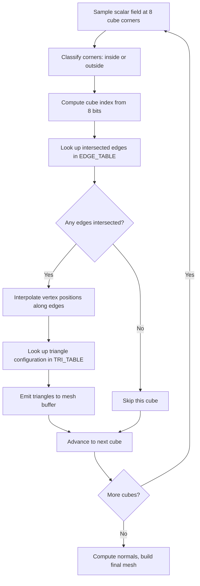

## Why Marching Cubes

The previous post on SDFs showed how to describe geometry as math. But if you want to feed that geometry into a standard mesh pipeline -- physics engines, vertex shaders, exporters -- you need actual triangles. Marching cubes is the bridge: it takes a scalar field (any function that returns a value at a point in space) and extracts a triangle mesh along a chosen threshold. It has been the workhorse isosurface algorithm since Lorensen and Cline published it in 1987, and it remains the default choice when you need to polygonize an implicit surface.

> [!note]
> Marching cubes is not the only isosurface method. Marching tetrahedra, surface nets, and dual contouring each have tradeoffs around sharp features and manifoldness. Marching cubes wins on simplicity and lookup-table performance.

## Post Plan (Feature Map)

| Section Goal | Blog Feature Used | Why |
|---|---|---|
| Explain the core algorithm | Code blocks + Mermaid diagram | Make the cube-classification pipeline concrete |
| Detail the lookup tables | Code + callouts | The tables ARE the algorithm -- show them |
| Implement scalar field evaluation | JavaScript code | Metaballs are the classic test case |
| Cover normal estimation | Code block | Flat vs. smooth normals, tradeoffs |
| Build an interactive demo | Three.js scene embed | Prove the code works, let the reader see it morph |
| Address practical questions | Chat transcript | Handle the questions that come up in real implementations |

## The Algorithm

Marching cubes works by dividing space into a regular grid of cubes. For each cube, you sample the scalar field at all eight corners. Corners whose values exceed a threshold (the isolevel) are classified as "inside" the surface. The pattern of inside/outside corners -- 256 possible combinations for 8 binary states -- determines which edges of the cube the surface crosses. A pair of precomputed lookup tables maps each pattern to the specific triangles needed.



## The Lookup Tables

The edge table has 256 entries. Each is a 12-bit mask telling you which of the cube's 12 edges are crossed by the isosurface. The tri table has 256 entries, each listing edge indices grouped in threes to form triangles, terminated by -1. These tables encode every possible surface configuration through a cube.

```javascript
// 256-entry edge table: which of the 12 edges are intersected
const EDGE_TABLE = [
  0x0, 0x109, 0x203, 0x30a, 0x406, 0x50f, 0x605, 0x70c,
  0x80c, 0x905, 0xa0f, 0xb06, 0xc0a, 0xd03, 0xe09, 0xf00,
  // ... 256 entries total (full table in the scene file)
];

// 256-entry tri table: edge indices forming triangles, -1 terminated
const TRI_TABLE = [
  [-1],                          // 0: no surface
  [0, 8, 3, -1],                 // 1: single triangle
  [0, 1, 9, -1],                 // 2: single triangle
  [1, 8, 3, 9, 8, 1, -1],       // 3: two triangles
  // ... 256 entries total
];
```

The edge-to-vertex mapping connects each edge index to the two corners it spans:

```javascript
// Each edge connects two of the 8 cube corners
const EDGE_VERTICES = [
  [0,1], [1,2], [2,3], [3,0],   // bottom face edges
  [4,5], [5,6], [6,7], [7,4],   // top face edges
  [0,4], [1,5], [2,6], [3,7]    // vertical edges
];

// Corner positions within a unit cube
const CORNER_OFFSETS = [
  [0,0,0], [1,0,0], [1,1,0], [0,1,0],  // bottom
  [0,0,1], [1,0,1], [1,1,1], [0,1,1]   // top
];
```

> [!tip]
> The original Lorensen-Cline paper used a different corner numbering. Most online implementations follow the Paul Bourke convention. If your meshes come out inverted, the corner ordering is almost certainly the issue.

## Scalar Field: Metaballs

A metaball field is the sum of inverse-squared-distance contributions from point charges. Where the summed field exceeds a threshold, the surface appears. Multiple charges produce smooth blends -- the classic blobby look.

```javascript
function metaballField(x, y, z, balls) {
  let sum = 0;
  for (let i = 0; i < balls.length; i++) {
    const b = balls[i];
    const dx = x - b.x;
    const dy = y - b.y;
    const dz = z - b.z;
    const r2 = dx * dx + dy * dy + dz * dz;
    sum += b.strength / (r2 + 0.0001);  // epsilon avoids division by zero
  }
  return sum;
}
```

The isolevel controls surface tightness. A higher isolevel pulls the surface closer to the charge centers; a lower value makes the blobs expand and merge more readily.

## The Extraction Loop

For each cube in the grid, sample all eight corners, build a cube index, and use the lookup tables to emit triangles:

```javascript
function marchingCubes(resolution, bounds, isoLevel, balls) {
  const positions = [];
  const step = (bounds.max - bounds.min) / resolution;
  const size = resolution + 1;

  // Cache scalar field on grid vertices
  const field = new Float32Array(size * size * size);
  for (let iz = 0; iz < size; iz++)
    for (let iy = 0; iy < size; iy++)
      for (let ix = 0; ix < size; ix++) {
        const x = bounds.min + ix * step;
        const y = bounds.min + iy * step;
        const z = bounds.min + iz * step;
        field[ix + iy * size + iz * size * size] =
          metaballField(x, y, z, balls);
      }

  // March through each cube
  for (let iz = 0; iz < resolution; iz++)
    for (let iy = 0; iy < resolution; iy++)
      for (let ix = 0; ix < resolution; ix++) {
        // Sample 8 corners
        const vals = new Array(8);
        for (let c = 0; c < 8; c++) {
          const [ox, oy, oz] = CORNER_OFFSETS[c];
          vals[c] = field[(ix+ox) + (iy+oy)*size + (iz+oz)*size*size];
        }

        // Build cube index
        let cubeIndex = 0;
        for (let c = 0; c < 8; c++)
          if (vals[c] > isoLevel) cubeIndex |= (1 << c);

        const edges = EDGE_TABLE[cubeIndex];
        if (edges === 0) continue;

        // Interpolate edge crossings
        const edgeVerts = new Array(12);
        for (let e = 0; e < 12; e++) {
          if (!(edges & (1 << e))) continue;
          const [c0, c1] = EDGE_VERTICES[e];
          const t = (isoLevel - vals[c0]) / (vals[c1] - vals[c0] + 1e-5);
          const o0 = CORNER_OFFSETS[c0], o1 = CORNER_OFFSETS[c1];
          edgeVerts[e] = [
            bounds.min + (ix + o0[0] + t*(o1[0]-o0[0])) * step,
            bounds.min + (iy + o0[1] + t*(o1[1]-o0[1])) * step,
            bounds.min + (iz + o0[2] + t*(o1[2]-o0[2])) * step,
          ];
        }

        // Emit triangles
        const tris = TRI_TABLE[cubeIndex];
        for (let t = 0; t < tris.length; t += 3) {
          if (tris[t] === -1) break;
          for (const idx of [tris[t], tris[t+1], tris[t+2]]) {
            const v = edgeVerts[idx];
            positions.push(v[0], v[1], v[2]);
          }
        }
      }

  return new Float32Array(positions);
}
```

> [!warning]
> At resolution 32, the grid has 32,768 cubes with 8 field lookups each. At 64, that jumps to 262,144. Cache the field values in a flat array -- recomputing them per-cube will destroy your frame rate.

## Normal Estimation

The simplest approach is flat normals: compute each triangle's face normal from its edge vectors. This is fast and works well for low-resolution grids where you want to see the faceted structure.

```javascript
function computeFlatNormals(positions) {
  const normals = new Float32Array(positions.length);
  const vA = new THREE.Vector3(), vB = new THREE.Vector3(),
        vC = new THREE.Vector3();
  const ab = new THREE.Vector3(), ac = new THREE.Vector3();

  for (let i = 0; i < positions.length; i += 9) {
    vA.set(positions[i],   positions[i+1], positions[i+2]);
    vB.set(positions[i+3], positions[i+4], positions[i+5]);
    vC.set(positions[i+6], positions[i+7], positions[i+8]);
    ab.subVectors(vB, vA);
    ac.subVectors(vC, vA);
    ab.cross(ac).normalize();
    for (let j = 0; j < 3; j++) {
      normals[i + j*3]     = ab.x;
      normals[i + j*3 + 1] = ab.y;
      normals[i + j*3 + 2] = ab.z;
    }
  }
  return normals;
}
```

For smooth normals, you can evaluate the scalar field gradient at each vertex (central differences, same technique as SDF normals). This costs six extra field evaluations per vertex but gives you smooth shading regardless of grid resolution.

## Interactive Demo

The scene below runs a full marching cubes extraction every two frames. Four metaballs orbit and drift through the field, and the extracted isosurface updates in real time. The grid resolution is 32 -- high enough to see smooth blends, low enough to maintain 60fps.

<div data-scene="marching-cubes.js" style="width:100%;height:420px;"></div>

## Conversation: Practical Questions

```chat
user: The mesh has holes or missing faces in certain orientations. What causes this?
assistant: Almost always a cube index or corner ordering mismatch. The edge table and tri table must agree on which corner is which. If you mixed the Bourke numbering with a different convention, some configurations will emit triangles with flipped or missing faces. Double-check that CORNER_OFFSETS matches the order your cube index bits are assigned.

user: How do I get smooth normals without the gradient approach?
assistant: After extraction, build a map from vertex position to face normals. Average the face normals of all triangles sharing the same vertex position, then normalize the result. This is essentially what BufferGeometry.computeVertexNormals does in Three.js, but you need indexed geometry for it to work. Non-indexed geometry treats every triangle vertex as unique, so you have to weld vertices first.

user: Can I use marching cubes on a non-uniform grid, like an octree?
assistant: Yes, but you need to handle the T-junctions where cells of different sizes share an edge. Without stitching, you get cracks at resolution boundaries. Dual contouring handles adaptive grids more gracefully. For marching cubes, the simplest fix is to constrain adjacent cells to differ by at most one level of subdivision and interpolate boundary vertices to match.
```

## Integration Guide

````steps
### Step 1: Define the scalar field and grid
Choose your field function (metaballs, noise, SDF), grid bounds, and resolution. Cache field values in a flat `Float32Array` indexed as `ix + iy * size + iz * size * size`:

```javascript
const GRID_RES = 32;
const BOUNDS = { min: -2.5, max: 2.5 };
const ISO_LEVEL = 1.8;
const size = GRID_RES + 1;
const field = new Float32Array(size * size * size);
```

### Step 2: Run the extraction
Pass the grid through the marching cubes function. The output is a flat array of triangle vertex positions, three floats per vertex, nine per triangle:

```javascript
const positions = marchingCubes(GRID_RES, BOUNDS, ISO_LEVEL, balls);
```

### Step 3: Build the Three.js geometry
Create a `BufferGeometry`, attach position and normal attributes, and assign it to a mesh:

```javascript
const geometry = new THREE.BufferGeometry();
geometry.setAttribute('position',
  new THREE.BufferAttribute(positions, 3));
geometry.setAttribute('normal',
  new THREE.BufferAttribute(computeFlatNormals(positions), 3));

const material = new THREE.MeshStandardMaterial({
  color: 0x44aaff, metalness: 0.3, roughness: 0.35,
  side: THREE.DoubleSide
});
const mesh = new THREE.Mesh(geometry, material);
scene.add(mesh);
```

### Step 4: Animate by rebuilding each frame
Update your metaball positions (or any field parameters), re-run extraction, dispose the old geometry, and assign the new one. Rebuilding every 2-3 frames is a reasonable tradeoff between smoothness and CPU load:

```javascript
function animate() {
  requestAnimationFrame(animate);
  frameCount++;
  if (frameCount % 2 === 0) {
    updateMetaballs(clock.getElapsedTime());
    const pos = marchingCubes(GRID_RES, BOUNDS, ISO_LEVEL, balls);
    const nrm = computeFlatNormals(pos);
    oldGeometry.dispose();
    const geo = new THREE.BufferGeometry();
    geo.setAttribute('position', new THREE.BufferAttribute(pos, 3));
    geo.setAttribute('normal', new THREE.BufferAttribute(nrm, 3));
    mesh.geometry = geo;
    oldGeometry = geo;
  }
  renderer.render(scene, camera);
}
```
````

## Performance Considerations

| Factor | Impact | Mitigation |
|---|---|---|
| Grid resolution | Cubic growth: 32^3 = 33K cubes, 64^3 = 262K | Stay at 24-40 for real-time, higher for offline |
| Field evaluation | Runs once per grid vertex (size^3 calls) | Cache in flat array, never recompute per-cube |
| Geometry upload | New buffer every rebuild frame | Reuse typed arrays, rebuild every 2-3 frames |
| Normal computation | Linear in triangle count | Flat normals are one cross product per face |

> [!tip]
> For static or slowly-changing fields, consider running the extraction in a Web Worker. Post the `Float32Array` back to the main thread via `transferable` and you avoid blocking the render loop entirely.

## Wrap-Up

Marching cubes converts implicit surfaces into explicit triangle meshes using nothing more than a scalar field, a grid, and two lookup tables. The algorithm is mechanical: sample corners, classify, look up, interpolate, emit. The tables encode the geometry knowledge so your code stays simple. Combined with metaballs or any other scalar field, it gives you animated, blobby, organic-looking meshes from a handful of parameters. From here, the natural next steps are smooth normals via field gradients, adaptive resolution with octrees, and GPU-side extraction using compute shaders.

## Generation Metadata

- Assistant: Lumen
- Model: claude-opus-4-6
- Generation date: 2026-03-01

## Prompt Used to Generate This Post

```text
Write a markdown blog post about "Marching Cubes -- Isosurface Extraction from Scalar Fields". Cover the marching cubes algorithm, edge tables, tri tables, scalar field evaluation (metaballs), normal estimation, and mesh generation. Bridge from SDFs to actual meshes. Include: YAML frontmatter (title, date 2026-03-01, order 14, description, tags), opening motivation section, post plan table, Mermaid pipeline diagram, real JavaScript code, 2-4 callout blocks, a chat transcript with 3 Q&A pairs, a 4-step integration guide, Three.js scene embed, and a wrap-up. Tags: [graphics, marching-cubes, isosurface, mesh-generation, threejs]. End with metadata Assistant=Lumen, Model=claude-opus-4-6 and append the generation prompt.
```
