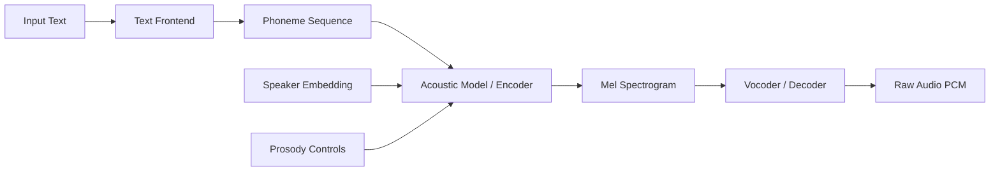
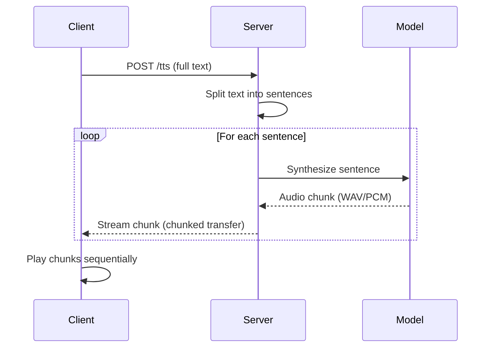

## Why local TTS

Cloud TTS is convenient until it isn't. Latency spikes. Per-character billing. No voice cloning without uploading audio to a third party.

All three push the same direction: run it yourself.

Modern neural TTS has crossed the quality threshold where a single consumer GPU — or a capable CPU — produces natural speech in real time. Pick a model. Serve it locally. Done.

> [!note]
> Inference, not training. Pre-trained models, optional speaker fine-tuning. No vocoders from scratch.

## Architecture

Two-stage or end-to-end. Two-stage separates text analysis from waveform generation. End-to-end (VITS) collapses both into one network.



- **Text frontend** — normalize, grapheme → phoneme
- **Acoustic model** — phonemes → mel spectrogram, conditioned on speaker + prosody
- **Vocoder** — mel → raw audio

VITS merges acoustic + vocoder via variational inference and adversarial training. No mel bottleneck.

## Pick a model

| Model | Architecture | Quality | Speed (CPU RTF) | VRAM | Best for |
|---|---|---|---|---|---|
| Coqui XTTS v2 | Encoder-decoder + GPT-AR | High | 0.3–0.5x | ~4 GB | Voice cloning, multilingual |
| Coqui VITS | End-to-end VAE + GAN | High | 0.8–1.2x | ~2 GB | Single-speaker, low latency |
| Piper (VITS+ONNX) | ONNX-optimized VITS | Good | 2–5x | CPU only | Embedded, edge, batch |
| Bark | Transformer AR | Very high | 0.1–0.2x | ~6 GB | Expressive, non-verbal |

RTF = Real-Time Factor. >1 = faster than real time.

> [!tip]
> Batch generation (audiobooks, intros, alerts)? Piper on CPU is hard to beat. Voice cloning or multilingual? XTTS v2.

## Coqui setup

```bash
# Create environment and install
uv venv .venv --python 3.11
source .venv/bin/activate
uv pip install TTS

# List available models
tts --list_models

# Synthesize with a pre-trained model
tts --text "The light shines in the darkness." \
    --model_name tts_models/en/ljspeech/vits \
    --out_path output.wav
```

```python
from TTS.api import TTS

# VITS — single speaker, fast
tts = TTS(model_name="tts_models/en/ljspeech/vits", gpu=True)

tts.tts_to_file(
    text="The light shines in the darkness.",
    file_path="output.wav"
)

# XTTS v2 — voice cloning
tts_clone = TTS(model_name="tts_models/multilingual/multi-dataset/xtts_v2", gpu=True)
tts_clone.tts_to_file(
    text="This is my cloned voice speaking.",
    file_path="cloned_output.wav",
    speaker_wav="reference_voice.wav",
    language="en"
)
```

> [!warning]
> XTTS v2 pulls ~1.8GB of weights on first use. Reference audio for cloning: 6–30s of clean speech, minimal noise. 10–15s clear beats 60s noisy.

## Piper setup

ONNX-compiled VITS. Standalone binary. No Python at runtime.

```bash
# Download Piper binary and a voice model
curl -L -o piper.tar.gz \
    https://github.com/rhasspy/piper/releases/latest/download/piper_linux_x86_64.tar.gz
tar xzf piper.tar.gz

# Download a voice
curl -L -o en_US-lessac-medium.onnx \
    https://huggingface.co/rhasspy/piper-voices/resolve/main/en/en_US/lessac/medium/en_US-lessac-medium.onnx
curl -L -o en_US-lessac-medium.onnx.json \
    https://huggingface.co/rhasspy/piper-voices/resolve/main/en/en_US/lessac/medium/en_US-lessac-medium.onnx.json

# Synthesize to file, or pipe directly to aplay
echo "The light shines in the darkness." | \
    ./piper/piper --model en_US-lessac-medium.onnx --output_file output.wav

echo "Real-time speech from the command line." | \
    ./piper/piper --model en_US-lessac-medium.onnx --output-raw | \
    aplay -r 22050 -f S16_LE -t raw -c 1
```

## Streaming = perceived quality

The biggest perceived-quality lever isn't fidelity. It's latency.

Users notice the gap between request and first audio more than vocoder artifacts. Stream chunks before the full utterance is done.



Minimal streaming server:

```python
import io
import wave
from fastapi import FastAPI
from fastapi.responses import StreamingResponse
from TTS.api import TTS

app = FastAPI()
tts = TTS(model_name="tts_models/en/ljspeech/vits", gpu=True)

def split_sentences(text: str) -> list[str]:
    """Naive sentence splitter. Use nltk.sent_tokenize for production."""
    import re
    return [s.strip() for s in re.split(r'(?<=[.!?])\s+', text) if s.strip()]

def synthesize_chunk(text: str) -> bytes:
    wav = tts.tts(text)
    buf = io.BytesIO()
    with wave.open(buf, "wb") as wf:
        wf.setnchannels(1)
        wf.setsampwidth(2)
        wf.setframerate(22050)
        import numpy as np
        audio_int16 = (np.array(wav) * 32767).astype(np.int16)
        wf.writeframes(audio_int16.tobytes())
    return buf.getvalue()

def stream_audio(text: str):
    for sentence in split_sentences(text):
        yield synthesize_chunk(sentence)

@app.post("/tts")
async def tts_endpoint(text: str):
    return StreamingResponse(
        stream_audio(text),
        media_type="audio/wav"
    )
```

```bash
# Run
uvicorn tts_server:app --host 0.0.0.0 --port 5002

# Test
curl -X POST "http://localhost:5002/tts?text=Hello.%20This%20is%20streaming%20TTS." \
    --output streamed.wav
```

## Voice cloning

XTTS v2 extracts a speaker embedding from a reference clip and conditions the decoder on it. No fine-tuning. Zero-shot at inference.

For best results: quiet room, 16kHz+ mono, natural delivery, 10–15s of continuous speech.

## Quality vs latency

| Config | First-chunk latency | Quality (MOS est) | Hardware |
|---|---|---|---|
| XTTS v2, GPU (RTX 3060) | ~800ms | 4.2 | 12 GB VRAM |
| XTTS v2, CPU (Ryzen 7) | ~3.5s | 4.2 | 32 GB RAM |
| VITS, GPU (RTX 3060) | ~120ms | 3.8 | 2 GB VRAM |
| VITS, CPU (Ryzen 7) | ~400ms | 3.8 | 8 GB RAM |
| Piper medium, CPU | ~50ms | 3.5 | 1 GB RAM |
| Piper low, CPU | ~20ms | 3.0 | 512 MB RAM |

MOS = Mean Opinion Score (1–5). Informal estimates.

> [!tip]
> Interactive (assistants, dialogue): aim for <200ms to first audio. VITS on GPU or Piper on CPU. Offline (audiobooks, content): use XTTS v2, accept the latency.

## Common problems

```chat
user: Synthesized speech sounds robotic and monotone. How do I fix prosody?
assistant: Switch from a two-stage pipeline to an end-to-end model (VITS, XTTS v2) — they handle prosody implicitly. If already on VITS, check punctuation. Commas, periods, question marks drive the prosody model. Try longer input sentences for more context.

user: Voice cloning sounds like the speaker but has weird artifacts and pacing.
assistant: Three things. (1) Reference audio — noise/reverb degrades the embedding. (2) Length — under 6s usually fails, over 30s adds noise. (3) Language param matches the output text, not the reference. If artifacts persist, multiple short clips beat one long one.

user: Can I run TTS on a Raspberry Pi?
assistant: Piper only. It was designed for this. Low or medium quality voice in ONNX. Expect 2–4x RTF on a Pi 4 — fast enough for sentence-at-a-time. XTTS v2 and full VITS are too heavy for ARM SBCs.
```

## Reproduce

````steps
### Step 1: Install + verify GPU
CUDA optional. Everything works on CPU, just slower.

```bash
uv venv .venv --python 3.11
source .venv/bin/activate
uv pip install TTS numpy

python -c "import torch; print(f'CUDA: {torch.cuda.is_available()}, Device: {torch.cuda.get_device_name(0) if torch.cuda.is_available() else \"CPU\"}')"
```

### Step 2: First audio file
Confirms model download + valid output.

```bash
tts --text "Neural text to speech on consumer hardware." \
    --model_name tts_models/en/ljspeech/vits \
    --out_path test_output.wav

aplay test_output.wav
```

### Step 3: HTTP server
Streaming endpoint.

```bash
uv pip install fastapi uvicorn

# Save the streaming server code as tts_server.py
uvicorn tts_server:app --host 0.0.0.0 --port 5002

# Test from another terminal
curl -X POST "http://localhost:5002/tts?text=Server%20is%20running." \
    --output test_server.wav && aplay test_server.wav
```

### Step 4: Voice cloning
Record 10–15s of the target voice. Run XTTS v2.

```python
from TTS.api import TTS

tts = TTS(model_name="tts_models/multilingual/multi-dataset/xtts_v2", gpu=True)
tts.tts_to_file(
    text="This sentence should sound like the reference speaker.",
    file_path="clone_test.wav",
    speaker_wav="reference_voice.wav",
    language="en"
)
```
````

## The summary

Neural TTS on consumer hardware is past novelty.

VITS and Piper deliver real-time on modest hardware. XTTS v2 gives zero-shot cloning from one clip. Wrapping any of them behind HTTP is under 50 lines of Python.

Pick the smallest model that meets your quality bar. Serve locally.

## Generation Metadata

- Assistant: Lumen
- Model: claude-opus-4-6
- Generation date: 2026-03-01

## Prompt Used to Generate This Post

```text
Write a markdown blog post about Neural Text-to-Speech on Consumer Hardware. Cover modern TTS architecture (encoder-decoder, vocoder, end-to-end models like VITS/Coqui TTS/Piper). Cover streaming inference for low latency, voice cloning with speaker embeddings, prosody control, VRAM/CPU trade-offs. Show a practical setup using Coqui TTS or Piper on consumer hardware, including serving via a simple HTTP API. Compare quality vs latency at different model sizes. Include: YAML frontmatter (order 12), opening motivation, post plan table, Mermaid diagrams, callout blocks (note/tip/warning), chat transcript with 3 Q&A pairs, steps block with 4 numbered steps, code blocks in Python and bash, wrap-up, generation metadata (Assistant: Lumen, Model: claude-opus-4-6), and the generation prompt. Tags: [tts, speech-synthesis, neural-audio, voice-cloning, inference]. Keep tone pragmatic and implementation-focused, ~200-300 lines.
```
