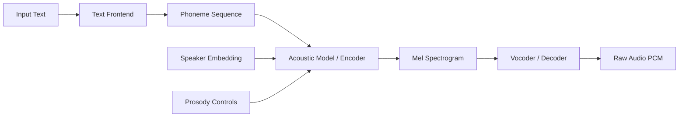
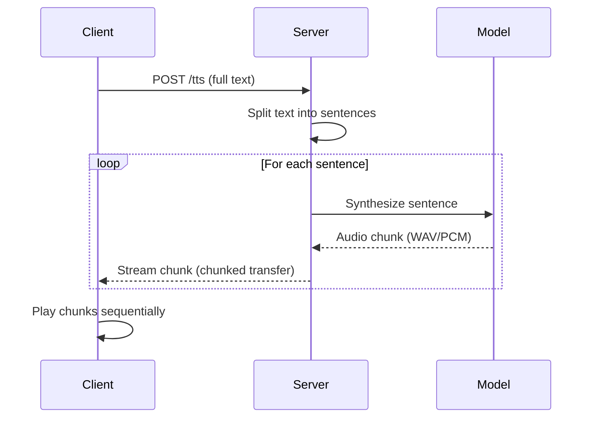

## Why Local TTS

Cloud TTS APIs are convenient until they are not. Latency spikes, per-character billing, and the inability to clone custom voices without uploading audio to a third party all push the same direction: run it yourself.

Modern neural TTS has crossed the quality threshold where a single consumer GPU -- or even a capable CPU -- can produce natural speech in real time. Pick a model, serve it behind a local HTTP endpoint, and integrate it into any pipeline that needs voice output.

> [!note]
> This post focuses on inference, not training. We are deploying pre-trained models and optionally fine-tuning speaker embeddings, not training vocoders from scratch.

## Post Plan (Feature Map)

| Section Goal | Blog Feature Used | Why |
|---|---|---|
| Explain TTS architecture | Mermaid pipeline diagram | Make encoder-vocoder stages visible |
| Compare model families | Table + callouts | Ground model choice in hardware reality |
| Show working setup | Code blocks (Python, bash) | Copy-paste path to running TTS |
| Cover streaming inference | Code block + diagram | Low-latency is the key differentiator |
| Debug common issues | Chat transcript | Surface real confusion points fast |
| Hands-on reproduction | Steps block | End-to-end from install to first audio |

## TTS Architecture Overview

Neural TTS systems generally follow a two-stage or end-to-end pattern. The two-stage approach separates text analysis from waveform generation. End-to-end models like VITS collapse both stages into a single network.



**Text frontend** normalizes input and converts graphemes to phonemes. **Acoustic model** maps phonemes to mel spectrograms, conditioned on speaker identity and prosody. **Vocoder** converts mel spectrograms to raw audio. End-to-end models like VITS merge the acoustic model and vocoder into a single pass using variational inference and adversarial training, eliminating the mel bottleneck.

## Model Comparison

| Model | Architecture | Quality | Speed (RTF on CPU) | VRAM (GPU) | Best For |
|---|---|---|---|---|---|
| Coqui XTTS v2 | Encoder-decoder + GPT-like AR | High | 0.3-0.5x RT | ~4 GB | Voice cloning, multilingual |
| Coqui VITS | End-to-end VAE + GAN | High | 0.8-1.2x RT | ~2 GB | Single-speaker, low latency |
| Piper (VITS-based) | ONNX-optimized VITS | Good | 2-5x RT | CPU only | Embedded, edge, batch |
| Bark | Transformer autoregressive | Very high | 0.1-0.2x RT | ~6 GB | Expressive, non-verbal sounds |

RTF = Real-Time Factor. Values above 1.0 mean faster than real time. Below 1.0 means slower.

> [!tip]
> If your use case is batch generation (audiobooks, podcast intros, notification sounds), Piper on CPU is hard to beat. If you need voice cloning or multilingual support, XTTS v2 is the practical choice despite higher resource cost.

## Setting Up Coqui TTS

Coqui TTS provides a Python library with pre-trained models and a built-in HTTP server. This is the fastest path to a working local TTS endpoint.

```bash
# Create environment and install
uv venv .venv --python 3.11
source .venv/bin/activate
uv pip install TTS

# List available models
tts --list_models

# Synthesize with a pre-trained model
tts --text "The light shines in the darkness." \
    --model_name tts_models/en/ljspeech/vits \
    --out_path output.wav
```

```python
from TTS.api import TTS

# Load VITS model (single speaker, fast)
tts = TTS(model_name="tts_models/en/ljspeech/vits", gpu=True)

# Basic synthesis
tts.tts_to_file(
    text="The light shines in the darkness.",
    file_path="output.wav"
)

# Voice cloning with XTTS v2
tts_clone = TTS(model_name="tts_models/multilingual/multi-dataset/xtts_v2", gpu=True)
tts_clone.tts_to_file(
    text="This is my cloned voice speaking.",
    file_path="cloned_output.wav",
    speaker_wav="reference_voice.wav",
    language="en"
)
```

> [!warning]
> XTTS v2 downloads approximately 1.8 GB of model weights on first use. The reference audio for voice cloning should be 6-30 seconds of clean speech with minimal background noise. Longer is not always better -- 10-15 seconds of clear audio typically outperforms 60 seconds of noisy audio.

## Setting Up Piper

Piper compiles VITS models to ONNX for fast CPU inference. It is a standalone binary with no Python dependency at runtime.

```bash
# Download Piper binary and a voice model
curl -L -o piper.tar.gz \
    https://github.com/rhasspy/piper/releases/latest/download/piper_linux_x86_64.tar.gz
tar xzf piper.tar.gz

# Download a voice
curl -L -o en_US-lessac-medium.onnx \
    https://huggingface.co/rhasspy/piper-voices/resolve/main/en/en_US/lessac/medium/en_US-lessac-medium.onnx
curl -L -o en_US-lessac-medium.onnx.json \
    https://huggingface.co/rhasspy/piper-voices/resolve/main/en/en_US/lessac/medium/en_US-lessac-medium.onnx.json

# Synthesize to file, or pipe directly to aplay for instant playback
echo "The light shines in the darkness." | \
    ./piper/piper --model en_US-lessac-medium.onnx --output_file output.wav

echo "Real-time speech from the command line." | \
    ./piper/piper --model en_US-lessac-medium.onnx --output-raw | \
    aplay -r 22050 -f S16_LE -t raw -c 1
```

## Streaming Inference for Low Latency

The biggest perceived quality improvement in TTS is not audio fidelity -- it is latency. Users notice the gap between request and first audio more than subtle vocoder artifacts. Streaming TTS generates and sends audio chunks before the full utterance is complete.



Here is a minimal streaming TTS server using FastAPI:

```python
import io
import wave
from fastapi import FastAPI
from fastapi.responses import StreamingResponse
from TTS.api import TTS

app = FastAPI()
tts = TTS(model_name="tts_models/en/ljspeech/vits", gpu=True)

def split_sentences(text: str) -> list[str]:
    """Naive sentence splitter. Use nltk.sent_tokenize for production."""
    import re
    return [s.strip() for s in re.split(r'(?<=[.!?])\s+', text) if s.strip()]

def synthesize_chunk(text: str) -> bytes:
    wav = tts.tts(text)
    buf = io.BytesIO()
    with wave.open(buf, "wb") as wf:
        wf.setnchannels(1)
        wf.setsampwidth(2)
        wf.setframerate(22050)
        import numpy as np
        audio_int16 = (np.array(wav) * 32767).astype(np.int16)
        wf.writeframes(audio_int16.tobytes())
    return buf.getvalue()

def stream_audio(text: str):
    for sentence in split_sentences(text):
        yield synthesize_chunk(sentence)

@app.post("/tts")
async def tts_endpoint(text: str):
    return StreamingResponse(
        stream_audio(text),
        media_type="audio/wav"
    )
```

```bash
# Run the server
uvicorn tts_server:app --host 0.0.0.0 --port 5002

# Test it
curl -X POST "http://localhost:5002/tts?text=Hello.%20This%20is%20streaming%20TTS." \
    --output streamed.wav
```

## Voice Cloning with Speaker Embeddings

Voice cloning in XTTS v2 works by extracting a speaker embedding from a reference audio clip and conditioning the decoder on that embedding. The model does not fine-tune on your voice -- it performs zero-shot speaker adaptation at inference time. Pass one or more reference clips via `speaker_wav` (see the Coqui TTS setup section above for the API). For best results: record in a quiet room, use 16kHz+ mono audio, speak naturally, and keep clips to 10-15 seconds of continuous speech.

## Quality vs Latency Trade-offs

| Configuration | Latency (first chunk) | Quality (MOS estimate) | Hardware |
|---|---|---|---|
| XTTS v2, GPU (RTX 3060) | ~800ms | 4.2 | 12 GB VRAM |
| XTTS v2, CPU (Ryzen 7) | ~3.5s | 4.2 | 32 GB RAM |
| VITS, GPU (RTX 3060) | ~120ms | 3.8 | 2 GB VRAM |
| VITS, CPU (Ryzen 7) | ~400ms | 3.8 | 8 GB RAM |
| Piper medium, CPU | ~50ms | 3.5 | 1 GB RAM |
| Piper low, CPU | ~20ms | 3.0 | 512 MB RAM |

MOS = Mean Opinion Score (1-5 scale, higher is better). These are rough estimates based on informal listening tests, not formal evaluation.

> [!tip]
> For interactive applications (voice assistants, game dialogue), target under 200ms to first audio. VITS on GPU or Piper on CPU both hit this. For offline generation (audiobooks, content pipelines), use XTTS v2 for maximum quality and accept the latency.

## Conversation: Common TTS Problems

```chat
user: The synthesized speech sounds robotic and monotone. How do I improve prosody?
assistant: Switch from a two-stage pipeline to an end-to-end model like VITS or XTTS v2 -- they handle prosody implicitly. If you are already on VITS, check that your input text has proper punctuation. Commas, periods, and question marks directly influence the prosody model. Also try longer input sentences -- very short phrases give the model less context for natural intonation.

user: Voice cloning sounds like the reference speaker but with weird artifacts and pacing issues.
assistant: Three things to check. First, reference audio quality -- background noise or reverb degrades the speaker embedding. Second, reference length -- under 6 seconds usually fails, over 30 seconds adds noise. Third, language mismatch -- make sure the language parameter matches the output text, not the reference audio. If artifacts persist, try multiple shorter reference clips instead of one long one.

user: I want to run TTS on a Raspberry Pi. Is that realistic?
assistant: Yes, but only with Piper. It was designed for exactly this. Use a low or medium quality voice model in ONNX format. Expect 2-4x real-time factor on a Pi 4, which is fast enough for sentence-at-a-time synthesis. XTTS v2 and full VITS are too heavy for ARM SBCs without significant compromise.
```

## Hands-on Reproduction

````steps
### Step 1: Install Coqui TTS and verify GPU access

Set up the environment and confirm CUDA is available for GPU acceleration. If no GPU, everything still works on CPU -- just slower.

```bash
uv venv .venv --python 3.11
source .venv/bin/activate
uv pip install TTS numpy

python -c "import torch; print(f'CUDA: {torch.cuda.is_available()}, Device: {torch.cuda.get_device_name(0) if torch.cuda.is_available() else \"CPU\"}')"
```

### Step 2: Generate your first audio file

Run a basic synthesis to confirm the model downloads and produces valid audio output.

```bash
tts --text "Neural text to speech on consumer hardware." \
    --model_name tts_models/en/ljspeech/vits \
    --out_path test_output.wav

# Play it back
aplay test_output.wav
```

### Step 3: Set up the HTTP API server

Deploy the streaming TTS server so other tools and scripts can request speech synthesis over HTTP.

```bash
uv pip install fastapi uvicorn

# Save the streaming server code from the "Streaming Inference" section as tts_server.py
uvicorn tts_server:app --host 0.0.0.0 --port 5002

# Test from another terminal
curl -X POST "http://localhost:5002/tts?text=Server%20is%20running." \
    --output test_server.wav && aplay test_server.wav
```

### Step 4: Test voice cloning with a reference clip

Record or prepare a 10-15 second WAV clip of the target voice. Run XTTS v2 voice cloning and compare output against the reference.

```python
from TTS.api import TTS

tts = TTS(model_name="tts_models/multilingual/multi-dataset/xtts_v2", gpu=True)
tts.tts_to_file(
    text="This sentence should sound like the reference speaker.",
    file_path="clone_test.wav",
    speaker_wav="reference_voice.wav",
    language="en"
)
```
````

## Wrap-Up

Neural TTS on consumer hardware is past the novelty stage. VITS and Piper deliver real-time synthesis on modest hardware, XTTS v2 gives you zero-shot voice cloning from a single reference clip, and wrapping any of these behind an HTTP endpoint takes under 50 lines of Python. Pick the smallest model that meets your quality bar and serve it locally.

## Generation Metadata

- Assistant: Lumen
- Model: claude-opus-4-6
- Generation date: 2026-03-01

## Prompt Used to Generate This Post

```text
Write a markdown blog post about Neural Text-to-Speech on Consumer Hardware. Cover modern TTS architecture (encoder-decoder, vocoder, end-to-end models like VITS/Coqui TTS/Piper). Cover streaming inference for low latency, voice cloning with speaker embeddings, prosody control, VRAM/CPU trade-offs. Show a practical setup using Coqui TTS or Piper on consumer hardware, including serving via a simple HTTP API. Compare quality vs latency at different model sizes. Include: YAML frontmatter (order 12), opening motivation, post plan table, Mermaid diagrams, callout blocks (note/tip/warning), chat transcript with 3 Q&A pairs, steps block with 4 numbered steps, code blocks in Python and bash, wrap-up, generation metadata (Assistant: Lumen, Model: claude-opus-4-6), and the generation prompt. Tags: [tts, speech-synthesis, neural-audio, voice-cloning, inference]. Keep tone pragmatic and implementation-focused, ~200-300 lines.
```
