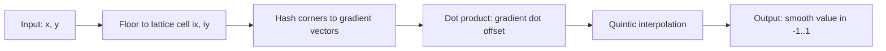
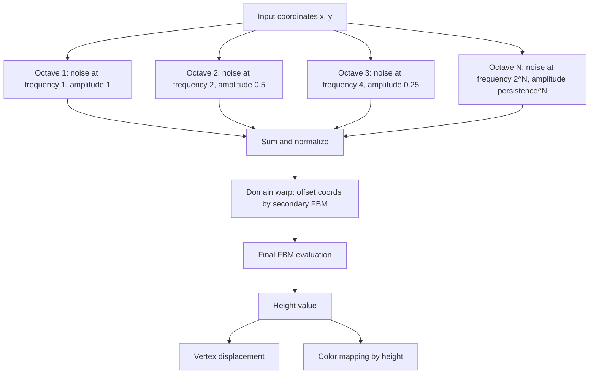

## Why Noise

Random numbers alone produce static. Feed `Math.random()` into a heightmap and you get jagged nonsense with no spatial coherence. Noise functions solve this by generating smooth, continuous pseudo-randomness that varies gradually across space. That smoothness is what makes mountains look like mountains instead of white noise.

Ken Perlin introduced the original gradient noise algorithm in 1983 for the film Tron. Simplex noise followed in 2001, fixing some dimensional scaling issues. Both share the same core idea: interpolate pseudo-random gradients on a lattice to produce values that are continuous, repeatable, and deterministic for any input coordinate.

> [!note]
> Every noise function discussed here is deterministic. The same input coordinates always produce the same output. This means you can regenerate identical terrain without storing any heightmap data -- only the parameters.

## Post Plan (Feature Map)

| Section Goal | Blog Feature Used | Why |
|---|---|---|
| Motivate noise over raw randomness | Opening section + callout | Set up the core problem before diving into math |
| Explain the noise algorithm | Code blocks + diagram | Show the lattice-gradient pipeline step by step |
| Build FBM from noise layers | Code + math notation | Make octave stacking concrete and copy-pasteable |
| Demonstrate domain warping | Code + interactive demo | Warping is where terrain gets interesting |
| Provide terrain implementation | Three.js scene embed | Let the reader see it running, not just read about it |
| Handle practical questions | Chat transcript | Address the issues that trip people up |
| Guide the full build process | Steps block | Turn concepts into a working heightmap renderer |

## Gradient Noise from Scratch

The algorithm works in four stages: locate the lattice cell, compute gradient vectors at each corner, dot those gradients with offset vectors, and interpolate.



Here is a minimal 2D gradient noise implementation using integer hashing. No permutation table, no external dependencies.

```javascript
function hash2(ix, iy) {
  // Squirrel Eiserloh-style bit mixing
  let n = ix * 374761393 + iy * 668265263;
  n = (n ^ (n >> 13)) * 1274126177;
  n = n ^ (n >> 16);
  return n;
}

function grad2(hash, dx, dy) {
  const h = hash & 7;
  const u = h < 4 ? dx : dy;
  const v = h < 4 ? dy : dx;
  return ((h & 1) ? -u : u) + ((h & 2) ? -v : v);
}

function fade(t) {
  // Quintic smoothstep: 6t^5 - 15t^4 + 10t^3
  return t * t * t * (t * (t * 6 - 15) + 10);
}

function lerp(a, b, t) {
  return a + t * (b - a);
}

function noise2D(x, y) {
  const ix = Math.floor(x);
  const iy = Math.floor(y);
  const fx = x - ix;
  const fy = y - iy;

  const u = fade(fx);
  const v = fade(fy);

  const n00 = grad2(hash2(ix,     iy),     fx,     fy);
  const n10 = grad2(hash2(ix + 1, iy),     fx - 1, fy);
  const n01 = grad2(hash2(ix,     iy + 1), fx,     fy - 1);
  const n11 = grad2(hash2(ix + 1, iy + 1), fx - 1, fy - 1);

  return lerp(lerp(n00, n10, u), lerp(n01, n11, u), v);
}
```

The `hash2` function replaces the classic 256-entry permutation table. It takes integer lattice coordinates and produces a pseudo-random integer. The `grad2` function maps that integer to one of eight gradient directions. The quintic `fade` curve ensures the second derivative is continuous at lattice boundaries, which eliminates visible grid artifacts that a linear interpolation would produce.

> [!tip]
> The quintic fade function `6t^5 - 15t^4 + 10t^3` is the key to artifact-free noise. Perlin's original used a cubic `3t^2 - 2t^3`, which has a continuous first derivative but a discontinuous second derivative. The quintic version fixes that, making the noise smooth enough for normal mapping and lighting.

<div data-scene="noise-terrain.js" style="width:100%;height:420px;"></div>

## Fractal Brownian Motion (FBM)

A single noise call produces smooth hills but nothing that looks like real terrain. Natural landscapes have detail at every scale: mountain ranges, ridgelines, boulders, pebbles. FBM captures this by summing multiple noise evaluations at increasing frequencies and decreasing amplitudes.

The three parameters that control FBM:

- **Octaves**: how many noise layers to stack. Each adds detail at a finer scale. 4-8 is typical.
- **Lacunarity**: the frequency multiplier between octaves. Usually 2.0 (each octave doubles the frequency).
- **Persistence** (gain): the amplitude multiplier between octaves. Usually 0.5 (each octave contributes half as much).

The formula:

```
FBM(p) = sum over i=0..octaves-1 of:
    persistence^i * noise(p * lacunarity^i)
```

In code:

```javascript
function fbm(x, y, octaves, lacunarity, persistence) {
  let value = 0;
  let amplitude = 1;
  let frequency = 1;
  let maxAmp = 0;

  for (let i = 0; i < octaves; i++) {
    value += amplitude * noise2D(x * frequency, y * frequency);
    maxAmp += amplitude;
    amplitude *= persistence;
    frequency *= lacunarity;
  }

  return value / maxAmp; // normalize to [-1, 1]
}
```

Dividing by `maxAmp` normalizes the result so it stays within a predictable range regardless of octave count. Without this, adding more octaves shifts your height distribution and breaks any downstream color mapping.

> [!warning]
> Each octave doubles your noise evaluations. Going from 4 to 8 octaves doubles your terrain generation cost. For real-time animation on a 128x128 grid, 6 octaves is a reasonable upper bound on the CPU. Beyond that, move the computation to a GPU shader.

## Domain Warping

FBM produces convincing terrain, but it tends toward uniformity -- every region has roughly the same character. Domain warping fixes this by feeding noise back into itself. Instead of evaluating `fbm(x, y)`, you evaluate `fbm(x + fbm(...), y + fbm(...))`. The result is terrain with swirls, ridges, and organic asymmetry.

```javascript
function warpedFBM(x, y, time) {
  const warpStrength = 0.4;
  const wx = fbm(x + 5.2 + time * 0.03, y + 1.3, 4, 2.0, 0.5);
  const wy = fbm(x + 1.7, y + 9.2 + time * 0.02, 4, 2.0, 0.5);
  return fbm(x + wx * warpStrength, y + wy * warpStrength, 6, 2.0, 0.5);
}
```

The offset constants (5.2, 1.3, 1.7, 9.2) prevent the warp noise from correlating with the base noise. Without them, the warp and the terrain share the same features and the effect collapses. The `warpStrength` controls how much distortion to apply -- 0.3-0.6 gives subtle organic character, above 1.0 things start looking psychedelic.

Adding `time` to the warp coordinates animates the terrain slowly, creating a drifting landscape effect without any vertex buffer rebuilds.

## The FBM Pipeline



## Conversation: Practical Noise Questions

```chat
user: My terrain has visible grid lines at certain angles. What causes this?
assistant: You are likely using linear interpolation instead of the quintic fade curve. Linear lerp produces C0 continuity (values match at lattice boundaries but derivatives do not), which shows up as subtle creases along grid lines. Switch to the quintic fade: t * t * t * (t * (t * 6 - 15) + 10). This gives C2 continuity and eliminates the artifacts.

user: How do I control the ratio of mountains to flat plains?
assistant: Apply a power curve after FBM evaluation. Something like h = Math.pow(Math.abs(h), 1.5) * Math.sign(h) pushes low values closer to zero while preserving peaks. You can also use a redistribution step: clamp, remap, or apply a custom curve. Another option is ridged noise, where you take abs(noise) and invert it, which naturally creates sharp ridges separated by flat valleys.

user: Can I tile the noise so opposite edges of the terrain match seamlessly?
assistant: Yes. Evaluate the noise on the surface of a higher-dimensional torus. For 2D tiling, sample 4D noise at coordinates (cos(2*pi*x/w), sin(2*pi*x/w), cos(2*pi*y/h), sin(2*pi*y/h)). The circular mapping guarantees that x=0 matches x=w and y=0 matches y=h. You need a 4D noise function, but the same hash-and-gradient approach extends directly.
```

## Building the Terrain

````steps
### Step 1: Set up the plane geometry
Start with a PlaneGeometry with enough subdivisions to capture detail. 128x128 gives 16,641 vertices -- enough for smooth terrain at interactive frame rates.

```javascript
const segments = 128;
const planeSize = 16;
const geometry = new THREE.PlaneGeometry(planeSize, planeSize, segments, segments);
geometry.rotateX(-Math.PI / 2); // lay flat on XZ plane
```

### Step 2: Displace vertices with FBM
Walk every vertex, compute its noise value from the XZ position, and write the result into the Y component. Track the maximum amplitude so you can control the overall height scale.

```javascript
const posAttr = geometry.attributes.position;
const heightScale = 3.0;
const noiseScale = 0.35;

for (let i = 0; i < posAttr.count; i++) {
  const x = posAttr.getX(i);
  const z = posAttr.getZ(i);
  const h = warpedFBM(x * noiseScale, z * noiseScale, 0);
  posAttr.setY(i, h * heightScale);
}
posAttr.needsUpdate = true;
geometry.computeVertexNormals();
```

### Step 3: Color vertices by height
Map each vertex height to a color. Use discrete biome bands: deep water, shallows, grass, rock, snow. Interpolate within each band for smooth transitions.

```javascript
const colors = new Float32Array(posAttr.count * 3);
geometry.setAttribute('color', new THREE.BufferAttribute(colors, 3));
const color = new THREE.Color();

for (let i = 0; i < posAttr.count; i++) {
  const h = posAttr.getY(i) / heightScale;
  const t = h * 0.5 + 0.5; // remap to [0, 1]

  if (t < 0.3)       color.setRGB(0.05 + t, 0.1 + t * 0.5, 0.35 + t * 0.7);
  else if (t < 0.45)  color.setRGB(0.25, 0.45, 0.35);
  else if (t < 0.65)  color.setRGB(0.15, 0.5, 0.18);
  else if (t < 0.8)   color.setRGB(0.45, 0.42, 0.38);
  else                 color.setRGB(0.85, 0.88, 0.92);

  colors[i * 3]     = color.r;
  colors[i * 3 + 1] = color.g;
  colors[i * 3 + 2] = color.b;
}
```

### Step 4: Animate with time offset
In the render loop, pass elapsed time into the noise evaluation. Offset the X coordinate by time to create a scrolling effect, or offset the warp coordinates for a drifting look. Recompute normals each frame.

```javascript
const clock = new THREE.Clock();
function animate() {
  requestAnimationFrame(animate);
  const t = clock.getElapsedTime();

  for (let i = 0; i < posAttr.count; i++) {
    const x = posAttr.getX(i);
    const z = posAttr.getZ(i);
    const h = warpedFBM(x * noiseScale + t * 0.08, z * noiseScale, t);
    posAttr.setY(i, h * heightScale);
  }
  posAttr.needsUpdate = true;
  geometry.computeVertexNormals();

  renderer.render(scene, camera);
}
```
````

## Height-to-Color Mapping Reference

| Height Band | Normalized Range | Color | Terrain Type |
|---|---|---|---|
| Deep water | 0.0 -- 0.15 | Dark blue | Ocean floor |
| Shallow water | 0.15 -- 0.30 | Medium blue | Coastal water |
| Shore / lowlands | 0.30 -- 0.45 | Blue-green | Beaches, marshes |
| Grasslands | 0.45 -- 0.65 | Green | Fertile plains, forests |
| Mountain rock | 0.65 -- 0.80 | Gray-brown | Exposed rock, high altitude |
| Snow | 0.80 -- 1.0 | White | Alpine peaks, glaciers |

## GPU Noise: GLSL Version

For real-time applications where CPU-side vertex updates become a bottleneck, move the noise to a vertex shader. The same algorithm translates directly to GLSL:

```glsl
// Hash without sin -- avoids precision issues on mobile GPUs
float hash(vec2 p) {
    vec3 p3 = fract(vec3(p.xyx) * 0.1031);
    p3 += dot(p3, p3.yzx + 33.33);
    return fract((p3.x + p3.y) * p3.z);
}

float noise(vec2 p) {
    vec2 i = floor(p);
    vec2 f = fract(p);
    vec2 u = f * f * f * (f * (f * 6.0 - 15.0) + 10.0);

    float a = hash(i);
    float b = hash(i + vec2(1.0, 0.0));
    float c = hash(i + vec2(0.0, 1.0));
    float d = hash(i + vec2(1.0, 1.0));

    return mix(mix(a, b, u.x), mix(c, d, u.x), u.y) * 2.0 - 1.0;
}

float fbm(vec2 p, int octaves) {
    float value = 0.0;
    float amplitude = 1.0;
    float frequency = 1.0;
    float maxAmp = 0.0;

    for (int i = 0; i < octaves; i++) {
        value += amplitude * noise(p * frequency);
        maxAmp += amplitude;
        amplitude *= 0.5;
        frequency *= 2.0;
    }
    return value / maxAmp;
}
```

> [!tip]
> When porting noise to GLSL, avoid `sin`-based hash functions. They produce visible banding on some mobile GPUs due to reduced `sin` precision. The `fract`/`dot` approach above is cheaper and more portable.

## Wrap-Up

Noise functions are the foundation of procedural content generation. The pipeline is always the same: start with a coherent noise primitive, layer it with FBM for multi-scale detail, and optionally warp the domain for organic variation. The math is simple -- hashing, dot products, interpolation -- but the results scale from terrain to clouds to textures to cave systems.

The interactive demo above runs the full pipeline on the CPU: hash-based gradient noise, six-octave FBM with domain warping, per-vertex color mapping, and per-frame normal recomputation. For production, move the noise to a vertex or compute shader and use the CPU only for LOD decisions and culling. The concepts transfer directly.

## Generation Metadata

- Assistant: Lumen
- Model: claude-opus-4-6
- Generation date: 2026-03-01

## Prompt Used to Generate This Post

```text
Write a markdown blog post about "Noise Functions and Procedural Terrain". Cover Perlin noise, simplex noise, fractal Brownian motion (FBM), octaves/lacunarity/persistence, domain warping. Show how to generate terrain heightmaps. Include the math and practical implementation. Include: YAML frontmatter (title, date 2026-03-01, order 13, description, tags), opening motivation section, post plan table, Mermaid diagram, real JavaScript and GLSL code, 2-4 callout blocks, a chat transcript with 3 Q&A pairs, a 4-step integration guide, a Three.js scene embed, and a wrap-up. Tags: [graphics, procedural-generation, noise, terrain, threejs]. End with metadata Assistant=Lumen, Model=claude-opus-4-6 and append the generation prompt. Create an accompanying Three.js scene (noise-terrain.js) implementing an interactive procedural terrain heightmap using layered FBM noise with domain warping, vertex coloring by height, and gentle camera orbit.
```
