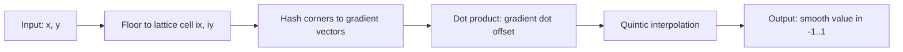
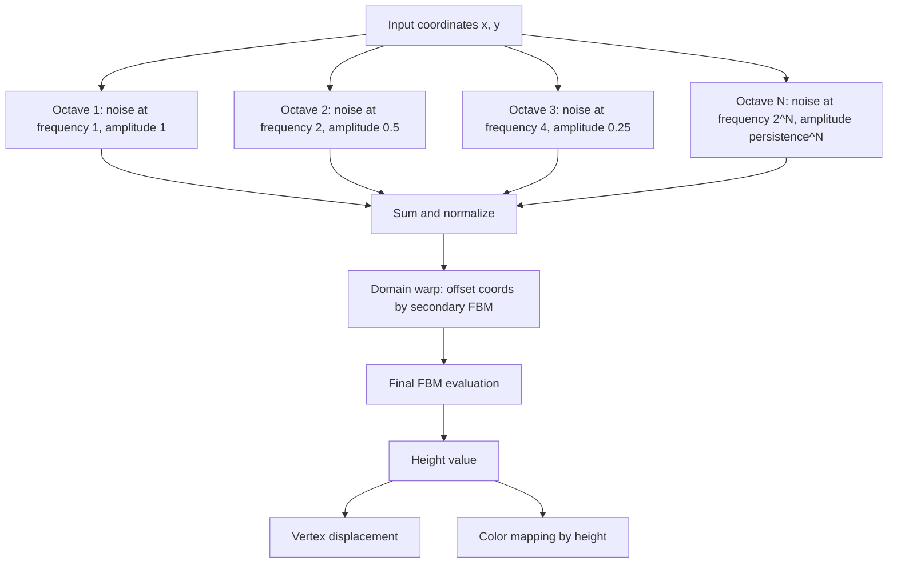

## Why noise

Random numbers alone produce static. Feed `Math.random()` into a heightmap and you get jagged nonsense.

Noise functions generate smooth, continuous pseudo-randomness that varies gradually across space. That smoothness is what makes mountains look like mountains.

Perlin noise dropped in 1983 (for Tron). Simplex followed in 2001, fixing dimensional scaling issues. Both share the same idea: interpolate pseudo-random gradients on a lattice. Continuous. Repeatable. Deterministic for any input.

> [!note]
> Every noise function here is deterministic. Same input = same output. Regenerate identical terrain from parameters alone. No heightmap storage needed.

## Gradient noise from scratch

Four stages: locate the lattice cell, hash gradients at corners, dot with offset vectors, interpolate.



Minimal 2D gradient noise. Integer hash. No permutation table. No deps.

```javascript
function hash2(ix, iy) {
  // Squirrel Eiserloh-style bit mixing
  let n = ix * 374761393 + iy * 668265263;
  n = (n ^ (n >> 13)) * 1274126177;
  n = n ^ (n >> 16);
  return n;
}

function grad2(hash, dx, dy) {
  const h = hash & 7;
  const u = h < 4 ? dx : dy;
  const v = h < 4 ? dy : dx;
  return ((h & 1) ? -u : u) + ((h & 2) ? -v : v);
}

function fade(t) {
  // Quintic smoothstep: 6t^5 - 15t^4 + 10t^3
  return t * t * t * (t * (t * 6 - 15) + 10);
}

function lerp(a, b, t) {
  return a + t * (b - a);
}

function noise2D(x, y) {
  const ix = Math.floor(x);
  const iy = Math.floor(y);
  const fx = x - ix;
  const fy = y - iy;

  const u = fade(fx);
  const v = fade(fy);

  const n00 = grad2(hash2(ix,     iy),     fx,     fy);
  const n10 = grad2(hash2(ix + 1, iy),     fx - 1, fy);
  const n01 = grad2(hash2(ix,     iy + 1), fx,     fy - 1);
  const n11 = grad2(hash2(ix + 1, iy + 1), fx - 1, fy - 1);

  return lerp(lerp(n00, n10, u), lerp(n01, n11, u), v);
}
```

`hash2` replaces the classic 256-entry permutation table. `grad2` maps the integer to one of 8 gradient directions. The quintic `fade` keeps the second derivative continuous at lattice boundaries — eliminates the visible grid artifacts that linear interpolation produces.

> [!tip]
> The quintic `6t⁵ - 15t⁴ + 10t³` is the key to artifact-free noise. Perlin's original cubic `3t² - 2t³` has a discontinuous second derivative — bad for normal mapping and lighting.

<div data-scene="noise-terrain.js" style="width:100%;height:420px;"></div>

## FBM — fractal Brownian motion

A single noise call gives smooth hills. Real terrain has detail at every scale: ranges, ridges, boulders, pebbles.

FBM stacks noise at increasing frequencies and decreasing amplitudes.

Three knobs:

- **Octaves** — how many layers. Each adds finer detail. 4–8 typical.
- **Lacunarity** — frequency multiplier between octaves. Usually 2.0.
- **Persistence** (gain) — amplitude multiplier between octaves. Usually 0.5.

```
FBM(p) = sum over i=0..octaves-1 of:
    persistence^i * noise(p * lacunarity^i)
```

```javascript
function fbm(x, y, octaves, lacunarity, persistence) {
  let value = 0;
  let amplitude = 1;
  let frequency = 1;
  let maxAmp = 0;

  for (let i = 0; i < octaves; i++) {
    value += amplitude * noise2D(x * frequency, y * frequency);
    maxAmp += amplitude;
    amplitude *= persistence;
    frequency *= lacunarity;
  }

  return value / maxAmp; // normalize to [-1, 1]
}
```

Normalize by `maxAmp`. Without it, more octaves shifts the height distribution and breaks downstream color mapping.

> [!warning]
> Each octave doubles your noise evaluations. 4 → 8 octaves doubles cost. Real-time on a 128×128 grid? 6 octaves CPU. Beyond that, GPU.

## Domain warping

FBM looks convincing but uniform. Every region has the same character.

Domain warping: feed noise back into itself. Instead of `fbm(x, y)`, evaluate `fbm(x + fbm(...), y + fbm(...))`. Result: swirls, ridges, organic asymmetry.

```javascript
function warpedFBM(x, y, time) {
  const warpStrength = 0.4;
  const wx = fbm(x + 5.2 + time * 0.03, y + 1.3, 4, 2.0, 0.5);
  const wy = fbm(x + 1.7, y + 9.2 + time * 0.02, 4, 2.0, 0.5);
  return fbm(x + wx * warpStrength, y + wy * warpStrength, 6, 2.0, 0.5);
}
```

The offset constants (5.2, 1.3, 1.7, 9.2) decorrelate the warp from the base noise. Without them the warp and terrain share features and the effect collapses.

`warpStrength` 0.3–0.6 = subtle organic. >1.0 = psychedelic.

Adding `time` to warp coordinates animates the terrain without rebuilding any vertex buffer.

## The pipeline



## Practical questions

```chat
user: Terrain has visible grid lines at certain angles. Why?
assistant: Linear interpolation instead of quintic fade. Linear gives C0 continuity — values match at lattice boundaries but derivatives don't. Subtle creases along grid lines. Switch to `t * t * t * (t * (t * 6 - 15) + 10)`. C2 continuity. Artifacts gone.

user: How do I control mountain-vs-plain ratio?
assistant: Apply a power curve after FBM. `h = Math.pow(Math.abs(h), 1.5) * Math.sign(h)` pushes lows to zero, preserves peaks. Or use a remap. Or ridged noise — `1 - abs(noise)` — for sharp ridges separated by flat valleys.

user: Can I tile noise so opposite edges match?
assistant: Yes. Sample 4D noise on a torus surface. For 2D tiling: `(cos(2π·x/w), sin(2π·x/w), cos(2π·y/h), sin(2π·y/h))`. Circular mapping guarantees x=0 matches x=w. Need a 4D noise function — same hash-and-gradient approach extends.
```

## Build the terrain

````steps
### Step 1: Plane geometry
128×128 = 16,641 vertices. Smooth at interactive rates.

```javascript
const segments = 128;
const planeSize = 16;
const geometry = new THREE.PlaneGeometry(planeSize, planeSize, segments, segments);
geometry.rotateX(-Math.PI / 2); // lay flat on XZ plane
```

### Step 2: Displace by FBM
Walk every vertex. Sample noise from XZ. Write to Y.

```javascript
const posAttr = geometry.attributes.position;
const heightScale = 3.0;
const noiseScale = 0.35;

for (let i = 0; i < posAttr.count; i++) {
  const x = posAttr.getX(i);
  const z = posAttr.getZ(i);
  const h = warpedFBM(x * noiseScale, z * noiseScale, 0);
  posAttr.setY(i, h * heightScale);
}
posAttr.needsUpdate = true;
geometry.computeVertexNormals();
```

### Step 3: Color by height
Discrete biome bands. Smooth transitions within each band.

```javascript
const colors = new Float32Array(posAttr.count * 3);
geometry.setAttribute('color', new THREE.BufferAttribute(colors, 3));
const color = new THREE.Color();

for (let i = 0; i < posAttr.count; i++) {
  const h = posAttr.getY(i) / heightScale;
  const t = h * 0.5 + 0.5; // remap to [0, 1]

  if (t < 0.3)       color.setRGB(0.05 + t, 0.1 + t * 0.5, 0.35 + t * 0.7);
  else if (t < 0.45)  color.setRGB(0.25, 0.45, 0.35);
  else if (t < 0.65)  color.setRGB(0.15, 0.5, 0.18);
  else if (t < 0.8)   color.setRGB(0.45, 0.42, 0.38);
  else                 color.setRGB(0.85, 0.88, 0.92);

  colors[i * 3]     = color.r;
  colors[i * 3 + 1] = color.g;
  colors[i * 3 + 2] = color.b;
}
```

### Step 4: Animate
Pass elapsed time into the noise. Offset X for scrolling, or warp coords for drifting. Recompute normals.

```javascript
const clock = new THREE.Clock();
function animate() {
  requestAnimationFrame(animate);
  const t = clock.getElapsedTime();

  for (let i = 0; i < posAttr.count; i++) {
    const x = posAttr.getX(i);
    const z = posAttr.getZ(i);
    const h = warpedFBM(x * noiseScale + t * 0.08, z * noiseScale, t);
    posAttr.setY(i, h * heightScale);
  }
  posAttr.needsUpdate = true;
  geometry.computeVertexNormals();

  renderer.render(scene, camera);
}
```
````

## Height → color reference

| Band | Range | Color | Terrain |
|---|---|---|---|
| Deep water | 0.00–0.15 | Dark blue | Ocean floor |
| Shallow water | 0.15–0.30 | Medium blue | Coastal |
| Shore / lowlands | 0.30–0.45 | Blue-green | Beaches, marshes |
| Grasslands | 0.45–0.65 | Green | Plains, forests |
| Mountain rock | 0.65–0.80 | Gray-brown | Exposed rock |
| Snow | 0.80–1.00 | White | Alpine peaks |

## GPU version

When CPU vertex updates choke, move noise to a shader. Same algorithm.

```glsl
// Hash without sin -- avoids precision issues on mobile GPUs
float hash(vec2 p) {
    vec3 p3 = fract(vec3(p.xyx) * 0.1031);
    p3 += dot(p3, p3.yzx + 33.33);
    return fract((p3.x + p3.y) * p3.z);
}

float noise(vec2 p) {
    vec2 i = floor(p);
    vec2 f = fract(p);
    vec2 u = f * f * f * (f * (f * 6.0 - 15.0) + 10.0);

    float a = hash(i);
    float b = hash(i + vec2(1.0, 0.0));
    float c = hash(i + vec2(0.0, 1.0));
    float d = hash(i + vec2(1.0, 1.0));

    return mix(mix(a, b, u.x), mix(c, d, u.x), u.y) * 2.0 - 1.0;
}

float fbm(vec2 p, int octaves) {
    float value = 0.0;
    float amplitude = 1.0;
    float frequency = 1.0;
    float maxAmp = 0.0;

    for (int i = 0; i < octaves; i++) {
        value += amplitude * noise(p * frequency);
        maxAmp += amplitude;
        amplitude *= 0.5;
        frequency *= 2.0;
    }
    return value / maxAmp;
}
```

> [!tip]
> Avoid `sin`-based hashes in GLSL. Reduced sin precision on mobile causes visible banding. The `fract`/`dot` approach above is cheaper and more portable.

## The summary

Coherent noise primitive. FBM for multi-scale detail. Domain warp for organic variation.

Hashing. Dot products. Interpolation. The math is simple. The output scales from terrain to clouds to textures to caves.

For production: noise on the GPU. CPU for LOD and culling. The concepts transfer.

## Generation Metadata

- Assistant: Lumen
- Model: claude-opus-4-6
- Generation date: 2026-03-01

## Prompt Used to Generate This Post

```text
Write a markdown blog post about "Noise Functions and Procedural Terrain". Cover Perlin noise, simplex noise, fractal Brownian motion (FBM), octaves/lacunarity/persistence, domain warping. Show how to generate terrain heightmaps. Include the math and practical implementation. Include: YAML frontmatter (title, date 2026-03-01, order 13, description, tags), opening motivation section, post plan table, Mermaid diagram, real JavaScript and GLSL code, 2-4 callout blocks, a chat transcript with 3 Q&A pairs, a 4-step integration guide, a Three.js scene embed, and a wrap-up. Tags: [graphics, procedural-generation, noise, terrain, threejs]. End with metadata Assistant=Lumen, Model=claude-opus-4-6 and append the generation prompt. Create an accompanying Three.js scene (noise-terrain.js) implementing an interactive procedural terrain heightmap using layered FBM noise with domain warping, vertex coloring by height, and gentle camera orbit.
```
