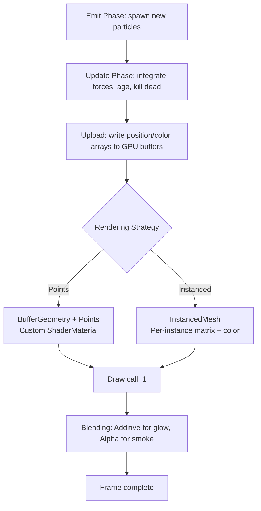
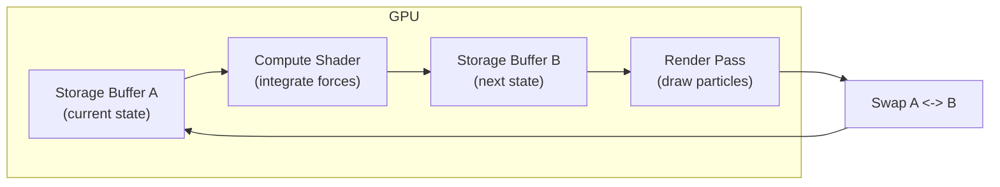

## Why Particles Still Matter

Particle systems are one of the oldest tricks in real-time graphics, and they remain one of the most useful. Fire, smoke, rain, starfields, debris, magic effects -- the technique generalizes to anything that involves many small, independently moving elements. The hard part has always been count. A few hundred particles are trivial. Ten thousand start to hurt. A hundred thousand require you to think carefully about where data lives and how it moves.

The GPU is built for this. Thousands of identical lightweight objects, each doing the same math with different inputs, is the exact workload that parallel hardware devours. The question is how to structure your particle system so the GPU can actually help instead of waiting on CPU-side loops and per-particle draw calls.

> [!note]
> This post focuses on Three.js with WebGL. The same principles apply to WebGPU compute-driven particles, but the API surface is different. See the WebGPU compute shaders post for that side of the fence.

## Post Plan (Feature Map)

| Section Goal | Blog Feature Used | Why |
|---|---|---|
| Cover particle lifecycle and data layout | Code blocks + callouts | Concrete, copy-paste-ready patterns |
| Compare integration schemes | Table + code | Euler vs Verlet tradeoffs in context |
| Show the rendering pipeline | Mermaid diagram | Make the emit-update-render loop explicit |
| Walk through a high-count implementation | Steps block | Reproducible path from zero to 18K particles |
| Handle common confusion | Chat transcript | Short-circuit the usual stumbling blocks |

## Particle Lifecycle

Every particle system has the same three-phase loop: emit, update, die. Particles are born with initial state (position, velocity, color, lifetime), transformed each frame by forces and integration, and removed or recycled when their lifetime expires.

```javascript
// Minimal particle state -- flat arrays for GPU-friendly access
const MAX = 20000;
const pos     = new Float32Array(MAX * 3);  // x, y, z
const vel     = new Float32Array(MAX * 3);  // vx, vy, vz
const life    = new Float32Array(MAX);      // remaining lifetime
const maxLife = new Float32Array(MAX);      // total lifetime (for alpha fade)
let alive = 0;

function emit(x, y, z, vx, vy, vz, ttl) {
  if (alive >= MAX) return;
  const i = alive;
  pos[i * 3]     = x;
  pos[i * 3 + 1] = y;
  pos[i * 3 + 2] = z;
  vel[i * 3]     = vx;
  vel[i * 3 + 1] = vy;
  vel[i * 3 + 2] = vz;
  life[i] = ttl;
  maxLife[i] = ttl;
  alive++;
}
```

Dead particles get swapped with the last alive particle so the active set is always contiguous. This avoids branching over dead slots during update and keeps GPU buffer uploads tight.

```javascript
function kill(index) {
  alive--;
  // Swap with last alive
  pos[index * 3]     = pos[alive * 3];
  pos[index * 3 + 1] = pos[alive * 3 + 1];
  pos[index * 3 + 2] = pos[alive * 3 + 2];
  vel[index * 3]     = vel[alive * 3];
  vel[index * 3 + 1] = vel[alive * 3 + 1];
  vel[index * 3 + 2] = vel[alive * 3 + 2];
  life[index]    = life[alive];
  maxLife[index]  = maxLife[alive];
}
```

> [!tip]
> Use Structure of Arrays (SoA) layout -- separate typed arrays for position, velocity, life -- rather than an Array of Objects. SoA is cache-friendly, directly uploadable to GPU buffers, and avoids GC pressure from thousands of small objects.

## Integration: Euler vs Verlet

Integration turns forces into motion. The two practical choices for real-time particles are explicit Euler and Verlet.

**Euler** is the simplest: `velocity += force * dt`, then `position += velocity * dt`. It drifts under large timesteps and accumulates energy in oscillatory systems, but for particles that live a few seconds and do not collide, it works fine.

**Verlet** stores position and previous position instead of velocity. The update is `newPos = 2 * pos - prevPos + accel * dt * dt`. Velocity is implicit. This is more stable for constraint-based systems (cloth, chains) and dissipates energy naturally, but it makes emission slightly more involved because you have to initialize both current and previous position.

```javascript
// Euler update -- straightforward, good enough for most particle effects
function updateEuler(dt) {
  const gravity = -9.8;
  for (let i = alive - 1; i >= 0; i--) {
    life[i] -= dt;
    if (life[i] <= 0) { kill(i); continue; }

    vel[i * 3 + 1] += gravity * dt;        // apply gravity
    pos[i * 3]     += vel[i * 3]     * dt;
    pos[i * 3 + 1] += vel[i * 3 + 1] * dt;
    pos[i * 3 + 2] += vel[i * 3 + 2] * dt;
  }
}

// Verlet update -- better stability for constrained systems
const prevPos = new Float32Array(MAX * 3);

function updateVerlet(dt) {
  const gravity = -9.8;
  const dt2 = dt * dt;
  for (let i = alive - 1; i >= 0; i--) {
    life[i] -= dt;
    if (life[i] <= 0) { kill(i); continue; }

    for (let c = 0; c < 3; c++) {
      const idx = i * 3 + c;
      const accel = c === 1 ? gravity : 0;
      const curr = pos[idx];
      pos[idx] = 2 * curr - prevPos[idx] + accel * dt2;
      prevPos[idx] = curr;
    }
  }
}
```

| Property | Euler | Verlet |
|---|---|---|
| Storage per particle | pos + vel (6 floats) | pos + prevPos (6 floats) |
| Stability | Drifts under large dt | Naturally damped |
| Emission complexity | Simple: set pos and vel | Must initialize pos and prevPos |
| Constraint handling | Awkward | Natural (project positions) |
| Best for | Fire, sparks, rain | Cloth, ropes, soft bodies |

## Rendering Pipeline



## Points vs InstancedMesh

Two practical strategies for rendering thousands of particles in Three.js: `Points` and `InstancedMesh`. They have different strengths.

**Points** use `GL_POINTS` under the hood. Each particle is a single vertex rendered as a screen-space square. You control size and appearance in a custom shader. This is the cheapest option for round, billboard-style particles and scales to hundreds of thousands easily.

```javascript
const geometry = new THREE.BufferGeometry();
geometry.setAttribute('position', new THREE.BufferAttribute(pos, 3));
geometry.setAttribute('aLife', new THREE.BufferAttribute(life, 1));

const material = new THREE.ShaderMaterial({
  vertexShader: `
    attribute float aLife;
    varying float vLife;
    void main() {
      vLife = aLife;
      vec4 mvPosition = modelViewMatrix * vec4(position, 1.0);
      gl_PointSize = mix(1.0, 4.0, vLife) * (300.0 / -mvPosition.z);
      gl_Position = projectionMatrix * mvPosition;
    }
  `,
  fragmentShader: `
    varying float vLife;
    void main() {
      float d = length(gl_PointCoord - vec2(0.5));
      if (d > 0.5) discard;
      float alpha = smoothstep(0.5, 0.0, d) * vLife;
      gl_FragColor = vec4(1.0, 0.6, 0.2, alpha);
    }
  `,
  transparent: true,
  blending: THREE.AdditiveBlending,
  depthWrite: false,
});

const points = new THREE.Points(geometry, material);
scene.add(points);
```

**InstancedMesh** renders an actual mesh (sphere, quad, custom shape) at each particle position via hardware instancing. One draw call, one geometry, N instances. This lets you use real lighting, cast shadows, and have particles with actual 3D shape, at the cost of more vertices per particle.

```javascript
const baseGeo = new THREE.SphereGeometry(0.05, 6, 4);
const baseMat = new THREE.MeshStandardMaterial({
  color: 0xffaa44,
  emissive: 0xff6600,
  emissiveIntensity: 0.4,
});

const mesh = new THREE.InstancedMesh(baseGeo, baseMat, MAX);
mesh.instanceMatrix.setUsage(THREE.DynamicDrawUsage);
scene.add(mesh);

// Each frame: update instance matrices from particle positions
const dummy = new THREE.Object3D();
function syncInstances() {
  for (let i = 0; i < alive; i++) {
    dummy.position.set(pos[i * 3], pos[i * 3 + 1], pos[i * 3 + 2]);
    const scale = life[i] / maxLife[i];
    dummy.scale.setScalar(scale);
    dummy.updateMatrix();
    mesh.setMatrixAt(i, dummy.matrix);
  }
  mesh.count = alive;
  mesh.instanceMatrix.needsUpdate = true;
}
```

> [!warning]
> `InstancedMesh` calls `dummy.updateMatrix()` per particle per frame. For 50K+ particles this CPU-side matrix construction becomes the bottleneck. At that scale, switch to Points or push the transform math into a vertex shader that reads from a custom buffer attribute.

## Buffer Attribute Updates

The bridge between CPU simulation and GPU rendering is `BufferAttribute.needsUpdate`. When you modify the backing typed array, set this flag so Three.js re-uploads the data.

```javascript
function frame(dt) {
  updateEuler(dt);

  // Update the draw range to match alive count
  geometry.setDrawRange(0, alive);

  // Flag position and life attributes for re-upload
  geometry.attributes.position.needsUpdate = true;
  geometry.attributes.aLife.needsUpdate = true;
}
```

For partial updates on very large buffers, you can use `renderer.copyTextureToTexture` or write directly to `attribute.array` and set `updateRange` to avoid uploading the entire buffer:

```javascript
const attr = geometry.attributes.position;
attr.updateRange.offset = 0;
attr.updateRange.count = alive * 3;
attr.needsUpdate = true;
```

> [!tip]
> Set `attribute.setUsage(THREE.DynamicDrawUsage)` at creation time. This hints to the driver that the buffer changes every frame and prevents internal copies on some implementations.

## Spatial Hashing for Particle Collisions

If particles need to interact -- collision, attraction, flocking -- brute-force O(n^2) pair checks are dead on arrival at 10K+. Spatial hashing divides space into a grid and only checks particles in the same or neighboring cells.

```javascript
class SpatialHash {
  constructor(cellSize) {
    this.cellSize = cellSize;
    this.map = new Map();
  }

  clear() {
    this.map.clear();
  }

  key(x, y, z) {
    const cs = this.cellSize;
    return `${Math.floor(x / cs)},${Math.floor(y / cs)},${Math.floor(z / cs)}`;
  }

  insert(index, x, y, z) {
    const k = this.key(x, y, z);
    if (!this.map.has(k)) this.map.set(k, []);
    this.map.get(k).push(index);
  }

  query(x, y, z) {
    const cs = this.cellSize;
    const cx = Math.floor(x / cs);
    const cy = Math.floor(y / cs);
    const cz = Math.floor(z / cs);
    const result = [];
    for (let dx = -1; dx <= 1; dx++) {
      for (let dy = -1; dy <= 1; dy++) {
        for (let dz = -1; dz <= 1; dz++) {
          const k = `${cx + dx},${cy + dy},${cz + dz}`;
          const cell = this.map.get(k);
          if (cell) result.push(...cell);
        }
      }
    }
    return result;
  }
}

// Usage per frame:
const hash = new SpatialHash(1.0);
hash.clear();
for (let i = 0; i < alive; i++) {
  hash.insert(i, pos[i * 3], pos[i * 3 + 1], pos[i * 3 + 2]);
}
// For each particle, query neighbors and resolve collisions
```

Cell size should be approximately equal to the interaction radius. Too small and you check too many cells. Too large and each cell has too many particles.

## GPU-Driven Patterns

At very high counts (100K+), even the CPU update loop becomes a bottleneck. The solution is to move the simulation onto the GPU entirely.

**Transform feedback** (WebGL 2) lets you run a vertex shader that reads particle state from one buffer, computes the update, and writes the result to another buffer. Ping-pong between two buffers each frame. Three.js does not expose transform feedback natively, but you can use raw WebGL calls alongside the renderer.

**Compute shaders** (WebGPU) are the clean solution. A compute dispatch reads particle state from a storage buffer, applies forces and integration, and writes updated state to the same or a second buffer. The render pass reads the result. No CPU readback, no buffer upload. The data never leaves the GPU.



For Three.js on WebGL, the practical middle ground is: simulate on the CPU with typed arrays, upload only the alive portion of each buffer per frame, and render with Points or InstancedMesh. This comfortably handles 20-50K particles at 60fps on mid-range hardware.

## Live Demo: Particle Galaxy

The scene below renders 18,000 particles arranged in logarithmic spiral arms with differential rotation, distance-based coloring, and additive blending for the glow effect. This is the Points approach with a custom ShaderMaterial.

<div data-scene="particle-galaxy.js" style="width:100%;height:420px;"></div>

## Conversation: Common Particle System Questions

```chat
user: My particle system drops frames when I go above 5000 particles. I am using individual Mesh objects. What is wrong?
assistant: Each Mesh is a separate draw call. At 5000 meshes you are issuing 5000 draw calls per frame, which crushes the CPU-GPU command overhead. Switch to InstancedMesh (one draw call for all particles) or Points with a custom ShaderMaterial. Either approach will handle 50K+ particles in a single draw call.

user: Should I use Euler or Verlet integration for a fire effect?
assistant: Euler. Fire particles are short-lived, do not collide, and do not need constraints. Euler is simpler to implement and the energy drift is irrelevant when particles only live for 1-2 seconds. Save Verlet for systems where positional stability matters, like cloth or chains.

user: How do I make particles fade out as they die instead of popping?
assistant: Pass the particle lifetime ratio (life / maxLife) as a vertex attribute to your shader. In the fragment shader, multiply the output alpha by this ratio. Particles will smoothly fade from full opacity to transparent as they approach death. Combine with size scaling for a shrink-and-fade effect.
```

## Building a High-Count Particle System: Step by Step

````steps
### Step 1: Set up flat typed arrays for particle state
Allocate `Float32Array` buffers for position, velocity, lifetime, and any per-particle attributes (color, size). Use SoA layout. Pre-allocate for your maximum count to avoid reallocation.

```javascript
const MAX = 20000;
const pos  = new Float32Array(MAX * 3);
const vel  = new Float32Array(MAX * 3);
const life = new Float32Array(MAX);
const col  = new Float32Array(MAX * 3);
let alive = 0;
```

### Step 2: Build the BufferGeometry and attach attributes
Create a `BufferGeometry` and set each typed array as a `BufferAttribute`. Mark dynamic attributes with `DynamicDrawUsage` so the driver knows they change every frame.

```javascript
const geometry = new THREE.BufferGeometry();
const posAttr = new THREE.BufferAttribute(pos, 3);
posAttr.setUsage(THREE.DynamicDrawUsage);
geometry.setAttribute('position', posAttr);

const lifeAttr = new THREE.BufferAttribute(life, 1);
lifeAttr.setUsage(THREE.DynamicDrawUsage);
geometry.setAttribute('aLife', lifeAttr);
```

### Step 3: Write the update loop with swap-kill
Each frame: decrement life, apply forces with Euler integration, swap-kill dead particles, and set `needsUpdate` on modified attributes. Use `setDrawRange` to render only the alive portion of the buffer.

```javascript
function update(dt) {
  for (let i = alive - 1; i >= 0; i--) {
    life[i] -= dt;
    if (life[i] <= 0) { kill(i); continue; }
    vel[i * 3 + 1] += -9.8 * dt;
    pos[i * 3]     += vel[i * 3]     * dt;
    pos[i * 3 + 1] += vel[i * 3 + 1] * dt;
    pos[i * 3 + 2] += vel[i * 3 + 2] * dt;
  }
  geometry.setDrawRange(0, alive);
  posAttr.needsUpdate = true;
  lifeAttr.needsUpdate = true;
}
```

### Step 4: Render with additive blending and depth write disabled
Use a `ShaderMaterial` with `AdditiveBlending` and `depthWrite: false` for glowing, overlapping particles. The vertex shader sizes points by distance; the fragment shader creates a soft circle and fades by lifetime.

```javascript
const material = new THREE.ShaderMaterial({
  vertexShader: `
    attribute float aLife;
    varying float vLife;
    void main() {
      vLife = aLife;
      vec4 mvPosition = modelViewMatrix * vec4(position, 1.0);
      gl_PointSize = (2.0 + vLife * 3.0) * (200.0 / -mvPosition.z);
      gl_Position = projectionMatrix * mvPosition;
    }
  `,
  fragmentShader: `
    varying float vLife;
    void main() {
      float d = length(gl_PointCoord - vec2(0.5));
      if (d > 0.5) discard;
      float glow = 1.0 - smoothstep(0.0, 0.5, d);
      gl_FragColor = vec4(1.0, 0.5 + vLife * 0.3, 0.1, glow * vLife);
    }
  `,
  transparent: true,
  blending: THREE.AdditiveBlending,
  depthWrite: false,
});
const particles = new THREE.Points(geometry, material);
scene.add(particles);
```
````

## Performance Reference

| Particle Count | Strategy | Draw Calls | Typical FPS (mid-range GPU) |
|---|---|---|---|
| 500 | Individual meshes | 500 | 60 (but wasteful) |
| 5,000 | InstancedMesh | 1 | 60 |
| 20,000 | Points + ShaderMaterial | 1 | 60 |
| 100,000 | Points + ShaderMaterial | 1 | 45-60 (CPU update is the bottleneck) |
| 500,000+ | GPU compute (WebGPU) | 1 | 60 (simulation stays on GPU) |

## Wrap-Up

Particle systems are a solved problem in terms of architecture: emit, integrate, kill, render. The engineering challenge is keeping the data layout GPU-friendly and minimizing the CPU-GPU data transfer. Flat typed arrays with SoA layout, swap-kill for O(1) removal, `DynamicDrawUsage` hints, and single-draw-call rendering via Points or InstancedMesh get you to 20-50K particles at 60fps without leaving JavaScript. Beyond that, push the simulation into a compute shader and keep the data on the GPU entirely. Start with the patterns above, profile with your actual workload, and scale the technique to match.

## Generation Metadata

- Assistant: Lumen
- Model: claude-opus-4-6
- Generation date: 2026-03-01

## Prompt Used to Generate This Post

```text
Write a markdown blog post about "Particle Systems on the GPU". Cover particle lifecycle (emit, update, die), Verlet/Euler integration, instanced rendering vs Points, buffer attribute updates, spatial hashing for collisions, GPU-driven patterns. Show how to push particle counts high while maintaining frame rate. Include: YAML frontmatter (title, date 2026-03-01, order 15, description, tags), opening motivation section, Post Plan (Feature Map) table, core technical content with real JavaScript code, at least one Mermaid diagram, a Three.js scene embed (particle-galaxy.js), 2-4 callout blocks, one chat transcript with 3 Q&A pairs, one steps block with 4 steps, a wrap-up section, generation metadata (Assistant: Lumen, Model: claude-opus-4-6, Generation date: 2026-03-01), and the prompt used. Tags: [graphics, particles, gpu-simulation, instancing, threejs]. Style: pragmatic, implementation-focused, assumes technical reader, ~200-300 lines, no emojis, real code only.
```
