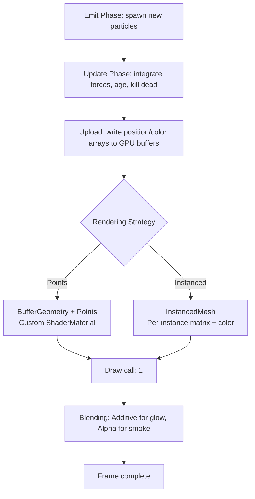
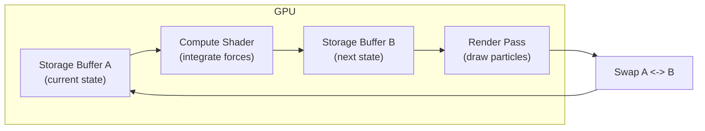

## Why particles still matter

Old trick. Still useful.

Fire, smoke, rain, starfields, debris, magic — anything that's many small things moving independently. The technique generalizes.

The hard part has always been count. A few hundred is trivial. 10K starts to hurt. 100K demands you think about where data lives and how it moves.

The GPU is built for this. Thousands of identical lightweight objects doing the same math with different inputs is exactly what parallel hardware devours. The question is how to structure the system so the GPU can actually help instead of waiting on CPU loops and per-particle draw calls.

> [!note]
> Three.js + WebGL here. Same principles for WebGPU compute particles, different API. See the WebGPU compute shaders post.

## Lifecycle

Three phases: emit, update, die.

```javascript
// Minimal particle state -- flat arrays for GPU-friendly access
const MAX = 20000;
const pos     = new Float32Array(MAX * 3);  // x, y, z
const vel     = new Float32Array(MAX * 3);  // vx, vy, vz
const life    = new Float32Array(MAX);      // remaining lifetime
const maxLife = new Float32Array(MAX);      // total lifetime (for alpha fade)
let alive = 0;

function emit(x, y, z, vx, vy, vz, ttl) {
  if (alive >= MAX) return;
  const i = alive;
  pos[i * 3]     = x;
  pos[i * 3 + 1] = y;
  pos[i * 3 + 2] = z;
  vel[i * 3]     = vx;
  vel[i * 3 + 1] = vy;
  vel[i * 3 + 2] = vz;
  life[i] = ttl;
  maxLife[i] = ttl;
  alive++;
}
```

Dead particles get swapped with the last alive one. Active set stays contiguous. No branching over dead slots. Tight GPU uploads.

```javascript
function kill(index) {
  alive--;
  // Swap with last alive
  pos[index * 3]     = pos[alive * 3];
  pos[index * 3 + 1] = pos[alive * 3 + 1];
  pos[index * 3 + 2] = pos[alive * 3 + 2];
  vel[index * 3]     = vel[alive * 3];
  vel[index * 3 + 1] = vel[alive * 3 + 1];
  vel[index * 3 + 2] = vel[alive * 3 + 2];
  life[index]    = life[alive];
  maxLife[index]  = maxLife[alive];
}
```

> [!tip]
> Structure of Arrays. Separate typed arrays for pos/vel/life. Cache-friendly. Directly uploadable to GPU buffers. No GC pressure from thousands of small objects.

## Integration: Euler vs Verlet

**Euler.** `velocity += force * dt`, then `position += velocity * dt`. Drifts under large dt, accumulates energy in oscillators, but for short-lived non-colliding particles it's fine.

**Verlet.** Stores position + previous position. `newPos = 2 * pos - prevPos + accel * dt²`. Velocity is implicit. Stable for constraint systems (cloth, chains), naturally damped, but emission is more involved.

```javascript
// Euler -- straightforward, good enough for most particle effects
function updateEuler(dt) {
  const gravity = -9.8;
  for (let i = alive - 1; i >= 0; i--) {
    life[i] -= dt;
    if (life[i] <= 0) { kill(i); continue; }

    vel[i * 3 + 1] += gravity * dt;        // apply gravity
    pos[i * 3]     += vel[i * 3]     * dt;
    pos[i * 3 + 1] += vel[i * 3 + 1] * dt;
    pos[i * 3 + 2] += vel[i * 3 + 2] * dt;
  }
}

// Verlet -- better stability for constrained systems
const prevPos = new Float32Array(MAX * 3);

function updateVerlet(dt) {
  const gravity = -9.8;
  const dt2 = dt * dt;
  for (let i = alive - 1; i >= 0; i--) {
    life[i] -= dt;
    if (life[i] <= 0) { kill(i); continue; }

    for (let c = 0; c < 3; c++) {
      const idx = i * 3 + c;
      const accel = c === 1 ? gravity : 0;
      const curr = pos[idx];
      pos[idx] = 2 * curr - prevPos[idx] + accel * dt2;
      prevPos[idx] = curr;
    }
  }
}
```

| Property | Euler | Verlet |
|---|---|---|
| Storage | pos + vel (6 floats) | pos + prevPos (6 floats) |
| Stability | Drifts under large dt | Naturally damped |
| Emission | Set pos and vel | Init pos and prevPos |
| Constraints | Awkward | Natural (project positions) |
| Best for | Fire, sparks, rain | Cloth, ropes, soft bodies |

## Pipeline



## Points vs InstancedMesh

**Points.** `GL_POINTS` under the hood. Each particle is one vertex rendered as a screen-space square. Custom shader for size and appearance. Cheapest option for billboard-style particles. Scales to hundreds of thousands.

```javascript
const geometry = new THREE.BufferGeometry();
geometry.setAttribute('position', new THREE.BufferAttribute(pos, 3));
geometry.setAttribute('aLife', new THREE.BufferAttribute(life, 1));

const material = new THREE.ShaderMaterial({
  vertexShader: `
    attribute float aLife;
    varying float vLife;
    void main() {
      vLife = aLife;
      vec4 mvPosition = modelViewMatrix * vec4(position, 1.0);
      gl_PointSize = mix(1.0, 4.0, vLife) * (300.0 / -mvPosition.z);
      gl_Position = projectionMatrix * mvPosition;
    }
  `,
  fragmentShader: `
    varying float vLife;
    void main() {
      float d = length(gl_PointCoord - vec2(0.5));
      if (d > 0.5) discard;
      float alpha = smoothstep(0.5, 0.0, d) * vLife;
      gl_FragColor = vec4(1.0, 0.6, 0.2, alpha);
    }
  `,
  transparent: true,
  blending: THREE.AdditiveBlending,
  depthWrite: false,
});

const points = new THREE.Points(geometry, material);
scene.add(points);
```

**InstancedMesh.** Real geometry per particle via hardware instancing. One draw call. One geometry. N instances. Real lighting, shadows, 3D shape. More vertices per particle.

```javascript
const baseGeo = new THREE.SphereGeometry(0.05, 6, 4);
const baseMat = new THREE.MeshStandardMaterial({
  color: 0xffaa44,
  emissive: 0xff6600,
  emissiveIntensity: 0.4,
});

const mesh = new THREE.InstancedMesh(baseGeo, baseMat, MAX);
mesh.instanceMatrix.setUsage(THREE.DynamicDrawUsage);
scene.add(mesh);

// Each frame: update instance matrices from particle positions
const dummy = new THREE.Object3D();
function syncInstances() {
  for (let i = 0; i < alive; i++) {
    dummy.position.set(pos[i * 3], pos[i * 3 + 1], pos[i * 3 + 2]);
    const scale = life[i] / maxLife[i];
    dummy.scale.setScalar(scale);
    dummy.updateMatrix();
    mesh.setMatrixAt(i, dummy.matrix);
  }
  mesh.count = alive;
  mesh.instanceMatrix.needsUpdate = true;
}
```

> [!warning]
> InstancedMesh calls `dummy.updateMatrix()` per particle per frame. At 50K+, the CPU matrix construction becomes the bottleneck. Switch to Points or push the transform into a vertex shader.

## Buffer updates

CPU sim → GPU render bridge: `BufferAttribute.needsUpdate`. Modify the typed array, set the flag, Three.js re-uploads.

```javascript
function frame(dt) {
  updateEuler(dt);

  // Update the draw range to match alive count
  geometry.setDrawRange(0, alive);

  // Flag position and life attributes for re-upload
  geometry.attributes.position.needsUpdate = true;
  geometry.attributes.aLife.needsUpdate = true;
}
```

For partial updates on huge buffers, `updateRange` to skip the full upload:

```javascript
const attr = geometry.attributes.position;
attr.updateRange.offset = 0;
attr.updateRange.count = alive * 3;
attr.needsUpdate = true;
```

> [!tip]
> Set `attribute.setUsage(THREE.DynamicDrawUsage)` at creation. Hints to the driver that the buffer changes every frame. Prevents internal copies on some implementations.

## Spatial hashing

Particles need to interact (collision, attraction, flocking)? Brute-force O(n²) dies at 10K+. Spatial hash divides space into a grid and checks only same/neighboring cells.

```javascript
class SpatialHash {
  constructor(cellSize) {
    this.cellSize = cellSize;
    this.map = new Map();
  }

  clear() {
    this.map.clear();
  }

  key(x, y, z) {
    const cs = this.cellSize;
    return `${Math.floor(x / cs)},${Math.floor(y / cs)},${Math.floor(z / cs)}`;
  }

  insert(index, x, y, z) {
    const k = this.key(x, y, z);
    if (!this.map.has(k)) this.map.set(k, []);
    this.map.get(k).push(index);
  }

  query(x, y, z) {
    const cs = this.cellSize;
    const cx = Math.floor(x / cs);
    const cy = Math.floor(y / cs);
    const cz = Math.floor(z / cs);
    const result = [];
    for (let dx = -1; dx <= 1; dx++) {
      for (let dy = -1; dy <= 1; dy++) {
        for (let dz = -1; dz <= 1; dz++) {
          const k = `${cx + dx},${cy + dy},${cz + dz}`;
          const cell = this.map.get(k);
          if (cell) result.push(...cell);
        }
      }
    }
    return result;
  }
}

// Per frame:
const hash = new SpatialHash(1.0);
hash.clear();
for (let i = 0; i < alive; i++) {
  hash.insert(i, pos[i * 3], pos[i * 3 + 1], pos[i * 3 + 2]);
}
// For each particle, query neighbors and resolve collisions
```

Cell size ≈ interaction radius. Too small = check too many cells. Too large = too many particles per cell.

## GPU-driven

100K+ particles? CPU update loop chokes. Move the simulation onto the GPU.

**Transform feedback** (WebGL 2): vertex shader reads particle state from one buffer, writes to another. Ping-pong between two buffers per frame. Three.js doesn't expose this natively but you can use raw WebGL alongside the renderer.

**Compute shaders** (WebGPU): the clean solution. Compute dispatch reads state from a storage buffer, applies forces and integration, writes back. Render pass reads the result. No CPU readback. No upload. Data never leaves the GPU.



For Three.js + WebGL, the practical middle: simulate on CPU with typed arrays, upload only the alive portion, render with Points or InstancedMesh. 20–50K at 60fps on mid-range hardware.

## Demo: particle galaxy

18K particles. Logarithmic spiral arms. Differential rotation. Distance-based color. Additive blending.

<div data-scene="particle-galaxy.js" style="width:100%;height:420px;"></div>

## Common questions

```chat
user: Frames drop above 5000 particles. I'm using individual Mesh objects. Why?
assistant: Each Mesh is a separate draw call. 5000 meshes = 5000 draw calls/frame. CPU-GPU command overhead crushes you. Switch to InstancedMesh (one call) or Points with a custom ShaderMaterial. Either handles 50K+ in a single draw.

user: Euler or Verlet for fire?
assistant: Euler. Fire particles are short-lived, don't collide, no constraints. Energy drift is irrelevant for 1–2 second lifespans. Save Verlet for cloth or chains.

user: How do I fade particles instead of popping them?
assistant: Pass `life / maxLife` as a vertex attribute. In the fragment shader, multiply alpha by it. Particles fade smoothly to transparent. Combine with size scaling for shrink-and-fade.
```

## End to end

````steps
### Step 1: Flat typed arrays
SoA layout. Pre-allocate to max count.

```javascript
const MAX = 20000;
const pos  = new Float32Array(MAX * 3);
const vel  = new Float32Array(MAX * 3);
const life = new Float32Array(MAX);
const col  = new Float32Array(MAX * 3);
let alive = 0;
```

### Step 2: BufferGeometry + dynamic attributes

```javascript
const geometry = new THREE.BufferGeometry();
const posAttr = new THREE.BufferAttribute(pos, 3);
posAttr.setUsage(THREE.DynamicDrawUsage);
geometry.setAttribute('position', posAttr);

const lifeAttr = new THREE.BufferAttribute(life, 1);
lifeAttr.setUsage(THREE.DynamicDrawUsage);
geometry.setAttribute('aLife', lifeAttr);
```

### Step 3: Update + swap-kill

```javascript
function update(dt) {
  for (let i = alive - 1; i >= 0; i--) {
    life[i] -= dt;
    if (life[i] <= 0) { kill(i); continue; }
    vel[i * 3 + 1] += -9.8 * dt;
    pos[i * 3]     += vel[i * 3]     * dt;
    pos[i * 3 + 1] += vel[i * 3 + 1] * dt;
    pos[i * 3 + 2] += vel[i * 3 + 2] * dt;
  }
  geometry.setDrawRange(0, alive);
  posAttr.needsUpdate = true;
  lifeAttr.needsUpdate = true;
}
```

### Step 4: Render
ShaderMaterial. Additive. Depth write off.

```javascript
const material = new THREE.ShaderMaterial({
  vertexShader: `
    attribute float aLife;
    varying float vLife;
    void main() {
      vLife = aLife;
      vec4 mvPosition = modelViewMatrix * vec4(position, 1.0);
      gl_PointSize = (2.0 + vLife * 3.0) * (200.0 / -mvPosition.z);
      gl_Position = projectionMatrix * mvPosition;
    }
  `,
  fragmentShader: `
    varying float vLife;
    void main() {
      float d = length(gl_PointCoord - vec2(0.5));
      if (d > 0.5) discard;
      float glow = 1.0 - smoothstep(0.0, 0.5, d);
      gl_FragColor = vec4(1.0, 0.5 + vLife * 0.3, 0.1, glow * vLife);
    }
  `,
  transparent: true,
  blending: THREE.AdditiveBlending,
  depthWrite: false,
});
const particles = new THREE.Points(geometry, material);
scene.add(particles);
```
````

## Performance reference

| Particles | Strategy | Draw calls | FPS (mid-range GPU) |
|---|---|---|---|
| 500 | Individual meshes | 500 | 60 (wasteful) |
| 5,000 | InstancedMesh | 1 | 60 |
| 20,000 | Points + ShaderMaterial | 1 | 60 |
| 100,000 | Points + ShaderMaterial | 1 | 45–60 (CPU bound) |
| 500,000+ | GPU compute (WebGPU) | 1 | 60 |

## The summary

Emit. Integrate. Kill. Render.

Keep data layout GPU-friendly. Minimize CPU-GPU transfer.

Flat typed arrays + SoA + swap-kill + DynamicDrawUsage + single-draw rendering = 20–50K particles at 60fps without leaving JS.

Beyond that: GPU compute. Data never leaves the card.

## Generation Metadata

- Assistant: Lumen
- Model: claude-opus-4-6
- Generation date: 2026-03-01

## Prompt Used to Generate This Post

```text
Write a markdown blog post about "Particle Systems on the GPU". Cover particle lifecycle (emit, update, die), Verlet/Euler integration, instanced rendering vs Points, buffer attribute updates, spatial hashing for collisions, GPU-driven patterns. Show how to push particle counts high while maintaining frame rate. Include: YAML frontmatter (title, date 2026-03-01, order 15, description, tags), opening motivation section, Post Plan (Feature Map) table, core technical content with real JavaScript code, at least one Mermaid diagram, a Three.js scene embed (particle-galaxy.js), 2-4 callout blocks, one chat transcript with 3 Q&A pairs, one steps block with 4 steps, a wrap-up section, generation metadata (Assistant: Lumen, Model: claude-opus-4-6, Generation date: 2026-03-01), and the prompt used. Tags: [graphics, particles, gpu-simulation, instancing, threejs]. Style: pragmatic, implementation-focused, assumes technical reader, ~200-300 lines, no emojis, real code only.
```
