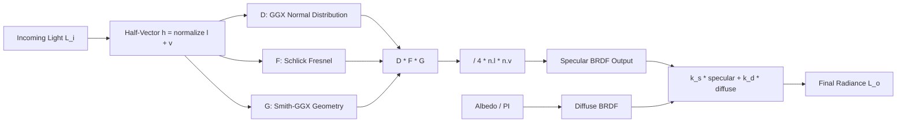

## Why PBR

Traditional shading models -- Phong, Blinn-Phong -- let you push numbers around until a material "looks right." PBR (Physically-Based Rendering) replaces that guesswork with constraints derived from actual physics: energy conservation, microfacet statistics, and Fresnel reflectance. The result is materials that respond correctly to any lighting environment without per-scene hand-tuning. Every major engine (Unreal, Unity, Godot, Three.js) adopted the metalness-roughness workflow for this reason. Once you understand the math, you understand why every sphere in a PBR material chart looks the way it does.

> [!note]
> PBR does not mean photorealism. It means the shading math obeys physical constraints. You can use PBR for stylized rendering -- the energy conservation and Fresnel response still make materials feel grounded.

## Post Plan (Feature Map)

| Section Goal | Blog Feature Used | Why |
|---|---|---|
| Ground the Cook-Torrance BRDF | Code blocks + callouts | Show the actual math, not just API calls |
| Visualize the metalness/roughness parameter space | Interactive Three.js scene | A grid of spheres beats a thousand words |
| Explain the rendering equation components | Mermaid diagram | Map how D, F, G terms compose into the specular BRDF |
| Walk through a Three.js implementation | Steps block | From MeshStandardMaterial to custom PBR |
| Address common misconceptions | Chat transcript | Metalness confusion, energy conservation, IBL fallback |

## The Rendering Equation (Simplified)

Real-time PBR starts from the reflectance equation. For a single surface point illuminated by direct lights:

```
L_o(p, v) = sum over lights [ f(l, v) * L_i(p, l) * (n . l) ]
```

Where `f(l, v)` is the BRDF -- the function that determines how much light arriving from direction `l` scatters toward view direction `v`. The Cook-Torrance model splits this into diffuse and specular terms:

```
f(l, v) = k_d * f_lambert + k_s * f_cook_torrance
```

The diffuse term is trivial: `f_lambert = albedo / PI`. The specular term is where the physics lives.

## Cook-Torrance Specular BRDF

The specular component is built from three distribution functions:

```
f_cook_torrance = D(h) * F(v, h) * G(l, v) / (4 * (n . l) * (n . v))
```

- **D(h)** -- Normal Distribution Function. How many microfacets are aligned with the half-vector `h`. Controls specular highlight shape.
- **F(v, h)** -- Fresnel term. How reflectance changes at grazing angles. All materials become mirrors at steep angles.
- **G(l, v)** -- Geometry function. Accounts for microfacet self-shadowing and masking.



## GGX Normal Distribution

GGX (Trowbridge-Reitz) is the industry-standard NDF. It produces long specular tails that match real-world measured materials better than Blinn-Phong.

```glsl
float distributionGGX(vec3 N, vec3 H, float roughness) {
    float a = roughness * roughness;
    float a2 = a * a;
    float NdotH = max(dot(N, H), 0.0);
    float NdotH2 = NdotH * NdotH;

    float denom = NdotH2 * (a2 - 1.0) + 1.0;
    denom = 3.14159265 * denom * denom;

    return a2 / denom;
}
```

At roughness = 0, the NDF collapses to a near-delta function (perfect mirror). At roughness = 1, it spreads energy uniformly across the hemisphere. The `roughness * roughness` remapping (alpha = roughness squared) is deliberate -- it makes the 0-to-1 slider perceptually linear.

> [!tip]
> Three.js applies the `roughness * roughness` remapping internally. When you set `material.roughness = 0.5`, the shader uses `alpha = 0.25`. This is why roughness 0.5 still looks fairly shiny.

## Schlick Fresnel Approximation

Fresnel reflectance is the ratio of reflected to refracted light at a surface boundary. Schlick's approximation is computationally cheap and accurate enough for real-time:

```glsl
vec3 fresnelSchlick(float cosTheta, vec3 F0) {
    return F0 + (1.0 - F0) * pow(clamp(1.0 - cosTheta, 0.0, 1.0), 5.0);
}
```

`F0` is the surface reflectance at normal incidence. For dielectrics (plastic, wood, stone), F0 is around 0.04 -- low base reflectivity, strong Fresnel at grazing angles. For metals, F0 is the albedo color itself -- that is why metals reflect their own tint.

```javascript
// In the metalness workflow:
// F0 = mix(vec3(0.04), albedo, metalness)
//
// metalness = 0 -> F0 = 0.04 (dielectric)
// metalness = 1 -> F0 = albedo (conductor)
```

## Smith-GGX Geometry Function

The geometry term accounts for microfacet occlusion. Smith's method splits it into two factors: light-side shadowing and view-side masking.

```glsl
float geometrySchlickGGX(float NdotV, float roughness) {
    float r = roughness + 1.0;
    float k = (r * r) / 8.0;
    return NdotV / (NdotV * (1.0 - k) + k);
}

float geometrySmith(vec3 N, vec3 V, vec3 L, float roughness) {
    float NdotV = max(dot(N, V), 0.0);
    float NdotL = max(dot(N, L), 0.0);
    float ggx1 = geometrySchlickGGX(NdotL, roughness);
    float ggx2 = geometrySchlickGGX(NdotV, roughness);
    return ggx1 * ggx2;
}
```

At high roughness, more microfacets block each other, reducing specular intensity. This is part of how PBR achieves energy conservation: rough surfaces scatter more light diffusely because the geometry function dampens specular output.

## Energy Conservation

A PBR material must never reflect more light than it receives. The metalness workflow enforces this structurally:

```glsl
vec3 kS = fresnelSchlick(max(dot(H, V), 0.0), F0);
vec3 kD = vec3(1.0) - kS;
kD *= 1.0 - metalness; // metals have no diffuse
```

`kS + kD` never exceeds 1.0. Metals redirect all energy to specular (tinted by albedo). Dielectrics split energy between diffuse and specular based on the Fresnel curve. This constraint is why PBR materials look correct under any light -- there is no scenario where they "blow out" from accumulated reflectance.

> [!warning]
> Setting both metalness and roughness to extreme values (metalness=1, roughness=0) creates a perfect mirror. If you have no environment map, the sphere will render nearly black -- there is nothing to reflect. Always provide environment lighting for metallic materials.

## Metalness-Roughness Parameter Space

The interactive scene below renders a 5x5 grid of spheres. The X-axis sweeps metalness from 0 (left, dielectric) to 1 (right, conductor). The Y-axis sweeps roughness from 0 (top, smooth) to 1 (bottom, rough). Watch how the Fresnel rim, specular highlight width, and color response change across the grid.

<div data-scene="pbr-material-ball.js" style="width:100%;height:420px;"></div>

Top-left: smooth dielectric (plastic). Top-right: smooth metal (polished gold). Bottom-left: rough dielectric (clay). Bottom-right: rough metal (brushed iron). The diagonal from top-left to bottom-right shows the full parameter space.

## Image-Based Lighting (IBL)

Direct lights alone produce harsh, unrealistic PBR results. Real environments illuminate objects from all directions. IBL captures this with two precomputed textures:

1. **Irradiance map** -- low-frequency diffuse lighting from the environment, sampled by surface normal.
2. **Prefiltered specular map** -- environment convolved at multiple roughness levels, sampled by reflection vector with mip level driven by roughness.

Three.js handles this through `scene.environment`:

```javascript
import { RGBELoader } from 'three/addons/loaders/RGBELoader.js';

const loader = new RGBELoader();
loader.load('studio_small_09_1k.hdr', (texture) => {
  texture.mapping = THREE.EquirectangularReflectionMapping;
  scene.environment = texture;
  // Optional: also use as background
  // scene.background = texture;
});
```

> [!note]
> Without an HDR environment, `MeshStandardMaterial` falls back to the scene's lights for specular reflections. The result is functional but lacks the nuanced reflections that make PBR convincing. For production, always provide an environment map.

## Three.js: MeshStandardMaterial vs MeshPhysicalMaterial

`MeshStandardMaterial` implements the metalness-roughness PBR model described above. `MeshPhysicalMaterial` extends it with advanced features:

| Feature | Standard | Physical |
|---|---|---|
| Metalness/roughness | Yes | Yes |
| Normal/AO/emissive maps | Yes | Yes |
| Clearcoat | No | Yes |
| Sheen | No | Yes |
| Transmission (glass) | No | Yes |
| Iridescence | No | Yes |
| IOR control | No | Yes |
| Shader cost | Lower | Higher |

Use `MeshStandardMaterial` by default. Reach for `MeshPhysicalMaterial` only when you need clearcoat (car paint), transmission (glass, water), or sheen (fabric).

## Conversation: PBR Misconceptions

```chat
user: Why does my metallic material look black even though I set a bright albedo?
assistant: Metals have no diffuse component -- all their color comes from specular reflection. If there is no environment map and your direct lights do not hit the surface at the right angle, there is nothing to reflect and the surface goes dark. Add an HDR environment to scene.environment or add more lights from multiple directions.

user: Should I ever set metalness to a value between 0 and 1?
assistant: Rarely. Real materials are either conductors (metal, metalness=1) or dielectrics (everything else, metalness=0). Intermediate values exist for blending at texture boundaries (rust over metal, paint chips) but a uniform 0.5 metalness does not correspond to any real material. Use a metalness map for transitions.

user: Does roughness affect performance?
assistant: Not directly -- the shader cost is the same regardless of roughness value. However, very low roughness (near-mirror) surfaces expose IBL map resolution more aggressively. If your environment map is low-res, smooth metals will look blurry or show artifacts. Use at least 1K HDR maps for scenes with polished metals.
```

## Building a PBR Material From Scratch

````steps
### Step 1: Set up the base material with maps

Start with `MeshStandardMaterial` and load your texture maps. The minimum viable PBR material needs an albedo (color) map, a roughness map, and a metalness map.

```javascript
const textureLoader = new THREE.TextureLoader();

const material = new THREE.MeshStandardMaterial({
  map: textureLoader.load('albedo.jpg'),
  roughnessMap: textureLoader.load('roughness.jpg'),
  metalnessMap: textureLoader.load('metalness.jpg'),
  normalMap: textureLoader.load('normal.jpg'),
  aoMap: textureLoader.load('ao.jpg'),
  aoMapIntensity: 1.0,
});
```

### Step 2: Configure environment lighting

Load an HDR environment map and assign it to the scene. This provides the indirect illumination that makes PBR materials respond realistically.

```javascript
import { RGBELoader } from 'three/addons/loaders/RGBELoader.js';

new RGBELoader().load('environment.hdr', (hdr) => {
  hdr.mapping = THREE.EquirectangularReflectionMapping;
  scene.environment = hdr;

  const pmremGenerator = new THREE.PMREMGenerator(renderer);
  const envMap = pmremGenerator.fromEquirectangular(hdr).texture;
  scene.environment = envMap;
  hdr.dispose();
  pmremGenerator.dispose();
});
```

### Step 3: Add advanced layers with MeshPhysicalMaterial

If you need clearcoat, transmission, or sheen, switch to `MeshPhysicalMaterial` and layer the effects:

```javascript
const carPaint = new THREE.MeshPhysicalMaterial({
  color: 0x880022,
  metalness: 0.9,
  roughness: 0.15,
  clearcoat: 1.0,
  clearcoatRoughness: 0.05,
  // Glass example:
  // transmission: 1.0,
  // ior: 1.5,
  // thickness: 0.5,
});
```

### Step 4: Validate with a material ball grid

Create a parameter sweep grid -- metalness on one axis, roughness on the other -- and visually inspect under your target lighting. This catches bad textures, missing environment maps, and energy conservation issues immediately.

```javascript
for (let m = 0; m < 5; m++) {
  for (let r = 0; r < 5; r++) {
    const mat = new THREE.MeshStandardMaterial({
      color: 0xcc9966,
      metalness: m / 4,
      roughness: r / 4,
    });
    const sphere = new THREE.Mesh(sphereGeo, mat);
    sphere.position.set(m * 1.5 - 3, r * 1.5 - 3, 0);
    scene.add(sphere);
  }
}
```
````

## Quick Reference

| Parameter | Range | Effect |
|---|---|---|
| metalness | 0-1 | 0 = dielectric (diffuse + subtle specular), 1 = conductor (colored specular only) |
| roughness | 0-1 | 0 = mirror-smooth, 1 = fully diffuse specular spread |
| F0 (derived) | 0.04 to albedo | Base reflectivity at normal incidence |
| clearcoat | 0-1 | Additional smooth reflective layer (PhysicalMaterial only) |
| transmission | 0-1 | Light passes through surface (PhysicalMaterial only) |
| ior | 1.0-2.33 | Index of refraction for transmission (PhysicalMaterial only) |

## Wrap-Up

PBR is not a black box -- it is three functions (D, F, G) composed into a specular BRDF, balanced against a Lambertian diffuse term, under an energy conservation constraint. The metalness-roughness workflow maps that math into two intuitive parameters that cover the full space of real-world materials. Three.js gives you `MeshStandardMaterial` as a production-ready implementation and `MeshPhysicalMaterial` for advanced surface types. The key practical takeaways: always provide environment lighting for metals, use roughness-squared remapping awareness when authoring textures, keep metalness binary (0 or 1) except at transition boundaries, and validate with a material ball grid before shipping.

## Generation Metadata

- Assistant: Lumen
- Model: claude-opus-4-6
- Generation date: 2026-03-01

## Prompt Used to Generate This Post

```text
Write a markdown blog post about "PBR Materials -- Physics-Based Shading in Three.js". Cover Cook-Torrance BRDF, GGX normal distribution, Fresnel (Schlick approximation), metalness/roughness workflow, energy conservation, IBL/environment maps, Three.js MeshStandardMaterial vs MeshPhysicalMaterial. Include: YAML frontmatter (title, date 2026-03-01, order 16, description, tags), opening motivation section, post plan table, Mermaid diagram of BRDF composition, real GLSL and JavaScript code, 2-4 callout blocks, a chat transcript with 3 Q&A pairs, a 4-step implementation guide, an interactive Three.js scene embed (5x5 metalness-roughness sphere grid), and a wrap-up. Tags: [graphics, pbr, brdf, materials, threejs]. End with metadata Assistant=Lumen, Model=claude-opus-4-6 and append the generation prompt.
```
