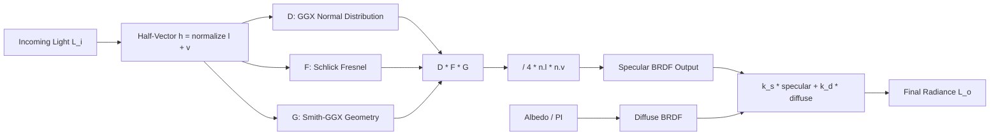

## Why PBR

Phong and Blinn-Phong let you push numbers around until a material looks right. PBR replaces guesswork with constraints: energy conservation, microfacet statistics, Fresnel reflectance.

Materials respond correctly to any lighting. No per-scene hand-tuning. That's the whole pitch.

Every major engine adopted metalness-roughness for this reason. Once you see the math, you understand why every sphere in a PBR chart looks the way it does.

> [!note]
> PBR ≠ photorealism. It means the shading math obeys physical constraints. Stylized rendering still benefits — energy conservation and Fresnel response keep things grounded.

## The reflectance equation

For a single point illuminated by direct lights:

```
L_o(p, v) = sum over lights [ f(l, v) * L_i(p, l) * (n . l) ]
```

`f(l, v)` is the BRDF — how much light from direction `l` scatters toward view direction `v`. Cook-Torrance splits it:

```
f(l, v) = k_d * f_lambert + k_s * f_cook_torrance
```

Diffuse is trivial: `f_lambert = albedo / PI`. Specular is where the physics lives.

## Cook-Torrance specular

Three distribution functions:

```
f_cook_torrance = D(h) * F(v, h) * G(l, v) / (4 * (n . l) * (n . v))
```

- **D(h)** — Normal Distribution Function. How many microfacets align with the half-vector. Controls highlight shape.
- **F(v, h)** — Fresnel. How reflectance changes at grazing angles. All materials become mirrors at steep angles.
- **G(l, v)** — Geometry. Microfacet self-shadowing and masking.



## GGX

Industry-standard NDF. Long specular tails that match measured materials better than Blinn-Phong.

```glsl
float distributionGGX(vec3 N, vec3 H, float roughness) {
    float a = roughness * roughness;
    float a2 = a * a;
    float NdotH = max(dot(N, H), 0.0);
    float NdotH2 = NdotH * NdotH;

    float denom = NdotH2 * (a2 - 1.0) + 1.0;
    denom = 3.14159265 * denom * denom;

    return a2 / denom;
}
```

Roughness 0 → near-delta function (perfect mirror). Roughness 1 → uniform spread. The `roughness²` remapping (alpha = roughness²) makes the slider perceptually linear.

> [!tip]
> Three.js applies `roughness²` internally. `material.roughness = 0.5` → shader uses `alpha = 0.25`. Why 0.5 still looks fairly shiny.

## Schlick Fresnel

Cheap, accurate enough for real-time:

```glsl
vec3 fresnelSchlick(float cosTheta, vec3 F0) {
    return F0 + (1.0 - F0) * pow(clamp(1.0 - cosTheta, 0.0, 1.0), 5.0);
}
```

`F0` = surface reflectance at normal incidence.

- Dielectrics (plastic, wood, stone): F0 ≈ 0.04. Low base reflectivity. Strong Fresnel at grazing angles.
- Metals: F0 = albedo. Why metals reflect their own tint.

```javascript
// In the metalness workflow:
// F0 = mix(vec3(0.04), albedo, metalness)
//
// metalness = 0 -> F0 = 0.04 (dielectric)
// metalness = 1 -> F0 = albedo (conductor)
```

## Smith-GGX geometry

Microfacet occlusion. Smith splits it into shadowing (light side) and masking (view side).

```glsl
float geometrySchlickGGX(float NdotV, float roughness) {
    float r = roughness + 1.0;
    float k = (r * r) / 8.0;
    return NdotV / (NdotV * (1.0 - k) + k);
}

float geometrySmith(vec3 N, vec3 V, vec3 L, float roughness) {
    float NdotV = max(dot(N, V), 0.0);
    float NdotL = max(dot(N, L), 0.0);
    float ggx1 = geometrySchlickGGX(NdotL, roughness);
    float ggx2 = geometrySchlickGGX(NdotV, roughness);
    return ggx1 * ggx2;
}
```

Higher roughness → more microfacets blocking each other → less specular. Part of how PBR achieves energy conservation: rough surfaces scatter diffusely because the geometry function dampens specular.

## Energy conservation

A PBR material never reflects more than it receives. The metalness workflow enforces it:

```glsl
vec3 kS = fresnelSchlick(max(dot(H, V), 0.0), F0);
vec3 kD = vec3(1.0) - kS;
kD *= 1.0 - metalness; // metals have no diffuse
```

`kS + kD ≤ 1.0`. Always.

Metals: all energy → tinted specular.
Dielectrics: split by Fresnel curve.

This is why PBR materials never blow out under any light.

> [!warning]
> metalness=1 + roughness=0 = perfect mirror. No environment map = nearly black sphere. Always provide environment lighting for metals.

## Parameter space

5×5 grid. X = metalness 0→1. Y = roughness 0→1. Watch the Fresnel rim, highlight width, and color response shift.

<div data-scene="pbr-material-ball.js" style="width:100%;height:420px;"></div>

Top-left: smooth dielectric (plastic). Top-right: smooth metal (polished gold). Bottom-left: rough dielectric (clay). Bottom-right: rough metal (brushed iron).

## Image-Based Lighting

Direct lights alone produce harsh PBR. Real environments illuminate from all directions. IBL captures that with two precomputed textures:

1. **Irradiance map** — low-frequency diffuse, sampled by surface normal
2. **Prefiltered specular map** — environment convolved at multiple roughness levels, sampled by reflection vector with mip driven by roughness

Three.js handles it through `scene.environment`:

```javascript
import { RGBELoader } from 'three/addons/loaders/RGBELoader.js';

const loader = new RGBELoader();
loader.load('studio_small_09_1k.hdr', (texture) => {
  texture.mapping = THREE.EquirectangularReflectionMapping;
  scene.environment = texture;
  // Optional: also use as background
  // scene.background = texture;
});
```

> [!note]
> Without HDR environment, MeshStandardMaterial falls back to scene lights for specular. Functional but lacks the nuanced reflections that make PBR convincing. Always provide an environment in production.

## Standard vs Physical

| Feature | Standard | Physical |
|---|---|---|
| Metalness/roughness | ✓ | ✓ |
| Normal/AO/emissive maps | ✓ | ✓ |
| Clearcoat | — | ✓ |
| Sheen | — | ✓ |
| Transmission (glass) | — | ✓ |
| Iridescence | — | ✓ |
| IOR control | — | ✓ |
| Shader cost | Lower | Higher |

Default to MeshStandardMaterial. Reach for MeshPhysicalMaterial only when you need clearcoat (car paint), transmission (glass, water), or sheen (fabric).

## Common misreads

```chat
user: Why does my metallic material look black even with bright albedo?
assistant: Metals have no diffuse — color comes from specular reflection. No environment map + no light hitting at the right angle = nothing to reflect = dark. Add an HDR environment to `scene.environment`, or add lights from multiple directions.

user: Should I ever set metalness between 0 and 1?
assistant: Rarely. Real materials are conductors (1) or dielectrics (0). Intermediate values exist for blending at texture boundaries (rust over metal, paint chips), but a uniform 0.5 doesn't correspond to any real material. Use a metalness map for transitions.

user: Does roughness affect performance?
assistant: Not directly. Same shader cost regardless of value. But near-mirror surfaces expose IBL map resolution. Low-res environment maps look blurry on smooth metals. Use 1K HDR minimum for polished metals.
```

## Build a PBR material

````steps
### Step 1: Base material with maps
Minimum viable PBR: albedo, roughness, metalness.

```javascript
const textureLoader = new THREE.TextureLoader();

const material = new THREE.MeshStandardMaterial({
  map: textureLoader.load('albedo.jpg'),
  roughnessMap: textureLoader.load('roughness.jpg'),
  metalnessMap: textureLoader.load('metalness.jpg'),
  normalMap: textureLoader.load('normal.jpg'),
  aoMap: textureLoader.load('ao.jpg'),
  aoMapIntensity: 1.0,
});
```

### Step 2: Environment lighting
HDR map → indirect illumination → PBR responds realistically.

```javascript
import { RGBELoader } from 'three/addons/loaders/RGBELoader.js';

new RGBELoader().load('environment.hdr', (hdr) => {
  hdr.mapping = THREE.EquirectangularReflectionMapping;
  scene.environment = hdr;

  const pmremGenerator = new THREE.PMREMGenerator(renderer);
  const envMap = pmremGenerator.fromEquirectangular(hdr).texture;
  scene.environment = envMap;
  hdr.dispose();
  pmremGenerator.dispose();
});
```

### Step 3: Advanced layers (Physical only)
Clearcoat, transmission, sheen.

```javascript
const carPaint = new THREE.MeshPhysicalMaterial({
  color: 0x880022,
  metalness: 0.9,
  roughness: 0.15,
  clearcoat: 1.0,
  clearcoatRoughness: 0.05,
  // Glass example:
  // transmission: 1.0,
  // ior: 1.5,
  // thickness: 0.5,
});
```

### Step 4: Validate with a parameter sweep
Material ball grid. Metalness × roughness. Catches bad textures, missing environment, energy conservation issues immediately.

```javascript
for (let m = 0; m < 5; m++) {
  for (let r = 0; r < 5; r++) {
    const mat = new THREE.MeshStandardMaterial({
      color: 0xcc9966,
      metalness: m / 4,
      roughness: r / 4,
    });
    const sphere = new THREE.Mesh(sphereGeo, mat);
    sphere.position.set(m * 1.5 - 3, r * 1.5 - 3, 0);
    scene.add(sphere);
  }
}
```
````

## Reference

| Parameter | Range | Effect |
|---|---|---|
| metalness | 0–1 | 0 = dielectric, 1 = conductor (colored specular only) |
| roughness | 0–1 | 0 = mirror, 1 = fully diffuse spread |
| F0 (derived) | 0.04 → albedo | Base reflectivity at normal incidence |
| clearcoat | 0–1 | Additional smooth reflective layer (Physical) |
| transmission | 0–1 | Light through surface (Physical) |
| ior | 1.0–2.33 | Index of refraction (Physical) |

## The summary

Three functions (D, F, G) composed into a specular BRDF. Balanced against Lambertian diffuse. Constrained by energy conservation.

Practical: always provide environment lighting for metals. Be aware of roughness² remapping when authoring textures. Keep metalness binary except at transitions. Validate with a material ball grid before shipping.

## Generation Metadata

- Assistant: Lumen
- Model: claude-opus-4-6
- Generation date: 2026-03-01

## Prompt Used to Generate This Post

```text
Write a markdown blog post about "PBR Materials -- Physics-Based Shading in Three.js". Cover Cook-Torrance BRDF, GGX normal distribution, Fresnel (Schlick approximation), metalness/roughness workflow, energy conservation, IBL/environment maps, Three.js MeshStandardMaterial vs MeshPhysicalMaterial. Include: YAML frontmatter (title, date 2026-03-01, order 16, description, tags), opening motivation section, post plan table, Mermaid diagram of BRDF composition, real GLSL and JavaScript code, 2-4 callout blocks, a chat transcript with 3 Q&A pairs, a 4-step implementation guide, an interactive Three.js scene embed (5x5 metalness-roughness sphere grid), and a wrap-up. Tags: [graphics, pbr, brdf, materials, threejs]. End with metadata Assistant=Lumen, Model=claude-opus-4-6 and append the generation prompt.
```
