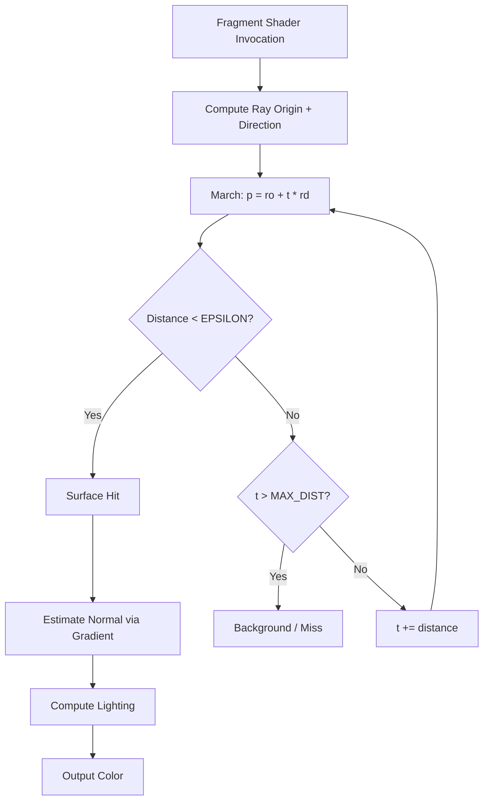

## Why SDFs

Mesh geometry forces you to define every vertex and face up front. SDFs flip that: describe shapes as math, the renderer figures out where surfaces are at runtime.

Smooth CSG. Infinite detail at any zoom. Scenes parameterized by a handful of floats instead of megabytes of vertex data.

> [!note]
> Not a replacement for mesh pipelines. SDFs win at procedural content, prototyping, and effects where analytic surface definitions beat polygon soup.

## What an SDF is

A function that takes a point and returns the shortest distance to the nearest surface. Negative = inside. Positive = outside. Zero = the surface.

That single contract is enough to build a renderer.

```glsl
// Sphere: distance from center minus radius
float sdSphere(vec3 p, float r) {
    return length(p) - r;
}

// Box: per-axis distance folded into a single value
float sdBox(vec3 p, vec3 b) {
    vec3 q = abs(p) - b;
    return length(max(q, 0.0)) + min(max(q.x, max(q.y, q.z)), 0.0);
}

// Torus: ring around the Y axis
float sdTorus(vec3 p, vec2 t) {
    vec2 q = vec2(length(p.xz) - t.x, p.y);
    return length(q) - t.y;
}

// Cylinder: aligned along Y axis
float sdCylinder(vec3 p, float r, float h) {
    vec2 d = abs(vec2(length(p.xz), p.y)) - vec2(r, h);
    return min(max(d.x, d.y), 0.0) + length(max(d, 0.0));
}
```

> [!tip]
> Center primitives at the origin. Position via `p - offset`. Keeps distance functions clean and composable.

## CSG ops

Combine primitives with min/max. No mesh booleans. No topology headaches.

```glsl
// Union: closest surface wins
float opUnion(float d1, float d2) {
    return min(d1, d2);
}

// Subtraction: carve d2 out of d1
float opSubtraction(float d1, float d2) {
    return max(d1, -d2);
}

// Intersection: only where both overlap
float opIntersection(float d1, float d2) {
    return max(d1, d2);
}

// Smooth blend: organic union with controllable radius
float opSmoothUnion(float d1, float d2, float k) {
    float h = clamp(0.5 + 0.5 * (d2 - d1) / k, 0.0, 1.0);
    return mix(d2, d1, h) - k * h * (1.0 - h);
}
```

## Ray march pipeline



## The marcher

Start at the camera. Step along the ray by the distance the SDF reports. Stop when close enough to a surface or too far gone.

```glsl
float sceneSDF(vec3 p) {
    float sphere = sdSphere(p - vec3(0.0, 1.0, 0.0), 1.0);
    float box = sdBox(p - vec3(2.5, 1.0, 0.0), vec3(0.8));
    float torus = sdTorus(p - vec3(-2.5, 1.0, 0.0), vec2(0.8, 0.25));
    float ground = p.y;

    float scene = opUnion(ground, sphere);
    scene = opUnion(scene, box);
    scene = opUnion(scene, torus);
    return scene;
}

const int MAX_STEPS = 128;
const float MAX_DIST = 100.0;
const float EPSILON = 0.001;

float rayMarch(vec3 ro, vec3 rd) {
    float t = 0.0;
    for (int i = 0; i < MAX_STEPS; i++) {
        vec3 p = ro + t * rd;
        float d = sceneSDF(p);
        if (d < EPSILON) return t;
        t += d;
        if (t > MAX_DIST) break;
    }
    return -1.0;
}
```

## Normals + lighting

Surface normals come from the gradient of the distance field. No vertex normals. Smooth normals everywhere, free.

```glsl
vec3 estimateNormal(vec3 p) {
    vec2 e = vec2(0.001, 0.0);
    return normalize(vec3(
        sceneSDF(p + e.xyy) - sceneSDF(p - e.xyy),
        sceneSDF(p + e.yxy) - sceneSDF(p - e.yxy),
        sceneSDF(p + e.yyx) - sceneSDF(p - e.yyx)
    ));
}

vec3 lighting(vec3 p, vec3 rd) {
    vec3 n = estimateNormal(p);
    vec3 lightDir = normalize(vec3(1.0, 2.0, -1.0));

    float diff = max(dot(n, lightDir), 0.0);
    float amb = 0.15;
    vec3 ref = reflect(rd, n);
    float spec = pow(max(dot(ref, lightDir), 0.0), 32.0);

    vec3 col = vec3(0.8, 0.85, 0.9);
    return col * (amb + diff) + vec3(1.0) * spec * 0.3;
}
```

> [!warning]
> Normal estimation calls `sceneSDF` six extra times per hit. For complex scenes, this is your primary per-pixel cost. Keep `sceneSDF` lean.

## Common questions

```chat
user: My shapes look blocky at glancing angles. Why?
assistant: Too few march steps, or EPSILON too large. Bump MAX_STEPS to 128–256. Drop EPSILON to 0.0005. Glancing rays skim slowly and need more steps.

user: How do I animate without rebuilding geometry?
assistant: Change the parameters you pass into your distance functions. The marcher re-evaluates every frame anyway. Animation = uniform updates. No buffers.

user: Can I mix SDFs with regular Three.js meshes?
assistant: Yes. Render the SDF on a fullscreen quad via ShaderMaterial. Write `gl_FragDepth` so it composites with the scene depth buffer. Then render meshes normally. Depth testing handles the rest.
```

## Three.js integration

````steps
### Step 1: Fullscreen quad with ShaderMaterial

```javascript
const material = new THREE.ShaderMaterial({
  uniforms: {
    uResolution: { value: new THREE.Vector2(window.innerWidth, window.innerHeight) },
    uTime: { value: 0.0 },
    uCameraPos: { value: new THREE.Vector3(0, 2, 5) },
    uCameraTarget: { value: new THREE.Vector3(0, 1, 0) }
  },
  vertexShader: vertexSrc,
  fragmentShader: fragmentSrc,
  depthWrite: true
});
const quad = new THREE.Mesh(new THREE.PlaneGeometry(2, 2), material);
scene.add(quad);
```

### Step 2: Vertex shader passes UVs through

```glsl
varying vec2 vUv;
void main() {
    vUv = uv;
    gl_Position = vec4(position.xy, 0.0, 1.0);
}
```

### Step 3: Fragment shader assembles everything
SDFs, CSG ops, ray marcher, normals, lighting. Time and camera as uniforms.

```glsl
uniform vec2 uResolution;
uniform float uTime;
uniform vec3 uCameraPos;
uniform vec3 uCameraTarget;
varying vec2 vUv;

void main() {
    vec2 uv = (gl_FragCoord.xy - 0.5 * uResolution) / uResolution.y;

    vec3 ro = uCameraPos;
    vec3 forward = normalize(uCameraTarget - ro);
    vec3 right = normalize(cross(vec3(0, 1, 0), forward));
    vec3 up = cross(forward, right);
    vec3 rd = normalize(uv.x * right + uv.y * up + 1.5 * forward);

    float t = rayMarch(ro, rd);
    vec3 col = vec3(0.05, 0.05, 0.1);
    if (t > 0.0) {
        vec3 p = ro + t * rd;
        col = lighting(p, rd);
    }
    gl_FragColor = vec4(col, 1.0);
}
```

### Step 4: Animate

```javascript
const clock = new THREE.Clock();
function animate() {
    requestAnimationFrame(animate);
    material.uniforms.uTime.value = clock.getElapsedTime();
    material.uniforms.uCameraPos.value.copy(camera.position);
    renderer.render(scene, camera);
}
animate();
```
````

## Primitive reference

| Primitive | Parameters | Notes |
|---|---|---|
| Sphere | radius | Cheapest |
| Box | half-extents vec3 | Exact, sharp edges |
| Torus | major, minor radius | Ring around Y |
| Cylinder | radius, half-height | Capped, axis-aligned |
| Plane | implicit via `p.y` | Infinite ground |

> [!tip]
> Combine `abs()`, `mod()`, and domain repetition (`p = mod(p, spacing) - 0.5 * spacing`) to instance primitives infinitely across space. Zero memory cost.

## The summary

Geometry as math.

A few distance functions. A handful of CSG ops. A marcher.

Change a float. Get a new shape.

For procedural content and shader-driven effects, hard to beat.

## Generation Metadata

- Assistant: Lumen
- Model: claude-opus-4-6
- Generation date: 2026-03-01

## Prompt Used to Generate This Post

```text
Write a markdown blog post about "Procedural Geometry with Signed Distance Functions". Cover what SDFs are, core primitives (sphere, box, torus, cylinder), CSG operations (union, intersection, subtraction, smooth blend), ray marching algorithm, normals via gradient estimation, lighting, practical GLSL implementation for real-time rendering, and Three.js integration via ShaderMaterial. Include: YAML frontmatter (title, date 2026-03-01, order 9, description, tags), opening motivation section, post plan table, Mermaid pipeline diagram, real GLSL and JavaScript code, 2-4 callout blocks, a chat transcript with 3 Q&A pairs, a 4-step integration guide, and a wrap-up. Tags: [graphics, sdf, ray-marching, glsl, procedural-generation]. End with metadata Assistant=Lumen, Model=claude-opus-4-6 and append the generation prompt.
```
