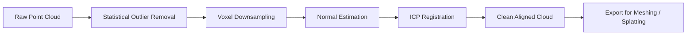

## The plumbing nobody writes about

Every 3D capture pipeline — photogrammetry, LiDAR, gaussian splatting — produces point clouds. Raw clouds are noisy, misaligned, and far too dense for downstream consumption.

If you can't clean and register clouds, nothing downstream works. Meshing fails. Splatting trains on garbage. Real-time viewers choke on millions of redundant points.

The goal: a repeatable pipeline. Raw input → clean, aligned, downsampled output ready for meshing or splatting.

> [!note]
> Open3D throughout. Cleaning pipeline only. Meshing and splatting are separate stages that consume the cleaned output.

## Spatial indexing

Tens of millions of points. Any neighbor-touching operation (outlier removal, normals, downsampling) needs fast spatial queries. Linear scans die immediately.

| Structure | Split strategy | Best for |
|---|---|---|
| KD-Tree | Axis-aligned splits on median | k-NN queries, low dim |
| Octree | Recursive octant subdivision | Uniform spatial queries, LOD |

Open3D builds a KD-Tree internally. Build cost: O(n log n). Query cost: O(log n) amortized.

```python
import open3d as o3d
import numpy as np

pcd = o3d.io.read_point_cloud("scan_raw.ply")
print(f"Raw points: {len(pcd.points)}")

# Build KD-Tree explicitly (Open3D does this internally for most ops)
kd_tree = o3d.geometry.KDTreeFlann(pcd)

# Query: find 20 nearest neighbors of point 0
[k, idx, dist] = kd_tree.search_knn_vector_3d(pcd.points[0], 20)
print(f"Nearest neighbor distances: {np.sqrt(dist[:5])}")
```

> [!tip]
> Non-uniform density (common with photogrammetry)? Radius-based queries beat fixed-k for outlier detection.

## Pipeline



Each stage is independent. Order matters: remove noise *before* downsampling (so outliers don't bias voxel centers), estimate normals *before* registration (point-to-plane ICP needs them).

## Statistical outlier removal

Mean distance from each point to its k nearest neighbors. Points whose mean exceeds a threshold (in stddev from the global mean) are removed.

```python
def remove_outliers(pcd, nb_neighbors=20, std_ratio=2.0):
    """
    Remove statistical outliers from a point cloud.
    nb_neighbors: how many neighbors to consider per point
    std_ratio: standard deviation multiplier for the threshold
    """
    cleaned, mask = pcd.remove_statistical_outlier(
        nb_neighbors=nb_neighbors,
        std_ratio=std_ratio
    )
    removed = pcd.select_by_index(mask, invert=True)
    print(f"Kept {len(cleaned.points)}, removed {len(removed.points)} outliers")
    return cleaned

pcd_clean = remove_outliers(pcd, nb_neighbors=20, std_ratio=2.0)
```

> [!warning]
> Too-low `std_ratio` strips legitimate edge geometry. Start at 2.0. Tighten only if floating noise is obvious. Inspect visually.

## Voxel downsampling

Divide space into a grid. Replace all points in each voxel with their centroid. Uniform density regardless of capture distance.

```python
def downsample(pcd, voxel_size=0.02):
    """
    Downsample point cloud to uniform density.
    voxel_size: side length of each voxel in scene units (meters).
    """
    down = pcd.voxel_down_sample(voxel_size=voxel_size)
    ratio = len(down.points) / len(pcd.points) * 100
    print(f"Downsampled: {len(pcd.points)} -> {len(down.points)} ({ratio:.1f}%)")
    return down

pcd_down = downsample(pcd_clean, voxel_size=0.02)
```

Room-scale photogrammetry: 0.01–0.02m. Outdoor LiDAR: 0.05–0.10m. Tune to the detail you need to preserve.

## Normal estimation

Required for point-to-plane ICP and Poisson meshing. PCA on the covariance matrix of each point's k neighbors.

```python
def estimate_normals(pcd, radius=0.05, max_nn=30):
    """
    Estimate surface normals using local PCA.
    radius: search radius for neighbors
    max_nn: max neighbors to consider
    """
    pcd.estimate_normals(
        search_param=o3d.geometry.KDTreeSearchParamHybrid(
            radius=radius, max_nn=max_nn
        )
    )
    # Orient normals consistently (important for meshing)
    pcd.orient_normals_consistent_tangent_plane(k=15)
    return pcd

pcd_down = estimate_normals(pcd_down, radius=0.05, max_nn=30)
```

## ICP registration

Multiple scans of the same scene → align into a common frame. Point-to-plane converges faster than point-to-point and handles flat surfaces better.

```python
def register_icp(source, target, max_distance=0.05, init_transform=np.eye(4)):
    """
    Align source cloud to target using point-to-plane ICP.
    Both clouds must have normals estimated.
    """
    result = o3d.pipelines.registration.registration_icp(
        source, target,
        max_correspondence_distance=max_distance,
        init=init_transform,
        estimation_method=o3d.pipelines.registration.TransformationEstimationPointToPlane(),
        criteria=o3d.pipelines.registration.ICPConvergenceCriteria(
            max_iteration=200,
            relative_fitness=1e-6,
            relative_rmse=1e-6
        )
    )
    print(f"ICP fitness: {result.fitness:.4f}, RMSE: {result.inlier_rmse:.6f}")
    return result.transformation

# Align scan_b to scan_a
transform = register_icp(pcd_b, pcd_a, max_distance=0.05)
pcd_b.transform(transform)

# Merge aligned clouds
merged = pcd_a + pcd_b
```

> [!tip]
> ICP is a local optimizer. Needs a reasonable initial alignment. Far-apart scans? Coarse-align with FPFH + RANSAC first, then refine with ICP.

```python
def coarse_align_fpfh(source, target, voxel_size=0.05):
    """
    Coarse registration using FPFH features + RANSAC.
    Use this when scans have no initial alignment.
    """
    def compute_fpfh(pcd, voxel_size):
        down = pcd.voxel_down_sample(voxel_size)
        down.estimate_normals(
            o3d.geometry.KDTreeSearchParamHybrid(radius=voxel_size * 2, max_nn=30)
        )
        fpfh = o3d.pipelines.registration.compute_fpfh_feature(
            down,
            o3d.geometry.KDTreeSearchParamHybrid(radius=voxel_size * 5, max_nn=100)
        )
        return down, fpfh

    src_down, src_feat = compute_fpfh(source, voxel_size)
    tgt_down, tgt_feat = compute_fpfh(target, voxel_size)

    result = o3d.pipelines.registration.registration_ransac_based_on_feature_matching(
        src_down, tgt_down, src_feat, tgt_feat,
        mutual_filter=True,
        max_correspondence_distance=voxel_size * 1.5,
        estimation_method=o3d.pipelines.registration.TransformationEstimationPointToPoint(),
        ransac_n=3,
        checkers=[
            o3d.pipelines.registration.CorrespondenceCheckerBasedOnDistance(voxel_size * 1.5)
        ],
        criteria=o3d.pipelines.registration.RANSACConvergenceCriteria(100000, 0.999)
    )
    return result.transformation
```

## Full pipeline

````steps
### Step 1: Load and inspect
Tells you scale (meters vs mm) and whether coordinates are reasonable.

```python
import open3d as o3d
import numpy as np

pcd = o3d.io.read_point_cloud("scan_raw.ply")
print(f"Points: {len(pcd.points)}")
print(f"Bounds: {pcd.get_min_bound()} to {pcd.get_max_bound()}")
o3d.visualization.draw_geometries([pcd])
```

### Step 2: Outliers + downsample

```python
pcd_clean, _ = pcd.remove_statistical_outlier(nb_neighbors=20, std_ratio=2.0)
pcd_down = pcd_clean.voxel_down_sample(voxel_size=0.02)
print(f"After cleaning: {len(pcd_down.points)} points")
```

### Step 3: Normals + register additional scans

```python
pcd_down.estimate_normals(
    search_param=o3d.geometry.KDTreeSearchParamHybrid(radius=0.05, max_nn=30)
)
# If you have a second scan:
coarse_T = coarse_align_fpfh(scan_b, pcd_down, voxel_size=0.05)
fine_T = register_icp(scan_b, pcd_down, max_distance=0.02, init_transform=coarse_T)
scan_b.transform(fine_T)
merged = pcd_down + scan_b
```

### Step 4: Export
PLY. Ready for Poisson meshing, splatting training, or any downstream consumer.

```python
o3d.io.write_point_cloud("scan_clean.ply", merged)
print(f"Exported {len(merged.points)} points to scan_clean.ply")
```
````

## Common questions

```chat
user: ICP converges but the alignment is clearly wrong. Big offset.
assistant: Local optimizer. Far-apart initial poses → local minimum. Run coarse FPFH + RANSAC first to get within a few centimeters. Then refine with ICP. Also verify both clouds are in the same coordinate system and units.

user: Outlier removal eats legitimate edge geometry. How do I keep it?
assistant: Bump `std_ratio` from 2.0 toward 3.0. Edge points naturally have higher mean neighbor distances — neighbors on fewer sides. Or try radius-based outlier removal (fixed radius + minimum point count) instead of stddev.

user: Voxel downsampling makes my cloud blocky. Smoother alternative?
assistant: Voxel replaces all points in a cell with one centroid — sharp features die. For detail-sensitive work: `pcd.random_down_sample` preserves original positions. Or smaller voxels. Tradeoff: less uniform density.
```

## Performance

| Operation | Complexity | Memory | Bottleneck at scale |
|---|---|---|---|
| KD-Tree build | O(n log n) | O(n) | Construction time at >50M points |
| Statistical outlier removal | O(n log n) | O(n) | k-NN queries dominate |
| Voxel downsampling | O(n) | O(n) | Hash map memory |
| Normal estimation | O(n log n) | O(n) | Parallelizes well on CPU |
| ICP per iteration | O(n log n) | O(n) | Correspondence search |
| FPFH features | O(n · k) | O(n · 33) | Histogram computation |

> [!note]
> 50M+ points: chunk spatially (tile, process independently) or use GPU NN libraries (cuML). Open3D's CPU backend handles 10–20M comfortably on a modern workstation.

## The summary

Plumbing. Determines the quality ceiling for everything downstream.

Clean. Downsample. Estimate normals. Register. Export.

Open3D handles all of it with a consistent API.

## Generation Metadata

- Assistant: Lumen
- Model: claude-opus-4-6
- Generation date: 2026-03-01

## Prompt Used to Generate This Post

```text
Write a markdown blog post about Real-Time Point Cloud Processing. Cover working with large point clouds from photogrammetry/LiDAR/gaussian splatting pipelines. Include spatial indexing (octrees, KD-trees), statistical outlier removal, voxel downsampling, ICP registration/alignment, normal estimation. Use Open3D as the primary library. Show a pipeline that takes a raw noisy point cloud and produces a clean, aligned, downsampled result ready for meshing or splatting. Include YAML frontmatter, Post Plan table, Mermaid diagram, callout blocks, chat transcript, steps block, and generation metadata. Tags: point-clouds, open3d, spatial-indexing, 3d-reconstruction, photogrammetry. Assistant: Lumen, Model: claude-opus-4-6.
```
