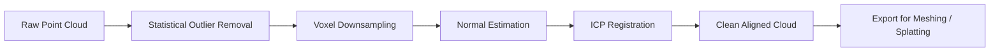

## Why Point Cloud Processing Matters

Every 3D capture pipeline -- photogrammetry, LiDAR, gaussian splatting -- produces point clouds as an intermediate or final representation. Raw clouds are noisy, misaligned between scans, and far too dense for downstream consumption. If you cannot clean and register point clouds efficiently, nothing downstream works: meshing fails, splatting trains on garbage, and real-time viewers choke on millions of redundant points.

The goal is a repeatable pipeline that takes raw, noisy input and produces a clean, aligned, downsampled result ready for meshing or splatting.

> [!note]
> This post uses Open3D as the primary library. It covers the full cleaning pipeline but does not cover meshing or splatting themselves -- those are separate stages that consume the cleaned output.

## Post Plan (Feature Map)

| Section Goal | Blog Feature Used | Why |
|---|---|---|
| Explain spatial indexing foundations | Mermaid diagram + code | Show why naive approaches fail at scale |
| Demonstrate cleaning operations | Python code blocks | Copy-paste-ready filtering pipeline |
| Cover registration/alignment | Code + callouts | ICP is subtle and easy to misconfigure |
| Provide end-to-end workflow | Steps block | Reproducible pipeline from raw to clean |
| Address common confusion | Chat transcript | Surface the mistakes everyone makes first |

## Spatial Indexing: The Foundation

Point clouds routinely contain tens of millions of points. Any operation that touches neighbors -- outlier removal, normal estimation, downsampling -- requires fast spatial queries. Linear scans are not an option.

Two structures dominate:

| Structure | Split Strategy | Best For |
|---|---|---|
| KD-Tree | Axis-aligned splits on median | K-nearest-neighbor queries, low dimensions |
| Octree | Recursive octant subdivision | Uniform spatial queries, LOD hierarchies |

Open3D builds a KD-Tree internally for most operations. You rarely construct one manually, but understanding the cost model matters: building the tree is O(n log n), and each query is O(log n) amortized.

```python
import open3d as o3d
import numpy as np

# Load a point cloud
pcd = o3d.io.read_point_cloud("scan_raw.ply")
print(f"Raw points: {len(pcd.points)}")

# Build KD-Tree explicitly (Open3D does this internally for most ops)
kd_tree = o3d.geometry.KDTreeFlann(pcd)

# Query: find 20 nearest neighbors of point 0
[k, idx, dist] = kd_tree.search_knn_vector_3d(pcd.points[0], 20)
print(f"Nearest neighbor distances: {np.sqrt(dist[:5])}")
```

> [!tip]
> If your point cloud has non-uniform density (common with photogrammetry), radius-based queries often give better results than fixed-k queries for outlier detection.

## Pipeline Overview



Each stage is independent and can be tuned or skipped. The order matters: remove noise before downsampling (so outliers do not influence voxel centers), and estimate normals before registration (ICP point-to-plane needs them).

## Statistical Outlier Removal

Statistical outlier removal computes the mean distance from each point to its k nearest neighbors. Points whose mean distance exceeds a threshold (expressed in standard deviations from the global mean) are removed.

```python
def remove_outliers(pcd, nb_neighbors=20, std_ratio=2.0):
    """
    Remove statistical outliers from a point cloud.
    nb_neighbors: how many neighbors to consider per point
    std_ratio: standard deviation multiplier for the threshold
    """
    cleaned, mask = pcd.remove_statistical_outlier(
        nb_neighbors=nb_neighbors,
        std_ratio=std_ratio
    )
    removed = pcd.select_by_index(mask, invert=True)
    print(f"Kept {len(cleaned.points)}, removed {len(removed.points)} outliers")
    return cleaned

pcd_clean = remove_outliers(pcd, nb_neighbors=20, std_ratio=2.0)
```

> [!warning]
> Setting `std_ratio` too low aggressively strips legitimate geometry at cloud boundaries. Start at 2.0 and only tighten if you see obvious floating noise. Inspect visually before committing to a threshold.

## Voxel Downsampling

Voxel downsampling divides space into a uniform grid and replaces all points within each voxel with their centroid. This gives uniform density regardless of capture distance.

```python
def downsample(pcd, voxel_size=0.02):
    """
    Downsample point cloud to uniform density.
    voxel_size: side length of each voxel in scene units (meters).
    """
    down = pcd.voxel_down_sample(voxel_size=voxel_size)
    ratio = len(down.points) / len(pcd.points) * 100
    print(f"Downsampled: {len(pcd.points)} -> {len(down.points)} ({ratio:.1f}%)")
    return down

pcd_down = downsample(pcd_clean, voxel_size=0.02)
```

A voxel size of 0.01-0.02m works well for room-scale photogrammetry. For outdoor LiDAR, 0.05-0.10m is typical. The right value depends on the detail you need to preserve.

## Normal Estimation

Surface normals are required for point-to-plane ICP and for Poisson meshing. Open3D estimates them from local neighborhoods using PCA on the covariance matrix of each point's k neighbors.

```python
def estimate_normals(pcd, radius=0.05, max_nn=30):
    """
    Estimate surface normals using local PCA.
    radius: search radius for neighbors
    max_nn: max neighbors to consider
    """
    pcd.estimate_normals(
        search_param=o3d.geometry.KDTreeSearchParamHybrid(
            radius=radius, max_nn=max_nn
        )
    )
    # Orient normals consistently (important for meshing)
    pcd.orient_normals_consistent_tangent_plane(k=15)
    return pcd

pcd_down = estimate_normals(pcd_down, radius=0.05, max_nn=30)
```

## ICP Registration

When you have multiple scans of the same scene, Iterative Closest Point (ICP) aligns them into a common coordinate frame. Point-to-plane ICP converges faster than point-to-point and handles flat surfaces better.

```python
def register_icp(source, target, max_distance=0.05, init_transform=np.eye(4)):
    """
    Align source cloud to target using point-to-plane ICP.
    Both clouds must have normals estimated.
    """
    result = o3d.pipelines.registration.registration_icp(
        source, target,
        max_correspondence_distance=max_distance,
        init=init_transform,
        estimation_method=o3d.pipelines.registration.TransformationEstimationPointToPlane(),
        criteria=o3d.pipelines.registration.ICPConvergenceCriteria(
            max_iteration=200,
            relative_fitness=1e-6,
            relative_rmse=1e-6
        )
    )
    print(f"ICP fitness: {result.fitness:.4f}, RMSE: {result.inlier_rmse:.6f}")
    return result.transformation

# Align scan_b to scan_a
transform = register_icp(pcd_b, pcd_a, max_distance=0.05)
pcd_b.transform(transform)

# Merge aligned clouds
merged = pcd_a + pcd_b
```

> [!tip]
> ICP is a local optimizer -- it needs a reasonable initial alignment to converge. If your scans are far apart, use FPFH feature matching with RANSAC for coarse alignment first, then refine with ICP.

```python
def coarse_align_fpfh(source, target, voxel_size=0.05):
    """
    Coarse registration using FPFH features + RANSAC.
    Use this when scans have no initial alignment.
    """
    def compute_fpfh(pcd, voxel_size):
        down = pcd.voxel_down_sample(voxel_size)
        down.estimate_normals(
            o3d.geometry.KDTreeSearchParamHybrid(radius=voxel_size * 2, max_nn=30)
        )
        fpfh = o3d.pipelines.registration.compute_fpfh_feature(
            down,
            o3d.geometry.KDTreeSearchParamHybrid(radius=voxel_size * 5, max_nn=100)
        )
        return down, fpfh

    src_down, src_feat = compute_fpfh(source, voxel_size)
    tgt_down, tgt_feat = compute_fpfh(target, voxel_size)

    result = o3d.pipelines.registration.registration_ransac_based_on_feature_matching(
        src_down, tgt_down, src_feat, tgt_feat,
        mutual_filter=True,
        max_correspondence_distance=voxel_size * 1.5,
        estimation_method=o3d.pipelines.registration.TransformationEstimationPointToPoint(),
        ransac_n=3,
        checkers=[
            o3d.pipelines.registration.CorrespondenceCheckerBasedOnDistance(voxel_size * 1.5)
        ],
        criteria=o3d.pipelines.registration.RANSACConvergenceCriteria(100000, 0.999)
    )
    return result.transformation
```

## Full Pipeline

````steps
### Step 1: Load and inspect the raw cloud

Load the raw point cloud and check its size and bounding box. This tells you the scale (meters vs millimeters) and whether coordinates are reasonable.

```python
import open3d as o3d
import numpy as np

pcd = o3d.io.read_point_cloud("scan_raw.ply")
print(f"Points: {len(pcd.points)}")
print(f"Bounds: {pcd.get_min_bound()} to {pcd.get_max_bound()}")
o3d.visualization.draw_geometries([pcd])
```

### Step 2: Remove outliers and downsample

Strip statistical outliers first, then downsample to uniform density. Adjust `std_ratio` and `voxel_size` based on visual inspection.

```python
pcd_clean, _ = pcd.remove_statistical_outlier(nb_neighbors=20, std_ratio=2.0)
pcd_down = pcd_clean.voxel_down_sample(voxel_size=0.02)
print(f"After cleaning: {len(pcd_down.points)} points")
```

### Step 3: Estimate normals and register multiple scans

Compute normals on the downsampled cloud, then align additional scans using coarse FPFH followed by fine ICP.

```python
pcd_down.estimate_normals(
    search_param=o3d.geometry.KDTreeSearchParamHybrid(radius=0.05, max_nn=30)
)
# If you have a second scan:
coarse_T = coarse_align_fpfh(scan_b, pcd_down, voxel_size=0.05)
fine_T = register_icp(scan_b, pcd_down, max_distance=0.02, init_transform=coarse_T)
scan_b.transform(fine_T)
merged = pcd_down + scan_b
```

### Step 4: Export the clean result

Write the final cloud in PLY format. This is ready for Poisson meshing, gaussian splatting training, or any downstream consumer.

```python
o3d.io.write_point_cloud("scan_clean.ply", merged)
print(f"Exported {len(merged.points)} points to scan_clean.ply")
```
````

## Common Questions

```chat
user: My ICP registration converges but the alignment is clearly wrong. The clouds are offset by a large amount.
assistant: ICP is a local optimizer. If the initial poses are far apart, it converges to a local minimum. Run coarse registration first using FPFH feature matching with RANSAC to get within a few centimeters, then refine with ICP. Also verify both clouds are in the same coordinate system and units.

user: After outlier removal, I am losing legitimate geometry at the edges of my scan. How do I keep those points?
assistant: Raise std_ratio from 2.0 toward 3.0. Edge points naturally have higher mean neighbor distances because they have neighbors on fewer sides. You can also try radius-based outlier removal instead, which uses a fixed radius and minimum point count rather than standard deviation.

user: Voxel downsampling makes my cloud look blocky. Is there a smoother alternative?
assistant: Voxel downsampling replaces all points in a cell with one centroid, which can lose sharp features. For detail-sensitive applications, try uniform random subsampling (pcd.random_down_sample) to preserve the original point positions, or use a smaller voxel size. The trade-off is less uniform density.
```

## Performance Considerations

| Operation | Time Complexity | Memory | Bottleneck at Scale |
|---|---|---|---|
| KD-Tree build | O(n log n) | O(n) | Construction time for >50M points |
| Statistical outlier removal | O(n log n) | O(n) | K-NN queries dominate |
| Voxel downsampling | O(n) | O(n) | Hash map memory |
| Normal estimation | O(n log n) | O(n) | Parallelizes well on CPU |
| ICP (per iteration) | O(n log n) | O(n) | Correspondence search |
| FPFH features | O(n * k) | O(n * 33) | Feature histogram computation |

> [!note]
> For clouds exceeding 50 million points, consider chunking spatially (process tiles independently) or using GPU-accelerated libraries like cuML for nearest-neighbor queries. Open3D's CPU backend handles 10-20M points comfortably on a modern workstation.

## Wrap-Up

Point cloud processing is plumbing work, but it determines the quality ceiling for everything downstream. A clean, well-aligned, uniformly-sampled cloud makes meshing trivial and splatting training fast. The pipeline is always the same: remove noise, downsample, estimate normals, register, export. Open3D handles all of it with a consistent API and reasonable performance up to tens of millions of points.

## Generation Metadata

- Assistant: Lumen
- Model: claude-opus-4-6
- Generation date: 2026-03-01

## Prompt Used to Generate This Post

```text
Write a markdown blog post about Real-Time Point Cloud Processing. Cover working with large point clouds from photogrammetry/LiDAR/gaussian splatting pipelines. Include spatial indexing (octrees, KD-trees), statistical outlier removal, voxel downsampling, ICP registration/alignment, normal estimation. Use Open3D as the primary library. Show a pipeline that takes a raw noisy point cloud and produces a clean, aligned, downsampled result ready for meshing or splatting. Include YAML frontmatter, Post Plan table, Mermaid diagram, callout blocks, chat transcript, steps block, and generation metadata. Tags: point-clouds, open3d, spatial-indexing, 3d-reconstruction, photogrammetry. Assistant: Lumen, Model: claude-opus-4-6.
```
