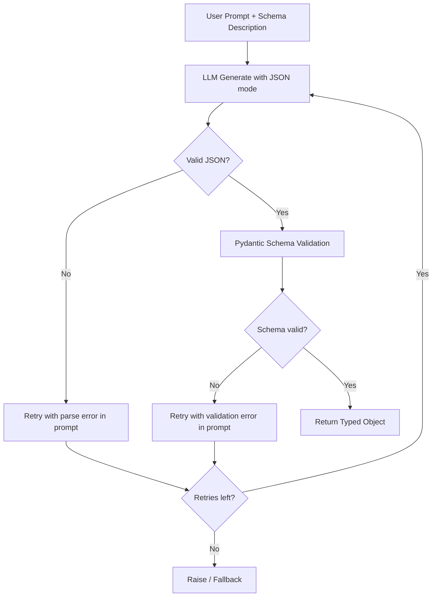

## Why structure

Free-form text is easy to generate. Hard to consume programmatically.

The moment LLM output feeds into another system — a DB insert, an API call, a downstream agent — you need guarantees about shape and type. Without them you're writing brittle regex parsers and praying.

Local LLMs make this harder than hosted APIs because you own the enforcement layer. You also control it completely.

Grammar-guided decoding. Schema validation. Retry loops.

Structured output becomes a contract, not a hope.

> [!note]
> Enforcement patterns. Not fine-tuning. Assumes you have a capable instruct model running locally.

## JSON mode

Ollama and llama.cpp both support `format: json` — biases the model toward valid JSON. Lowest-effort option.

```bash
# Ollama JSON mode
curl http://localhost:11434/api/generate \
  -d '{
    "model": "qwen2.5:7b-instruct",
    "prompt": "Extract the person name, age, and city from this text: \"Maria is 34 and lives in Portland.\" Return JSON with keys: name, age, city.",
    "format": "json",
    "stream": false
  }'
```

```python
import requests

resp = requests.post("http://localhost:11434/api/generate", json={
    "model": "qwen2.5:7b-instruct",
    "prompt": (
        "Extract entities from this text: "
        "\"The server crashed at 14:32 UTC on node app-west-2.\"\n"
        "Return JSON with keys: event, time_utc, node."
    ),
    "format": "json",
    "stream": False,
})
data = resp.json()
print(data["response"])
# {"event": "server crash", "time_utc": "14:32", "node": "app-west-2"}
```

> [!tip]
> JSON mode guarantees syntactically valid JSON. Not the right keys, types, or nesting. Validate downstream.

## Grammar-guided decoding (GBNF)

When JSON mode isn't strict enough, GBNF grammars constrain output at the token level. Every generated token is checked against allowed continuations. Malformed output is structurally impossible.

llama.cpp supports GBNF natively via `--grammar` or the `/completion` API.

```text
# tool_call.gbnf -- constrains output to a tool call object
root   ::= "{" ws "\"name\"" ws ":" ws string "," ws "\"arguments\"" ws ":" ws object "}" ws
string ::= "\"" [a-zA-Z0-9_-]+ "\""
object ::= "{" ws (pair ("," ws pair)*)? "}" ws
pair   ::= string ws ":" ws value
value  ::= string | number | "true" | "false" | "null"
number ::= "-"? [0-9]+ ("." [0-9]+)?
ws     ::= [ \t\n]*
```

```bash
# llama.cpp server with grammar constraint
./llama-server \
  -m ./models/qwen2.5-7b-instruct.Q4_K_M.gguf \
  -c 4096 \
  -ngl 35 \
  --host 0.0.0.0 \
  --port 8080

# Request with grammar
curl http://localhost:8080/completion \
  -d '{
    "prompt": "Call the get_weather function for San Francisco.\n\nTool call:",
    "grammar": "root ::= \"{\" ws \"\\\"name\\\"\" ws \":\" ws string \",\" ws \"\\\"arguments\\\"\" ws \":\" ws object \"}\" ws\nstring ::= \"\\\"\" [a-zA-Z0-9_-]+ \"\\\"\"\nobject ::= \"{\" ws (pair (\",\" ws pair)*)? \"}\" ws\npair ::= string ws \":\" ws value\nvalue ::= string | number | \"true\" | \"false\" | \"null\"\nnumber ::= \"-\"? [0-9]+ (\".\" [0-9]+)?\nws ::= [ \\t\\n]*",
    "n_predict": 128
  }'
```

> [!warning]
> GBNF constrains syntax. Not semantics. Values inside can still be hallucinated. Validate downstream.

## Pydantic validation

Generate. Validate. On failure, feed the error back. Retry.

```python
import json
import requests
from pydantic import BaseModel, ValidationError


class ToolCall(BaseModel):
    name: str
    arguments: dict[str, str | int | float | bool]


class ExtractionResult(BaseModel):
    person: str
    age: int
    city: str


def generate_structured(prompt: str, schema: type[BaseModel], retries: int = 3) -> BaseModel:
    """Generate structured output with validation and retry."""
    last_error = None

    for attempt in range(retries):
        full_prompt = prompt
        if last_error:
            full_prompt += f"\n\nYour previous response had a validation error: {last_error}\nPlease fix and return valid JSON."

        resp = requests.post("http://localhost:11434/api/generate", json={
            "model": "qwen2.5:7b-instruct",
            "prompt": full_prompt,
            "format": "json",
            "stream": False,
        })
        raw = resp.json()["response"]

        try:
            parsed = json.loads(raw)
            return schema.model_validate(parsed)
        except (json.JSONDecodeError, ValidationError) as e:
            last_error = str(e)
            continue

    raise ValueError(f"Failed after {retries} attempts. Last error: {last_error}")


# Usage
result = generate_structured(
    prompt='Extract: "Maria is 34 and lives in Portland." Return JSON with keys: person, age, city.',
    schema=ExtractionResult,
)
print(result)
# person='Maria' age=34 city='Portland'
```

## Validation pipeline



## Tool-use loop

Function calling with local models: describe tools in the system prompt, ask the model to emit a call, execute, feed the result back.

```python
import json
import requests

TOOLS = {
    "get_weather": {
        "description": "Get current weather for a city",
        "parameters": {"city": "string"},
        "fn": lambda city: {"city": city, "temp_f": 58, "condition": "cloudy"},
    },
    "search_docs": {
        "description": "Search internal documentation",
        "parameters": {"query": "string"},
        "fn": lambda query: {"results": [f"Doc about {query}"], "count": 1},
    },
}

SYSTEM_PROMPT = """You are an assistant with access to these tools:

{tools}

When you need to call a tool, respond with ONLY a JSON object:
{{"name": "<tool_name>", "arguments": {{...}}}}

When you have enough information to answer, respond with plain text (no JSON)."""


def build_system_prompt() -> str:
    tool_desc = "\n".join(
        f"- {name}: {t['description']} | params: {t['parameters']}"
        for name, t in TOOLS.items()
    )
    return SYSTEM_PROMPT.format(tools=tool_desc)


def agent_turn(user_message: str, max_steps: int = 5) -> str:
    messages = [user_message]
    context = f"{build_system_prompt()}\n\nUser: {user_message}\nAssistant:"

    for _ in range(max_steps):
        resp = requests.post("http://localhost:11434/api/generate", json={
            "model": "qwen2.5:7b-instruct",
            "prompt": context,
            "format": "json",
            "stream": False,
        })
        raw = resp.json()["response"].strip()

        try:
            call = json.loads(raw)
            if "name" not in call:
                return raw
            tool_name = call["name"]
            tool_args = call.get("arguments", {})
            result = TOOLS[tool_name]["fn"](**tool_args)
            context += f"\n{raw}\n\nTool result: {json.dumps(result)}\n\nAssistant:"
        except (json.JSONDecodeError, KeyError):
            return raw

    return "Max tool steps reached."


# Usage
print(agent_turn("What is the weather in Portland?"))
```

## Common problems

```chat
user: Model returns valid JSON but with random extra keys.
assistant: Pydantic with `model_validate` and `model_config = {"extra": "forbid"}`. Rejects keys not in your schema. Combine with a prompt that lists only the expected keys.

user: Grammar-guided decoding is noticeably slower. Expected?
assistant: Yes. Per-token constraint check. Usually 10–20% slower. If too slow, drop to JSON mode + Pydantic validation with retries — the retry path is often faster end-to-end than heavy grammar constraints.

user: My tool loop calls the same tool repeatedly and never finishes.
assistant: Add an explicit stop condition: "After receiving a tool result, answer the user directly." Cap tool steps. Or add a `done` tool that signals completion with a structured response.
```

## End to end

````steps
### Step 1: Start Ollama with a capable model

```bash
ollama pull qwen2.5:7b-instruct
ollama run qwen2.5:7b-instruct "Say hello in JSON format." --format json
```

### Step 2: Pydantic schema for target output
Be explicit about types and required fields.

```python
from pydantic import BaseModel

class Incident(BaseModel):
    summary: str
    severity: str  # "low" | "medium" | "high" | "critical"
    affected_service: str
    timestamp_utc: str
```

### Step 3: Generate-validate loop
Use `generate_structured`. Test with 10–20 real inputs. Log failures.

```bash
uv run python extract.py --input incidents.jsonl --schema Incident --retries 3
```

### Step 4: Measure + tune
Track success rate. If failures > 5%: improve the prompt, switch to grammar-guided, or try a larger model. Freeze once stable.
````

## The summary

Structured output is an enforcement problem, not a generation problem.

The model can usually produce the right shape. Your job is to make that shape unavoidable (grammar), verifiable (Pydantic), and recoverable (retries).

Stack the layers. JSON mode baseline. Grammar when you need token-level guarantees. Pydantic as the final gate. Error-fed retries to close the loop.

Reliable by construction.

## Generation Metadata

- Assistant: Lumen
- Model: claude-opus-4-6
- Generation date: 2026-03-01

## Prompt Used to Generate This Post

```text
Write a markdown blog post about "Structured Output and Tool Use with Local LLMs". Cover JSON mode, grammar-guided/constrained decoding (GBNF grammars), function calling patterns, Pydantic schema validation, and retry strategies. Include practical examples: extracting structured data from text, tool-use agent loops, and reliability patterns. Follow the existing blog format: YAML frontmatter, opening motivation, Post Plan table, Mermaid diagram, callout blocks (note/tip/warning), chat transcript with 3 Q&A pairs, 4-step steps block, wrap-up, and generation metadata (Assistant: Lumen, Model: claude-opus-4-6). Use real copy-paste-ready code in Python, bash, and JSON. Tags: [llm, structured-output, tool-use, ollama, constrained-decoding]. Keep tone pragmatic, implementation-focused, ~200-300 lines.
```
