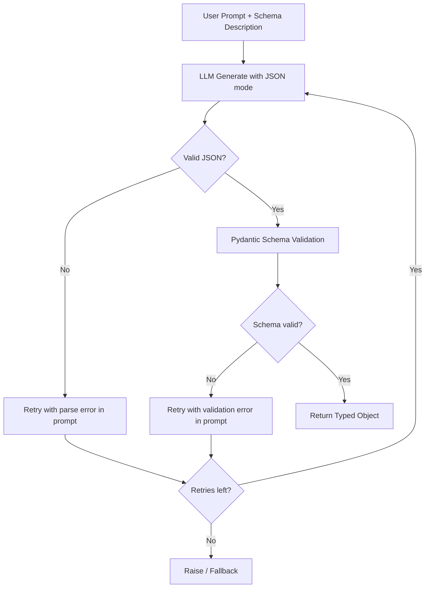

## Why Structured Output Matters

Free-form text is easy to generate but hard to consume programmatically. The moment your LLM output feeds into another system -- a database insert, an API call, a downstream agent step -- you need guarantees about shape and type. Without them you are writing brittle regex parsers and praying.

Local LLMs make this harder than hosted APIs because you own the enforcement layer. The upside: you also control it completely. Grammar-guided decoding, schema validation, and retry loops let you build pipelines where structured output is a contract, not a hope.

> [!note]
> This post focuses on practical enforcement patterns, not model fine-tuning. We assume you have a capable instruct model already running locally.

## Post Plan (Feature Map)

| Section Goal | Blog Feature Used | Why |
|---|---|---|
| Explain structured output landscape | Prose + callouts | Set context before implementation |
| Show JSON mode and grammar decoding | Code blocks (bash, Python, JSON) | Copy-paste-ready patterns |
| Visualize the validation pipeline | Mermaid flowchart | Make the retry/fallback logic explicit |
| Tool-use agent loop | Python code + diagram | Show function calling end-to-end |
| Troubleshoot common failures | Chat transcript | Address real confusion points |
| Hands-on reproduction | Steps block | Give a reproducible setup path |

## JSON Mode: The Simplest Starting Point

Ollama and llama.cpp both support a `format: json` flag that biases the model toward producing valid JSON. This is the lowest-effort option.

```bash
# Ollama JSON mode
curl http://localhost:11434/api/generate \
  -d '{
    "model": "qwen2.5:7b-instruct",
    "prompt": "Extract the person name, age, and city from this text: \"Maria is 34 and lives in Portland.\" Return JSON with keys: name, age, city.",
    "format": "json",
    "stream": false
  }'
```

```python
import requests

resp = requests.post("http://localhost:11434/api/generate", json={
    "model": "qwen2.5:7b-instruct",
    "prompt": (
        "Extract entities from this text: "
        "\"The server crashed at 14:32 UTC on node app-west-2.\"\n"
        "Return JSON with keys: event, time_utc, node."
    ),
    "format": "json",
    "stream": False,
})
data = resp.json()
print(data["response"])
# {"event": "server crash", "time_utc": "14:32", "node": "app-west-2"}
```

> [!tip]
> JSON mode only guarantees syntactically valid JSON. It does not guarantee the correct keys, types, or nesting. You still need schema validation downstream.

## Grammar-Guided Decoding (GBNF)

When JSON mode is not strict enough, constrained decoding with GBNF grammars forces the model to produce output matching an exact grammar at the token level. Every generated token is checked against allowed continuations -- malformed output is structurally impossible.

llama.cpp supports GBNF grammars natively via the `--grammar` flag or the `/completion` API.

```text
# tool_call.gbnf -- constrains output to a tool call object
root   ::= "{" ws "\"name\"" ws ":" ws string "," ws "\"arguments\"" ws ":" ws object "}" ws
string ::= "\"" [a-zA-Z0-9_-]+ "\""
object ::= "{" ws (pair ("," ws pair)*)? "}" ws
pair   ::= string ws ":" ws value
value  ::= string | number | "true" | "false" | "null"
number ::= "-"? [0-9]+ ("." [0-9]+)?
ws     ::= [ \t\n]*
```

```bash
# llama.cpp server with grammar constraint
./llama-server \
  -m ./models/qwen2.5-7b-instruct.Q4_K_M.gguf \
  -c 4096 \
  -ngl 35 \
  --host 0.0.0.0 \
  --port 8080

# Request with grammar
curl http://localhost:8080/completion \
  -d '{
    "prompt": "Call the get_weather function for San Francisco.\n\nTool call:",
    "grammar": "root ::= \"{\" ws \"\\\"name\\\"\" ws \":\" ws string \",\" ws \"\\\"arguments\\\"\" ws \":\" ws object \"}\" ws\nstring ::= \"\\\"\" [a-zA-Z0-9_-]+ \"\\\"\"\nobject ::= \"{\" ws (pair (\",\" ws pair)*)? \"}\" ws\npair ::= string ws \":\" ws value\nvalue ::= string | number | \"true\" | \"false\" | \"null\"\nnumber ::= \"-\"? [0-9]+ (\".\" [0-9]+)?\nws ::= [ \\t\\n]*",
    "n_predict": 128
  }'
```

> [!warning]
> GBNF grammars constrain syntax, not semantics. The model will produce valid JSON matching the grammar, but the values inside can still be hallucinated or wrong. Always validate values downstream.

## Pydantic Schema Validation

The practical pattern: let the model generate, then validate with Pydantic. On failure, feed the error back and retry.

```python
import json
import requests
from pydantic import BaseModel, ValidationError


class ToolCall(BaseModel):
    name: str
    arguments: dict[str, str | int | float | bool]


class ExtractionResult(BaseModel):
    person: str
    age: int
    city: str


def generate_structured(prompt: str, schema: type[BaseModel], retries: int = 3) -> BaseModel:
    """Generate structured output with validation and retry."""
    last_error = None

    for attempt in range(retries):
        full_prompt = prompt
        if last_error:
            full_prompt += f"\n\nYour previous response had a validation error: {last_error}\nPlease fix and return valid JSON."

        resp = requests.post("http://localhost:11434/api/generate", json={
            "model": "qwen2.5:7b-instruct",
            "prompt": full_prompt,
            "format": "json",
            "stream": False,
        })
        raw = resp.json()["response"]

        try:
            parsed = json.loads(raw)
            return schema.model_validate(parsed)
        except (json.JSONDecodeError, ValidationError) as e:
            last_error = str(e)
            continue

    raise ValueError(f"Failed after {retries} attempts. Last error: {last_error}")


# Usage
result = generate_structured(
    prompt='Extract: "Maria is 34 and lives in Portland." Return JSON with keys: person, age, city.',
    schema=ExtractionResult,
)
print(result)
# person='Maria' age=34 city='Portland'
```

## Validation Pipeline



## Tool-Use Agent Loop

Function calling with local models follows a straightforward loop: describe available tools in the system prompt, ask the model to emit a tool call, execute it, and feed the result back.

```python
import json
import requests

TOOLS = {
    "get_weather": {
        "description": "Get current weather for a city",
        "parameters": {"city": "string"},
        "fn": lambda city: {"city": city, "temp_f": 58, "condition": "cloudy"},
    },
    "search_docs": {
        "description": "Search internal documentation",
        "parameters": {"query": "string"},
        "fn": lambda query: {"results": [f"Doc about {query}"], "count": 1},
    },
}

SYSTEM_PROMPT = """You are an assistant with access to these tools:

{tools}

When you need to call a tool, respond with ONLY a JSON object:
{{"name": "<tool_name>", "arguments": {{...}}}}

When you have enough information to answer, respond with plain text (no JSON)."""


def build_system_prompt() -> str:
    tool_desc = "\n".join(
        f"- {name}: {t['description']} | params: {t['parameters']}"
        for name, t in TOOLS.items()
    )
    return SYSTEM_PROMPT.format(tools=tool_desc)


def agent_turn(user_message: str, max_steps: int = 5) -> str:
    messages = [user_message]
    context = f"{build_system_prompt()}\n\nUser: {user_message}\nAssistant:"

    for _ in range(max_steps):
        resp = requests.post("http://localhost:11434/api/generate", json={
            "model": "qwen2.5:7b-instruct",
            "prompt": context,
            "format": "json",
            "stream": False,
        })
        raw = resp.json()["response"].strip()

        try:
            call = json.loads(raw)
            if "name" not in call:
                return raw
            tool_name = call["name"]
            tool_args = call.get("arguments", {})
            result = TOOLS[tool_name]["fn"](**tool_args)
            context += f"\n{raw}\n\nTool result: {json.dumps(result)}\n\nAssistant:"
        except (json.JSONDecodeError, KeyError):
            return raw

    return "Max tool steps reached."


# Usage
print(agent_turn("What is the weather in Portland?"))
```

## Conversation: Common Structured Output Problems

```chat
user: The model returns valid JSON but with random extra keys I did not ask for. How do I handle that?
assistant: Use Pydantic with model_validate and set model_config with extra="forbid". This rejects any keys not in your schema. Combine with a clear prompt that lists only the expected keys.

user: Grammar-guided decoding makes generation noticeably slower. Is that expected?
assistant: Yes. GBNF grammar checking adds overhead at each token. For most schemas the cost is small (10-20% slower). If it is too slow, try JSON mode without grammar and rely on Pydantic validation with retries instead -- the retry path is usually faster end-to-end than heavy grammar constraints.

user: My tool-use loop keeps calling the same tool repeatedly and never produces a final answer.
assistant: Add an explicit stop condition in your system prompt like "After receiving a tool result, answer the user directly." Also cap tool steps and consider including a done/answer tool that signals completion with a structured response.
```

## Hands-On: End-to-End Structured Extraction

````steps
### Step 1: Start Ollama with a capable model
Pull an instruct model and verify it responds. Qwen 2.5 7B or Llama 3.1 8B work well.

```bash
ollama pull qwen2.5:7b-instruct
ollama run qwen2.5:7b-instruct "Say hello in JSON format." --format json
```

### Step 2: Write a Pydantic schema for your target output
Define the exact shape you need. Be explicit about types and required fields.

```python
from pydantic import BaseModel

class Incident(BaseModel):
    summary: str
    severity: str  # "low" | "medium" | "high" | "critical"
    affected_service: str
    timestamp_utc: str
```

### Step 3: Build the generate-validate loop
Use the `generate_structured` function from above. Test with 10-20 real inputs and log validation failures.

```bash
uv run python extract.py --input incidents.jsonl --schema Incident --retries 3
```

### Step 4: Measure reliability and tune
Track success rate across your test set. If validation failures exceed 5%, improve the prompt, switch to grammar-guided decoding, or try a larger model. Freeze once stable.
````

## Wrap-Up

Structured output from local LLMs is an enforcement problem, not a generation problem. The model is usually capable of producing the right shape -- your job is to make that shape unavoidable (grammars), verifiable (Pydantic), and recoverable (retries). Stack these layers: JSON mode as the baseline, grammar constraints when you need token-level guarantees, Pydantic validation as the final gate, and error-fed retries to close the loop. The result is a pipeline where structured output is reliable by construction.

## Generation Metadata

- Assistant: Lumen
- Model: claude-opus-4-6
- Generation date: 2026-03-01

## Prompt Used to Generate This Post

```text
Write a markdown blog post about "Structured Output and Tool Use with Local LLMs". Cover JSON mode, grammar-guided/constrained decoding (GBNF grammars), function calling patterns, Pydantic schema validation, and retry strategies. Include practical examples: extracting structured data from text, tool-use agent loops, and reliability patterns. Follow the existing blog format: YAML frontmatter, opening motivation, Post Plan table, Mermaid diagram, callout blocks (note/tip/warning), chat transcript with 3 Q&A pairs, 4-step steps block, wrap-up, and generation metadata (Assistant: Lumen, Model: claude-opus-4-6). Use real copy-paste-ready code in Python, bash, and JSON. Tags: [llm, structured-output, tool-use, ollama, constrained-decoding]. Keep tone pragmatic, implementation-focused, ~200-300 lines.
```
