```mermaid
flowchart LR
    A["JavaScript: Create Buffers"] --> B["Create Bind Group Layout"]
    B --> C["Create Compute Pipeline"]
    C --> D["Create Command Encoder"]
    D --> E["Set Pipeline + Bind Group"]
    E --> F["dispatch Workgroups(x, y, z)"]
    F --> G["Submit to Queue"]
    G --> H["Copy Results to Staging Buffer"]
    H --> I["Map + Read Results in JS"]
```

## What WebGL never gave us

WebGL gave us pixel and vertex shaders. No general-purpose compute. To run a parallel reduction or sort an array without rendering a quad, you were hacking around the graphics pipeline.

WebGPU fixes it. First-class compute. Dispatch work, read results, never touch a framebuffer.

Real applications need parallel compute, not just triangles. Physics, ML inference, audio, particles. WebGPU compute pipelines give you that with explicit buffer management, workgroup control, and a clean shader language (WGSL) designed for the job.

> [!note]
> Chrome 113+ and Firefox Nightly. Check `navigator.gpu` before relying on it.

## Pipeline architecture

Fewer moving parts than render. No vertex stage. No rasterizer. No fragment output. Compute shader, bind buffers, dispatch.



## WGSL basics

Compute entry point: `@compute` + `@workgroup_size`. `global_invocation_id` tells each thread which element it owns.

```wgsl
@group(0) @binding(0) var<storage, read>       input:  array<f32>;
@group(0) @binding(1) var<storage, read_write> output: array<f32>;

@compute @workgroup_size(64)
fn main(@builtin(global_invocation_id) gid: vec3u) {
    let i = gid.x;
    if (i >= arrayLength(&input)) {
        return;
    }
    output[i] = input[i] * input[i];
}
```

Squares every element. One thread per index. The guard prevents OOB writes when array length isn't a clean multiple of workgroup size.

> [!tip]
> Always guard against OOB. `dispatchWorkgroups` rounds up. Trailing threads in the last workgroup may exceed your data length.

## Workgroup sizing

Workgroup size = threads that execute together and share local memory. Total threads = `workgroup_size × num_workgroups`.

| Size | Best for | Notes |
|---|---|---|
| 64 | General-purpose, simple kernels | Safe default. Good occupancy on most GPUs. |
| 128 | Medium-complexity kernels | Better latency hiding on desktop |
| 256 | Reduction / scan patterns | Maximizes shared memory utility |
| 1 | Debugging only | Serializes execution. Never ship. |

```javascript
const workgroupSize = 64;
const numWorkgroups = Math.ceil(dataLength / workgroupSize);
pass.dispatchWorkgroups(numWorkgroups);
```

## Buffers

Explicit usage flags. Compute needs `STORAGE` for I/O and `MAP_READ | COPY_DST` staging to read back to JS.

```javascript
// Input buffer: upload data from JS, read in shader
const inputBuffer = device.createBuffer({
    size: data.byteLength,
    usage: GPUBufferUsage.STORAGE | GPUBufferUsage.COPY_DST,
});
device.queue.writeBuffer(inputBuffer, 0, data);

// Output buffer: written by shader, copied to staging
const outputBuffer = device.createBuffer({
    size: data.byteLength,
    usage: GPUBufferUsage.STORAGE | GPUBufferUsage.COPY_SRC,
});

// Staging buffer: mapped to read results in JS
const stagingBuffer = device.createBuffer({
    size: data.byteLength,
    usage: GPUBufferUsage.MAP_READ | GPUBufferUsage.COPY_DST,
});
```

> [!warning]
> You cannot map a `STORAGE` buffer directly. Copy to a staging buffer with `COPY_DST | MAP_READ`, then `mapAsync`. The single most common WebGPU compute mistake.

## End-to-end example

Square 1024 floats on the GPU. Read the results back.

```javascript
async function runComputeShader() {
    const adapter = await navigator.gpu.requestAdapter();
    const device = await adapter.requestDevice();

    const WORKGROUP_SIZE = 64;
    const NUM_ELEMENTS = 1024;

    // -- Shader module --
    const shaderModule = device.createShaderModule({
        code: `
            @group(0) @binding(0) var<storage, read>       input:  array<f32>;
            @group(0) @binding(1) var<storage, read_write> output: array<f32>;

            @compute @workgroup_size(${WORKGROUP_SIZE})
            fn main(@builtin(global_invocation_id) gid: vec3u) {
                let i = gid.x;
                if (i >= arrayLength(&input)) {
                    return;
                }
                output[i] = input[i] * input[i];
            }
        `,
    });

    // -- Input data --
    const inputData = new Float32Array(NUM_ELEMENTS);
    for (let i = 0; i < NUM_ELEMENTS; i++) inputData[i] = i;

    const bufferSize = inputData.byteLength;

    // -- Buffers --
    const inputBuffer = device.createBuffer({
        size: bufferSize,
        usage: GPUBufferUsage.STORAGE | GPUBufferUsage.COPY_DST,
    });
    device.queue.writeBuffer(inputBuffer, 0, inputData);

    const outputBuffer = device.createBuffer({
        size: bufferSize,
        usage: GPUBufferUsage.STORAGE | GPUBufferUsage.COPY_SRC,
    });

    const stagingBuffer = device.createBuffer({
        size: bufferSize,
        usage: GPUBufferUsage.MAP_READ | GPUBufferUsage.COPY_DST,
    });

    // -- Pipeline --
    const pipeline = device.createComputePipeline({
        layout: 'auto',
        compute: { module: shaderModule, entryPoint: 'main' },
    });

    const bindGroup = device.createBindGroup({
        layout: pipeline.getBindGroupLayout(0),
        entries: [
            { binding: 0, resource: { buffer: inputBuffer } },
            { binding: 1, resource: { buffer: outputBuffer } },
        ],
    });

    // -- Dispatch --
    const encoder = device.createCommandEncoder();
    const pass = encoder.beginComputePass();
    pass.setPipeline(pipeline);
    pass.setBindGroup(0, bindGroup);
    pass.dispatchWorkgroups(Math.ceil(NUM_ELEMENTS / WORKGROUP_SIZE));
    pass.end();

    encoder.copyBufferToBuffer(outputBuffer, 0, stagingBuffer, 0, bufferSize);
    device.queue.submit([encoder.finish()]);

    // -- Read back --
    await stagingBuffer.mapAsync(GPUMapMode.READ);
    const result = new Float32Array(stagingBuffer.getMappedRange().slice(0));
    stagingBuffer.unmap();

    console.log('First 8 results:', Array.from(result.slice(0, 8)));
    // Expected: [0, 1, 4, 9, 16, 25, 36, 49]
}

runComputeShader();
```

## Pattern: parallel reduction (sum)

The classic compute pattern. Each workgroup reduces a chunk using shared memory. Second pass combines partials.

```wgsl
@group(0) @binding(0) var<storage, read>       data:    array<f32>;
@group(0) @binding(1) var<storage, read_write> partial: array<f32>;

var<workgroup> shared: array<f32, 256>;

@compute @workgroup_size(256)
fn reduce(
    @builtin(global_invocation_id) gid: vec3u,
    @builtin(local_invocation_id) lid: vec3u,
    @builtin(workgroup_id) wid: vec3u,
) {
    let i = gid.x;
    if (i < arrayLength(&data)) {
        shared[lid.x] = data[i];
    } else {
        shared[lid.x] = 0.0;
    }
    workgroupBarrier();

    // Tree reduction within the workgroup
    var stride = 128u;
    loop {
        if (stride == 0u) { break; }
        if (lid.x < stride) {
            shared[lid.x] += shared[lid.x + stride];
        }
        workgroupBarrier();
        stride = stride / 2u;
    }

    if (lid.x == 0u) {
        partial[wid.x] = shared[0];
    }
}
```

JS dispatches this. Then either second pass on GPU, or read back the small partial-sums array and finish on CPU.

## Pattern: image processing

Image data in a flat buffer. Brightness adjustment.

```wgsl
@group(0) @binding(0) var<storage, read_write> pixels: array<u32>;
@group(0) @binding(1) var<uniform> params: vec4f;

@compute @workgroup_size(64)
fn adjust(@builtin(global_invocation_id) gid: vec3u) {
    let i = gid.x;
    if (i >= arrayLength(&pixels)) { return; }

    let rgba = unpack4x8unorm(pixels[i]);
    let brightness = params.x;
    let adjusted = clamp(rgba * brightness, vec4f(0.0), vec4f(1.0));
    pixels[i] = pack4x8unorm(adjusted);
}
```

## WebGL vs WebGPU

| Capability | WebGL 2 | WebGPU |
|---|---|---|
| Compute shaders | — | ✓ |
| General buffer R/W | Texture workarounds | Storage buffers |
| Workgroup shared memory | — | `var<workgroup>` |
| Atomics | — | `atomicAdd`, `atomicMax`, etc. |
| Multiple queues | — | Single queue today |
| Buffer readback | `readPixels` on framebuffer | `mapAsync` on staging buffer |

## Common confusion

```chat
user: My compute shader runs but the output buffer is all zeros. What am I missing?
assistant: You're reading from the output buffer directly. Storage buffers can't be mapped. Add `copyBufferToBuffer` from output to a staging buffer with `MAP_READ`. Then `mapAsync` on the staging buffer.

user: 64 or 256 for workgroup size?
assistant: 64 for simple element-wise kernels. 256 when you need shared memory or are doing reductions. Total threads per workgroup (x·y·z) must not exceed the device limit, typically 256. Profile and check occupancy if performance matters.

user: Can I use WebGPU compute without rendering anything?
assistant: Yes. No canvas, no rendering pipeline. Request adapter and device, create compute pipelines and buffers, dispatch, read. Ideal for data processing, ML inference, any non-visual parallel workload.
```

## Run your first compute shader

````steps
### Step 1: Minimal HTML
No canvas needed.

```html
<!DOCTYPE html>
<html>
<head><title>WebGPU Compute</title></head>
<body>
<pre id="output">Running...</pre>
<script type="module" src="compute.js"></script>
</body>
</html>
```

### Step 2: Initialize the device
Fail gracefully if WebGPU is missing.

```javascript
if (!navigator.gpu) {
    document.getElementById('output').textContent = 'WebGPU not supported';
    throw new Error('WebGPU not supported');
}
const adapter = await navigator.gpu.requestAdapter();
const device = await adapter.requestDevice();
```

### Step 3: Buffers, pipeline, dispatch
Use the example above. Save as `compute.js`. Wrap in an async IIFE or top-level await.

### Step 4: Serve and test

```bash
bunx serve .
# Open https://localhost:3000 in Chrome 113+
# Check DevTools console
```
````

## The summary

Direct access to massively parallel execution without leaving the browser.

Buffers. WGSL kernel. Dispatch workgroups. Read through a staging buffer.

Pitfalls are buffer usage flags and workgroup sizing. Both become routine after a few iterations.

If you've been working around WebGL's lack of compute, this is the upgrade.

## Generation Metadata

- Assistant: Lumen
- Model: claude-opus-4-6
- Generation date: 2026-03-01

## Prompt Used to Generate This Post

```text
Write a markdown blog post about WebGPU Compute Shaders — Parallel Processing in the Browser. Cover WGSL basics, compute pipeline setup, workgroup sizing, buffer management, practical patterns (parallel reduction, image processing). Compare to WebGL compute limitations. Show a complete working example of a compute shader doing parallel array operations. Include: YAML frontmatter (title, date 2026-03-01, order 7, description, tags), opening motivation section, Post Plan (Feature Map) table, core technical content with real code snippets (WGSL + JavaScript), at least one Mermaid diagram, 2-4 callout blocks, one chat transcript with 3 Q&A pairs, one steps block with 4 numbered steps, a wrap-up section, generation metadata (Assistant: Lumen, Model: claude-opus-4-6), and the prompt used. Tags: [webgpu, compute-shaders, wgsl, gpu-programming, browser]. Tone: pragmatic, implementation-focused, direct, no emojis. ~200-300 lines.
```
