## Why Compute Shaders in the Browser Matter

WebGL gave us pixel shaders and vertex shaders, but no general-purpose compute. If you wanted to run a parallel reduction, sort an array, or process an image kernel without rendering a quad, you were hacking around the graphics pipeline. WebGPU fixes this with first-class compute shaders: you dispatch work to the GPU, read results back, and never touch a framebuffer.

This matters because real applications -- physics simulations, ML inference, audio processing, particle systems -- need parallel compute, not just triangles. WebGPU compute pipelines give you that with explicit buffer management, workgroup control, and a clean shader language (WGSL) designed for the job.

> [!note]
> WebGPU is available in Chrome 113+ and Firefox Nightly. Check `navigator.gpu` before relying on it in production.

## Post Plan (Feature Map)

| Section Goal | Blog Feature Used | Why |
|---|---|---|
| Explain compute pipeline architecture | Mermaid diagram | Make the dispatch model concrete |
| Teach WGSL and buffer setup | Code blocks + callouts | Provide copy-paste-ready starting points |
| Clarify workgroup sizing | Table + tip callout | Sizing mistakes are the most common compute bug |
| Walk through a complete example | Steps block | Reproducible end-to-end path |
| Address common confusion | Chat transcript | Short-circuit the usual stumbling blocks |

## WebGPU Compute Pipeline Architecture

A compute pipeline has fewer moving parts than a render pipeline. There is no vertex stage, no rasterizer, no fragment output. You write a single compute shader, bind buffers, and dispatch workgroups.

```mermaid
flowchart LR
    A["JavaScript: Create Buffers"] --> B["Create Bind Group Layout"]
    B --> C["Create Compute Pipeline"]
    C --> D["Create Command Encoder"]
    D --> E["Set Pipeline + Bind Group"]
    E --> F["dispatch Workgroups(x, y, z)"]
    F --> G["Submit to Queue"]
    G --> H["Copy Results to Staging Buffer"]
    H --> I["Map + Read Results in JS"]
```



## WGSL Basics for Compute

WGSL compute shaders declare an entry point with `@compute` and a `@workgroup_size` attribute. The built-in `global_invocation_id` tells each thread which element it owns.

```wgsl
@group(0) @binding(0) var<storage, read>       input:  array<f32>;
@group(0) @binding(1) var<storage, read_write> output: array<f32>;

@compute @workgroup_size(64)
fn main(@builtin(global_invocation_id) gid: vec3u) {
    let i = gid.x;
    if (i >= arrayLength(&input)) {
        return;
    }
    output[i] = input[i] * input[i];
}
```

This shader squares every element in the input array. Each thread handles one index. The `if` guard prevents out-of-bounds writes when the array length is not a clean multiple of the workgroup size.

> [!tip]
> Always guard against out-of-bounds access. `dispatchWorkgroups` rounds up, so trailing threads in the last workgroup may exceed your data length.

## Workgroup Sizing

Workgroup size is the number of threads that execute together and share local memory. The total number of threads dispatched equals `workgroup_size * num_workgroups`.

| Workgroup Size | Best For | Notes |
|---|---|---|
| 64 | General-purpose, simple kernels | Safe default, good occupancy on most GPUs |
| 128 | Medium-complexity kernels | Better latency hiding on desktop GPUs |
| 256 | Reduction / scan patterns | Maximizes shared memory utility |
| 1 | Debugging only | Serializes execution, never ship this |

The dispatch count is calculated as:

```javascript
const workgroupSize = 64;
const numWorkgroups = Math.ceil(dataLength / workgroupSize);
pass.dispatchWorkgroups(numWorkgroups);
```

## Buffer Management

WebGPU buffers have explicit usage flags. A compute shader needs `STORAGE` buffers for input/output and a `MAP_READ | COPY_DST` staging buffer to read results back to JavaScript.

```javascript
// Input buffer: upload data from JS, read in shader
const inputBuffer = device.createBuffer({
    size: data.byteLength,
    usage: GPUBufferUsage.STORAGE | GPUBufferUsage.COPY_DST,
});
device.queue.writeBuffer(inputBuffer, 0, data);

// Output buffer: written by shader, copied to staging
const outputBuffer = device.createBuffer({
    size: data.byteLength,
    usage: GPUBufferUsage.STORAGE | GPUBufferUsage.COPY_SRC,
});

// Staging buffer: mapped to read results in JS
const stagingBuffer = device.createBuffer({
    size: data.byteLength,
    usage: GPUBufferUsage.MAP_READ | GPUBufferUsage.COPY_DST,
});
```

> [!warning]
> You cannot map a `STORAGE` buffer directly. You must copy to a staging buffer with `COPY_DST | MAP_READ` and then `mapAsync` on that. Skipping this step is the single most common WebGPU compute mistake.

## Complete Working Example

Here is a full pipeline that squares 1024 floats on the GPU and reads the results back.

```javascript
async function runComputeShader() {
    const adapter = await navigator.gpu.requestAdapter();
    const device = await adapter.requestDevice();

    const WORKGROUP_SIZE = 64;
    const NUM_ELEMENTS = 1024;

    // -- Shader module --
    const shaderModule = device.createShaderModule({
        code: `
            @group(0) @binding(0) var<storage, read>       input:  array<f32>;
            @group(0) @binding(1) var<storage, read_write> output: array<f32>;

            @compute @workgroup_size(${WORKGROUP_SIZE})
            fn main(@builtin(global_invocation_id) gid: vec3u) {
                let i = gid.x;
                if (i >= arrayLength(&input)) {
                    return;
                }
                output[i] = input[i] * input[i];
            }
        `,
    });

    // -- Input data --
    const inputData = new Float32Array(NUM_ELEMENTS);
    for (let i = 0; i < NUM_ELEMENTS; i++) inputData[i] = i;

    const bufferSize = inputData.byteLength;

    // -- Buffers --
    const inputBuffer = device.createBuffer({
        size: bufferSize,
        usage: GPUBufferUsage.STORAGE | GPUBufferUsage.COPY_DST,
    });
    device.queue.writeBuffer(inputBuffer, 0, inputData);

    const outputBuffer = device.createBuffer({
        size: bufferSize,
        usage: GPUBufferUsage.STORAGE | GPUBufferUsage.COPY_SRC,
    });

    const stagingBuffer = device.createBuffer({
        size: bufferSize,
        usage: GPUBufferUsage.MAP_READ | GPUBufferUsage.COPY_DST,
    });

    // -- Pipeline --
    const pipeline = device.createComputePipeline({
        layout: 'auto',
        compute: { module: shaderModule, entryPoint: 'main' },
    });

    const bindGroup = device.createBindGroup({
        layout: pipeline.getBindGroupLayout(0),
        entries: [
            { binding: 0, resource: { buffer: inputBuffer } },
            { binding: 1, resource: { buffer: outputBuffer } },
        ],
    });

    // -- Dispatch --
    const encoder = device.createCommandEncoder();
    const pass = encoder.beginComputePass();
    pass.setPipeline(pipeline);
    pass.setBindGroup(0, bindGroup);
    pass.dispatchWorkgroups(Math.ceil(NUM_ELEMENTS / WORKGROUP_SIZE));
    pass.end();

    encoder.copyBufferToBuffer(outputBuffer, 0, stagingBuffer, 0, bufferSize);
    device.queue.submit([encoder.finish()]);

    // -- Read back --
    await stagingBuffer.mapAsync(GPUMapMode.READ);
    const result = new Float32Array(stagingBuffer.getMappedRange().slice(0));
    stagingBuffer.unmap();

    console.log('First 8 results:', Array.from(result.slice(0, 8)));
    // Expected: [0, 1, 4, 9, 16, 25, 36, 49]
}

runComputeShader();
```

## Practical Pattern: Parallel Reduction (Sum)

Summing an array is the classic compute pattern. Each workgroup reduces a chunk using shared memory, and a second pass combines the partial sums.

```wgsl
@group(0) @binding(0) var<storage, read>       data:    array<f32>;
@group(0) @binding(1) var<storage, read_write> partial: array<f32>;

var<workgroup> shared: array<f32, 256>;

@compute @workgroup_size(256)
fn reduce(
    @builtin(global_invocation_id) gid: vec3u,
    @builtin(local_invocation_id) lid: vec3u,
    @builtin(workgroup_id) wid: vec3u,
) {
    let i = gid.x;
    if (i < arrayLength(&data)) {
        shared[lid.x] = data[i];
    } else {
        shared[lid.x] = 0.0;
    }
    workgroupBarrier();

    // Tree reduction within the workgroup
    var stride = 128u;
    loop {
        if (stride == 0u) { break; }
        if (lid.x < stride) {
            shared[lid.x] += shared[lid.x + stride];
        }
        workgroupBarrier();
        stride = stride / 2u;
    }

    if (lid.x == 0u) {
        partial[wid.x] = shared[0];
    }
}
```

The JavaScript side dispatches this, then runs a second pass (or reads back a small partial-sums array and finishes on CPU).

## Practical Pattern: Per-Pixel Image Processing

Compute shaders can process image data stored in a flat buffer. This is a simple brightness adjustment.

```wgsl
@group(0) @binding(0) var<storage, read_write> pixels: array<u32>;
@group(0) @binding(1) var<uniform> params: vec4f;

@compute @workgroup_size(64)
fn adjust(@builtin(global_invocation_id) gid: vec3u) {
    let i = gid.x;
    if (i >= arrayLength(&pixels)) { return; }

    let rgba = unpack4x8unorm(pixels[i]);
    let brightness = params.x;
    let adjusted = clamp(rgba * brightness, vec4f(0.0), vec4f(1.0));
    pixels[i] = pack4x8unorm(adjusted);
}
```

## WebGL Compute Comparison

| Capability | WebGL 2 | WebGPU |
|---|---|---|
| Compute shaders | Not available | First-class support |
| General buffer read/write | Texture workarounds only | Storage buffers |
| Workgroup shared memory | None | `var<workgroup>` |
| Atomic operations | None | `atomicAdd`, `atomicMax`, etc. |
| Multiple queues | No | Future spec (single queue today) |
| Buffer readback | `readPixels` on framebuffer | `mapAsync` on staging buffer |

## Conversation: Common Confusion

```chat
user: My compute shader runs but the output buffer is all zeros. What am I missing?
assistant: You are probably reading from the output buffer directly instead of copying to a staging buffer first. Storage buffers cannot be mapped for reading. Add a copyBufferToBuffer from your output buffer to a staging buffer with MAP_READ usage, then mapAsync on the staging buffer.

user: How do I choose between workgroup size 64 and 256?
assistant: Start with 64 for simple element-wise kernels. Move to 256 when you need more shared memory or are doing reductions. The key constraint is that total threads per workgroup (x * y * z) must not exceed the device limit, typically 256. Profile both and check occupancy if performance matters.

user: Can I use WebGPU compute without ever rendering anything?
assistant: Yes. You do not need a canvas or any rendering pipeline. Request an adapter and device, create compute pipelines and buffers, dispatch work, and read results. This is ideal for data processing, ML inference, or any non-visual parallel workload.
```

## Hands-on: Run Your First Compute Shader

````steps
### Step 1: Set up a minimal HTML file
Create a file with no canvas required -- compute runs headless on the GPU.

```html
<!DOCTYPE html>
<html>
<head><title>WebGPU Compute</title></head>
<body>
<pre id="output">Running...</pre>
<script type="module" src="compute.js"></script>
</body>
</html>
```

### Step 2: Initialize the device
Request an adapter and device. Fail gracefully if WebGPU is not available.

```javascript
if (!navigator.gpu) {
    document.getElementById('output').textContent = 'WebGPU not supported';
    throw new Error('WebGPU not supported');
}
const adapter = await navigator.gpu.requestAdapter();
const device = await adapter.requestDevice();
```

### Step 3: Create buffers, pipeline, and dispatch
Use the complete example from the section above. Save it as `compute.js` and wrap the body in an async IIFE or top-level await (module script).

### Step 4: Serve and test
Serve the files locally and open in Chrome:

```bash
bunx serve .
# Open https://localhost:3000 in Chrome 113+
# Check DevTools console for output
```
````

## Wrap-Up

WebGPU compute shaders give you direct access to massively parallel execution without leaving the browser. The mental model is straightforward: create buffers, write a WGSL kernel, dispatch workgroups, and read results through a staging buffer. The main pitfalls are buffer usage flags and workgroup sizing, both of which become routine after a few iterations. If you have been working around WebGL's lack of compute, this is the upgrade worth learning.

## Generation Metadata

- Assistant: Lumen
- Model: claude-opus-4-6
- Generation date: 2026-03-01

## Prompt Used to Generate This Post

```text
Write a markdown blog post about WebGPU Compute Shaders — Parallel Processing in the Browser. Cover WGSL basics, compute pipeline setup, workgroup sizing, buffer management, practical patterns (parallel reduction, image processing). Compare to WebGL compute limitations. Show a complete working example of a compute shader doing parallel array operations. Include: YAML frontmatter (title, date 2026-03-01, order 7, description, tags), opening motivation section, Post Plan (Feature Map) table, core technical content with real code snippets (WGSL + JavaScript), at least one Mermaid diagram, 2-4 callout blocks, one chat transcript with 3 Q&A pairs, one steps block with 4 numbered steps, a wrap-up section, generation metadata (Assistant: Lumen, Model: claude-opus-4-6), and the prompt used. Tags: [webgpu, compute-shaders, wgsl, gpu-programming, browser]. Tone: pragmatic, implementation-focused, direct, no emojis. ~200-300 lines.
```
