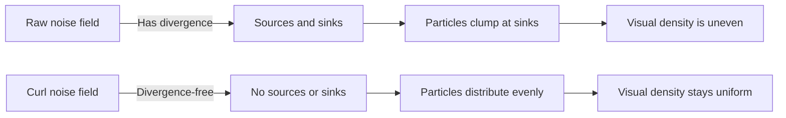

## Why flow fields

A vector field that tells particles where to go. At every point, a vector specifying direction and magnitude. Drop particles in. Let them follow.

Result: organic, fluid motion. Some of the most visually striking generative art in the medium.

The technique is everywhere — wind maps, ocean currents, Tyler Hobbs' work, fluid VFX, flocking, hair dynamics. A well-designed vector field produces coherent motion with no explicit path planning.

> [!note]
> The noise choice determines character. Perlin = smooth rolling fields. Simplex = same, no axis-aligned artifacts. Curl noise = divergence-free, prevents particles from clumping.

## Vector fields and advection

A vector field assigns a velocity to every point. Advection moves each particle by the field at its current location.

```javascript
// Simplest advection: Euler step
particle.x += field(particle.x, particle.y, particle.z).x * dt;
particle.y += field(particle.x, particle.y, particle.z).y * dt;
particle.z += field(particle.x, particle.y, particle.z).z * dt;
```

The field can be anything — formula, sampled texture, noise. For generative art, noise dominates because it produces spatially coherent, non-repeating motion with minimal config.

## The clumping problem

Naive noise-based fields have **sources** (vectors point outward) and **sinks** (vectors point inward). Particles accumulate at sinks. Voids appear at sources. Distribution becomes uneven.



## Curl noise

The curl of any vector field is divergence-free. Use noise to define a potential field. Take the curl. Get a velocity field with no convergence or divergence.

In 3D, three independent noise fields and cross-partial derivatives:

```
curl(F) = (∂Fz/∂y - ∂Fy/∂z,  ∂Fx/∂z - ∂Fz/∂x,  ∂Fy/∂x - ∂Fx/∂y)
```

Finite-difference implementation:

```javascript
function curlNoise(x, y, z, t) {
  const e = 0.01;  // epsilon for finite differences

  // Three independent noise fields offset by large constants
  // to decorrelate them
  const na_y1 = noise3D(x, y + e, z + 31.416);
  const na_y0 = noise3D(x, y - e, z + 31.416);
  const na_z1 = noise3D(x, y, z + e + 31.416);
  const na_z0 = noise3D(x, y, z - e + 31.416);

  const nb_x1 = noise3D(x + e, y, z + 47.123);
  const nb_x0 = noise3D(x - e, y, z + 47.123);
  const nb_z1 = noise3D(x, y, z + e + 47.123);
  const nb_z0 = noise3D(x, y, z - e + 47.123);

  const nc_x1 = noise3D(x + e, y, z + 67.891);
  const nc_x0 = noise3D(x - e, y, z + 67.891);
  const nc_y1 = noise3D(x, y + e, z + 67.891);
  const nc_y0 = noise3D(x, y - e, z + 67.891);

  const inv2e = 1 / (2 * e);
  return [
    (nc_y1 - nc_y0) * inv2e - (nb_z1 - nb_z0) * inv2e,
    (na_z1 - na_z0) * inv2e - (nc_x1 - nc_x0) * inv2e,
    (nb_x1 - nb_x0) * inv2e - (na_y1 - na_y0) * inv2e,
  ];
}
```

The cost:

- Three separate noise lookups (offset by irrational constants to decorrelate)
- Six partial derivatives per component (forward + backward)
- 18 noise evaluations per particle per frame

That's the price of divergence-freedom.

> [!tip]
> 2D is much cheaper. One noise field. `vx = ∂noise/∂y`, `vy = -∂noise/∂x`. Four evaluations instead of eighteen.

## Particle lifecycle

Without management, particles drift off and the field empties.

```javascript
function updateParticle(i, t) {
  life[i]++;

  // Kill and respawn if expired or out of bounds
  if (life[i] > maxLife[i] || outOfBounds(px[i], py[i], pz[i])) {
    resetParticle(i);
    return;
  }

  // Advect by curl noise
  const [cx, cy, cz] = curlNoise(px[i] * 0.4, py[i] * 0.4, pz[i] * 0.4, t);
  px[i] += cx * speed;
  py[i] += cy * speed;
  pz[i] += cz * speed;
}
```

Stagger initial lifetimes (randomize starting life). Otherwise all particles reset at once and the field flashes.

## Trails

Each particle stores its last N positions. New positions shift in at the head. Old fall off the tail.

```javascript
const TRAIL_LENGTH = 8;

// Shift trail down
for (let tr = TRAIL_LENGTH - 1; tr > 0; tr--) {
  trail[i][tr] = trail[i][tr - 1];
}
trail[i][0] = { x: px[i], y: py[i], z: pz[i] };
```

Fade head → tail. Additive blending. Overlapping trails create luminous density that reveals the field — bright regions are where streamlines converge (not clumps; the field is divergence-free).

## Demo

12,000 particles. 3D curl noise. The field evolves slowly. Trails with additive blending. Camera orbits.

<div data-scene="flow-field.js" style="width:100%;height:420px;"></div>

## Artistic controls

| Parameter | Effect |
|---|---|
| Noise frequency | Low = broad sweeping curves. High = tight turbulent curls. |
| Noise octaves (FBM) | More = finer detail on large-scale flow |
| Time speed | How fast the field evolves. Zero = frozen streamlines. |
| Particle speed | Distance per frame. Higher = longer trails. |
| Particle count | Density of the visualization |
| Trail length | More positions = more fluid ribbons |
| Color mapping | Position, velocity, or curl magnitude → hue |

## Common questions

```chat
user: How is this different from a fluid simulation?
assistant: Fluid sim solves Navier-Stokes — pressure, viscosity, mass conservation. Curl noise is a shortcut. Fluid-like motion without simulating fluid dynamics. No pressure. No obstacles. Fluid pushes back when compressed; curl noise doesn't. For art, curl noise is far cheaper and equally beautiful. For physically accurate behavior, use a real solver.

user: How do I make this faster?
assistant: Bottleneck is noise evaluation — 18 calls per particle per frame in 3D. Options: bake the curl field into a 3D texture (one lookup vs 18 noise calls), reduce octaves, drop particle count, skip trail shifts. On GPU compute shaders, curl noise for all particles in parallel — scales to millions.

user: Can flow fields work in 2D?
assistant: Yes — and 2D is more common for prints, posters, web canvases. Curl noise needs one field and four evaluations: `vx = (noise(x, y+e) - noise(x, y-e)) / 2e`, `vy = -(noise(x+e, y) - noise(x-e, y)) / 2e`. Same visual style. Stroked paths on a 2D canvas instead of 3D points.

user: How do I get the wind-map look?
assistant: Very short-lived particles (50–100 frames), no trail, high transparency. Spawn uniformly, follow briefly, die, respawn. Instantaneous density reveals the field. Maintain uniform spawn density. Global alpha accumulates over frames. earth.nullschool.net is the definitive example.
```
