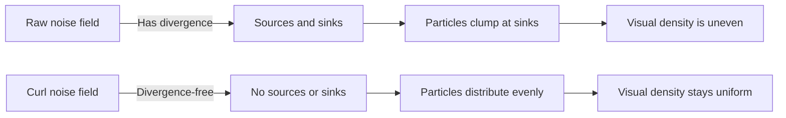

## Why Flow Fields

A flow field is a vector field that tells particles where to move. At every point in space, a vector specifies the direction and magnitude of flow. Drop particles into the field and let them follow the vectors -- the result is organic, fluid motion that produces some of the most visually striking generative art in the medium.

The technique appears everywhere: data visualization (wind maps, ocean currents), generative art (Tyler Hobbs' work, Matt DesLauriers' sketches), VFX (particle advection in fluid sims), and procedural animation (flocking, hair dynamics). The key insight is that a well-designed vector field produces coherent, flowing motion without any explicit path planning.

> [!note]
> Flow fields for generative art typically use noise functions to define the vectors. The choice of noise determines the character: Perlin noise produces smooth, rolling fields. Simplex noise is similar but avoids axis-aligned artifacts. Curl noise adds the critical property of divergence-freedom, which prevents particles from clumping.

## Post Plan (Feature Map)

| Section Goal | Blog Feature Used | Why |
|---|---|---|
| Explain vector fields and advection | Code blocks + math | Ground the concept before adding noise |
| Cover curl noise derivation | Code + Mermaid diagram | The divergence-free property is the key insight |
| Show the particle system | JavaScript code + steps | Copy-pasteable 3D implementation |
| Build an interactive demo | Three.js scene embed | 12,000 particles flowing through curl noise |
| Address practical questions | Chat transcript | 2D vs 3D, performance, artistic control |

## Vector Fields and Advection

A vector field assigns a velocity to every point in space. Particle advection means moving each particle in the direction specified by the field at its current location:

```javascript
// Simplest advection: Euler step
particle.x += field(particle.x, particle.y, particle.z).x * dt;
particle.y += field(particle.x, particle.y, particle.z).y * dt;
particle.z += field(particle.x, particle.y, particle.z).z * dt;
```

The field function can be anything: a mathematical formula, a sampled texture, or a noise function. For generative art, noise-based fields dominate because they produce spatially coherent, non-repeating motion with minimal configuration.

## The Clumping Problem

Naive noise-based flow fields have a problem: particles clump. If you use raw Perlin noise to define velocities, the field has **sources** (where vectors point outward) and **sinks** (where vectors point inward). Particles accumulate at sinks and leave voids at sources. The distribution becomes uneven over time.



## Curl Noise: The Solution

The curl of a vector field is guaranteed to be divergence-free. Instead of using noise directly as velocities, compute the curl of a noise-based potential field. The result is a vector field where no particle ever converges to a point or diverges from one.

In 3D, curl requires three independent noise fields (a potential vector field) and computes cross-partial derivatives:

```
curl(F) = (∂Fz/∂y - ∂Fy/∂z,  ∂Fx/∂z - ∂Fz/∂x,  ∂Fy/∂x - ∂Fx/∂y)
```

Implemented with finite differences:

```javascript
function curlNoise(x, y, z, t) {
  const e = 0.01;  // epsilon for finite differences

  // Three independent noise fields offset by large constants
  // to decorrelate them
  const na_y1 = noise3D(x, y + e, z + 31.416);
  const na_y0 = noise3D(x, y - e, z + 31.416);
  const na_z1 = noise3D(x, y, z + e + 31.416);
  const na_z0 = noise3D(x, y, z - e + 31.416);

  const nb_x1 = noise3D(x + e, y, z + 47.123);
  const nb_x0 = noise3D(x - e, y, z + 47.123);
  const nb_z1 = noise3D(x, y, z + e + 47.123);
  const nb_z0 = noise3D(x, y, z - e + 47.123);

  const nc_x1 = noise3D(x + e, y, z + 67.891);
  const nc_x0 = noise3D(x - e, y, z + 67.891);
  const nc_y1 = noise3D(x, y + e, z + 67.891);
  const nc_y0 = noise3D(x, y - e, z + 67.891);

  const inv2e = 1 / (2 * e);
  return [
    (nc_y1 - nc_y0) * inv2e - (nb_z1 - nb_z0) * inv2e,
    (na_z1 - na_z0) * inv2e - (nc_x1 - nc_x0) * inv2e,
    (nb_x1 - nb_x0) * inv2e - (na_y1 - na_y0) * inv2e,
  ];
}
```

The key details:
- Three separate noise lookups (offset by irrational constants to prevent correlation)
- Six partial derivatives per component (forward and backward differences)
- 18 noise evaluations per particle per frame — this is the cost of divergence-freedom

> [!tip]
> In 2D, curl noise is much cheaper. You only need one noise field, and the curl simplifies to: vx = ∂noise/∂y, vy = -∂noise/∂x. Just four noise evaluations instead of eighteen.

## Particle Lifecycle

Particles need lifecycle management. Without it, they drift off the visible area and the field empties out:

```javascript
function updateParticle(i, t) {
  life[i]++;

  // Kill and respawn if expired or out of bounds
  if (life[i] > maxLife[i] || outOfBounds(px[i], py[i], pz[i])) {
    resetParticle(i);
    return;
  }

  // Advect by curl noise
  const [cx, cy, cz] = curlNoise(px[i] * 0.4, py[i] * 0.4, pz[i] * 0.4, t);
  px[i] += cx * speed;
  py[i] += cy * speed;
  pz[i] += cz * speed;
}
```

Staggering initial lifetimes (randomizing the starting life) prevents all particles from resetting at once, which would cause a visible flash.

## Trail Rendering

Each particle stores the last N positions as a trail. New positions shift in at the head, old positions fall off the tail:

```javascript
const TRAIL_LENGTH = 8;

// Shift trail down
for (let tr = TRAIL_LENGTH - 1; tr > 0; tr--) {
  trail[i][tr] = trail[i][tr - 1];
}
trail[i][0] = { x: px[i], y: py[i], z: pz[i] };
```

The trail fades from full brightness at the head to transparent at the tail. With additive blending, overlapping trails create luminous density that reveals the field structure -- bright regions are where flow converges (not clumps, since the field is divergence-free, but where streamlines run close together).

## Interactive Demo

12,000 particles advected through a 3D curl noise field. The noise evolves slowly over time, causing the flow patterns to shift and reform. Trails use additive blending for a luminous, fluid aesthetic. The camera orbits to reveal the 3D structure of the flow.

<div data-scene="flow-field.js" style="width:100%;height:420px;"></div>

## Artistic Controls

The visual character of a flow field is controlled by a few parameters:

| Parameter | Effect |
|---|---|
| **Noise frequency** (scale multiplied into coordinates) | Low = broad, sweeping curves. High = tight, turbulent curls |
| **Noise octaves** (FBM layers) | More octaves = finer detail superimposed on large-scale flow |
| **Time speed** | How fast the field evolves. Zero = frozen streamlines |
| **Particle speed** | Distance traveled per frame. Higher = longer trails, faster motion |
| **Particle count** | Density of visualization. More particles = more detail revealed |
| **Trail length** | Number of stored positions. Longer = more fluid ribbons |
| **Color mapping** | Map position, velocity, or curl magnitude to hue |

## Common Questions

```chat
user: How is this different from a fluid simulation?
assistant: A fluid simulation solves the Navier-Stokes equations, which account for pressure, viscosity, and conservation of mass. Curl noise is a shortcut — it produces fluid-like motion without simulating actual fluid dynamics. The key difference is that curl noise has no concept of pressure or obstacles. Fluid pushes back when compressed; curl noise does not. For generative art, curl noise is far cheaper and produces equally beautiful results. For physically accurate fluid behavior, you need a proper solver.

user: How do I make this run faster?
assistant: The bottleneck is noise evaluation — 18 calls per particle per frame in 3D. Options: bake the curl field into a 3D texture and sample it (one texture lookup instead of 18 noise calls), reduce noise octaves, lower particle count, or skip trail shifts and just render current positions. On the GPU, compute shaders can evaluate curl noise for all particles in parallel — this scales to millions of particles.

user: Can flow fields work in 2D?
assistant: Yes, and 2D is the more common case for generative art (prints, posters, web canvases). In 2D, curl noise needs only one noise field and four evaluations per particle: vx = (noise(x, y+e) - noise(x, y-e)) / 2e, vy = -(noise(x+e, y) - noise(x-e, y)) / 2e. The visual style is the same — smooth, flowing curves — but rendered as stroked paths on a 2D canvas instead of 3D points.

user: How do I get the wind-map style visualization?
assistant: The classic wind-map look uses very short-lived particles (50-100 frames), no trail, and high transparency. Particles spawn uniformly, follow the field briefly, then die and respawn. The instantaneous density reveals the field structure. The key is maintaining uniform spawn density and using a global alpha that accumulates over many frames. Cameron Beccario's earth.nullschool.net is the definitive example.
```
