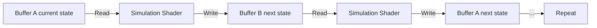

## Why reaction-diffusion

1952. Alan Turing publishes "The Chemical Basis of Morphogenesis." Proposes that simple chemical reactions plus diffusion explain biological patterns — leopard spots, zebrafish stripes, fingerprint ridges.

The math is elegant. Two chemicals interact and spread at different rates. The imbalance creates stable spatial patterns from uniform initial conditions.

No template. No blueprint. Pattern from process.

Gray-Scott is the most visually productive variant. Two chemicals — A feeds the reaction, B consumes A and replicates. Both diffuse, at different rates. Two parameters (feed, kill) control which of dozens of distinct patterns emerge: spots, stripes, spirals, pulsing solitons, worms, mitosis, coral.

> [!note]
> Not just a curiosity. Confirmed as the mechanism behind pigmentation patterns in several species. Same equations on your GPU as in actual biological morphogenesis.

## The Gray-Scott equations

Two coupled PDEs:

```
∂A/∂t = Da∇²A - ABB + f(1 - A)
∂B/∂t = Db∇²B + ABB - (f + k)B
```

- **A, B** — chemical concentrations (0–1)
- **Da, Db** — diffusion rates (Da > Db is essential)
- **f** — feed rate (how fast A is replenished)
- **k** — kill rate (how fast B decays)
- **∇²** — Laplacian (how much a point differs from its neighbors)
- **ABB** — reaction term (B catalyzes conversion of A → B)

The asymmetry is everything. A diffuses faster than B. A spreads into regions and "prepares the ground" before B arrives. B converts A locally, creating a depletion zone that stops further growth in that direction.

Activation (B replicates) competes with inhibition (A depletion). That competition is what produces patterns.

## On the GPU

Pixel grid → Laplacian becomes a stencil:

```glsl
// 5-point Laplacian stencil on a texture
vec2 laplacian = -4.0 * state;
laplacian += texture2D(uState, vUv + vec2(texelSize.x, 0.0)).rg;
laplacian += texture2D(uState, vUv - vec2(texelSize.x, 0.0)).rg;
laplacian += texture2D(uState, vUv + vec2(0.0, texelSize.y)).rg;
laplacian += texture2D(uState, vUv - vec2(0.0, texelSize.y)).rg;
```

Full step:

```glsl
void main() {
  vec2 state = texture2D(uState, vUv).rg;
  float a = state.r;
  float b = state.g;

  vec2 laplacian = /* stencil as above */;

  float abb = a * b * b;
  float da = Da * laplacian.r - abb + feed * (1.0 - a);
  float db = Db * laplacian.g + abb - (feed + kill) * b;

  gl_FragColor = vec4(
    clamp(a + da * dt, 0.0, 1.0),
    clamp(b + db * dt, 0.0, 1.0),
    0.0, 1.0
  );
}
```

> [!tip]
> Multiple steps per animation frame (8–16) speeds up pattern formation dramatically. Each step is cheap — a texture read, some math, a write. GPU eats it.

## Ping-pong

Read current state. Compute next state. Can't read and write the same texture. Two framebuffers that swap roles each step.



```javascript
// Each simulation step
simUniforms.uState.value = rtA.texture;  // read from A
renderer.setRenderTarget(rtB);            // write to B
renderer.render(simScene, camera);

// Swap references
[rtA, rtB] = [rtB, rtA];
```

This pattern is everywhere — fluid dynamics, cellular automata, any system where the next state depends on the current state of neighbors.

## Parameter space

Feed/kill controls everything. Small changes → dramatically different results.

| f | k | Pattern |
|---|---|---|
| 0.037 | 0.060 | Spots (mitosis) |
| 0.030 | 0.062 | Stripes and labyrinths |
| 0.025 | 0.060 | Pulsing solitons |
| 0.040 | 0.060 | Worms |
| 0.014 | 0.054 | Moving spots |
| 0.018 | 0.051 | Spirals |
| 0.050 | 0.065 | Coral growth |
| 0.022 | 0.059 | Fingerprint ridges |

> [!note]
> Robert Munafo's "Xmorphia" maps the entire f/k space and catalogs every known pattern. The definitive reference.

## Demo

Several seed spots of B on a uniform field of A. Patterns emerge in seconds. Feed/kill drift between presets — pattern morphs through regimes.

<div data-scene="reaction-diffusion.js" style="width:100%;height:420px;"></div>

## Seeding

Initial conditions matter. Single seed grows radially. Multiple seeds interact — depletion zones collide and create complex boundaries.

```javascript
// Circular seed: set A=0.5, B=0.25 in a disc
function seedSpot(data, cx, cy, radius, size) {
  for (let y = cy - radius; y <= cy + radius; y++) {
    for (let x = cx - radius; x <= cx + radius; x++) {
      if ((x - cx) ** 2 + (y - cy) ** 2 < radius ** 2) {
        const idx = (y * size + x) * 4;
        data[idx] = 0.5;      // reduce A
        data[idx + 1] = 0.25; // inject B
      }
    }
  }
}

// Random noise: more organic initial conditions
function seedNoise(data, size, probability) {
  for (let i = 0; i < size * size; i++) {
    if (Math.random() < probability) {
      data[i * 4] = 0.5;
      data[i * 4 + 1] = 0.25;
    }
  }
}
```

## Common questions

```chat
user: Why do patterns take so long to appear?
assistant: Reaction-diffusion is slow by nature. B needs enough local concentration to trigger the autocatalytic reaction. A needs time to diffuse into the surrounding area to create the inhibition field. 8–16 steps per frame helps. At 256×256, expect clear patterns in 2000–5000 sim steps (250–600 frames at 8 steps/frame). Larger grids take proportionally longer.

user: What happens if Da equals Db?
assistant: Nothing interesting. Asymmetry Da > Db is essential. Same diffusion rates → Laplacian terms cancel in the instability analysis → uniform decay. Turing's insight: differential diffusion creates the instability. Da/Db typically ~2:1.

user: Can this run in 3D?
assistant: Yes. Cost is cubic. 256³ = 16M voxels, each with a 6-point 3D Laplacian. Feasible on modern GPUs with 3D textures and compute shaders. Not with the simple fragment shader ping-pong here. Patterns become 3D analogs — spots → spheres, stripes → sheets and tubes, worms → tunnels. Marching cubes extracts the isosurface.

user: How do I find interesting parameter combinations?
assistant: Start with the presets. Nudge by 0.001 increments. Interesting behavior lives in narrow bands — most of the space is either uniform or chaos. Munafo's map is the visual guide. Or: a grid of small simulations running different parameters in parallel and watch which ones bloom.
```
