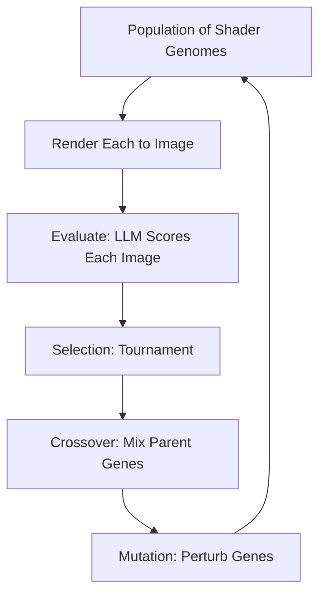

## Why Evolutionary Art

In 1994, Karl Sims demonstrated that genetic algorithms could evolve stunning visual art. His system bred mathematical expressions — trees of arithmetic operators and functions — selecting survivors based on aesthetic preference. The results were alien and beautiful, but the bottleneck was always the fitness function: either a human sat clicking "better/worse" for hours (interactive evolution), or you defined some mathematical proxy for beauty (color entropy, fractal dimension) that inevitably felt sterile.

Local LLMs change the equation. Instead of mathematical proxies, describe what you want: "more crystalline," "darker and more ominous," "organic like coral growth." The LLM evaluates each candidate image against the natural language prompt and returns a fitness score. Evolution proceeds as normal — selection, crossover, mutation — but guided by language instead of math. The fitness function becomes as flexible as English.

This is newly practical because local inference (via Ollama) makes it free and fast enough for real-time evolution. A cloud API call per evaluation would cost dollars per generation. Local inference on consumer hardware takes 200ms per evaluation — fast enough for a generation every few seconds with a population of 8.

> [!note]
> Karl Sims' original work evolved Lisp S-expressions as genomes. Each expression computed a pixel color from (x, y) coordinates. Our approach uses parameterized shaders — a fixed shader program with a vector of floating-point genes that control its behavior. This is less expressive but more controllable, and avoids the problem of evolved programs that crash or produce empty output.

## Post Plan (Feature Map)

| Section Goal | Blog Feature Used | Why |
|---|---|---|
| Explain evolutionary art history | Text | Karl Sims, the fitness function problem |
| Show the LLM-as-judge pipeline | Mermaid diagram + code | The key novel combination |
| Describe genotype design | Code blocks | Parameterized shader genomes |
| Cover genetic operators | Code blocks | Selection, crossover, mutation |
| Interactive demo | Three.js scene embed | Watch evolution in real time |
| Address questions | Chat transcript | Prompt engineering, convergence, diversity |

## The Pipeline



For each generation:
1. Render all candidates by setting shader uniforms from their gene vectors
2. Send rendered images to the LLM with a prompt like "Rate this image 1-10 for how crystalline and geometric it looks"
3. Parse the score as fitness
4. Select parents via tournament selection
5. Create children through crossover and mutation
6. Replace population and repeat

## Genome Design

Each individual is a vector of 12 floats in [0, 1], controlling a fragment shader:

```javascript
// Gene mapping:
// [0-2]  Color palette hue offsets (3 colors)
// [3]    Noise frequency (1-9)
// [4]    Noise octaves (1-5)
// [5]    Symmetry type (0=none, 0.25=mirror, 0.5=radial4, 0.75=radial8)
// [6]    Rotation amount (0-2pi)
// [7]    Domain warping strength (0-2)
// [8]    Saturation (0.4-1.0)
// [9]    Brightness (0.3-0.9)
// [10]   Contrast/gamma (0.5-2.0)
// [11]   Layer blend factor
```

The shader uses these genes to control FBM noise, domain warping, symmetry folding, and a three-color palette. The design space is constrained enough that random genomes always produce visible output, but expressive enough that evolved genomes can produce striking images.

## Genetic Operators

**Tournament Selection**: Pick two random individuals, keep the fitter one. Simple, effective, naturally maintains selection pressure without premature convergence.

**Uniform Crossover**: For each gene, randomly pick from parent A or parent B. This preserves good gene combinations while exploring new ones.

**Gaussian Mutation**: Add small random perturbations to each gene with some probability. Clamped to [0, 1].

```javascript
function evolve(population, fitness) {
  const newPop = [];
  // Elitism: keep the best unchanged
  newPop.push([...population[bestIndex(fitness)]]);

  while (newPop.length < POP_SIZE) {
    const p1 = tournamentSelect(population, fitness);
    const p2 = tournamentSelect(population, fitness);
    let child = crossover(p1, p2);
    child = mutate(child, 0.3); // 30% mutation rate per gene
    newPop.push(child);
  }
  return newPop;
}
```

## The LLM Prompt

The prompt needs to be specific enough to guide evolution but not so specific that only one phenotype scores well:

```
Look at this generated abstract image. Rate it from 1 to 10 on how well
it matches this description: "crystalline, geometric, with deep cool colors
and sharp angular structures." Only respond with the number.
```

Different prompts produce dramatically different evolved populations:
- "organic, flowing, like underwater coral" → high warp, low symmetry, warm colors
- "precise, minimalist, black and white" → low noise, high contrast, low saturation
- "psychedelic, vibrant, kaleidoscopic" → high symmetry, high saturation, many octaves

## Interactive Demo

A population of 8 shader-generated images evolves in real time. Every 3 seconds, the population undergoes selection, crossover, and mutation. The fittest individual (green border) survives to the next generation. The simulated fitness function rewards color diversity, moderate complexity, and symmetry — approximating what an LLM aesthetic judge would select.

<div data-scene="evo-art.js" style="width:100%;height:420px;"></div>

## Common Questions

```chat
user: How many generations until interesting results?
assistant: With a population of 8-16, you typically see convergence toward a coherent style within 10-20 generations. The first few generations are mostly noise and random patterns. By generation 5-8, selection pressure starts creating clusters of similar-looking individuals. By generation 15-20, the population has usually converged on a specific aesthetic. After that, mutation provides slow exploration around the local optimum.

user: Doesn't the LLM just give random scores?
assistant: Modern vision-language models (LLaVA, Llama 3.2 Vision) are surprisingly good at aesthetic evaluation. They have strong priors about visual quality from training data. The key is prompt specificity — "rate this image" gives noisy results, but "rate how crystalline and geometric this looks" gives consistent rankings that meaningfully differ between candidates. The noise in individual evaluations averages out over generations through selection pressure.

user: Could you evolve the shader code itself, not just parameters?
assistant: Yes — that's closer to Sims' original approach. You'd evolve an abstract syntax tree of GLSL operations and compile new shaders each generation. The risk is that most random shader programs produce blank or broken output. A safer middle ground is evolving a larger parameter vector (50-100 genes) that controls a more complex fixed shader, or using a small neural network whose weights are the genome.

user: What about diversity? Doesn't evolution converge to one look?
assistant: Yes, that's a known problem. Techniques to maintain diversity include fitness sharing (penalize similarity to other individuals), island models (multiple isolated populations that occasionally exchange individuals), and novelty search (reward individuals for being different from anything seen before, regardless of fitness). Adding 1-2 fully random individuals per generation also helps prevent premature convergence.
```
