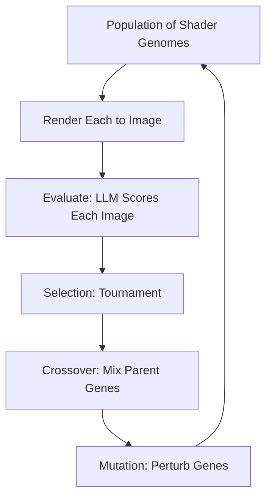

## Why now

1994. Karl Sims showed genetic algorithms could evolve stunning visual art. Bred mathematical expressions — trees of arithmetic operators — selecting survivors by aesthetic preference.

The bottleneck was always the fitness function. Either a human clicked "better/worse" for hours (interactive evolution), or you defined some math proxy for beauty (color entropy, fractal dimension) that inevitably felt sterile.

Local LLMs change the equation.

Don't define a math proxy. Describe what you want: *more crystalline. Darker and more ominous. Organic like coral growth.*

The LLM evaluates each candidate against the prompt and returns a fitness score. Selection, crossover, mutation — guided by language instead of math. The fitness function is as flexible as English.

This is newly practical because local inference (Ollama) makes evaluation free and fast enough for real-time. Cloud APIs would cost dollars per generation. Local on consumer hardware: 200ms per evaluation. Fast enough for a generation every few seconds with a population of 8.

> [!note]
> Sims evolved Lisp S-expressions as genomes — each expression computed a pixel color from (x, y). Our approach uses parameterized shaders — fixed program, vector of float genes controlling behavior. Less expressive but more controllable. Avoids evolved programs that crash or produce empty output.

## The pipeline



Each generation:

1. Render all candidates by setting shader uniforms from gene vectors
2. Send rendered images to the LLM with a prompt: "Rate 1–10 how crystalline and geometric this looks"
3. Parse the score as fitness
4. Tournament select parents
5. Crossover + mutation → children
6. Replace and repeat

## Genome

Vector of 12 floats in [0, 1]. Controls a fragment shader.

```javascript
// Gene mapping:
// [0-2]  Color palette hue offsets (3 colors)
// [3]    Noise frequency (1-9)
// [4]    Noise octaves (1-5)
// [5]    Symmetry type (0=none, 0.25=mirror, 0.5=radial4, 0.75=radial8)
// [6]    Rotation amount (0-2pi)
// [7]    Domain warping strength (0-2)
// [8]    Saturation (0.4-1.0)
// [9]    Brightness (0.3-0.9)
// [10]   Contrast/gamma (0.5-2.0)
// [11]   Layer blend factor
```

The shader uses these for FBM noise, domain warping, symmetry folding, and a three-color palette. Constrained enough that random genomes always produce visible output. Expressive enough that evolved genomes produce striking images.

## Operators

**Tournament selection** — pick two random individuals, keep the fitter one. Simple. Maintains pressure without premature convergence.

**Uniform crossover** — for each gene, randomly pick from parent A or B. Preserves good combinations while exploring new ones.

**Gaussian mutation** — small random perturbations per gene with some probability. Clamp to [0, 1].

```javascript
function evolve(population, fitness) {
  const newPop = [];
  // Elitism: keep the best unchanged
  newPop.push([...population[bestIndex(fitness)]]);

  while (newPop.length < POP_SIZE) {
    const p1 = tournamentSelect(population, fitness);
    const p2 = tournamentSelect(population, fitness);
    let child = crossover(p1, p2);
    child = mutate(child, 0.3); // 30% mutation rate per gene
    newPop.push(child);
  }
  return newPop;
}
```

## The prompt

Specific enough to guide. Loose enough that more than one phenotype scores well.

```
Look at this generated abstract image. Rate it from 1 to 10 on how well
it matches this description: "crystalline, geometric, with deep cool colors
and sharp angular structures." Only respond with the number.
```

Different prompts → dramatically different populations:

- "organic, flowing, like underwater coral" → high warp, low symmetry, warm colors
- "precise, minimalist, black and white" → low noise, high contrast, low saturation
- "psychedelic, vibrant, kaleidoscopic" → high symmetry, high saturation, many octaves

## Demo

Population of 8 shader images evolving in real time. Selection, crossover, mutation every 3 seconds. Fittest (green border) survives. Simulated fitness rewards color diversity, moderate complexity, symmetry — approximating an LLM aesthetic judge.

<div data-scene="evo-art.js" style="width:100%;height:420px;"></div>

## Common questions

```chat
user: How many generations until interesting results?
assistant: Population of 8–16, coherent style within 10–20 generations. First few are noise and random patterns. By gen 5–8, selection pressure creates clusters of similar individuals. By 15–20, population converges on an aesthetic. After: mutation slowly explores around the local optimum.

user: Doesn't the LLM just give random scores?
assistant: Modern VLMs (LLaVA, Llama 3.2 Vision) are surprisingly good at aesthetic evaluation. Strong visual priors from training data. Key is prompt specificity — "rate this image" gives noise. "Rate how crystalline and geometric this looks" gives consistent rankings that meaningfully differ. Noise in individual evaluations averages out through selection pressure.

user: Could you evolve the shader code itself?
assistant: Yes — closer to Sims' original. Evolve an AST of GLSL operations, compile new shaders each generation. Risk: most random shader programs produce blank or broken output. Safer middle ground: larger parameter vector (50–100 genes) controlling a more complex fixed shader, or a small neural net whose weights are the genome.

user: What about diversity? Doesn't evolution converge to one look?
assistant: Yes, known problem. Techniques: fitness sharing (penalize similarity), island models (isolated populations occasionally exchange), novelty search (reward different-from-anything-seen regardless of fitness). Adding 1–2 random individuals per generation also helps.
```
