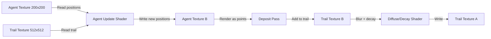

## Why Physarum

Physarum polycephalum is a slime mold that solves optimization problems without a brain. Place food sources on a petri dish. Physarum grows a transport network between them that closely approximates the shortest spanning tree.

2010. Researchers recreated the Tokyo rail network by placing oat flakes at major station locations. The slime mold independently converged on a layout strikingly similar to the actual rail system.

No central planning. No global knowledge. Just local chemical sensing and response.

The computational model is simple: thousands of agents move through a shared environment, depositing chemical trail and sensing trail ahead. Three rules per agent — sense, rotate, deposit. The trail diffuses and decays.

From minimal local interactions, complex global structures: branching networks, pulsing veins, adaptive routing that reconfigures when the environment changes.

What makes Physarum special among agent-based systems is the tight feedback loop. Agents deposit trail → trail attracts agents → positive feedback creates self-reinforcing paths. Diffusion spreads the trail. Decay prevents runaway accumulation.

Reinforcement and dissipation in balance. That balance produces the vein-like networks.

> [!note]
> Physarum-inspired algorithms have been applied to real network design — communication routing, urban planning, even mapping the large-scale structure of dark matter. Jeff Jones' 2010 paper established the computational model used here.

## The agent

Three properties per agent: position (x, y), heading, nothing else. Per step:

1. **Sense** — sample the trail map at three points ahead — left, center, right — at a configurable distance and angle
2. **Rotate** — turn toward the highest-trail sensor
3. **Move** — step forward in the heading direction
4. **Deposit** — add a fixed amount of trail at the new position

```javascript
// Pseudocode for one agent step
function stepAgent(agent, trailMap) {
  const left  = senseTrail(agent.pos, agent.heading - sensorAngle, sensorDist);
  const center = senseTrail(agent.pos, agent.heading, sensorDist);
  const right = senseTrail(agent.pos, agent.heading + sensorAngle, sensorDist);

  if (center >= left && center >= right) {
    // Keep heading (slight random wobble)
  } else if (left > right) {
    agent.heading -= turnSpeed;
  } else if (right > left) {
    agent.heading += turnSpeed;
  } else {
    // Random choice when equal
    agent.heading += randomSign() * turnSpeed;
  }

  agent.pos.x += Math.cos(agent.heading) * moveSpeed;
  agent.pos.y += Math.sin(agent.heading) * moveSpeed;

  trailMap.deposit(agent.pos, depositAmount);
}
```

Trail map evolves independently:

```javascript
function updateTrail(trailMap) {
  // 3x3 box blur (diffusion)
  const blurred = boxBlur3x3(trailMap);
  // Decay
  for (let i = 0; i < blurred.length; i++) {
    blurred[i] *= decayRate; // e.g., 0.95
  }
  return blurred;
}
```

## On the GPU

40K agents on the CPU is feasible but slow. Encode everything as textures, run in fragment shaders.



**Agent texture** — 200×200 RGBA float. Each pixel = one agent. R = x, G = y, B = heading. 40K agents.

**Trail texture** — 512×512 float, pheromone concentration.

Three render passes per step:

### Pass 1 — agent update

Fullscreen quad reads agents and trail, computes sense-rotate-move, writes new positions:

```glsl
void main() {
  vec4 agent = texture2D(uAgents, vUv);
  float x = agent.r, y = agent.g, heading = agent.b;

  // Sense three points ahead
  vec2 sL = fract(vec2(x + cos(heading - sAngle) * sDist,
                        y + sin(heading - sAngle) * sDist));
  float valL = texture2D(uTrail, sL).r;
  // ... same for center and right

  // Turn toward highest value
  if (valL > valR) heading -= turnSpeed;
  else if (valR > valL) heading += turnSpeed;

  // Move
  x = fract(x + cos(heading) * moveSpeed);
  y = fract(y + sin(heading) * moveSpeed);

  gl_FragColor = vec4(x, y, heading, 1.0);
}
```

### Pass 2 — deposit

Render agents as `GL_POINTS` into the trail texture with additive blending. Vertex shader reads each agent's position from the agent texture (vertex texture fetch) and positions a 1-pixel point.

### Pass 3 — diffuse + decay

Fullscreen 3×3 box blur × decay:

```glsl
void main() {
  float sum = 0.0;
  for (int dy = -1; dy <= 1; dy++)
    for (int dx = -1; dx <= 1; dx++)
      sum += texture2D(uTrail, vUv + vec2(dx, dy) * texelSize).r;
  gl_FragColor = vec4(vec3(sum / 9.0 * decay), 1.0);
}
```

## Parameter space

Small changes → dramatically different patterns.

| Parameter | Low | High | Effect |
|---|---|---|---|
| Sensor angle | 0.2 rad | 1.0 rad | Narrow → tight veins. Wide → diffuse clouds. |
| Sensor distance | 5 texels | 30 texels | Short → dense networks. Long → sparse branches. |
| Turn speed | 0.1 | 0.8 | Slow → smooth curves. Fast → jagged paths. |
| Decay rate | 0.90 | 0.99 | Fast → only active paths. Slow → persistent trails. |
| Deposit | Low | High | Weak → fragile networks. Strong → thick veins. |

> [!tip]
> Best patterns: sensor angle 0.4–0.6 rad, decay 0.94–0.97. Too little decay → field saturates. Too much → trails vanish before agents reinforce them.

## Demo

40K agents starting in a ring formation. Self-organize into a branching transport network. Parameters drift to show different regimes — tight vascular networks to diffuse clouds and back.

<div data-scene="physarum.js" style="width:100%;height:420px;"></div>

## Common questions

```chat
user: How does this compare to ant colony optimization?
assistant: Same spirit — both use stigmergy (indirect communication through the environment). ACO deposits pheromone on graph edges, uses evaporation as decay. Physarum operates in continuous 2D space, uses diffusion. The continuous spatial model produces branching network topology that graph-based ACO doesn't naturally generate.

user: Can this scale to millions of agents?
assistant: On GPU, yes. Agent update is embarrassingly parallel — each agent reads its local neighborhood independently. Bottleneck is the deposit pass (many agents writing to the same texels) and diffuse pass (memory bandwidth). WebGPU compute shaders handle millions easily. In WebGL: ~100K before frame rate drops, because the deposit pass uses point rendering which isn't as efficient as compute shader atomics.

user: Why start agents in a ring?
assistant: Aesthetic choice. Visible expansion phase as the network grows outward — more dramatic than random placement. Random works fine — agents still self-organize, but the initial phase looks like noise resolving into structure instead of a ring expanding. Both converge to similar steady-state patterns.

user: Is biological Physarum actually doing this computation?
assistant: Biological organism uses a different mechanism — protoplasmic streaming through tubes, with tube thickness adapting based on flow. But the agent model captures the emergent behavior remarkably well. The abstraction (agents + trail) reproduces macroscopic patterns without modeling microscopic physics. Jones showed the model reproduces network formation, maze solving, and nutrient-source connecting.
```
