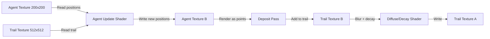

## Why Physarum

Physarum polycephalum is a slime mold that solves optimization problems without a brain. Place food sources on a petri dish and Physarum will grow a transport network between them that closely approximates the shortest spanning tree. In 2010, researchers recreated the Tokyo rail network by placing oat flakes at the locations of major stations — the slime mold independently converged on a layout strikingly similar to the actual rail system. No central planning, no global knowledge. Just local chemical sensing and response.

The computational model is remarkably simple: thousands of agents move through a shared environment, depositing chemical trail and sensing trail ahead of them. Each agent follows three rules — sense, rotate, deposit — and the trail diffuses and decays over time. From these minimal local interactions, complex global structures emerge: branching networks, pulsing veins, and adaptive routing that reconfigures when the environment changes.

What makes Physarum special among agent-based systems is the tight feedback loop between agents and environment. Agents deposit trail, trail attracts agents, and the positive feedback creates self-reinforcing paths. But diffusion spreads the trail, and decay prevents runaway accumulation. This balance between reinforcement and dissipation is what produces the characteristic vein-like networks.

> [!note]
> Physarum-inspired algorithms have been applied to real network design problems: routing in communication networks, urban planning, and even mapping the large-scale structure of dark matter in the universe. Jeff Jones' 2010 paper established the computational model used here.

## Post Plan (Feature Map)

| Section Goal | Blog Feature Used | Why |
|---|---|---|
| Explain the organism and its behavior | Text + callout | Ground the simulation in biology |
| Describe the agent model | Code blocks | The sense-rotate-deposit loop |
| Cover GPU implementation | Mermaid diagram + code | Texture-based agent storage is the key trick |
| Show the diffuse-decay pipeline | Code blocks | Trail dynamics create the patterns |
| Interactive demo | Three.js scene embed | Watch networks self-organize |
| Address practical questions | Chat transcript | Parameters, performance, applications |

## The Agent Model

Each agent has three properties: position (x, y), heading (angle), and nothing else. Every step:

1. **Sense**: Sample the trail map at three points ahead — left sensor, center sensor, right sensor — at a configurable distance and angle
2. **Rotate**: Turn toward the sensor that detected the highest trail concentration
3. **Move**: Step forward in the current heading direction
4. **Deposit**: Add a fixed amount of trail chemical at the new position

```javascript
// Pseudocode for one agent step
function stepAgent(agent, trailMap) {
  const left  = senseTrail(agent.pos, agent.heading - sensorAngle, sensorDist);
  const center = senseTrail(agent.pos, agent.heading, sensorDist);
  const right = senseTrail(agent.pos, agent.heading + sensorAngle, sensorDist);

  if (center >= left && center >= right) {
    // Keep heading (slight random wobble)
  } else if (left > right) {
    agent.heading -= turnSpeed;
  } else if (right > left) {
    agent.heading += turnSpeed;
  } else {
    // Random choice when equal
    agent.heading += randomSign() * turnSpeed;
  }

  agent.pos.x += Math.cos(agent.heading) * moveSpeed;
  agent.pos.y += Math.sin(agent.heading) * moveSpeed;

  trailMap.deposit(agent.pos, depositAmount);
}
```

The trail map is a separate 2D grid that evolves independently:

```javascript
function updateTrail(trailMap) {
  // 3x3 box blur (diffusion)
  const blurred = boxBlur3x3(trailMap);
  // Decay
  for (let i = 0; i < blurred.length; i++) {
    blurred[i] *= decayRate; // e.g., 0.95
  }
  return blurred;
}
```

## GPU Implementation

Running 40,000 agents on the CPU is feasible but slow. The GPU approach encodes everything as textures and runs the simulation entirely in fragment shaders.



**Agent texture**: A 200x200 RGBA float texture where each pixel stores one agent. Red = x position, Green = y position, Blue = heading angle. This encodes 40,000 agents.

**Trail texture**: A 512x512 float texture storing pheromone concentration.

Three render passes per step:

### Pass 1: Agent Update

A fullscreen quad shader reads the agent texture and trail texture, computes the sense-rotate-move logic, and writes new agent positions:

```glsl
void main() {
  vec4 agent = texture2D(uAgents, vUv);
  float x = agent.r, y = agent.g, heading = agent.b;

  // Sense three points ahead
  vec2 sL = fract(vec2(x + cos(heading - sAngle) * sDist,
                        y + sin(heading - sAngle) * sDist));
  float valL = texture2D(uTrail, sL).r;
  // ... same for center and right

  // Turn toward highest value
  if (valL > valR) heading -= turnSpeed;
  else if (valR > valL) heading += turnSpeed;

  // Move
  x = fract(x + cos(heading) * moveSpeed);
  y = fract(y + sin(heading) * moveSpeed);

  gl_FragColor = vec4(x, y, heading, 1.0);
}
```

### Pass 2: Deposit

Render the agents as GL_POINTS into the trail texture with additive blending. The vertex shader reads each agent's position from the agent texture (vertex texture fetch) and positions a 1-pixel point there.

### Pass 3: Diffuse + Decay

A fullscreen shader applies a 3x3 box blur and multiplies by the decay factor:

```glsl
void main() {
  float sum = 0.0;
  for (int dy = -1; dy <= 1; dy++)
    for (int dx = -1; dx <= 1; dx++)
      sum += texture2D(uTrail, vUv + vec2(dx, dy) * texelSize).r;
  gl_FragColor = vec4(vec3(sum / 9.0 * decay), 1.0);
}
```

## Parameter Space

Small parameter changes produce dramatically different patterns:

| Parameter | Low Value | High Value | Effect |
|---|---|---|---|
| Sensor angle | 0.2 rad | 1.0 rad | Narrow → tight veins, Wide → diffuse clouds |
| Sensor distance | 5 texels | 30 texels | Short → dense networks, Long → sparse branches |
| Turn speed | 0.1 | 0.8 | Slow → smooth curves, Fast → jagged paths |
| Decay rate | 0.90 | 0.99 | Fast decay → only active paths visible, Slow → persistent trails |
| Deposit amount | Low | High | Weak → fragile networks, Strong → thick veins |

> [!tip]
> The most visually striking patterns emerge when sensor angle is around 0.4-0.6 radians and decay is 0.94-0.97. Too little decay and the entire field saturates. Too much decay and trails vanish before agents can reinforce them.

## Interactive Demo

40,000 agents start in a ring formation and self-organize into a branching transport network. Parameters slowly drift to show different pattern regimes — from tight vascular networks to diffuse clouds and back.

<div data-scene="physarum.js" style="width:100%;height:420px;"></div>

## Common Questions

```chat
user: How does this compare to ant colony optimization?
assistant: Very similar in spirit — both use stigmergy (indirect communication through the environment). Ant colony optimization deposits pheromone on graph edges and uses evaporation as decay. Physarum operates in continuous 2D space rather than on a graph, and uses diffusion instead of just evaporation. The continuous spatial model produces the characteristic branching network topology that graph-based ACO doesn't naturally generate.

user: Can this scale to millions of agents?
assistant: On GPU, yes. The agent update is embarrassingly parallel — each agent reads its local neighborhood independently. The bottleneck is the deposit pass (many agents writing to the same trail texels) and the diffuse pass (memory bandwidth). WebGPU compute shaders would handle millions easily. In WebGL, you're limited to ~100K agents before frame rate drops, because the deposit pass uses point rendering which isn't as efficient as compute shader atomics.

user: Why start agents in a ring?
assistant: It's an aesthetic choice. Starting in a ring creates a visible expansion phase where the network grows outward, which is more dramatic than random initial placement. Random placement works fine too — the agents still self-organize into networks, but the initial phase looks like noise resolving into structure rather than a ring expanding into branches. Both converge to similar steady-state patterns.

user: Is the biological Physarum actually doing this computation?
assistant: The biological organism uses a different mechanism — protoplasmic streaming through a network of tubes, with tube thickness adapting based on flow. But the agent-based model captures the emergent behavior remarkably well. It's a case where the abstraction (agents + trail) reproduces the macroscopic patterns without modeling the microscopic physics. Jones showed that the agent model reproduces many of Physarum's documented behaviors including network formation, maze solving, and nutrient-source connecting.
```
