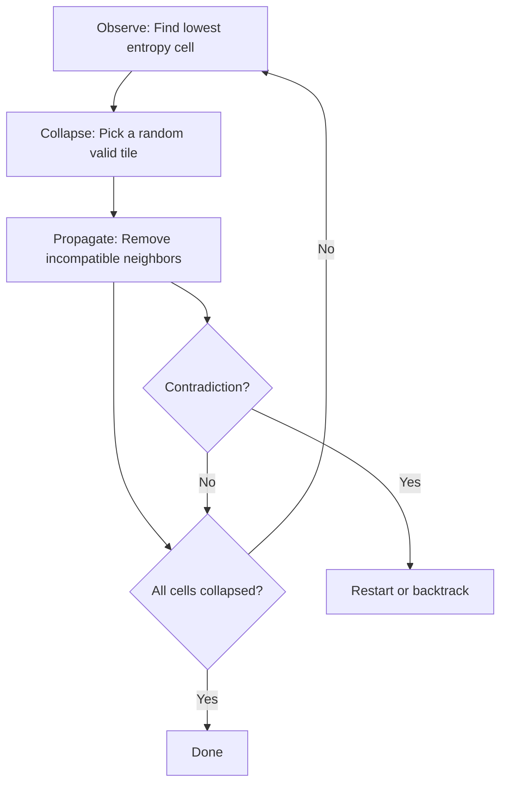

## Why Wave Function Collapse

In 2016, Maxim Gumin released Wave Function Collapse (WFC) — an algorithm that generates globally coherent patterns from purely local constraints. Give it a set of tiles with rules about which tiles can be adjacent, and it fills an entire grid with a valid arrangement. The name borrows from quantum mechanics: each cell starts in a "superposition" of all possible tiles, and the algorithm progressively "collapses" cells to specific values while propagating constraints to neighbors.

WFC has become one of the most popular procedural generation techniques in game development. It powers level generation in Caves of Qud, Bad North, and dozens of indie titles. Unlike noise-based generation (which produces random terrain) or grammar-based generation (which follows rigid templates), WFC produces output that is both locally correct (every adjacency is valid) and globally varied (different runs produce different layouts). It sits in a sweet spot between order and randomness.

The algorithm is also deeply visual. Watching it work — cells flickering with uncertainty, collapsing one by one, constraints rippling outward — is more compelling than the final result. The process looks like crystallization, with order growing from seed points and filling the space.

> [!note]
> WFC is essentially arc consistency (AC-3) from constraint satisfaction, applied to grid generation. The "quantum mechanics" framing is a metaphor — there's no actual quantum computation. But it's an effective metaphor: the algorithm's behavior genuinely resembles wavefunction collapse, with measurement (observation) determining state and propagation enforcing entanglement-like correlations.

## Post Plan (Feature Map)

| Section Goal | Blog Feature Used | Why |
|---|---|---|
| Explain the algorithm | Text + mermaid diagram | The observe-collapse-propagate loop |
| Show constraint propagation | Code blocks | The core AC-3 implementation |
| Cover entropy and tile design | Table + callout | Why tile edge matching works |
| Interactive demo | Three.js scene embed | Watch collapse in real time |
| Address questions | Chat transcript | Backtracking, 3D, performance |

## The Algorithm



### Step 1: Observe

Find the uncollapsed cell with the fewest remaining options (lowest entropy). Ties are broken randomly. This heuristic, borrowed from constraint satisfaction, ensures that the most constrained cells are resolved first, reducing the chance of contradictions.

### Step 2: Collapse

Choose one tile from the cell's remaining options. The choice can be uniformly random or weighted — for example, biasing toward grass tiles to create open landscapes.

### Step 3: Propagate

The collapsed cell now constrains its neighbors. For each neighbor, remove any tiles whose edges don't match the collapsed tile. If a neighbor's options are reduced, propagate from that neighbor too. This cascading propagation is what makes WFC powerful — a single collapse can determine tiles across the entire grid.

```javascript
function propagate(grid, startIdx) {
  const stack = [startIdx];
  while (stack.length > 0) {
    const ci = stack.pop();
    for (const neighbor of getNeighbors(ci)) {
      const before = grid[neighbor].size;
      // Keep only tiles compatible with current cell's options
      const valid = new Set();
      for (const myTile of grid[ci]) {
        for (const nTile of grid[neighbor]) {
          if (edgesMatch(myTile, direction, nTile)) {
            valid.add(nTile);
          }
        }
      }
      if (valid.size < before) {
        grid[neighbor] = valid;
        stack.push(neighbor); // Continue propagation
      }
    }
  }
}
```

## Tile Design

Each tile has four edges (top, right, bottom, left), each with a color/type. The adjacency rule: touching edges must have the same color. This simple constraint produces complex global structure.

```javascript
const TILES = [
  { edges: [green, green, green, green], name: 'grass' },
  { edges: [green, brown, green, brown], name: 'road-h' },
  { edges: [brown, green, brown, green], name: 'road-v' },
  { edges: [brown, brown, brown, brown], name: 'road-cross' },
  // Corner pieces connect roads at 90 degrees
  { edges: [brown, green, green, brown], name: 'road-corner-TL' },
  // ... etc
];
```

With just three edge colors (green, brown, blue) and 13 tile types, the system can generate varied landscapes with roads, grass, water, and shorelines — all guaranteed to be locally valid.

## Entropy as Uncertainty

Entropy quantifies uncertainty. A cell with all 13 tiles possible has maximum entropy. A cell with only 2 remaining options has low entropy. A collapsed cell has zero entropy.

Visualizing entropy reveals the algorithm's decision-making: high-entropy regions (bright) are unconstrained, low-entropy regions (dark) are nearly determined. The propagation wavefront shows constraints rippling outward from each collapse event.

## Interactive Demo

A 20x20 grid collapses step by step. Uncollapsed cells glow based on their entropy — brighter means more uncertainty. Watch as roads, water features, and grass regions crystallize from the constraint propagation. When complete, the grid pauses briefly and regenerates.

<div data-scene="wfc.js" style="width:100%;height:420px;"></div>

## Common Questions

```chat
user: What happens when the algorithm hits a contradiction?
assistant: A contradiction occurs when propagation empties a cell's option set — no tile is compatible with all its collapsed neighbors. The simplest recovery is to restart with a new random seed. More sophisticated implementations use backtracking: undo the last collapse and try a different tile. Full backtracking with arc consistency guarantees a solution exists if one is possible, but restarts are simpler and work well in practice since contradictions are rare with well-designed tile sets.

user: Can WFC work in 3D?
assistant: Yes, and it's spectacular. Each voxel has six faces instead of four edges, and tiles are 3D blocks. The algorithm is identical — observe, collapse, propagate — just with more neighbors. The computational cost is higher (6 faces x more tiles x larger grids), but the results are impressive: coherent 3D structures, cave systems, buildings. Townscaper by Oskar Stalberg uses a 3D WFC variant for its building generation.

user: How do you design good tile sets?
assistant: Start with the output you want and work backward. If you want roads, you need: straight pieces (horizontal, vertical), corners (4 rotations), crossroads, T-junctions, and end caps. Each piece's edges must encode what can connect to it. The most common mistake is missing a transition tile — for example, having road and grass tiles but no tile that transitions between them, which forces contradictions. Test by running WFC many times and checking for frequent restarts.

user: How does this compare to Perlin noise for procedural generation?
assistant: They solve different problems. Perlin noise gives you continuous variation (height maps, cloud density, biome distribution). WFC gives you discrete, structurally correct arrangements (rooms connected by doors, roads that connect, pipes that fit). They complement each other well: use noise for the broad strokes (biome map, elevation), then WFC to fill in the detail (building layouts, path networks) within each biome.
```
