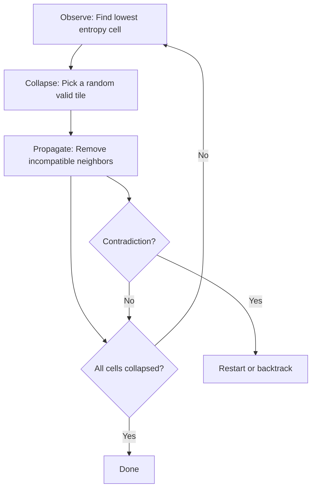

## Why WFC

2016. Maxim Gumin releases Wave Function Collapse. Algorithm that generates globally coherent patterns from purely local constraints.

Give it a set of tiles with adjacency rules. It fills an entire grid with a valid arrangement.

The name borrows from quantum mechanics. Each cell starts in a superposition of all possible tiles. The algorithm progressively collapses cells to specific values while propagating constraints to neighbors.

Powers level generation in Caves of Qud, Bad North, dozens of indie titles. Unlike noise (random terrain) or grammars (rigid templates), WFC produces output that's both locally correct (every adjacency is valid) and globally varied (different runs, different layouts).

The sweet spot between order and randomness.

The algorithm is also deeply visual. Watching it work — cells flickering with uncertainty, collapsing one by one, constraints rippling outward — is more compelling than the final result. Looks like crystallization.

> [!note]
> WFC is essentially arc consistency (AC-3) from constraint satisfaction, applied to grid generation. The "quantum" framing is a metaphor — no actual quantum computation. But it's an effective metaphor.

## The algorithm



### Observe

Find the uncollapsed cell with the fewest remaining options (lowest entropy). Ties broken randomly. Most constrained cells resolve first → fewer contradictions.

### Collapse

Choose one tile from the cell's remaining options. Uniform or weighted (e.g., bias toward grass for open landscapes).

### Propagate

The collapsed cell constrains its neighbors. For each neighbor, drop tiles whose edges don't match. If a neighbor's options shrink, propagate from that neighbor too.

This cascading propagation is what makes WFC powerful. A single collapse can determine tiles across the entire grid.

```javascript
function propagate(grid, startIdx) {
  const stack = [startIdx];
  while (stack.length > 0) {
    const ci = stack.pop();
    for (const neighbor of getNeighbors(ci)) {
      const before = grid[neighbor].size;
      // Keep only tiles compatible with current cell's options
      const valid = new Set();
      for (const myTile of grid[ci]) {
        for (const nTile of grid[neighbor]) {
          if (edgesMatch(myTile, direction, nTile)) {
            valid.add(nTile);
          }
        }
      }
      if (valid.size < before) {
        grid[neighbor] = valid;
        stack.push(neighbor); // Continue propagation
      }
    }
  }
}
```

## Tiles

Four edges per tile (top, right, bottom, left), each with a color/type. Adjacency rule: touching edges must match.

```javascript
const TILES = [
  { edges: [green, green, green, green], name: 'grass' },
  { edges: [green, brown, green, brown], name: 'road-h' },
  { edges: [brown, green, brown, green], name: 'road-v' },
  { edges: [brown, brown, brown, brown], name: 'road-cross' },
  // Corner pieces connect roads at 90 degrees
  { edges: [brown, green, green, brown], name: 'road-corner-TL' },
  // ... etc
];
```

Three edge colors (green, brown, blue) and 13 tile types → varied landscapes with roads, grass, water, shorelines. All locally valid.

## Entropy

A cell with all 13 tiles possible has maximum entropy. A cell with 2 options has low entropy. A collapsed cell has zero.

Visualizing entropy reveals the algorithm's decision-making. High-entropy regions (bright) are unconstrained. Low-entropy (dark) are nearly determined. The propagation wavefront shows constraints rippling outward from each collapse.

## Demo

20×20 grid collapses step by step. Uncollapsed cells glow by entropy — brighter = more uncertainty. Watch roads, water, and grass crystallize from constraint propagation. Pauses briefly when complete, regenerates.

<div data-scene="wfc.js" style="width:100%;height:420px;"></div>

## Common questions

```chat
user: What happens at a contradiction?
assistant: A contradiction = propagation empties a cell's option set. No tile compatible with all collapsed neighbors. Simplest recovery: restart with a new random seed. Sophisticated implementations backtrack — undo the last collapse, try another tile. Full backtracking with arc consistency guarantees a solution if one exists. Restarts are simpler and work well with well-designed tile sets — contradictions are rare.

user: Can WFC work in 3D?
assistant: Yes — spectacularly. Voxels have six faces instead of four edges. Tiles are 3D blocks. Same algorithm — observe, collapse, propagate — more neighbors. Higher computational cost. Coherent 3D structures, cave systems, buildings. Townscaper (Oskar Stålberg) uses a 3D WFC variant.

user: How do you design good tile sets?
assistant: Start with the output you want, work backward. Roads need: straight (h, v), corners (4 rotations), crossroads, T-junctions, end caps. Each piece's edges encode what can connect. Most common mistake: missing a transition tile (road and grass tiles but no transition between them → contradictions). Test by running many times, watch for frequent restarts.

user: WFC vs Perlin noise for procedural generation?
assistant: Different problems. Perlin gives continuous variation (height maps, cloud density, biome distribution). WFC gives discrete, structurally correct arrangements (rooms connected by doors, roads that connect, pipes that fit). Use noise for broad strokes (biome map, elevation). WFC for detail (building layouts, path networks) within each biome.
```
